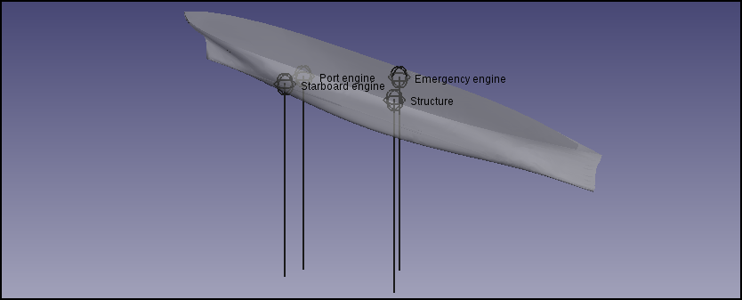
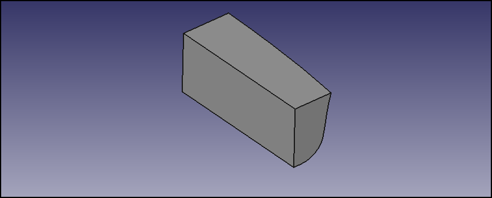

# FreeCAD-Ship s60 tutorial (II)

 

## Overview

Before starting this tutorial, please ensure that you have already performed [the first part](FreeCAD-Ship_s60_tutorial.md).

Learn more about the Ship workbench from it\'s dedicated wiki page: [Ship Workbench](Ship_Workbench.md)

## Introduction

In this tutorial we will work with weights and tanks in order to compute GZ curve, the most important hydrostatic stability parameter. GZ is the static moment generated when the ship takes roll angle, of course, since the GZ arm is positive, the ship has a positive moment, and will try to recover upright position, but when GZ turns on negative numbers ship has not anymore stability, reaching a critical situation.

IMO (International Maritime Organization) set following criteria:

-   *GM* \>= 0.15 m. *GM* (metacentric height) is the initial tangent of the *GZ* curve.
-   Maximum *GZ* value must be placed over 30 degrees of roll angle.
-   With 30 degrees roll angle, *GZ* value must be 0.2 m at least.
-   Area involved by *GZ* curve up to 40 degrees of roll angle must be at least 0.090 m · rad.
-   Area involved by *GZ* curve up to 30 degrees of roll angle must be at least 0.055 m · rad.
-   Area involved by *GZ* curve from 30 to 40 degrees of roll angle must be at least 0.030 m · rad.

In this tutorial we will set weights and tanks for our series 60 ship, in a simulated situation.

## Ship weights 

In order to can compute GZ curve we need to know ship weights, and their position at each roll angle, so weights will be divided in two categories:

-   Fixed weights, that are fully linked to ship movements.
-   Tanks, where fluid shape changes with the angle, needing center of gravity computation at each position.

The Ship workbench provides two different tools to generate each instance.

Weights definition tool icon.

Weights definition tool can be used to set first category of weights. When you launch the tool for first time (with ship instance selected), the Ship workbench initializes ship weights with Lightweight ship (equal to ship displacement) that is placed on the ship geometry center of gravity X coordinate, and at design draft height. Usually there are at least 2 relevant weights:

-   Structure.
-   Main engine (or several of them).

So we will change it. Double-click over each cell we can edit the value, setting weights:

-   Structure, 15000 kg, (-0.1, 0, 1.25) m
-   Starboard engine, 5000 kg, (-6.5, -0.65, 0.5) m
-   Port side engine, 5000 kg, (-6.5, 0.65, 0.5) m
-   Emergency engine, 2500 kg, (0.2, 0, 2.5) m

Weights definition 3D preview.

Weights position are shown in the [3D view](3D_view.md). Note: the annotations will be removed when the tool is closed. When you press **Accept** weights will be stored in your ship instance.

## Tanks

Tanks must be created on top of solid geometry, as the ship instance, so first step is create two bow tanks (one per ship side) solid geometries that we will consider (usually ships have a lot of tanks for fuel, fresh water, salt water, load, etc).

### Geometry generation 

In order to generate tanks we load [Part module](Part_Workbench.md), and create a box solid.

We need to edit the box, so we select it at **Attributes and tags** tree, and change from view to data tab. Expand Placement, and into them Position, and set *x* to 1.5, and z to -1. We want to change box length too changing it for 5.0 (note that units can be in mm, don\'t take care about this).

Tank geometry will be common part of created box and ship geometry, so we can hide **Ship** instance, and show **s60_IowaUniversity** geometry. Selecting box and **s60_IowaUniversity** we can use Common operation generating our starboard tank geometry.

Generated tank geometry.

We can perform port side tank selecting our starboard geometry and executing mirror tool, selecting XZ as mirror plane.

In order to convert geometry into a ussual solid shape our tanks, and recover our **s60_IowaUniversity** geometry, we can load [Draft module](Draft_Workbench.md), and with starboard tank geometry selected execute Upgrade, and repeat with port side tank geometry. We can rename geometries as:

-   StarboardTankGeom
-   PortTankGeom

We can delete created Box, that we don\'t need anymore.

### Tank intances generation 

If reload [FreeCAD-Ship module](Ship_Workbench.md) another time, we can find tank instances generator tool.

Tank instance generation tool icon.

Now we can select **StarboardTankGeom** and execute tank instance generation tool, where some data must be provided. We will set 40% of filling level, and 925 kg/m$\mathrm{m}^{3}$ (fuel approach). When **Accept** is clicked a new tank instance called **Tank** is generated. We can rename it as **StarboardTank**, and hide **StarboardTankGeom**.

We can repeat the same process in order to generate **PortTank**.

View of generated weights.

Figure shown our ship result that we will compute.

### GZ curve computation 

The Ship workbench provide a tool to easily compute a *GZ* curve.

GZ curve computation tool icon.

With **Ship** instance selected, we can run the tool. The first thing that we can see at opened dialog is a list with all tank instances found at active document. We want to use both of them, so we click over the tanks that are remarked with a different background.

In order to know the resultant ship displacement and draft we can press **Update displacement and draft**, taking some time for the computation. We receive following data:

-   Displacement = 37505.5 kg
-   Draft = 0.818664 m

So we are in a unloaded situation, where draft are sightly lower than design draft. Usually lower drafts imply lower ship stability, the draft depends on loading condition, so if we really expect than ship can be operated in this loading condition we can consider implement ballast tanks.

We can also automatically compute ship trim, operation that can take around one minute, retrieving that our ship have 0.95 degrees of trim angle (positive by stern). In this example we will work without trim angle (0 degrees).

Tool request roll angles considered too. In this case we want to know all ship behaviour, so we can set:

-   0 degrees starting roll angle.
-   180 degrees ending roll angle.
-   46 points. One for each 2 degrees. GZ computation can take some time, so take care about the number of points requested.

When we press **Accept** tool starts the computation. If you run FreeCAD from the terminal you can see work progress. In a couple of seconds we will receive GZ curve.

This tool use [pyxplot](http://www.pyxplot.org.uk/) and [ghostscript](http://www.ghostscript.com/) too. You can see where **gz.dat** output file has been placed at the report view (View/Views/Report view), and load it with datasheet software (for example [libreOffice](http://www.libreoffice.org)). Nearby data file several auxiliary files has been created too:

-   **gz.dat**: Computed GZ curve data.
-   **gz.pyxplot**: pyxplot layout in order to plot the curve.
-   **gz.eps**: EPS image version.
-   **gz.png**: PNG image version.

This files will be overwritten if you executes the tool another time.

### Results

Resultant GZ curve.

*GZ* maximum value is placed over 30 degrees (45 degrees), getting 0.25 m at 30 degrees (0.2 m is the minimum). Up to 30 degrees the area below *GZ* curve is 0.065 m·rad, up to 40 degrees we have 0.092 m·rad, being the area between 30 and 40 degrees of 0.027 m·rad. So our ship don\'t meets the IMO requirements. The solution is place ballast tanks.

At the other hand, the ship in this bad condition has positive *GZ* values up to 95 degrees roll angle, but has not been enough for IMO stability requirements, showing the hard criteria imposed about this item.

Of course this example is not real (first for all fuel tanks cannot be placed in the double bottom structure, or using hull side as structure), but is a good example in order to learn to use [Ship Workbench](Ship_Workbench.md).

---
⏵ [documentation index](../README.md) > [Ship](Category_Ship.md) > FreeCAD-Ship s60 tutorial (II)
