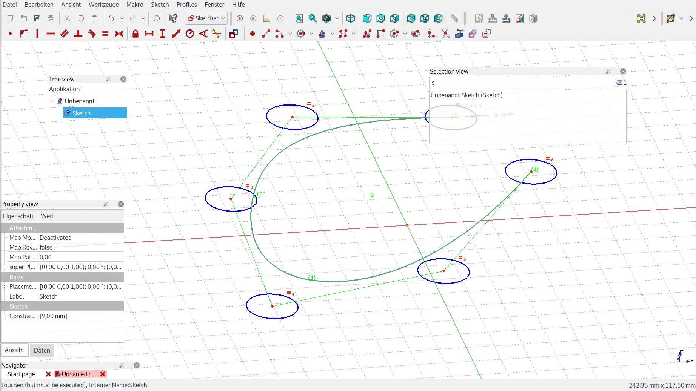

# Ickbys Frameless UI

## Intro

One of the core developers of FreeCAD, \@ickby, experimented with an alternative UI for FreeCAD. It\'s easier to show then describe in words, please see his [proof of concept](https://www.youtube.com/watch?v=wrOP7sLqwiM&t=3m20s)

This work is not complete but more as a proof of concept. Below an explanation will be provided about what would be needed to complete this project.

## Requirements

-   Knowledge of Qt5 and QML (javascript)
-   Understanding of the FreeCAD UI

### Roadmap

Issues and phases that would be needed to overcome this endeavour

--   
--   

### Relevant Links 

-   Forum thread <https://forum.freecadweb.org/viewtopic.php?f=8&t=23053>
-   [https://www.youtube.com/watch?v=wrOP7sLqwiM&t=3m20s Youtube clip](https://www.youtube.com/watch?v=wrOP7sLqwiM&t=3m20s_Youtube_clip.md)
-   Github repo: <https://github.com/ickby/FreeCAD_sf_master/commits/layout>

---
[documentation index](../README.md) > Ickbys Frameless UI
