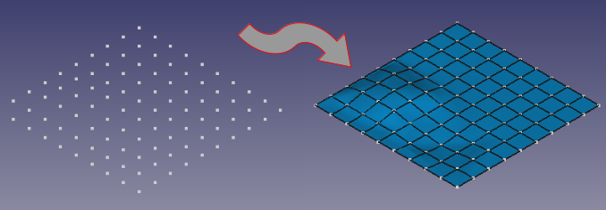

# Macro BSurf from grid
{{Macro
|Name=BSurf_from_grid
|Description=Makes a B-spline surface through a grid of points.
|Author=heda
|Version=0.1
|Date=2022-07-31
}}

## Description

Makes a B-spline surface through a grid of points. Options for only creating Wire or B-spline curves.

   
*Macro BSurf from grid*

## Installation

Available in the [Addon manager](Std_AddonMgr.md).

## Options

See docstring.

## Usage

See docstring.

## Script

**Macro_BSurf_from_grid.FCMacro**

    # -*- coding: utf-8 -*-

    # ***************************************************************************
    # *                                                                         *
    # *   Copyright (c) 2022 - heda <heda@fc-forum>                             *
    # *                                                                         *
    # *   This program is free software; you can redistribute it and/or modify  *
    # *   it under the terms of the GNU Lesser General Public License (LGPL)    *
    # *   as published by the Free Software Foundation; either version 2 of     *
    # *   the License, or (at your option) any later version.                   *
    # *   for detail see the LICENCE text file.                                 *
    # *                                                                         *
    # *   This program is distributed in the hope that it will be useful,       *
    # *   but WITHOUT ANY WARRANTY; without even the implied warranty of        *
    # *   MERCHANTABILITY or FITNESS FOR A PARTICULAR PURPOSE.  See the         *
    # *   GNU Library General Public License for more details.                  *
    # *                                                                         *
    # *   You should have received a copy of the GNU Library General Public     *
    # *   License along with this program; if not, write to the Free Software   *
    # *   Foundation, Inc., 59 Temple Place, Suite 330, Boston, MA  02111-1307  *
    # *   USA                                                                   *
    # *                                                                         *
    # ***************************************************************************

    __Name__ = 'BSurf_from_grid'
    __Comment__ = 'Makes a BSpline surface through a grid of points.'
    __Author__ = 'heda'
    __Version__ = '0.1'
    __Date__ = '2022-07-31'
    __License__ = 'LGPL-2.0-or-later'
    __Web__ = ''
    __Wiki__ = 'https://wiki.freecad.org/Macro_Grid_2_BSurf'
    __Icon__ = ''
    __Help__ = 'Select structured point-cloud, set options, run macro'
    __Status__ = 'functional'
    __Requires__ = ''
    __Communication__ = ''
    __Files__ = ''

    """
    inspired by:
    https://forum.freecadweb.org/viewtopic.php?f=22&t=69941&start=10
    cred to snow54

    it is assumed that the cloud is:
        - structured
        - aligned with xy grid,
    i.e. a constant y divides 2 horizontal rows of points,
    analogue for x and vertical columns of points

    usage:
    select a pointcloud and run macro    

    options:
    wires: convert boundary wires to spline (draft wb),
           in surf wb, use boundry edges and verts on wires as vertex-constraints

    splines: in surf wb, use outer contour as boundry edges,
             inner edges can be used as edge constraints

    bsurf: surface directly created with poles/knots from interpolated spline

    mkwframe: in case of bsurf, symbolic wireframe of splines (draft wb)
    """

    import numpy as np
    from scipy import interpolate

    import FreeCAD as App
    import FreeCADGui as Gui
    import Draft, Part

    Vector = App.Vector

    doc = App.ActiveDocument

    try:
        cloud, = Gui.Selection.getSelection()
    except ValueError as e:
        raise RuntimeWarning('a point cloud needs to be selected.')

    points = cloud.Points.Points
    bb = cloud.Points.BoundBox

    options = o = dict(MakeWires=False,
                       MakeBSplines=False,
                       MakeBSurf=True,
                       MakeWFrame=True)

    ## a bit of options logic...
    if o['MakeWires']: o['MakeBSplines'] = False
    if o['MakeBSplines']: o['MakeBSurf'] = o['MakeWires'] = False
    if o['MakeBSurf'] and o['MakeWFrame']:
        o['MakeBSplines'] = True; o['MakeWires'] = False
    if not o['MakeBSurf']: o['MakeWFrame'] = False

    def RGB(*args):
        return tuple((float(i/255) for i in args))

    hstep = min((p.y for p in points))
    vstep = min((p.x for p in points))

    wiregroup = doc.addObject('App::DocumentObjectGroup', 'Wires')
    hwires = doc.addObject('App::DocumentObjectGroup', 'HWires')
    vwires = doc.addObject('App::DocumentObjectGroup', 'VWires')
    wiregroup.addObjects([hwires, vwires])

    for wg, step, getter in ((hwires, hstep, 'y'),
                             (vwires, vstep, 'x')):
        wires = list()
        empty = False
        cc = bb.YMin if getter == 'y' else bb.XMin
        cc -= step/2
        while not empty:
            polypoints = list()
            for pt in points:
                value = getattr(pt, getter)
                if cc < value < cc + step:
                    polypoints.append(pt)
            if polypoints:
                if o['MakeWires'] or (o['MakeBSurf'] and not o['MakeWFrame']):
                    maker = Draft.make_wire
                elif o['MakeBSplines']:
                    maker = Draft.make_bspline
                wires.append(maker(polypoints, closed=False))
                cc += step
            else:
                empty = True

        wg.addObjects(wires)

    Gui.Selection.clearSelection()

    if o['MakeBSurf']:
        degree_u = degree_v = 3
        periodic = False

        lowerx, lowery = hwires.Group[0], vwires.Group[0]
        x = np.array([pt.x for pt in lowerx.Points])
        y = np.array([pt.y for pt in lowery.Points])
        Z = np.array([[pt.z for pt in hw.Points] for hw in hwires.Group])

        ## Create spline surface
        g = interpolate.RectBivariateSpline(x, y, Z.T)
        coefgs = g.get_coeffs()
        coefgs = np.reshape(coefgs, Z.T.shape).T
        knots = g.get_knots()
        # Convert knot vector format
        knot_u, mult_u = np.unique(knots[1], return_counts=True)
        knot_v, mult_v = np.unique(knots[0], return_counts=True)
        # Normalize knot vectors
        knot_u = (knot_u - knot_u.min()) / (knot_u.max() - knot_u.min())
        knot_v = (knot_v - knot_v.min()) / (knot_v.max() - knot_v.min())
        
        # Calculate spline coefficients for x and y
        gx = interpolate.make_interp_spline(x, x)
        coefgx = gx.tck[1]
        gy = interpolate.make_interp_spline(y, y)
        coefgy = gy.tck[1]

        getVector = lambda iz, jz: Vector(coefgx[jz],
                                          coefgy[iz],
                                          coefgs[iz, jz])

        # Create control point vectors
        ctrl = [[getVector(iZ, jZ) for jZ, lc in enumerate(lr)]
                for iZ, lr in enumerate(coefgs)]
        
        # Create spline surface in FreeCAD
        bs = Part.BSplineSurface()
        bs.buildFromPolesMultsKnots(ctrl, mult_u, mult_v, knot_u, knot_v,
                                    periodic, periodic, degree_u, degree_v)
        
        surf = Part.show(bs.toShape(), 'BSplineSurf')
        surf.Label2 = 'spline surface through points'
        surf.ViewObject.ShapeColor = RGB(0, 170, 255)

        if not o['MakeWFrame']:
            for obj in hwires.Group + vwires.Group + [hwires, vwires, wiregroup]:
                doc.removeObject(obj.Name)

    doc.recompute()

    av = Gui.ActiveDocument.ActiveView
    av.viewIsometric()
    av.fitAll()

---
⏵ [documentation index](../README.md) > Macro BSurf from grid
