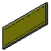

# Macro Cabinets32
{{Macro
|Name=Cabinets32
|Icon=Macro_Cabinets32.png
|Description=This macro creates Top/Bottom and sidewalls for a cabinet with System32 specification.
The defaults in the Macro are for parts of manufacturer Hettich.
|Author=Berner
|Version=1.0
|Date=2015-01-22
|FCVersion=All
|Download=[https://www.freecadweb.org/wiki/images/6/64/Macro_Cabinets32.png TollBar Icon]
}}

## Description

This macro creates Top/Bottom and sidewalls for a cabinet with System32 specification. The defaults in the Macro are for parts of manufacturer Hettich.

 
*cabinetside*

 
*cabinettop*

## Usage

-   Launch the macro and change length, height and width of your cabinet-board.
-   The Gui ask to drill one or two-hole connectors.
-   You can drill the hole board with holes in 32 mm distance.
-   You can drill holes for top/bottom boards of your cabinet.

## Script

TollBar Icon 

**Cabinets32.FCMacro**

{{MacroCode|code=
<nowiki>
#!/usr/bin/env python
# -*- coding: utf-8 -*-
# ***************************************************************************
# *                                                                         *
# *   Copyright (c) 2015 Bruno Bueckmann reset12 at gmx.de                  *
# *                      http://home.bb-24.net                              *
# *   This program is free software; you can redistribute it and/or modify  *
# *   it under the terms of the GNU Lesser General Public License (LGPL)    *
# *   as published by the Free Software Foundation; either version 2 of     *
# *   the License, or (at your option) any later version.                   *
# *   for detail see the LICENCE text file.                                 *
# *                                                                         *
# *   This program is distributed in the hope that it will be useful,       *
# *   but WITHOUT ANY WARRANTY; without even the implied warranty of        *
# *   MERCHANTABILITY or FITNESS FOR A PARTICULAR PURPOSE.  See the         *
# *   GNU Library General Public License for more details.                  *
# *                                                                         *
# *   You should have received a copy of the GNU Library General Public     *
# *   License along with this program; if not, write to the Free Software   *
# *   Foundation, Inc., 59 Temple Place, Suite 330, Boston, MA  02111-1307  *
# *   USA                                                                   *
# *                                                                         *
# ***************************************************************************

# Macro Begin: cabinets32.FCMacro ++++++++++++++++++++++++++++++++++++++++++++++
# This Macro generates holes and a groove for the side Base cabinet
# Top and Bottom Wall are OUTSIDE the side base
# like :
# -------
# |     |
# |     |
# -------

from __future__ import division

import FreeCAD as App
import FreeCADGui as Gui
from PySide import QtGui

# GUI
debug = False  # debugging on
guiok = True  # flag for abort input

width, ok = QtGui.QInputDialog.getDouble(
    QtGui.QWidget(), 'Thickness', 'Thickness of cabinet-side', 19, 0, 50, 2)
if ok:
    length, ok = QtGui.QInputDialog.getDouble(
        QtGui.QWidget(), 'Depth', 'Depth of cabinet-side', 600, 0, 2000, 2)
else:
    guiok = False

if ok and guiok:
    height, ok = QtGui.QInputDialog.getDouble(
        QtGui.QWidget(), 'Height', 'Height of cabinet-side', 2000, 0, 3000, 2)
else:
    guiok = False

if ok and guiok:
    bradius, ok = QtGui.QInputDialog.getDouble(
        QtGui.QWidget(), 'Bradius', 'Radius of drill holes in cabinet-side',
        2.5, 0, 50, 2)
else:
    guiok = False

if ok:
    bdeep, ok = QtGui.QInputDialog.getDouble(
        QtGui.QWidget(), 'Bdeep', 'Depth of drill holes in cabinet-side',
        12, 0, 50, 2)
else:
    guiok = False

if ok:
    fdist, ok = QtGui.QInputDialog.getDouble(
        QtGui.QWidget(), 'Fdist', 'Distance to Front of cabinet-side',
        37, 0, 50, 2)
else:
    guiok = False

if ok:
    hole1, ok = QtGui.QInputDialog.getDouble(
        QtGui.QWidget(), 'Hole1',
        'Distance first hole from top or bottom of cabinet-side', 10, 0, 50, 2)
else:
    guiok = False

if ok:
    holedistance, ok = QtGui.QInputDialog.getDouble(
        QtGui.QWidget(), 'Holedistance',
        'Distance from hole to hole (System 32)', 32, 1, 50, 2)
else:
    guiok = False

if ok:
    groovethickness, ok = QtGui.QInputDialog.getDouble(
        QtGui.QWidget(), 'Groovethickness', 'Thickness of backpanel',
        3, 1, 50, 2)
else:
    guiok = False

if ok:
    groovedeep, ok = QtGui.QInputDialog.getDouble(
        QtGui.QWidget(), 'Groovedeep',
        'Overlapping of backpanel in cabinet-side', 12, 1, 50, 2)
else:
    guiok = False

if guiok:
    # VB 35 / 18 or VB 36 M /19 from Hettich
    connector, ok = QtGui.QInputDialog.getInt(
        QtGui.QWidget(), 'Connectortype',
        'Zerohole(0) Singlehole(1) or Doublehole(2) Connector', 2, 0, 2, 1)

if ok:
    fillwithholes, ok = QtGui.QInputDialog.getItem(None,
            "Fillwithholes",
            "Fill Board with holes?",
            ["no", "yes"],
            editable=False)
else:
    guiok = False

endhole = 9.5

if ok and guiok:
    endholes, ok = QtGui.QInputDialog.getItem(None,
            "Endholes",
            "Drill Holes on Top/Bottom vertical for Connectors",
            ['no', 'yes'],
            editable=False)

if ok and guiok and endholes == 'yes':
    endhole, ok = QtGui.QInputDialog.getDouble(
        QtGui.QWidget(), 'Endhole',
        'Endhole distance from inner cabinet-side', 9.5, 1, 50, 2)
if debug:
    App.Console.PrintMessage("ok?: {}\n".format(ok))
    App.Console.PrintMessage("width = {}\n".format(width))
    App.Console.PrintMessage("length = {}\n".format(length))
    App.Console.PrintMessage("bradius = {}\n".format(bradius))
    App.Console.PrintMessage("bdeep = {}\n".format(bdeep))
    App.Console.PrintMessage("fdist = {}\n".format(fdist))
    App.Console.PrintMessage("hole1 = {}\n".format(hole1))
    App.Console.PrintMessage("holedistance = {}\n".format(holedistance))
    App.Console.PrintMessage("groovethickness = {}\n".format(groovethickness))
    App.Console.PrintMessage("groovedeep = {}\n".format(groovedeep))
    App.Console.PrintMessage("connector = {}\n".format(connector))
    App.Console.PrintMessage("fillwithholes = {}\n".format(fillwithholes))
    App.Console.PrintMessage("endholes = {}\n".format(endholes))
    App.Console.PrintMessage("endhole = {}\n".format(endhole))
    App.Console.PrintMessage("guiok = {}\n".format(guiok))
# End GUI

if guiok:
    # width= 19 # thickness of korpus
    # length= 600   # width of korpus
    # height= 2000  # height of korpus
    #
    # bradius = 2.5     # Radius drill hole
    # bdeep = 12        # deepness of drill hole
    # fdist = 37        # Distance to Front
    # hole1 = 9.5   # Distance first hole from top or bottom of korpus
    # holedistance = 32  # System 32
    # groovethickness = 3 # 3 mm backpanel
    # groovedeep = width-8 # deep of groovedeep
    if int(width) > 16:
        # First hole depends on specs for VB36 M / 19 for 19 mm boards from
        # Hettich.
        holetop = 9.5  # holedistance for screw of vb36
        hole1 = 9.5 + 0.5  # distance hole 1 from end of board
        hole1r = 10  # radius first hole
        hole1d = 14  # deepness first hole
        hole2r = 5  # radius 2. hole
        hole2d = 10.5  # deepness 2. hole
    else:
        # First hole depends on specs for VB36 M / 16 for 16 mm boards from
        # Hettich.
        holetop = 9.5  # holedistance for screw of vb36
        hole1 = 9.5 + 0.5  # distance hole 1 from end of board
        hole1r = 10  # radius first hole
        hole1d = 12.5  # deepness first hole
        hole2r = 5  # radius 2. hole
        hole2d = 10.5  # deepness 2. hole

    if debug:
        App.Console.PrintMessage("hole1d = {}\n".format(hole1d))

    # functions
    def cut(tool):
        global cutsnr
        global cuts
        # cuts objects defined in string cuts
        if debug:
            App.Console.PrintMessage("cuts = {}, cutsnr = {}\n".format(
                cuts, cutsnr))
        data = 'App.activeDocument().addObject("Part::Cut","' + str(cuts.split(" ")[cutsnr + 1]) + '")'
        if debug:
            App.Console.PrintMessage(str(data) + "\n")
        exec(data)
        data = "App.activeDocument()." + str(cuts.split(" ")[cutsnr + 1])
        data = data + ".Base = App.activeDocument()." + str(cuts.split(" ")[cutsnr])
        if debug:
            App.Console.PrintMessage(str(data) + "\n")
        exec(data)
        data = "App.activeDocument()." + str(cuts.split(" ")[cutsnr + 1])
        data = data + ".Tool = App.activeDocument()." + str(tool)
        if debug:
            App.Console.PrintMessage(str(data) + "\n")
        exec(data)
        cutsnr = cutsnr + 1
        cuts = cuts + " Cut%03d" % cutsnr
        return 0

    # end functions

    doc = App.activeDocument()

    # Korpus
    box = doc.addObject("Part::Box", "Box")
    box.Label = "Cube"
    box.Length = length
    box.Width = width
    box.Height = height
    # Change Color of Object.
    box.ViewObject.DiffuseColor = (0.67, 0.67, 0.0)
    if debug:
        doc.recompute()
    # Groove
    groove = doc.addObject("Part::Box", "Groove")
    groove.Label = "Groove"
    groove.Length = groovethickness
    groove.Width = groovedeep
    groove.Height = height - (2 * groovedeep)
    groove.ViewObject.DiffuseColor = (0.67, 0.67, 0.0)
    groove.Placement = App.Placement(
        App.Vector(length - groovethickness, 0, groovedeep),
        App.Rotation())
    if debug:
        doc.recompute()

    # make endholes
    cylinders = ""  # labels of cylinders to cut
    if endholes == 'y':
        # Bottom holes
        cylendl = doc.addObject("Part::Cylinder", "Cylinderendl")
        cylendl.Label = "Cylinderendl001"
        cylendl.Radius = bradius
        cylendl.Height = bdeep
        cylendl.Angle = 360
        cylinders = cylinders + " " + cylendl.Name
        cylendl.ViewObject.DiffuseColor = (0.0, 0.0, 0.0)
        doc.ActiveObject.Placement = App.Placement(
            App.Vector(fdist, bdeep, holetop),
            App.Rotation(App.Vector(1, 0, 0), 90))
        if debug:
            doc.recompute()
        cylendr = doc.addObject("Part::Cylinder", "Cylinderendr")
        cylendr.Label = "Cylinderendr001"
        cylendr.Radius = bradius
        cylendr.Height = bdeep
        cylendr.Angle = 360
        cylinders = cylinders + " " + cylendr.Name
        cylendr.ViewObject.DiffuseColor = (0.0, 0.0, 0.0)
        cylendr.Placement = App.Placement(
            App.Vector(length - fdist, bdeep, holetop),
            App.Rotation(App.Vector(1, 0, 0), 90))
        if debug:
            doc.recompute()

        # Top holes
        cylendl = doc.addObject("Part::Cylinder", "Cylinderendl")
        cylendl.Label = "Cylinderendl002"
        cylendl.Radius = bradius
        cylendl.Height = bdeep
        cylendl.Angle = 360
        cylinders = cylinders + " " + cylendl.Name
        cylendl.ViewObject.DiffuseColor = (0.0, 0.0, 0.0)
        cylendl.Placement = App.Placement(
            App.Vector(fdist, bdeep, height - holetop),
            App.Rotation(App.Vector(1, 0, 0), 90))
        if debug:
            doc.recompute()
        cylendr = doc.addObject("Part::Cylinder", "Cylinderendr")
        cylendr.Label = "Cylinderendr002"
        cylendr.Radius = bradius
        cylendr.Height = bdeep
        cylendr.Angle = 360
        cylinders = cylinders + " " + cylendr.Name
        cylendr.ViewObject.DiffuseColor = (0.0, 0.0, 0.0)
        cylendr.Placement = App.Placement(
            App.Vector(length - fdist, bdeep, height-holetop),
            App.Rotation(App.Vector(1, 0, 0), 90))
        if debug:
            doc.recompute()

    if fillwithholes == 'no':
        n = 0
    else:
        n = int(height / 2 / holedistance)

    # drill holes from bottom to half height
    # reduce holes for test to 2 alternative use n
    # Holes for Hettich VB36
    # Bohrloecher
    x = -1  # init value
    if connector >= 1:
        x = 0
        App.Console.PrintMessage("x="+str(x) + " " + "\n")
        cyll = doc.addObject("Part::Cylinder", "Cylinderl")
        cyll.Label = "Cylinderl%03d" % x
        cyll.Radius = hole1r
        cyll.Height = hole1d
        cyll.Angle = 360
        cylinders = cylinders + " " + cyll.Name
        cyll.ViewObject.DiffuseColor = (0.0, 0.0, 0.0)
        cyll.Placement = App.Placement(
            App.Vector(fdist, hole1d, hole1 + x * holedistance),
            App.Rotation(App.Vector(1, 0, 0), 90))
        if debug:
            doc.recompute()

        cylr = doc.addObject("Part::Cylinder", "Cylinderr")
        cylr.Label = "Cylinderr%03d" % x
        cylr.Radius = hole1r
        cylr.Height = hole1d
        cylr.Angle = 360
        cylinders = cylinders + " " + cylr.Name
        cylr.ViewObject.DiffuseColor = (0.0, 0.0, 0.0)
        cylr.Placement = App.Placement(
            App.Vector(length - fdist, hole1d, hole1 + x * holedistance),
            App.Rotation(App.Vector(1, 0, 0), 90))

    if connector == 2:
        x = 1
        cyll = doc.addObject("Part::Cylinder", "Cylinderl")
        cyll.Label = "Cylinderl%03d" % x
        cyll.Radius = hole2r
        cyll.Height = hole2d
        cyll.Angle = 360
        cylinders = cylinders + " " + cyll.Name
        cyll.ViewObject.DiffuseColor = (0.0, 0.0, 0.0)
        cyll.Placement = App.Placement(
            App.Vector(fdist, hole2d, hole1 + x * holedistance),
            App.Rotation(App.Vector(1, 0, 0), 90))
        if debug:
            doc.recompute()

        cylr = doc.addObject("Part::Cylinder", "Cylinderr")
        cylr.Label = "Cylinderr%03d" % x
        cylr.Radius = hole2r
        cylr.Height = hole2d
        cylr.Angle = 360
        cylinders = cylinders + " " + cylr.Name
        cylr.ViewObject.DiffuseColor = (0.0, 0.0, 0.0)
        cylr.Placement = App.Placement(
            App.Vector(length - fdist, hole2d, hole1 + x * holedistance),
            App.Rotation(App.Vector(1, 0, 0), 90))
        if debug:
            doc.recompute()

    xs = x + 1
    for x in range(xs, n):
        # Bohrloecher
        cyll = doc.addObject("Part::Cylinder", "Cylinderl")
        cyll.Label = "Cylinderl%03d" % x
        cyll.Radius = bradius
        cyll.Height = bdeep
        cyll.Angle = 360
        cylinders = cylinders + " " + cyll.Name
        cyll.ViewObject.DiffuseColor = (0.0, 0.0, 0.0)
        cyll.Placement = App.Placement(
            App.Vector(fdist, bdeep, hole1 + x * holedistance),
            App.Rotation(App.Vector(1, 0, 0), 90))
        if debug:
            doc.recompute()

        cylr = doc.addObject("Part::Cylinder", "Cylinderr")
        cylr.Label = "Cylinderr%03d" % x
        cylr.Radius = bradius
        cylr.Height = bdeep
        cylr.Angle = 360
        cylinders = cylinders + " " + cylr.Name
        cylr.ViewObject.DiffuseColor = (0.0, 0.0, 0.0)
        cylr.Placement = App.Placement(
            App.Vector(length - fdist, bdeep, hole1 + x * holedistance),
            App.Rotation(App.Vector(1, 0, 0), 90))
        if debug:
            doc.recompute()

    # drill holes from Top to half height
    # # Holes for Hettich VB36
    x = -1  # init value
    if connector >= 1:
        x = 0
        cyll = doc.addObject("Part::Cylinder", "Cylinderl")
        cyll.Label = "Cylinderl%03d" % x
        cyll.Radius = hole1r
        cyll.Height = hole1d
        cyll.Angle = 360
        cylinders = cylinders + " " + cyll.Name
        cyll.ViewObject.DiffuseColor = (0.0, 0.0, 0.0)
        cyll.Placement = App.Placement(
            App.Vector(fdist, hole1d, height - hole1 - x * holedistance),
            App.Rotation(App.Vector(1, 0, 0), 90))
        if debug:
            doc.recompute()

        cylr = doc.addObject("Part::Cylinder", "Cylinderr")
        cylr.Label = "Cylinderr%03d" % x
        cylr.Radius = hole1r
        cylr.Height = hole1d
        cylr.Angle = 360
        cylinders = cylinders + " " + cylr.Name
        cylr.ViewObject.DiffuseColor = (0.0, 0.0, 0.0)
        cylr.Placement = App.Placement(
            App.Vector(length - fdist, hole1d, height-hole1 - x * holedistance),
            App.Rotation(App.Vector(1, 0, 0), 90))
        if debug:
            doc.recompute()

    if connector == 2:
        x = 1
        cyll = doc.addObject("Part::Cylinder", "Cylinderl")
        cyll.Label = "Cylinderl%03d" % x
        cyll.Radius = hole2r
        cyll.Height = hole2d
        cyll.Angle = 360
        cylinders = cylinders + " " + cyll.Name
        cyll.ViewObject.DiffuseColor = (0.0, 0.0, 0.0)
        cyll.Placement = App.Placement(
            App.Vector(fdist, hole2d, height - hole1 - x * holedistance),
            App.Rotation(App.Vector(1, 0, 0), 90))
        if debug:
            doc.recompute()

        cylr = doc.addObject("Part::Cylinder", "Cylinderr")
        cylr.Label = "Cylinderr%03d" % x
        cylr.Radius = hole2r
        cylr.Height = hole2d
        cylr.Angle = 360
        cylinders = cylinders + " " + cylr.Name
        cylr.ViewObject.DiffuseColor = (0.0, 0.0, 0.0)
        cylr.Placement = App.Placement(
            App.Vector(
                length - fdist, hole2d, height - hole1 - x * holedistance),
            App.Rotation(App.Vector(1, 0, 0), 90))
        if debug:
            doc.recompute()

    xs = x + 1
    for x in range(xs, n):
        # Drillholes
        cyll = doc.addObject("Part::Cylinder", "Cylinderl")
        cyll.Label = "Cylinderl%03d" % x
        cyll.Radius = bradius
        cyll.Height = bdeep
        cyll.Angle = 360
        cylinders = cylinders + " " + cyll.Name
        cyll.ViewObject.DiffuseColor = (0.0, 0.0, 0.0)
        cyll.Placement = App.Placement(
            App.Vector(fdist, bdeep, height - hole1 - x * holedistance),
            App.Rotation(App.Vector(1, 0, 0), 90))
        if debug:
            doc.recompute()

        cylr = doc.addObject("Part::Cylinder", "Cylinderr")
        cylr.Label = "Cylinderr%03d" % x
        cylr.Radius = bradius
        cylr.Height = bdeep
        cylr.Angle = 360
        cylinders = cylinders + " " + cylr.Name
        cylr.ViewObject.DiffuseColor = (0.0, 0.0, 0.0)
        cylr.Placement = App.Placement(
            App.Vector(
                length - fdist, bdeep, height - hole1 - x * holedistance),
            App.Rotation(App.Vector(1, 0, 0), 90))
        if debug:
            doc.recompute()

    if debug:
        App.Console.PrintMessage("cylinders = ")
        App.Console.PrintMessage(cylinders + "\n")

    # cut all holes
    cuts = "Box Cut"  # cut labels
    cutsnr = 0      # index number in cuts
    # cut groove
    cut("Groove")
    cyls = cylinders.split()  # number of words
    if debug:
        App.Console.PrintMessage("n=" + str(cyls) + "\n")
    for x in cyls:
        if debug:
            App.Console.PrintMessage("cylinder(" + x + ")=" + str(x) + "\n")
        cut(str(x))
    doc.recompute()
    Gui.SendMsgToActiveView('ViewFit')

# OS: Ubuntu 14.04.1 LTS
# Word size of OS: 32-bit
# Word size of FreeCAD: 32-bit
# Version: 0.15.4410 (Git)
# Branch: master
# Hash: 9ee08a97ea81304e2690694f76ee2dc013556a5d
# Python version: 2.7.6
# Qt version: 4.8.6
# Coin version: 4.0.0a
</nowiki>
}}

## Links

-   [Macro\_PartsLibrary](Macro_PartsLibrary.md) FreeCAD Library

---
[documentation index](../README.md) > Macro Cabinets32
