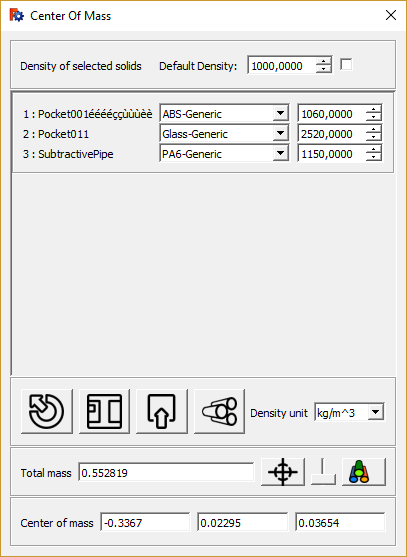
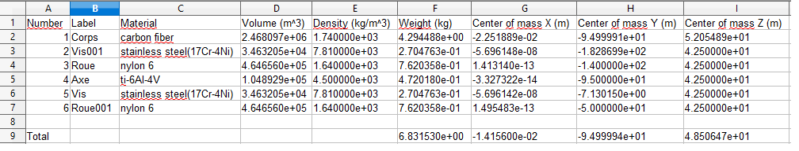

 

{{Macro
|Name=Macro CenterOfMass
|Description=Gives the Center of mass multiple of multiple objects selected.
|Author=schupin
|Version=0.4.2
|Date=2019-06-09
|FCVersion=0.18
|Download=Download the [https://forum.freecadweb.org/download/file.php?id=84270 Macro_CenterOfMass_Icon] package and extract it in the same directory of the macro.
}}

## Description

Gives the total mass and the location of the center of mass resulting of multiple objects selected. Different densities could be chosen for each object.  {{Codeextralink|https://raw.githubusercontent.com/chupins/FreeCAD-macros/SC_Branch/Information/CenterOfMass.FCMacro}}

 

The values (mass and center of mass) results can be saved in a spreadsheet   

## Usage

Select the object(s)

Run the macro

## Script

icon file download and paste in a sub directory named CenterOfMass in the macro directory

toolBar icon 

    

Download the [Macro\_CenterOfMass\_Icon](https://forum.freecadweb.org/download/file.php?id=84270) package and extract it in the same directory of the macro. 

**Macro CenterOfMass.FCMacro**  Download in Github

[Macro CenterOfMass.FCMacro](https://github.com/chupins/FreeCAD-macros/blob/SC_Branch/Information/CenterOfMass.FCMacro)

## Link

the forum discussion [Macro to compute center of mass](https://forum.freecadweb.org/viewtopic.php?f=24&t=31883)

## Version

0.4.2 / 2019-06-09 : - check last version number on github and popup if not last version - automatic update of show CdG (if it exists) when densities are changed - bug correction when changing radius

0.4.1 / 2019-05-25 : add default density button, sphere cursor, change window behavior, correct a container part issue

0.3.6 / 2019-05-22 : Radius of pheres representing centers of mass of each solid depends on each masses

0.3.5 / 2019-05-21 : Arrays and clone correction

0.3.4 / 2019-03-18 : minor

0.3.3 / 2019-03-17 : loading .csv corrections

0.3.2 / 2019-03-14 : add a colorify push button to add color on shapes depending on their density

0.3.0 / 2019-03-03 : python 3 compatibility

0.2.3 / 2018-11-22 : new icon name

0.1.2 / 2018-11-10 : xx

