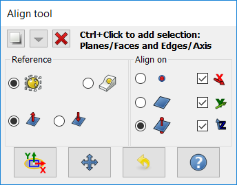

# Macro Center Align Objects with Faces or Edges
**These tools are now included in the [Manipulator Workbench](Manipulator_Workbench.md). Install this workbench for the latest updates on these tools.**

{{Macro
|Name=Center Faces of Parts
|Icon=Macro_Center_Align_Objects_with_Faces_or_Edges.svg
|Description=This macro Aligns Objects through Faces or Edges constraints. These tools are now included in the [https://github.com/easyw/Manipulator Manipulator Workbench]. Install this workbench for the latest updates on these tools.
|Author=easyw-fc
|Version=1.5.3
|Date=2017-10-01
|FCVersion=All
|Download=[https://www.freecadweb.org/wiki/images/e/ee/Macro_Center_Align_Objects_with_Faces_or_Edges.svg ToolBar Icon] [https://www.freecadweb.org/wiki/images/3/3d/Manipulator_Mover.svg Mover-icon] [https://www.freecadweb.org/wiki/images/1/10/Manipulator_Caliper.svg Caliper-icon]
}}

## Description

This macro Aligns Objects through Faces or Edges constraints

 

## Tools

**Aligner** : a set of tools to move and align 3D parts

**Mover** : a set of tools to move and rotate 3D parts on different Axis

**Measure** : a set of tools to measure 3D parts, with some Snap facility and Radius, Length, Angle measurements.

These helpers work with **Part, App::Part and Body objects**. Each Tool can be **Floating** or **Docked Left or Right**.

## OLD References 

This macro covers the following constraints:

-   Concentric constraint among non cylindrical parts;
-   Constraint on center Faces and/or Edges.
-   It works also with the new Body and App::Part containers, as well as with STEP hierarchy.

[Aligning tool video tutorial](https://youtu.be/qzixT157jJU)

[Aligning STEP models video tutorial](https://youtu.be/aQcPqhlgHBU)

## Usage

Faces or Edges constraint among non cylindrical parts: Just open a FC document, launch the Macro and select two or more Faces/Edges to be aligned. Click on Align button and that\'s it!

## Script

The icon for your toolbar 

**CenterAlignObjectswFacesEdges.py**

After downloading the file here
GitHub page
<https://github.com/easyw/FreeCAD_Macros/tree/master/Align%20Objects>
code:
<https://github.com/easyw/FreeCAD_Macros/raw/master/Align%20Objects/CenterAlignObjectswFacesEdges.py>
you need to copy the file to your macro directory.
[How to install macros](How_to_install_macros.md)

## Link

Forum : [Faces or Edges constraint among non cylindrical parts Macro](http://forum.freecadweb.org/viewtopic.php?f=22&t=18655)

---
 [documentation index](../README.md) > Macro Center Align Objects with Faces or Edges
