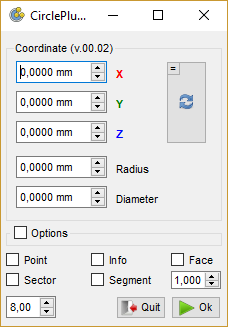
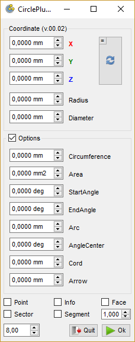

# Macro CirclePlus

  {{Macro
|Name=Macro CirclePlus
|Icon=Macro_CirclePlus.png
|Description=Creates circle or arc giving radius, diameter, circumference, area, startangle, endangle, arc, anglecenter, cord, arrow, center (point), placemObject on choice (With GUI)
|Download=[https://www.freecadweb.org/wiki/images/4/4c/Macro_CirclePlus.png Macro_CirclePlus].
|Author=mario52
|FCVersion=All
|Version=0.4
|Date=2019/04/07
}}

## Description

This macro creates a circle or arc and lets the user, using the following option (via a dialog box), to customize the: *radius, diameter, circumference, area, startangle, endangle, arc, anglecenter, cord, arrow, center (point),* and *placemObject*.

The circle by default will face the screen (it refers to the function getCameraOrientation to get its orientation). It is possible to change manually change this function to customize the placement of the shape.

### Legend

In the CirclePlus dialog certain spinboxes will change colors. Green indicates a spinbox that is modified and ready to be run. Orange will indicate the optional spinbox that the user can utilize if deemed necessary. Red indicates a missing or inadequate value. The until the correct values are used.

 

## Usage

Copy the code and paste it in the macro directory

-   **X Y Z** : coordinates of circle if not coordinates the circle is created on point 0,0,0
-   **radius** : radius of cicle
-   **diameter** : diameter of circle
-   ****Reset**** : reset the coordinate value
-   ****Equal**** : copy the X value in Y and Z window
-   **CheckBox :**
-   **Options** : other options for create circle
-   **Point** : if checked the central point is created
-   **Info** : if checked display the information give in the macro
-   **Face** : if checked the face is created on circle
-   **Sector** : if checked the sector is created
-   **Segment** : if checked the segment is created
-   **SpinBox 1.0** : step increment for Radius and Diameter (Default: 1.0 (for modify the value on begin change the value Line 87 **\"incrementDS = xx.xx\"**))
-   **SpinBox 8.0** : give the height of text in the macro

-   ****Quit**** : quit the macro (this button is coloured in red in case error)
-   ****Ok**** : create the circle

  

-   **Options available**
-   **circumference** : circumference of circle
-   **area** : area of circle
-   **startangle** : start angle for arc
-   **endangle** : end angle for arc
-   **arc** and **anglecenter** : arc in combination with anglecenter
    -   **arc** = length of arc
    -   **anglecenter** = angle of center circle to extremities of arc
-   **cord** and **arrow** : cord in combination with arrow of circle
    -   **cord** : length of cord of circle
    -   **arrow** : length of arrow of circle

 

## Script

Download image positioning on the icon  and then drag the mouse right click \"save as\" (do not change the name)
{{CodeDownload|https://gist.github.com/mario52a/0ed8129bacbe9124a41e3ae1d378d5b7|Last version Macro_CirclePlus  and the icons at the end of the page}}

## Memo of circle 

**Examples codes**

     

## Version

ver 04 , 07-04-2019 : replace setStyleSheet DoubleSpinBox by setStyleSheet Label cause: the increment in the Dspinbox does not work ??!

ver 03 , 06-04-2019 : supp all \"(QtGui.QApplication.translate(\"MainWindow\", \"Diameter\", None, QtGui.QApplication.UnicodeUTF8))\" give error in 0.18.16093 (Git) Hash: 690774c0effe4fd7b8d2b5e2fb2b8c8d145e21ce Python version: 3.6.6 Qt version: 5.6.2

ver 0.2 , 05-04-2019 : add increment the step from 1.0 to 0.1 (DoubleSpinbox)

ver 0.1 , 2018-07-14 : add create segment

ver 0.0 , 2018-07-10 :

[Category:Macros Needing Review](Category:Macros_Needing_Review.md)
