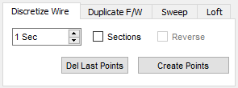
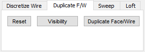
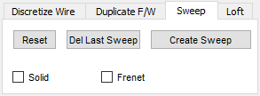
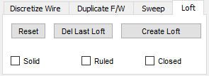
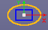
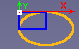
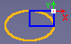
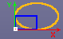
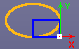
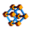

# Macro Connect And Sweep
{{Macro
|Name= Macro Connect And Sweep
|Icon=Macro_Connect_And_Sweep.png
|Description={{ColoredText|#ff0000|#ffffff|New version GUI modifyed for the HD dpi (QGridLayout) run only FC version 0.18 and more (PySide2 Qt5)}}     This macro easily creates a connection between two objects, an object and a point or between two points or on wire selected (the center of the objects are the starting and ending points of the sweep) can be selected form a configurable ellipse polygon circle. A discretize function is available to create marker points configurable for cutting lines in section or cutting with a dimension on point is created to all coordinates. A Duplicate face or wire feature for use with the Sweep and Loft operation Sweep and Loft operation directly with the macro. Centring the beam on face  For the precedent version see [https://gist.githubusercontent.com/mario52a/3ec67a3711202dab69592ce53b938924/raw/b3554916e0dce63644a2d4d3f88ef114b5e1e390/Macro_Connect_And_Sweep.FCMacro Macro_Connect_And_Sweep.FCMacro] and install it manually.
|Author=Mario52
|Version=0.12
|Date=2020-07-05
|FCVersion=0.18 and more
|Download=[https://www.freecadweb.org/wiki/images/c/c9/Macro_Connect_And_Sweep.png ToolBar Icon] 
}}

## Description

This macro easily creates a connection between two objects, an object and a point or between two points (the center of the objects are the starting and ending points of the sweep) can be selected form a configurable ellipse polygon circle.
A discretize function is available to create marker points configurable for cutting lines in section or cutting with a dimension on point is created to all coordinates.
A Duplicate face or wire feature for use with the Sweep and Loft operation
Sweep and Loft operation directly with the macro.

 

   
*Macro_Connect_And_Sweep*

## Usage

Run the macro select your objects or points choice the form and parameters and click **Create**.

 

 *Discretize*  *Duplicate*  *Sweep*  *Loft*  *Reset*

## Images

These files must be copied to your macros directory

(For download : Click Right button op the image and click \"Save Image as \...\" (version 0.17))

     

 The icon for the toolbar   

## Script

*\' Macro\_Connect\_And\_Sweep.FCMacro*\'

Download the macro to Gits [*\' Macro\_Connect\_And\_Sweep.FCMacro*\'](https://gist.github.com/mario52a/3ec67a3711202dab69592ce53b938924)

## Example

Path and tubing with Macro\_Connect\_And\_Sweep and [Macro\_Repro\_Wire](http://www.freecadweb.org/wiki/index.php?title=Macro_Repro_Wire)  

<File:Macro> Connect And Sweep 02.png\| The sweep to work

 <File:Macro> Connect And Sweep 03.png\| Select the two points choice your form, settings and execute the sweep 

<File:Macro> Connect And Sweep 04.png\| Repeat the operation if needed

 <File:Macro> Connect And Sweep 05.png\| select the border of cylinder and run the [Macro\_Repro\_Wire](Macro_Repro_Wire.md)  

 <File:Macro> Connect And Sweep 06.png\| the circle is created activate the Sweep tools  

 <File:Macro> Connect And Sweep 07.png\| Select the circle the path and execute the sweep 

<File:Macro> Connect And Sweep 08.png\| Easy ?

## Animated example 

*align=center|
[[File:Macro Connect And Sweep Sweep2.gif]]*

{clear}}

*align=center|
<translate>

Object and Object, the connection boundBox center object 1 and boundBox center object 2
</translate>
[[File:Connect_And_Sweep_01_Object_Object.gif]]*

*align=center|
<translate>

Object SubObject, the connection boundBox center object 1 and boundBox center Subobject 1
</translate>
[[File:Connect_And_Sweept_02_Object_SubObject.gif]]*

*align=center|
<translate>

SubObject SubObject, the connection boundBox center Subobject 1 and boundBox center Subobject 2
</translate>
[[File:Connect_And_Sweep_03_SubObject_SubObject.gif]]*

*align=center|
<translate>

Connect And Sweep Direction one object selected or Subobject selected
</translate>
[[File:Connect And Sweep 4 Direction.gif]]*

*align=center|
<translate>

Detect Error of mode selection, if one error of selection is created the mode change to mode 3 and the mode 3 line is colored in orange
</translate>
[[File:Connect_And_Sweep_05_Detect_Error.gif]]*

## Version

ver 0.12 2020/07/05 : include icons in source code

ver 00.11b 2020-02-22 : adding the test \"try: except\" on test FreeCAD version

ver 00.11 2020-02-13 : modify for the HD dpi QGridLayout run only FC version 0.18 and more
For the precedent version see [Macro\_Connect\_And\_Sweep.FCMacro](https://gist.githubusercontent.com/mario52a/3ec67a3711202dab69592ce53b938924/raw/b3554916e0dce63644a2d4d3f88ef114b5e1e390/Macro_Connect_And_Sweep.FCMacro)

ver 00.10 2020-01-09 : centering on face

ver 00.09 2020-01-06 : adding Tab Duplicate (as Macro reproWire), Sweep, Loft.

ver 00.08 2019-12-23 : adding function discretize wire and create marker points for use the points as landmarks

ver 00.07 2019-06-26 : upgrade add mode Object to Object, Object to SubObject, SubObject to SubObject selection one line and other minor change

00.06 18/06/2019 : adding \"Recompute\" on create line section

00.05 05/04/2019 : compatible Python 3

00.04 22/02/2017 : upgrade the search path

00.03 15/09/2016 : add create pipe

00.02 13/06/2016 : add options choice angle path rectangle and ellipse

00.01 07/06/2016 : add option solid or not centring rectangle or not

00.00 05/06/2016 :

 

## Links

The forum discussion [Scripting point to point tubing](http://forum.freecadweb.org/viewtopic.php?f=22&t=15833)

This macro is based to the microelly2 code see [Looking for some helpful GUI-commands](http://forum.freecadweb.org/viewtopic.php?t=7029#p56746)

Other forum discussion [Macro\_Connect\_And\_Sweep](https://forum.freecadweb.org/viewtopic.php?f=22&t=35432)

---
[documentation index](../README.md) > Macro Connect And Sweep
