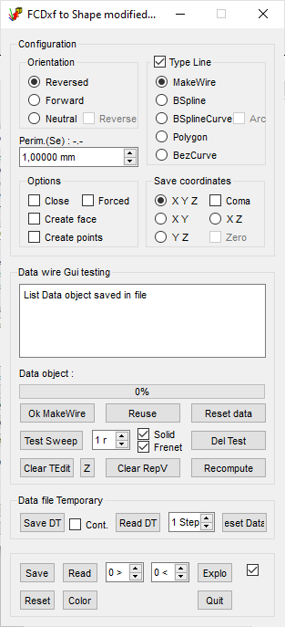
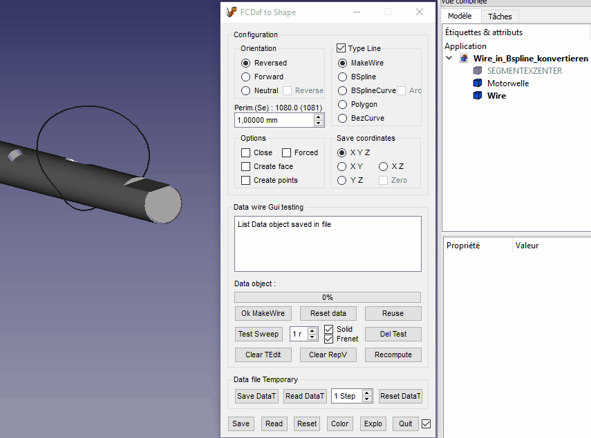
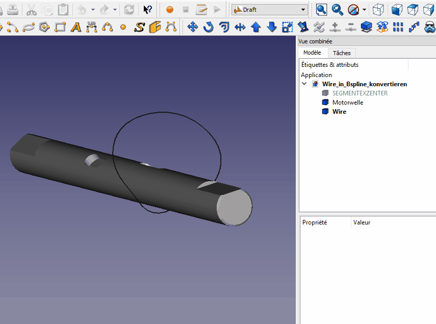

# Macro Dxf To Shape
**Documentation not finished, not translate thanks**

{{Macro
|Name=Macro Dxf To Shape
|Description=Utility to create a unique wire with many wires
|Author=Mario52
|Version=00.00
|Date=2020-09-04
|FCVersion= 0.18, 0.19
|Download=[https   *//www.freecadweb.org/wiki/images/f/f4/Macro_Dxf_To_Shape.png ToolBar Icon]
}}

## Description

Macro utility to create a unique wire with many wires. Types of wire available are   * MakeWire, Bspline, BsplineCurve, BsplineCurve + Arc, Polygon, and Bezier curve.

{{Codeextralink|https   *//gist.githubusercontent.com/mario52a/0596ad522b151806d5970586a5051e4b/raw/23fe427f5f00df81c9a7d0a877cf58c052ea5f76/Macro_DXF_to_Shape.FCMacro}}

## Usage

-   Downgrade the compound line to work with a single line
-   Discretize the first line
-   The linetest is created by choosing one of the following types   * MakeWire, Bspline, BsplineCurve, Polygon, BezCurve (display the orientation Begin - End (Reversed Forward))
-   test is good .. then   coordinates in file (and Del Test If you want)
-   second line same first line and accord end to begin \....
-   test is good .. then   coordinates in file (and Del Test If you want)
-   \...\... tests finished
-     saved in on unique wire with the type line selected

you can also test one sweep, force reverse, close wire, create points, cloud\...

you can also   the file to disk

(  ,  ,   Are the Temporary working file)

 

## Script

The icon for you toolBar  copy in same directory to the macro

[How to Customize Toolbars](Customize_Toolbars.md), [How to install macros](How_to_install_macros.md)

The script on github [Macro\_DXF\_to\_Shape.FCMacro](https   *//gist.github.com/mario52a/0596ad522b151806d5970586a5051e4b)

## Example

 
*Convert Wire (multi lines) in BsplineCurve*

 
*Convert wire with selected face*

## Links

-   More of mario52\'s macros can be found on [Github](https   *//gist.github.com/mario52a)

## Version

-   04/09/2020 ver 00.00    * add duplicate edge button

-   13/02/2020 ver 00.00    *

-   21/11/2016 ver 00.00    *

---
 [documentation index](../README.md) > Macro Dxf To Shape
