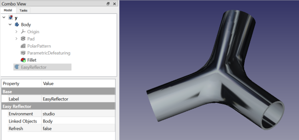

# Macro EasyReflector
{{Macro
|Name=Macro EasyReflector
|Icon=EasyReflectorIcon.svg
|Description=Easily manage textures with this Feature Python object
|Author=TheMarkster
|Version=0.2023.12.09
|Date=2023-12-09
|FCVersion=Python 3 versions
|Download=[https://wiki.freecadweb.org/File:EasyReflectorIcon.svg ToolBar Icon]
|Links=[https://github.com/mwganson/EasyReflector Full Documentation on Github]
}}

## Description

EasyReflector makes it easy to manage textures in FreeCAD. It creates a [Feature Python](App_FeaturePython.md) object that persists when the document is reloaded. Select from a variety of included textures, or use your own images.

Full documentation can be found on github: [EasyReflector](https://github.com/mwganson/EasyReflector).

   
*Macro EasyReflector screenshot‎*

## Legend

 

ToolBar Icon   

## Script

 **Macro EasyReflector.FCMacro**

{{CodeDownload|https://gist.github.com/mwganson/aea3c51981c0b994cfd961cf4db56b50|EasyReflector.FCMacro}}

---
⏵ [documentation index](../README.md) > Macro EasyReflector
