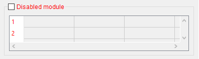
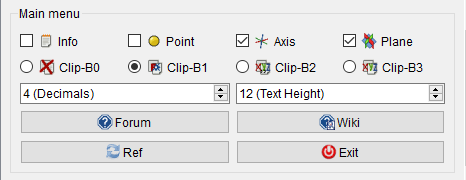

# Macro FCInfo
**[left|45px|link=](File:Under_construction_icon-blue.svg.md) image and page no yet upgrade with the new feature ... waiting<br>(This wiki page correspond in date ver 1.22, 12/11/2020 and not include the new features)<br><br>Upgrade page in progress<br>**


{{Macro
|Name=Macro FCInfo
|Icon=FCInfo.png
|Description=Gives information about the selected shape and can display a conversion of length, inclination (degrees, radians, grades, percent), area, volume and weight in different units (metric and imperial). The macro now also works for the elements of a sketch in edit mode.
<br />French Version [https://gist.githubusercontent.com/mario52a/6afc64081c4eb8be3b93/raw/795cac01c84fbbfa7ea68703c7138667119995d8/FCInfo_fr_Ver_1-26c-rmu_Docked.FCMacro Version française]
|Author=Mario52
|Version=1.26c
|Date=2022/04/19
|FCVersion=All
|SeeAlso=[Arch Survey| [Arch Survey](Arch_Survey.md)<br /> [Macro_SimpleProperties| [Macro SimpleProperties](Macro_SimpleProperties.md)<br /> [ [Macro FCInfoGlass](Macro_FCInfoGlass.md)
}}

## Description

Gives information about the selected shape and can display a conversion of length, inclination (degrees, radians, grades, percent), area, volume and weight in different units (metric and imperial). The macro now also works for the elements of a sketch in edit mode.

 

 
*FCInfo*

## Utilisation

Select an object or launch the application and select an object, and a series of informations appear. His calculations based on unity of FreeCAD, which is the **mm** to each new selection, the length unit always comes back on **mm** and angle on **decimal degrees**. 


**Sector 1: Document**


-   Document name
-   Label and internal name of the object
-   Internal Name of the object
-   Sub element name and type of the object
-   Type of the object

**Sector 2: Coordinates click mouse**


-   Coordinates X,Y and Z click to mouse
-   The button creates point, axis, plane, copy vector axis from **FreeCAD.Vector(-24.0, 240.0, 7.0)**

**Sector 3: Color on point**


-   Colour on point clicked.
-   Line Edit display the colour value in different formats: \"3435973887\" , \"#cccccc\" , \"0xcccccc\" , \"204,204,204\" , \"(0.8,0.8,0.8)\"
    -   **3435973887** : Mode RVBA Int unsigned (format in FreeCAD preferences) Alpha = 255
    -   **#cccccc** : Mode RVB Hexadecimal (`Qt setStyleSheet("color : #cccccc"`)
    -   **0xcccccc** : Mode RVB Hexadecimal (Python: `hex(0xcccccc`)
    -   \"**204,204,204** \" : RVB decim: Mode RVB (Qt `setStyleSheet("background-color: rgb(204, 204, 204)")`)
    -   **(0.8,0.8,0.8)** : RVB float: Mode RVB format float de 0.0 à 1.0

(The number of decimals depend of the option \"x (Decimals)\")

**Sector 4: Value Units**


-   If the object is a face perimeter, length of the object is displayed. Unit size can be selected :
    km, hm, dam, m, dm, cm, **mm**, µm, nm, pm, fm, inch, link, foot, yard, perch, chain, furlong, mile, league, nautique.
-   If the object is a circle, a second line is opened and displays the radius of circle.
-   Perimeter of the shape.

**Sector 5: Inclination**


-   **Inclination of the object** can be displayed in:
    -   decimal degree, ex: 174.831872611°
    -   degree minute seconde, ex: 174° 49\' 54.741401\'\'
    -   radian, ex: 3.05139181449 rad
    -   grade, ex: 194.257636235 gon
    -   pourcent, ex: 30° = 57.74%
-   **Inclinations in planes XY, YZ, ZX** and their coordinates
-   **Direction object**, give the direction of object. The calculate is : coord_1 - coord_2 = direction (or reverse)
    -   
        **Line**
        
        this button create a line in direction of the object.
-   **ValueAt**, returns the 3D vector corresponding to a parameter value.

**Sector 6: Surface and Volume**


-   Surface of the form displayed, unit size can be selected.
-   Surface of the face displayed, unit size can be selected.
-   Volume of the form displayed, unit size can be selected.
-   Density of the material in **kg by dm3**
    (the \"spinBox\" is set to **7,5** kg, average density of steel. If you want a different default value, change the value of the density, line 204).
-   The **gram** unit mass can be chosen :
    ton,quintal, kg, hg, dag, **gram**, dg, cg, mg, µg, ng, pg, fg, gr (grain), dr (drachm), oz (once), oz t (once troy),
    lb t (livre troy), lb (livre av), st (stone), qtr (quarter), cwt (hundredweight), tonneau fr, ct.
-   Weight of the form displayed, unit mass can be selected.

**Sector 7: BoundBox**


-   BoundBox gives extreme dimensions of the shape.

**Sector 8: Center of:**


-   Center of the shape and these coordinates XYZ
-   Center of mass and these coordinates XYZ
-   The button creates on point, axis, plane, copy vector axis form **FreeCAD.Vector(-24.0, 240.0, 7.0)**


**Sector 9: Inertia**


-   Moment of inertia and these coordinates length and weigth
-   The button creates on point, axis, plane, copy vector axis form **FreeCAD.Vector(-24.0, 240.0, 7.0)**
    -   action line 1 : x1, y1, z1
    -   action line 2 : x2, y2, z2
    -   action line 3 : x3, y3, z3
    -   action 4 diagonal : x1, y2, z3

same for length and weigth

-   Determinant 1 : computes the determinant of the matrix, in [scientific value](https://en.wikipedia.org/wiki/Scientific_notation)
-   Determinant 2 : computes the determinant of the matrix, in decimal value

**Sector 4: Vertexes and details**



-   CheckBox for for search or not all details of the object. If it is not checked, only the principal value is displayed.
-   Vertexes and details of the shape (compt_Edge), (compt_Faces), (compt_Vector of the Face)
    max 200 lines in the table, if there are more than 200 lines it appears (!+ 200) and the number of lines
    (full details can save be the **Save** button in a file in CSV format and can be viewed the file in spreadsheet with the **Read** or by an external spreadsheet as [LibreOffice](https://www.libreoffice.org/) [OpenOffice](http://openoffice.apache.org/downloads.html) or other)

**Section 10: SpreadSheet**


-    **Read**: read the data in a spreadsheet saved **.FCInfo** or txt, asc, csv

-    **Save**: save the data in disk in the form selected below **.FCInfo** or txt, asc, csv

-    **Tabulation**: the separator is Tabulation

-    **Comma**: the separator is Comma

-    **Semicolon**: the separator is Semicolon

-    **Space**: the separator is Space

Option for save or read the spreadsheet with different separator, Tabulation, Comma, Semicolon, Space
The Tabulation are the separator for the FreeCAD \[Spreadsheet_Workbench\|Spreadsheet workbench\]
The number of this four separator are calculate for help if unknown
The COMMA are the old (01.16 and before) separator of the FCInfo macro
Now for compatibility with the FreeCAD spreadsheet and since 01.17 version the TABULATION is the separator by default
If you want to convert your old FCInfo spreadsheet : Open it in FCInfo and save it with the Tabulation option checked

**Section 11: Main**



-    **CheckBox Clip Board**: if checked, the coordinates are saved in clipBoard form : **FreeCAD.Vector(-24.0, 240.0, 7.0)**

-    **CheckBox Point**: if checked, one point is created in the coordinate displayed form : **FreeCAD.Vector(-24.0, 240.0, 7.0)**

-    **CheckBox Axis**: if checked, one axis is created in the coordinate displayed form : **FreeCAD.Vector(-24.0, 240.0, 7.0)**

-    **CheckBox Plane**: if checked, one axis plane is created in the coordinate displayed form : **FreeCAD.Vector(-24.0, 240.0, 7.0)**

-    **Ref**: refresh the display of data in report view

-    **Exit**: exit the macro (you must restart from the tool bar button or menu \"View → Panels → FCInfo\"

-    **CheckBox****1** : if this CheckBox is checked, the informations are displayed in the report view window

-    **CheckBox****2** : if this CheckBox is not checked, the window macro are displayed to right (default). If it is checked the window macro are displayed to left

Once launched macro, the macro remains active and the window remains visible. To exit the macro by pressing **Exit**. If you leave by the cross, the macro remains in memory and the data appears in the \"report view\" of FreeCAD.


<center>

Image:Macro_FCInfo_04.png\|Docked to right, Image:Macro FCInfo 05.png\|or left with Combo view and reachable by a tab, or not docked, to the choice.


</center>


## Options

### The unit used 

#### Length unit: 

km, hm, dam, m, dm, cm, **mm**, µm, nm, pm, fm, inch, link, foot, yard, perch, chain, furlong, mile, league, nautique.

#### Angle degrees : 

1.  **decimal degree**, ex: 174.831872611°
2.  degree minute seconde, ex: 174° 49\' 54.741401\'\'
3.  radian, ex: 3.05139181449 rad
4.  grade, ex: 194.257636235 gon
5.  pourcent ex: 30° = 57.74%

Understanding of angles in FCInfo display.


<center>

Image:Macro FCInfo 02.png\|Understanding of angles in FCInfo display Image:Macro FCInfo 03.gif\|Understanding of angles in poucent in FCInfo display
click twice to see the animation (the image must be in full screen)


</center>


#### Weight unit : 

ton, quintal, kg, hg, dag, **gram**, dg, cg, mg, µg, ng, pg, fg, gr (grain), dr (drachm), oz (once), oz t (once troy),
lb t (livre troy), lb (livre av), st (stone), qtr (quarter), cwt (hundredweight), tonneau fr, ct
the \"spinBox\" is set to **7,5** kg, average density of steel. If you want a different default value, change the value of the density, line 208

 
```python
 global densite       ; densite       = 7.5  # (steel = 7.5 kg par dm3)
```

A file can be created by the button **Save**. The file is written as a file [csv](https://fr.wikipedia.org/wiki/Comma-separated_values) in this way, the data can be studied in a spreadsheet in FreeCAD or OpenOffice, LibreOffice\...

## Script

Copy the contents of the macro in a file named \"FCInfo.FCMacro\"

-   Windows: the form is usually **\" drive:\\Users\\your_user_name\\AppData\\Roaming\\FreeCAD\\ \"**
-   Ubuntu: the form is usually **\" /home/your_user_name/.FreeCAD \"**.

Or, directly in the interface of FreeCAD
The icon must be in the same directory as the macro.
Download image positioning on the icon   and then drag the mouse right click \"save as\" (do not change the name)
  **PS: the code is too long to be contained in the wiki page (for the time being the wiki pages accept only 64 KB) the macro code has been placed in the forum**


<div class="toccolours mw-collapsible mw-collapsed">


{{ColoredParagraph|There is also a [FCInfo Alternate Linux](FCInfo_Alternate_Linux.md) for only for FreeCAD version 0.13... and PyQt4. ''Now totally obsolete see just as example code''
}}


<div class="mw-collapsible-content">

ColoredParagraph\|There is also a [Macro FCInfo Alternate Linux](Macro_FCInfo_Alternate_Linux.md). Here the code is changed (due to the character display error : **² ³ ° μ** ordinal not in range (128)\") which posed problems. In certain configurations the functions are the same
Example : 
```python
global uniteSs       ; uniteSs       = u"mm²"
global uniteVs       ; uniteVs       = u"mm³"
global uniteAs       ; uniteAs       = u"°"
``` remplacés par 
```python
global uniteSs       ; uniteSs       = "mm"+iso8859(unichr(178)) # also:  carre    hex="\xb2"  # also:  html=<span>&#178;</span>
global uniteVs       ; uniteVs       = "mm"+iso8859(unichr(179)) # also:  cube     hex="\xb3"  # also:  html=<span>&#179;</span>
global uniteAs       ; uniteAs       = iso8859(unichr(176))      # also:  degrees  hex="\xb0"  # also:  html=<span>&#176;</span>
                                     = iso8859(unichr(181))      # also:  micro    hex="\xB5"  # also:  html=<span>&#181;</span>
``` **Files saved with this version is incompatible with the other version (docked or not)**


</div>


</div>

Download the macro file on gist **docked to right**


{{CodeDownload|https://gist.github.com/mario52a/8d40ab6c018c2bde678f|last version Macro_FCInfo}}

(Or **[on the forum.](http://forum.freecadweb.org/viewtopic.php?f=10&t=3185&p=47748#p47748)** )
**PS:** this macro uses **getSelection()** and the list of object begin to 1 ex: for a box **Edge1 to Edge12** and the code in the console start at 0 ex: for a box **Edge\[0\] to Edge\[11\]**
This is normal, the counting on arrays/lists inside OpenCascade always starts at **1 and not at 0**.  

### Limitations

Always leave the button **Exit**. If one exits the program without going through the button **Exit**, the program remains in memory and continues to run and the display will remain in the \"view report\". You must leave FreeCAD to erase it from memory.
Only the first 200 elements of the object are visible in the table. If there are more than 200 items in the object, a signal will be displayed by **(! +200)**. The complete list of data is visible in the file saved by the button **Save**.
If the window macro is invisible after the run, see the bottom window :


 

project:
~~read the file directly in a table.~~ done
~~matches the \"Edges\" and their coordinates~~ done
~~Association of a substance to its density~~
~~inclination on the element rather than the global object~~ done
~~inlay right in the interface of FreeCAD~~ done

## Version

-   ver 1.26c 2022/04/19 upgrade BSpline error with Gear Bspline=Line

-   ver 1.26b 20/02/2022 upgrade for detect BSpline in SubObject

-   ver 1.26 06/02/2022 add info on Mesh and Points objects, decode colours, duplicate object or subObject, memorize the latest path and other preferences options

-   ver 1.25e 18/12/2021 add info detailed to BSpline (ToByArcs) and info \"sel\[0\].TypeId\"
-   ver 1.25d 12/12/2021 \-\--
-   ver 1.25c 12/12/2021 correct \"strAround((\" by \"str(Around(\" and other little \...
-   ver 1.25b 11/12/2021 correction error in change/modify new material and reorganization
-   ver 1.25 10/12/2021 PySide2 and add comboBox materials
-   ver 1.24 02/12/2021 add [adjustedGlobalPlacement](https://forum.freecadweb.org/viewtopic.php?f=22&t=59852) modified by edwilliams16 for placement with Body, boundbox tracing
-   ver 1.23cb 25/11/2021 delete **\"import Sketcher \* \"** create conflict with \"**open(OpenName, \"r\")**\" ??

Adding  
```python
FreeCAD.ActiveDocument.openTransaction(u"FCInfo")    # memorise les actions (avec annuler restore)
FreeCAD.ActiveDocument.commitTransaction()           # restore les actions  (avec annuler restore)
#FreeCAD.ActiveDocument.abortTransaction()            # abandonne les actions(avec annuler restore)
```

-   ver 1.25d, 13/12/2021 little correction material field uncomment the \"\'try\...Except\" !!!
-   ver 1.25c, 12/12/2021 little correction new material
-   ver 1.23b, 20/11/2021 little correction, add text info in beginning run macro, and ordinal the text code
-   ver 1.23 , 19/11/2021 include icon in macro, number decimal displayed, text height, configure options in the Preference FC, correct info for elements of sketch in edit mode.
-   ver 1.22 , 12/11/2020 : now the macro is totally uninstalled i use :

 
```python
try:
        self.window.setAttribute(QtCore.Qt.WA_DeleteOnClose, True)    # destroy
        self.window.deleteLater()                                     # destroy
        self.window.destroy()                                         # destroy
except Exception:
        None
```

[How do i exit from FreeCAD instead of Python?](https://forum.freecadweb.org/viewtopic.php?f=22&t=48013#p411508)

instead: 
```python
self.window.hide()
``` and i adding the possibility display or not the \"Error Message\" window \"False\" by default, if you wand activate the warning window go to :  
```python
FreeCAD >Menu >Tools >Edit parameters... >BaseApp/Preferences/Macros/FCMmacros/FCInfo > switchWarning
```

-   ver 1.21-3.01 , 07/11/2019 \# 07/11/2019 ver \"01.21-3-rmu\" replace character micro = \"U\", square = \"2\", cube = \"3\", degrees = \" deg\" see \"<https://forum.freecadweb.org/viewtopic.php?f=3&t=6005&start=70#p345819>\"
-   ver 1.21-2.01 (1.21-rmu) 11/06/2019 rmu replace all characters over 127 in ex: \"°\" in chr(176)) #degree
-   ver 1.21.01 (1.21-rmu) 30/05/2019 rmu change fixed positions to qt layouts grid.addWidget() by rmu75 see the rmu75 fork \"<https://gist.github.com/rmu75/b165147bd1c2f2659c014103793ae1d8>\"
-   ver 1.21 , 16/04/2019 optimization for Py 3\... Qt 5\... FreeCAD 0.15 to 0.19 release
-   ver 1.20 , 29/01/2018 optimization
-   ver 1.19 , 20/01/2018 create checkBox for use detection all elements of the object if wanted or not , the macro is faster. Optimisation
-   ver 1.18 , 19/12/2017 \...
-   ver 1.17c , 14/12/2017 create plane with coordinate give in one project in other project and replace \"FCInfo\" by \"\_\_title\_\_\"
-   ver 1.17b , 13/12/2017 little correction replace FCTreeView to FCInfo
-   ver 1.17 , 12/12/2017 add upgrade Moment of inertia mm and kg by pinq [FCMacro and moment of inertia of assembly](https://forum.freecadweb.org/viewtopic.php?t=23888), and create plane, axis, point, and add options separator for spreadsheet
-   ver 1.16 , 21/06/2017 add control height police (here PointSize 8) and checkbox for position the window to right or left
-   ver 1.15 , 19/12/2015 suppression PyQt4 option [see](http://forum.freecadweb.org/viewtopic.php?f=12&t=13541) , add checkBox for editing infos in report view
-   ver 1.14 , 04/08/2014 replace PyQt4 and PySide and correct tooltip not displayed cause on PySide and add fg
-   ver 1.13 , 27/07/2014 replace FCInfo_en_Ver_1-12_Docked.FCMacro to FCInfo_en_Ver_1-13_Docked.FCMacro accept PyQt4 and PySide
-   ver 1.12 , 10/03/2014 adding tooltip
-   ver 1.11 , 04/03/2014 adding µm, nm, pm, fm, µg, ng, pg, pourcent, fixed of grandeur carat ~~\"cd\"~~ in **\"ct\"**, display of the label and internal name, fixed calculation of angles XY YZ ZX could give an error on a compound shape, window dockable in FreeCAD
-   ver 1.10.b , 19/11/2013 buttons outside the scrollbar and the dimensions of the window blocking

(ver 1.10 , 18/11/2013 create scrollbar)
\*ver 1.08.b , 10/11/2013 translation units in English, error correction to display the area of the faces listed in the table and replacement of the\"**print**\" by \"**App.Console.PrintMessage**\"
~~ver 1.09 , 04/11/2013 works perfectly on Windows and Linux (cause of errors on Linux the characters : ² ³ ° \"ordinal not in range(128)\")~~
In a Linux distribution and in the case of an error of **\"ordinal not in range (128)\"** an alternative version exists on this page [Macro_FCInfo_Alternate_Linux](Macro_FCInfo_Alternate_Linux.md)
\*ver 1.08 , 24/10/2013 correction of high top \"Faces\" and \"Edges\" displaying 100 objects (in the saved file)
\*ver 1.07 , 11/10/2013 matches the \"Faces\" and their coordinates.
\*ver 1.06 , 22/09/2013 matches the \"Edges\" and their coordinates, inclination on the element rather than the global object
\*ver 1.05 , 17/09/2013 added an icon for the spreadsheet, conversion barrel fr, affichage des dimensions overall instead of coordinates.
\*ver 1.04 , 11/09/2013: read the file directly in a table.
\*ver 1.03 , 09/09/2013: clearer display in view report and replacement by \"typeObject = sel\[0\].Shape.ShapeType\"
\*ver 1.02 , 7/09/2013 : small updates
\*ver 1.00 , 6/09/2013

## Links

See Also:  [Arch Survey](Arch_Survey.md)

You can share your comments on the forum [Info Workbench - Help with icons please.](http://forum.freecadweb.org/viewtopic.php?f=10&t=3185)
Here another post of [FCInfo Macro](http://forum.freecadweb.org/viewtopic.php?f=8&t=6005)


---
 [documentation index](../README.md) > Macro FCInfo
