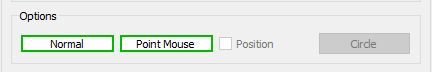

# Macro FCSpring Helix Variable
{{Macro
|Name=Macro FCSpring Helix Variable
|Icon=FCSpring Helix Variable.png
|Description=This macro creates a spring with customizable, any turn may change the spring configuration can be saved in a file with the extension '''.FCSpring''' or coordinates '''.FCSpringCoor'''.<br />Are detected   * Surface (Face direction), Cylinder (Radius), Ellipse (MinorRadius), Sphere (Radius), Toroid (Radius1), Plane (Direction), Line (follow the Direction ), Point (XYZ vertex position)<br />If no object is detected (not selection) the spring is created at the point XYZ 0., 0., 0.<br/>See the [https   *//www.freecadweb.org/wiki/Macro_FCSpring_Helix_Variable#Examples examples]
|Author=Mario52
|Version=01.18
|Date=2022/03/16
|Download=Download the [https   *//forum.freecadweb.org/download/file.php?id=80844 the Icons] in .zip file 
|FCVersion=0.19
}}

## Description

This macro creates a spring highly customizable. Any modification changing the spring configuration can be saved in a file with the extension .FCSpring or coordinates .FCSpringCoor
Are detected   * Surface (Face direction), Cylinder (Radius), Ellipse (MinorRadius), Sphere (Radius), Toroid (Radius1), Plane (Direction), Line (follow the Direction ), Point (XYZ vertex position)
If no object is detected (not selection) the spring is created at the point XYZ 0., 0., 0.

 

   
*FCSpring Helix Variable*

## Usage

This section is used to configuration the spring

Schematic detail of spring configuration

  

#### **Gui**

  

#### Configuration

-    {{SpinBox|10 coils}}**Number of coil**    * Total of coil to spring. Default = 10

-    {{SpinBox|20,000 mm}}**Radius of spring**    * Radius of spring. Default = 20.0

-    {{SpinBox|15,000 mm}}**Pitch of spring**    * Pitch of spring general. Default = 15.0

-    {{SpinBox|5 ( 72 points )}}**Precision of turn**    * Precision of turn the precision correspond the number of point for 1 turn the coil and is calculate    * precision (number points) = (pitch / (360/precision)). Default = 5 (72 points)

-    {{SpinBox|20,000 mm}}   * Radius of large circle of the cone (check the {{CheckBox|TRUE|Spring conical}} for use)

-    {{CheckBox|Spring conical}}   * Give the large diameter of the cone that dimension will always be greater than the radius

-    {{CheckBox|Angles}}   * Check box choice for activate the function Begin and End angle of the coil unchecked by default.
    If the function is checked. The accuracy is automatically set \"precision\" is ordered {{SpinBox|1 ( 360 points )}} to 1 (360 points per turn 1 point = 1 degrees)

-    {{SpinBox|0 deg}}**Begin**    * Begin angle of the spring first coil.

-    {{SpinBox|360 deg}}**End**    * End angle of the spring last coil.

  

#### Type line 

-    {{RadioButton|TRUE| Bspline}}**BSpline**    * Type line BSpline.

-    {{RadioButton| Wire}}**Wire**    * Type line Wire.

-    {{CheckBox| Points}}**Points**    * Check box point if the check box is activate one point is create of on each point.

-    {{CheckBox|Reverse}}**Reverse**    * Check box reverse if the check box is activate the spring changes direction

  

#### Options

This section is displayed if on object is selected. The type object is displayed in the Text Editor

The object can be line, 2 points, circle, wire \... one axis the length of the spring is automatically created

Detection    * Cylinder (radius), Sphere (radius), Toroid (radius) , Cone (little radius), Circle (radius), Arc (radius), Ellipse (little radius)

-    **Normal**   * If one circle is selected **Normal** not modify the radius of circle (Default)

    -   
        **Adapt Rad.**
        
           * If the button **Normal**\' is pressed, the button change to **Adapt Rad.** the spring is adapted to the detected radius (If a radius is detected )

-    **Point Mouse**   * If the click mouse is on one face the spring is created on this point (Default)

    -   
        **Center Face**
        
           * If the button **Point Mouse** is pressed, the button change to **Center Face**, the spring is created on the center face selected

-    {{CheckBox|Position}}**Position**    * If two object are selected (First axis, Second the spring (or other object)), this checkBox is enabled and you can modify the placement object 2 (spring) along the on object 1 (axis), if this {{CheckBox|TRUE|Position}} is checked the \"Position\" option is enabled for use

-    **Circle**   * If three points click mouse are selected the **Circle** button is enabled and it possible to create a circle which can serve as a base for a spring

  

#### Position (0)(xx) 

(0)(xx)    * Number selection(s), length in mm of axis created x 10, equal number of points for shifting the spring of the axis

-    **Begin/End**   * Position the spring on begin, middle, end axis

-    **Reverse Spr.**   * Reverse the spring of the axis

-    {{SpinBox|0,1 mm}}   * Shifting the spring with precision (0.1 mm) along its axis

-    **Reverse Count.**   * Reverse the counter ex   * Begin 0 to 10.. or End 0 to 10..

-   **Slider**    * Position the spring on its axis

  

#### Coil special dimension 

-    {{SpinBox|Num   * 2}}**Numbering of coil**    * Numbering of coil to modify. (Default    * none)

-    {{CheckBox|Smoothing}}**Smoothing** This checkBox discover one spinBox for determine the grade of smoothing the maximum value is the precision value -1 (this option is still at the prototype stage and the result can be satisfying or completely wrong)

-    {{SpinBox|0,000 mm}}**Pitch of coil**    * Pitch of coil to modify. (Default    * none)

-    **15.0 mm**   * If the button is pressed the value of the \"Pitch of string\" is affected of the \"Pitch of coil\" (This value is automatically aligned of the value Pitch of string)

-    {{SpinBox|0,000 mm}}**Radius of coil**    * Radius of coil to modify. (Default    * none)

-    **20.0 mm**   * If the button is pressed the value of the \"Radius of string\" is affected of the \"Radius of coil\" (This value is automatically aligned of the value Radius of string)

-    ** Accept the value modified**   * Button to accept the modification after select the numbering of coil and modify the pitch of coil.

-   **Text edit**    * This window displayed all coil modified.

-    **Clear**   * Clean the text editor

-    **Zoom**   * Button \"Zoom\" enlarge the text-edit window

  

#### Command

-    ** Load**   * The Lead button open a dialogue box to read a file **.FCSpring**.

-    ** Save**   * The Save button open a dialogue box to save a file **.FCSpring** with configuration spring modify or not.

-    ** Load Coordinates**   * Open a dialogue box to read a file **.FCSpringCoor** (all coordinates of points of the spring).

-    ** Save Coordinates**   * Open a dialogue box to save a file **.FCSpringCoor** (all coordinates of points of the spring).

-    ** Quit**   * Quit the macro.

-    ** Reset**   * Reset the macro to default configuration.

-    ** Launch**   * Launch the macro and create the spring configured.

-    **Help**   * This button display the wiki page int the FreeCAD browser.

  

## Report view 

The window report view displayed all value modified.

  

## Example spring 

Example to spring modified

  

## Example Report view 

When the macro is launched full list of turns is displayed in tabular form.

Here the data of the spring above and displayed in the Report view   

## Icon

Download the file image and copy in your macro repertory.

Click the image, in the new window position the mouse over the image, click the right mouse and do \"Save target as \...\"

ToolBar button   Macro icons

        

## Script

**Macro_FCSpring_Helix_Variable.FCMacro**

Download the macro to Gist [Macro_FCSpring_Helix_Variable](https   *//gist.github.com/mario52a/68c81c32a0727a693d3a)

## Installation

The above file is a macro in the form of GitHub code. Download the Zip on GitHub, and then follow the macros installation instructions for dummies shown at [installing FreeCAD macros in Ubuntu](https   *//wiki.opensourceecology.org/wiki/Installing_Macros_in_FreeCAD).

## Examples


<center>

<File   *Valves> Assembly IN EX.png\| Valves Assembly IN EX with permit and created by r.tec see [Inlet & Exhaust Valves Assembly](http   *//forum.freecadweb.org/viewtopic.php?f=24&t=14183) and [Spiralfeder](http   *//forum.freecadweb.org/viewtopic.php?f=13&t=14143) thanks r.tec


</center>


<center>

<File   *Macro> FCSpring Helix Variable 12.png\| <File   *Macro> FCSpring Helix Variable 13.png\|


</center>


<center>

<File   *Macro> FCSpring Helix Variable 14.png\| <File   *Macro> FCSpring Helix Variable 15.png\|


</center>


<center>

<File   *Macro> FCSpring Helix Variable 16.png\| <File   *Macro> FCSpring Helix Variable 17.png\|


</center>


<center>

<File   *Macro> FCSpring Helix Variable 18.png\|


</center>


<center>

<File   *Macro> FCSpring Helix Variable 19.png\|Difference between Smooth (here 71 with precision 5 (72 points)) and normal


</center>


<center>

<File   *Macro> FCSpring Helix Variable.gif\|Example


</center>


<center>

<File   *Macro> FCSpringHelixVariable Example 02.gif\|Example create conical spring


</center>


<center>

<File   *Macro_FCSpringHelixVariable_Spring_On_Circle.gif%7CExample> create spring on circle <File   *Macro_FCSpringHelixVarable_Spring_Along_Axis.gif%7CMove> along the axis


</center>


## Links

The forum discussion [Try to do a Spring](http   *//forum.freecadweb.org/viewtopic.php?f=3&t=8313&p=68161#p68161)

## Project

spring solid truncated

soften fittings    *done

modify diameter to any coil    *done

## Version

2022/03/16 Version 0.18    * adding scrollBar, possibility docking Left or Right, restore the chrono *(time.time())*, memorise the last FilePath

 
```python
####chrono################
import time
global depart ; depart  = 0.0
global arrivee; arrivee = 0.0
def chrono(switch)   *    # 0=depart autre=stop
#time.strftime('%X %x %Z')#'15   *44   *07 12/14/19 Paris, Madrid'
    global depart
    global arrivee
    try   *
        if switch == 0   *
            depart = time.time()#time.clock()
            App.Console.PrintMessage("Chrono begin      * "+str(time.strftime('%X'))+"\n")
        else   *
            arrivee = time.time()#time.clock()
            App.Console.PrintMessage("Chrono end        * "+str(time.strftime('%X'))+"\n")
            parcouru = ((arrivee - depart)/60.0)
            App.Console.PrintError("Time execution    * "+str("%.3f" % parcouru)+" min"+"\n\n")
        return parcouru
        FreeCADGui.updateGui()    
    except Exception   * None
####chrono################
```

2020/11/12 Version=01.17    * suppress the timer chrono !!

2020/10/18 Ver 00.16b    * i suppress the test on FC 18 line 56, i suppress the timer chrono and i wait one little

2020/05/01 Ver 00.16   * correction error file (save and load) cause \"label_11_Name\" suppressed\...

2020/04/11 Ver 01.15   * layout and little presentation

2019/05/03 Ver 01.14   * compatible FreeCAD 0.19.16523 (Git)

2019/04/08 Ver 01.13   * compatible FreeCAD 0.18.16093 (Git) /Python version   * 3.6.6 /Qt version   * 5.6.2

03/04/2017   * ver 01.12   * correction bug line 2314 add \"global ui\"

11/12/2016   * ver 01.11   * Adding Position of the spring on a selected object

10/09/2016   * ver 01.10   * Adding Button \"Zoom\" enlarge the textedit window

04/09/2016   * ver 01.09   * add smoothing

16/03/2016   * ver 01.08    * correct and add \"int()\" to debutAngle and finAngle (read file)

02/03/2016   * ver 01.07    * add option reverse spring

08/02/2016   * ver 01.06    * correct bug angle cause \"modifyAngle = int(file.readline().rstrip(\'\\n\\r\')) \# 9\" modifyAngle is int() not char

07/01/2015   * ver 01.05    * adding \"Try \...Except\" (data cone) for compatibility with old version

07/01/2015   * ver 01.04    * adding spring conical and modify the path to \"UserAppData\" and adding the icone.

07/12/2014   * ver 01.03    * new version with radius coil adjustable

17/11/2014   * ver 1.02    * new version with GUI and modification any coil and save or load the data to disk.

10/11/2014   * (23h20) correction of the modification  
```python
ligne.Placement = App.Placement(App.Vector(0.0,0.0,0.0), App.Rotation(App.Vector(0,0,1),angleTr), App.Vector(0,0,0))
``` 10/11/2014   * modify line 44    *  
```python
        a = FreeCAD.ActiveDocument.Line.Placement=App.Placement(App.Vector(0.0,0.0,0.0), App.Rotation(App.Vector(0,0,1),angleTr), App.Vector(0,0,0))
``` to  
```python
        ligne = FreeCAD.ActiveDocument.Line.Placement=App.Placement(App.Vector(0.0,0.0,0.0), App.Rotation(App.Vector(0,0,1),angleTr), App.Vector(0,0,0))
``` 6/11/2014    * adding \"makeBSpline\" and configuration

## Limitations

During sweep tests here are the mistakes I have obtained !


<center>

<File   *Macro> FCSpring Helix Variable 20.png\|For the moment the macro is not adapted for the square, rectangle\...
Only circle work well


</center>


<center>

<File   *Macro> FCSpring Helix Variable 09.png\|ACCESS VIOLATION <File   *Macro> FCSpring Helix Variable 10.png\|TCollection_IndexedDataMap


</center>


<center>

<File   *Macro> FCSpring Helix Variable 11.png\|Wrong usage of punctual sections


</center>


---
 [documentation index](../README.md) > Macro FCSpring Helix Variable
