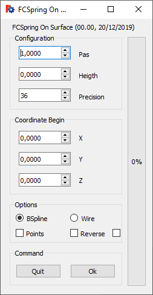
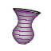
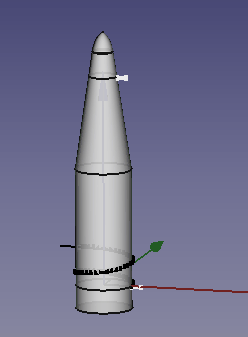

# Macro FCSpring On Surface
{{Macro
|Name=Macro FCSpring On Surface
|Icon=FCSpring_On_Surface.png
|Description=This macro creates a helix (or spring) around a solid object whatever its shape, the helix follows the entire surface of the object (Python2 is required) Download the [https://www.freecadweb.org/wiki/images/3/38/FCSpring_On_Surface.png toolBar icon]
|Author=Mario52
|Version=00.00
|Date=2019/12/20
|Download=[https://www.freecadweb.org/wiki/images/3/38/FCSpring_On_Surface.png ToolBar icon]
|FCVersion=0.18 and above
|SeeAlso=[Macro FCSpring Helix Variable](Macro_FCSpring_Helix_Variable.md) [
}}

## Description

This macro creates a helix around a solid object whatever its shape, the helix follows the entire surface of the object. (Python2 is required).

  

## Usage

Select the object (solid), the macro calculate by default value:

-   The value of the height of the BoundBox of the object, the X value of the center of the BoundBox, the Y value of the center of the BoundBox, and the Z value of the base of the BoundBox.

  

**Configuration:**

-   **Pas :** The pitch of the helix (Default: 1)
-   **Height :** The height of the helix. By default the height is the maximum height of the boundBox of the object.
-   **Precision :** Number of points for one turn of the object, maximum 360 (Default: 36)

**Coordinate Begin:**

-   **X :** The value X. If the object is offset, the X BoundBox center axis value is detected and used by default.
-   **Y :** The value Y. If the object is offset, the Y BoundBox center axis value is detected and used by default.
-   **Z :** The value Z. The Z of the base of the BoundBox is detected and used by default.

**Options:**

-   **BSpline :** One helix Bspline is created
-   **Wire :** One helix Wire is created
-   **Points :** One point is created in all coordinate created for built the Bspline or Wire
-   **Reverse :** The helix is reversed (Default: counterclockwise)
-   If is checked you must dee the progression in the 3D view

**Command:**

-    **Quit**: Quit FCSpring\_On\_Surface

-    **Ok**: Run the creation

## Script

ToolBar icon  

**Macro\_FCSpring\_On\_Surface.FCMacro**

{{MacroCode|code=
# -*- coding: utf-8 -*-
#from __future__ import unicode_literals
#
"""
***************************************************************************
*   Copyright (c)  2019 <mario52>                                         *
*                                                                         *
*   This file is a supplement to the FreeCAD CAx development system.      *
*                                                                         *
*   This program is free software; you can redistribute it and/or modify  *
*   it under the terms of the GNU Lesser General Public License (LGPL)    *
*   as published by the Free Software Foundation; either version 2 of     *
*   the License, or (at your option) any later version.                   *
*   for detail see the LICENCE text file.                                 *
**                                                                       **
*   Use at your own risk. The author assumes no liability for data loss.  *
*              It is advised to backup your data frequently.              *
*             If you do not trust the software do not use it.             *
**                                                                       **
*   This software is distributed in the hope that it will be useful,      *
*   but WITHOUT ANY WARRANTY; without even the implied warranty of        *
*   MERCHANTABILITY or FITNESS FOR A PARTICULAR PURPOSE.  See the         *
*   GNU Library General Public License for more details.                  *
*                                                                         *
*   You should have received a copy of the GNU Library General Public     *
*   License along with this macro; if not, write to the Free Software     *
*   Foundation, Inc., 59 Temple Place, Suite 330, Boston, MA  02111-1307  *
*   USA                                                                   *
***************************************************************************
*           WARNING! All changes in this file will be lost and            *  
*                  may cause malfunction of the program                   *
***************************************************************************
"""
#Macro_FCSpring On Surface 20/12/2019 /_00
#
#OS: Windows 10 (10.0)
#Word size of OS: 64-bit
#Word size of FreeCAD: 64-bit
#Version: 0.19.18848 (Git)
#Build type: Release
#Branch: master
#Hash: 50f4c012b4d45a4d34055f0be1a48de6e293c9a8
#Python version: 3.6.8
#Qt version: 5.12.1
#Coin version: 4.0.0a
#OCC version: 7.3.0
#
__title__   = "FCSpring On Surface"
__author__  = "Mario52"
__url__     = "http://www.freecadweb.org/index-fr.html"
__Wiki__    = "http://www.freecadweb.org/wiki/index.php?title=FCSpring_On_Surface"
__version__ = "00.00"
__date__    = "20/12/2019"

#original code by wandererfan
#How to intersect a line with a part
#http://www.forum.freecadweb.org/viewtopic.php?f=22&t=5456

import PySide2
from PySide2 import QtGui ,QtCore, QtWidgets
from PySide2.QtGui import *
from PySide2.QtCore import *

import time
import math
from math import sqrt, pi, sin, cos, asin
import Draft, Part, FreeCADGui, FreeCAD
from FreeCAD import Base

Gui = FreeCADGui
App = FreeCAD

global ui         ; ui         = ""
global lineLength ; lineLength = 0.0  # longueur de la ligne
global noPass     ; noPass     = 1    # switch observer
global detectFace ; detectFace = 0
global sel        ; sel        = ""
global objet      ; objet      = ""

####chrono################
import time
global depart ; depart  = 0.0
global arrivee; arrivee = 0.0
def chrono(sec):    # 0=depart autre=stop
#time.strftime('%X %x %Z')#'15:44:07 12/14/19 Paris, Madrid'
    global depart
    global arrivee
    if sec == 0:
        depart = time.time()#time.clock()
        App.Console.PrintMessage("Chrono begin   : "+str(time.strftime('%X'))+"\n")
    else:
        arrivee = time.time()#time.clock()
        App.Console.PrintMessage("Chrono end     : "+str(time.strftime('%X'))+"\n")
        parcouru = ((arrivee - depart)/60.0)
        App.Console.PrintError("Time execution : "+str("%.3f" % parcouru)+" min"+"\n")
#    FreeCADGui.updateGui()    
####chrono################

class Ui_MainWindow(object):

    def __init__(self ):
        self.window = MainWindow
        #self.path  = FreeCAD.ConfigGet("AppHomePath")
        #self.path  = FreeCAD.ConfigGet("UserAppData")
        #self.path  = "your path"
#        param = FreeCAD.ParamGet("User parameter:BaseApp/Preferences/Macro")# macro path
#        self.path = param.GetString("MacroPath","") + "/"                   # macro path
#        self.path = self.path.replace("\\","/")
#        print("Path for the icons : " , self.path)

        self.Pas        = 1.0
        self.Hauteur    = 0.0
        self.Precision  = 36
        self.steps      = (360.0 / self.Precision)
        self.longueurFil= 0.0
        self.coor_X     = 0.0
        self.coor_Y     = 0.0
        self.coor_Z     = 0.0

        self.PointSize     = 8    #heigth text

    def setupUi(self, MainWindow):
        self.window = MainWindow

        MainWindow.setObjectName("MainWindow")
        MainWindow.resize(251, 455)
#        MainWindow.move(1150, 100)                # position window

        self.label_00_Title = QtWidgets.QLabel(MainWindow)
        self.label_00_Title.setGeometry(QtCore.QRect(20, 5, 226, 16))
        self.label_00_Title.setObjectName("label_00_Title")

        ####
        self.GB_00_Configuration = QtWidgets.QGroupBox(MainWindow)
        self.GB_00_Configuration.setGeometry(QtCore.QRect(15, 25, 186, 126))
        self.GB_00_Configuration.setObjectName("GB_00_Configuration")

        self.DS_GB_00_01_Pas = QtWidgets.QDoubleSpinBox(self.GB_00_Configuration)
        self.DS_GB_00_01_Pas.setGeometry(QtCore.QRect(15, 20, 86, 22))
        self.DS_GB_00_01_Pas.setObjectName("DS_GB_00_01_Pas")
        self.DS_GB_00_01_Pas.setMaximum(999999)
        self.DS_GB_00_01_Pas.setValue(self.Pas)
        self.DS_GB_00_01_Pas.setDecimals(4)
        self.DS_GB_00_01_Pas.setToolTip("The screw pitch (default = 1)")
        self.DS_GB_00_01_Pas.valueChanged.connect(self.on_DS_GB_00_01_Pas)

        self.Label_GB_00_01_Pas = QtWidgets.QLabel(self.GB_00_Configuration)
        self.Label_GB_00_01_Pas.setGeometry(QtCore.QRect(115, 25, 66, 16))
        self.Label_GB_00_01_Pas.setObjectName("Label_GB_00_01_Pas")

        self.DS_GB_00_02_Hauteur = QtWidgets.QDoubleSpinBox(self.GB_00_Configuration)
        self.DS_GB_00_02_Hauteur.setGeometry(QtCore.QRect(15, 55, 86, 22))
        self.DS_GB_00_02_Hauteur.setObjectName("DS_GB_00_02_Hauteur")
#        self.DS_GB_00_02_Hauteur.setValue()
        self.DS_GB_00_02_Hauteur.setMaximum(999999)
        self.DS_GB_00_02_Hauteur.setDecimals(4)
        self.DS_GB_00_02_Hauteur.setToolTip("The height of the shape" + "\n"
                                            "the default height is calculte" + "\n"
                                            "by the max height of the BoundBox")
        self.DS_GB_00_02_Hauteur.valueChanged.connect(self.on_DS_GB_00_02_Hauteur)

        self.label_GB_00_02_Hauteur = QtWidgets.QLabel(self.GB_00_Configuration)
        self.label_GB_00_02_Hauteur.setGeometry(QtCore.QRect(115, 60, 66, 16))
        self.label_GB_00_02_Hauteur.setObjectName("label_GB_00_02_Hauteur")

        self.SP_GB_00_03_Precision = QtWidgets.QSpinBox(self.GB_00_Configuration)
        self.SP_GB_00_03_Precision.setGeometry(QtCore.QRect(15, 90, 86, 22))
        self.SP_GB_00_03_Precision.setObjectName("DS_GB_00_03_Precision")
        self.SP_GB_00_03_Precision.setValue(self.Precision)
        self.SP_GB_00_03_Precision.setMaximum(360)
        self.SP_GB_00_03_Precision.setMinimum(1)
        self.SP_GB_00_03_Precision.setToolTip("The number of points for one turn" + "\n"
                                              "(default = " + str(self.Precision) + ")")
        self.SP_GB_00_03_Precision.valueChanged.connect(self.on_SP_GB_00_03_Precision)

        self.label_GB_00_02_Precision = QtWidgets.QLabel(self.GB_00_Configuration)
        self.label_GB_00_02_Precision.setGeometry(QtCore.QRect(115, 95, 66, 16))
        self.label_GB_00_02_Precision.setObjectName("label_GB_00_02_Precision")

        ####
        self.GB_01_Coordinate = QtWidgets.QGroupBox(MainWindow)
        self.GB_01_Coordinate.setGeometry(QtCore.QRect(15, 160, 186, 131))
        self.GB_01_Coordinate.setObjectName("GB_01_Coordinate")

        self.DP_01_01_X = QtWidgets.QDoubleSpinBox(self.GB_01_Coordinate)
        self.DP_01_01_X.setGeometry(QtCore.QRect(15, 25, 86, 22))
        self.DP_01_01_X.setObjectName("SP_01_01_X")
        self.DP_01_01_X.setMaximum(999999)
        self.DP_01_01_X.setMinimum(-999999)
        self.DP_01_01_X.setDecimals(4)
        self.DP_01_01_X.setToolTip("The X value of the coordinate" + "\n"
                                   "the default value is calculed" + "\n"
                                   "by the X center BoundBox") 
        self.DP_01_01_X.valueChanged.connect(self.on_DP_01_01_X)

        self.DP_01_02_Y = QtWidgets.QDoubleSpinBox(self.GB_01_Coordinate)
        self.DP_01_02_Y.setGeometry(QtCore.QRect(15, 60, 86, 22))
        self.DP_01_02_Y.setObjectName("SP_01_01_Y")
        self.DP_01_02_Y.setMaximum(999999)
        self.DP_01_02_Y.setMinimum(-999999)
        self.DP_01_02_Y.setDecimals(4)
        self.DP_01_02_Y.setToolTip("The Y value of the coordinate" + "\n"
                                   "the default value is calculed" + "\n"
                                   "by the Y center BoundBox") 
        self.DP_01_02_Y.valueChanged.connect(self.on_DP_01_02_Y)

        self.DP_01_03_Z = QtWidgets.QDoubleSpinBox(self.GB_01_Coordinate)
        self.DP_01_03_Z.setGeometry(QtCore.QRect(15, 95, 86, 22))
        self.DP_01_03_Z.setObjectName("SP_01_01_Z")
        self.DP_01_03_Z.setMaximum(999999)
        self.DP_01_03_Z.setMinimum(-999999)
        self.DP_01_03_Z.setDecimals(4)
        self.DP_01_03_Z.setToolTip("The Z value of the coordinate" + "\n"
                                   "the default value is calculed" + "\n"
                                   "by the Z BoundBox minimum value") 
        self.DP_01_03_Z.valueChanged.connect(self.on_DP_01_03_Z)

        self.Label_GB_01_01_X = QtWidgets.QLabel(self.GB_01_Coordinate)
        self.Label_GB_01_01_X.setGeometry(QtCore.QRect(115, 30, 66, 13))
        self.Label_GB_01_01_X.setObjectName("Label_GB_01_01_X")

        self.Label_GB_01_02_Y = QtWidgets.QLabel(self.GB_01_Coordinate)
        self.Label_GB_01_02_Y.setGeometry(QtCore.QRect(115, 65, 66, 13))
        self.Label_GB_01_02_Y.setObjectName("Label_GB_01_02_Y")

        self.Label_GB_01_03_Z = QtWidgets.QLabel(self.GB_01_Coordinate)
        self.Label_GB_01_03_Z.setGeometry(QtCore.QRect(115, 100, 66, 13))
        self.Label_GB_01_03_Z.setObjectName("Label_GB_01_03_Z")

        ####
        self.GB_03_Options = QtWidgets.QGroupBox(MainWindow)
        self.GB_03_Options.setGeometry(QtCore.QRect(15, 300, 186, 71))
        self.GB_03_Options.setObjectName("GB_03_Options")

        self.RB_03_00_BSpline = QtWidgets.QRadioButton(self.GB_03_Options)
        self.RB_03_00_BSpline.setGeometry(QtCore.QRect(10, 20, 71, 18))
        self.RB_03_00_BSpline.setChecked(True)
        self.RB_03_00_BSpline.setToolTip("BSpline")
        self.RB_03_00_BSpline.setObjectName("RB_03_00_BSpline")

        self.RB_03_01_Wire = QtWidgets.QRadioButton(self.GB_03_Options)
        self.RB_03_01_Wire.setGeometry(QtCore.QRect(100, 20, 71, 18))
        self.RB_03_01_Wire.setToolTip("Wire")
        self.RB_03_01_Wire.setObjectName("RB_03_01_Wire")

        self.CB_03_00_Points = QtWidgets.QCheckBox(self.GB_03_Options)
        self.CB_03_00_Points.setGeometry(QtCore.QRect(10, 45, 71, 18))
        self.CB_03_00_Points.setToolTip("Create one Points in all coordinates")
        self.CB_03_00_Points.setObjectName("CB_03_00_Points")

        self.CB_03_01_Reverse = QtWidgets.QCheckBox(self.GB_03_Options)
        self.CB_03_01_Reverse.setGeometry(QtCore.QRect(100, 45, 71, 18))
        self.CB_03_01_Reverse.setToolTip("Reverse the direction" + "\n"
                                         "Default = counter clockwise")
        self.CB_03_01_Reverse.setObjectName("CB_03_01_Reverse")

        self.CB_03_02_Update = QtWidgets.QCheckBox(self.GB_03_Options)
        self.CB_03_02_Update.setGeometry(QtCore.QRect(170, 45, 18, 18))
        self.CB_03_02_Update.setObjectName("CB_03_02_Update")
        self.CB_03_02_Update.setToolTip("Display the progress of the operation in the 3D view")

        ####
        self.GB_02_Command = QtWidgets.QGroupBox(MainWindow)
        self.GB_02_Command.setGeometry(QtCore.QRect(15, 380, 186, 61))
        self.GB_02_Command.setObjectName("GB_02_Command")

        self.PB_02_01_Ok = QtWidgets.QPushButton(self.GB_02_Command)
        self.PB_02_01_Ok.setGeometry(QtCore.QRect(100, 25, 75, 23))
        self.PB_02_01_Ok.setObjectName("GB_02_01_Ok")
        self.PB_02_01_Ok.setToolTip("Button Ok" + "\n"
                                    "If on error is created" + "\n"
                                    "the button is coloured in red" + "\n"
                                    "if not the button is coloured in green")
        self.PB_02_01_Ok.clicked.connect(self.on_PB_02_01_Ok)

        self.PB_02_02_Quit = QtWidgets.QPushButton(self.GB_02_Command)
        self.PB_02_02_Quit.setGeometry(QtCore.QRect(10, 25, 75, 23))
        self.PB_02_02_Quit.setObjectName("GB_02_01_Quit")
        self.PB_02_02_Quit.setToolTip("Quit FCSpring On Surface")
        self.PB_02_02_Quit.clicked.connect(self.on_PB_Quit_clicked)

#        section progressBar 1 Green
        self.progressBar_1_Green = QtWidgets.QProgressBar(MainWindow)
        self.progressBar_1_Green.setGeometry(QtCore.QRect(210, 30, 30, 411))
        self.progressBar_1_Green.setValue(0)
        self.progressBar_1_Green.setOrientation(QtCore.Qt.Vertical)
        self.progressBar_1_Green.setAlignment(QtCore.Qt.AlignCenter)
        self.progressBar_1_Green.setObjectName("progressBar_1_Green")
        self.progressBar_1_Green.setToolTip("If the coordinate is erroneous the progressBar is coloured in red")
        self.progressBar_1_Green.setStyleSheet("QProgressBar {color:black; }"
                                               "QProgressBar:chunk {background-color: #00FF00;}") # modify the progressBar color 

        self.retranslateUi(MainWindow)
        QtCore.QMetaObject.connectSlotsByName(MainWindow)
        MainWindow.setWindowFlags(PySide2.QtCore.Qt.WindowStaysOnTopHint)        # PySide2 cette fonction met la fenetre en avant

    def retranslateUi(self, MainWindow):
        MainWindow.setWindowTitle(__title__+" ("+__version__+", "+__date__+")")
        self.label_00_Title.setText(__title__+" ("+__version__+", "+__date__+")")

        self.GB_00_Configuration.setTitle("Configuration")
        self.Label_GB_00_01_Pas.setText("Pas")
        self.label_GB_00_02_Hauteur.setText("Heigth")
        self.label_GB_00_02_Precision.setText("Precision")

        self.GB_01_Coordinate.setTitle("Coordinate Begin")
        self.Label_GB_01_01_X.setText("X")
        self.Label_GB_01_02_Y.setText("Y")
        self.Label_GB_01_03_Z.setText("Z")

        self.GB_03_Options.setTitle("Options")
        self.RB_03_00_BSpline.setText("BSpline")
        self.RB_03_01_Wire.setText("Wire")
        self.CB_03_00_Points.setText("Points")
        self.CB_03_01_Reverse.setText("Reverse")

        self.GB_02_Command.setTitle("Options")
        self.GB_02_Command.setTitle("Command")
        self.PB_02_01_Ok.setText("Ok")
        self.PB_02_02_Quit.setText("Quit")

    def on_DS_GB_00_01_Pas(self, value):
        self.Pas = value
        self.DS_GB_00_01_Pas.setStyleSheet("background-color: QPalette.Base")

    def on_DS_GB_00_02_Hauteur(self, value):
        self.Hauteur = value
        self.DS_GB_00_02_Hauteur.setStyleSheet("background-color: QPalette.Base")

    def on_SP_GB_00_03_Precision(self, value):
        self.Precision = value
        self.steps = (360.0 / self.Precision)
        self.SP_GB_00_03_Precision.setStyleSheet("background-color: QPalette.Base")

    def on_DP_01_01_X(self, value):
        self.coor_X = value

    def on_DP_01_02_Y(self, value):
        self.coor_Y = value

    def on_DP_01_03_Z(self, value):
        self.coor_Z = value

    def on_PB_02_01_Ok(self):
        global lineLength
        global noPass
        global sel
        global depart
        global arrivee
        global detectFace
        global objet

        try:
            if (self.Pas != 0) and (self.Hauteur != 0) and (self.Precision != 0) and (detectFace == 1):
                chrono(0)
                noPass     = 0    # switch 0=nopass
                #sel = FreeCADGui.Selection.getSelection()
                objetName  = sel[0].Name
                objetLabel = sel[0].Label
                objet      = sel[0].Shape
                z          = 0.0
                compteur   = 0

                lineDirectrice = Draft.makeWire([FreeCAD.Vector(0.0, 0.0, 0.0),FreeCAD.Vector(lineLength , 0.0, 0.0)])
                #print(lineDirectrice.Name)
                if self.CB_03_02_Update.isChecked():
                    FreeCADGui.ActiveDocument.getObject(lineDirectrice.Name).Visibility = True
                else:                    
                    FreeCADGui.ActiveDocument.getObject(lineDirectrice.Name).Visibility = False

                App.ActiveDocument.recompute()

                pl=FreeCAD.Placement()
                points = []
        
                self.progressBar_1_Green.setValue(0)
                progressMax = (self.Precision * int(self.Hauteur / self.Pas) + 1)
                self.progressBar_1_Green.setMaximum(progressMax)
                
                for sp in range(int(self.Hauteur / self.Pas) + 1):    #nombre de tours
                    for i in range(0, (360*1000), int(self.steps*1000)):                       #
                        if self.CB_03_01_Reverse.isChecked():
                            i = -float(i/1000)                ##Reverse
                        else:
                            i = float(i/1000)                 ##Normal

                        compteur += 1

                        pl=App.Placement(App.Vector(self.coor_X, self.coor_Y, z + self.coor_Z), App.Rotation(i,0.0,0.0), App.Vector(0,0,0))
                        lineDirectrice.Placement = pl
                        z += (self.Pas / self.Precision)
                
                        if z > self.Hauteur:
                            break
                
                        line   = lineDirectrice.Shape
                        intersection = objet.common(line)    # only for solid object not for face
                    
                        try:
                            coorIntersec = intersection.Vertexes[1].Point
                            points += [FreeCAD.Vector(coorIntersec[0],coorIntersec[1],coorIntersec[2])]
                            if self.CB_03_00_Points.isChecked():
                                Draft.makePoint(coorIntersec[0],coorIntersec[1],coorIntersec[2])
                        except Exception:
                            self.progressBar_1_Green.setStyleSheet("QProgressBar {color:black; }"
                                                "QProgressBar:chunk {background-color: #FF0000;}") # modify the progressBar color 
                            self.progressBar_1_Green.setValue(progressMax)

                        ####progressBar
                        self.progressBar_1_Green.setStyleSheet("QProgressBar {color:black; }"
                                              "QProgressBar:chunk {background-color: green;}")     # modify the progressBar color 
                        self.progressBar_1_Green.setValue(compteur)
                        ####progressBar
        
                        if self.CB_03_02_Update.isChecked():
                            Gui.updateGui()
                            App.ActiveDocument.recompute()
                
                try:
                    App.ActiveDocument.removeObject(lineDirectrice.Name)
                except Exception:
                    None

                if len(points) != 0:
                    ##Bspline
                    if self.RB_03_00_BSpline.isChecked():
                        BSpline = Draft.makeBSpline(points,closed=False)
                        #BSpline.Label = objetLabel + "_BSpline"
                        App.ActiveDocument.ActiveObject.Label = objetLabel + "_BSpline"
                        #self.longueurFil =
                    ##Wire
                    if self.RB_03_01_Wire.isChecked():
                        Wire = Draft.makeWire(points,closed=False)
                        #Wire.Label = objetLabel + "_Wire"
                        App.ActiveDocument.ActiveObject.Label = objetLabel + "_Wire"
                        #self.longueurFil = 
                    self.PB_02_01_Ok.setStyleSheet("background-color: green;\n"
                                                   "border:2px solid rgb( 0, 115,0);")
                else:
                    self.PB_02_01_Ok.setText("K-O")
                    self.PB_02_01_Ok.setStyleSheet("background-color: red;\n"
                                                   "border:2px solid rgb(115, 0, 0);")

            else:
                self.PB_02_01_Ok.setStyleSheet("background-color: red;\n"
                                               "border:2px solid rgb(115, 0, 0);")
                if (self.Pas == 0):
                    self.DS_GB_00_01_Pas.setStyleSheet("border:2px solid rgb(115, 0, 0);")
                if (self.Hauteur == 0):
                    self.DS_GB_00_02_Hauteur.setStyleSheet("border:2px solid rgb(115, 0, 0);")
                if (self.Precision == 0):
                    self.SP_GB_00_03_Precision.setStyleSheet("border:2px solid rgb(115, 0, 0);")
                
            FreeCAD.Console.PrintMessage("Pas        : " + str(self.Pas) + "\n")
            FreeCAD.Console.PrintMessage("Hauteur    : " + str(self.Hauteur) + "\n")
            FreeCAD.Console.PrintMessage("Precision  : " + str(self.Precision) + "\n")
            FreeCAD.Console.PrintMessage("Coordinate : " + str(len(points)) + "\n")
            #FreeCAD.Console.PrintMessage("Length     : " + str(self.longueurFil) + "\n")
            FreeCAD.Console.PrintMessage("coor_X     : " + str(self.coor_X) + "\n")
            FreeCAD.Console.PrintMessage("coor_Y     : " + str(self.coor_Y) + "\n")
            FreeCAD.Console.PrintMessage("coor_Z     : " + str(self.coor_Z) + "\n")
            chrono(1)
            FreeCAD.Console.PrintMessage("______________________" + "\n")
            points = []

        except Exception:
            self.PB_02_01_Ok.setStyleSheet("background-color: red;\n"
                                           "border:2px solid rgb(115, 0, 0);")

        App.ActiveDocument.recompute()
        noPass = 1    # switch 1 = pass

        ####################################################################
        
    def on_PB_Quit_clicked(self):
        FreeCADGui.Selection.removeObserver(s)   # Uninstalls resident function (desactivated for read after LeftDock RightDock)
        self.window.hide()                       # hide the window and close the macro
        FreeCAD.Console.PrintMessage("Quit " + __title__ + "\n\n")

##############################################################################
class SelObserver:
    def addSelection(self,document, object, element, position):  # Selection
        global ui
        global lineLength
        global noPass
        global sel
        global detectFace
        global objet

        sel = ""
        ui.progressBar_1_Green.setValue(0)
        ui.PB_02_01_Ok.setStyleSheet("background-color: QPalette.Base") # origin system
        ui.PB_02_01_Ok.setText("Ok")
        ui.DS_GB_00_01_Pas.setStyleSheet("background-color: QPalette.Base")
        ui.DS_GB_00_02_Hauteur.setStyleSheet("background-color: QPalette.Base")
        ui.SP_GB_00_03_Precision.setStyleSheet("background-color: QPalette.Base")
        ui.Label_GB_01_01_X.setText("X")
        ui.Label_GB_01_02_Y.setText("Y")
        ui.Label_GB_01_03_Z.setText("Z")

        detectFace = 0

        if (noPass == 1):
            try:
                selEx = FreeCADGui.Selection.getSelectionEx()
                if (noPass == 1) and (hasattr(selEx[0].SubObjects[0],"Surface")):
                    detectFace = 1                ui.DP_01_01_X.setValue(0.0)
                    ui.DP_01_02_Y.setValue(0.0)
                    ui.DP_01_03_Z.setValue(0.0)
        
                    sel = FreeCADGui.Selection.getSelection()
        
                    boundBoxLZ   = sel[0].Shape.BoundBox.ZLength         # Length z boundBox rectangle
                    ####
                    boundBoxLL   = sel[0].Shape.BoundBox.DiagonalLength  # Length Diagonal rectangle
                    ####
                    boundBoxZMin = sel[0].Shape.BoundBox.ZMin            # coordonate ZMin
                    ui.Label_GB_01_03_Z.setText("Z ("+str(round(boundBoxZMin,4))+")")
                    ####
                    boundBoxCenter = sel[0].Shape.BoundBox.Center        # boundBox Center
                    ####
        
                    ui.Label_GB_01_01_X.setText("X BBCenter")
                    ui.Label_GB_01_02_Y.setText("Y BBCenter")
                    ui.Label_GB_01_03_Z.setText("Z Lowermost")
        
                    ui.DP_01_01_X.setValue(boundBoxCenter[0])   # BBcenter X
                    ui.DP_01_02_Y.setValue(boundBoxCenter[1])   # BBcenter Y
                    ui.DP_01_03_Z.setValue(boundBoxZMin)        # point le plus bas
        
                    self.Hauteur = boundBoxLZ
                    ui.DS_GB_00_02_Hauteur.setValue(self.Hauteur)
                    lineLength = boundBoxLL
            except Exception:
                None
##############################################################################

s=SelObserver()
FreeCADGui.Selection.addObserver(s) # install the function resident mode

MainWindow = QtWidgets.QWidget()    #PySide2
ui = Ui_MainWindow()
ui.setupUi(MainWindow)
MainWindow.show()

}}

## Examples

 

### Links

The Genesis [Zwei Helix - ein Sweep](https://forum.freecadweb.org/viewtopic.php?f=13&t=41627)

The original code [How to intersect a line with a part](https://www.forum.freecadweb.org/viewtopic.php?f=22&t=5456#p44194) by wandererfan

---
 [documentation index](../README.md) > Macro FCSpring On Surface
