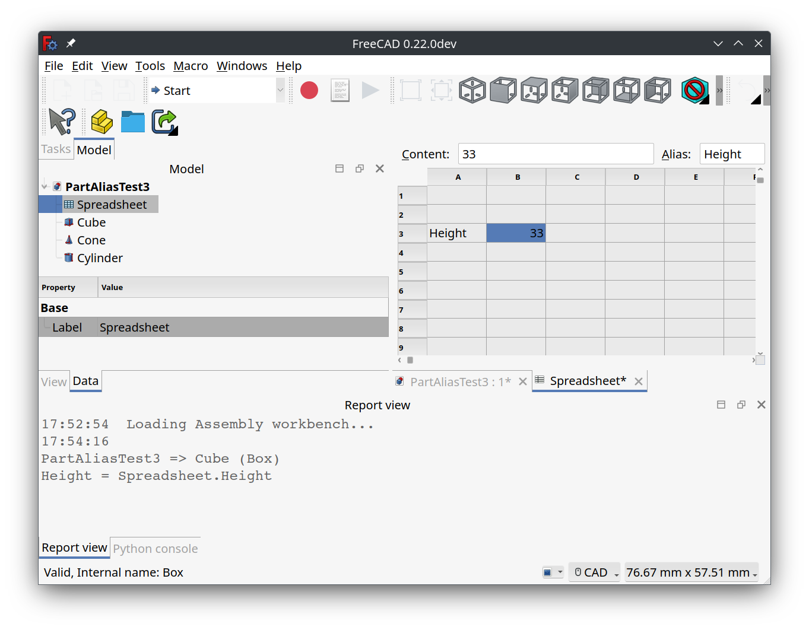

# Macro FindAliasReferences
{{Macro
|Name=FindAliasReferences
|Description=This macro will scan all the expressions in all the open documents then output, to the Report View, all expressions that contain the alias or if the alias is not defined then the value in the spreadsheet selected cell(s).
|Author=RoyW
|Download=[https://wiki.freecad.org/images/b/bd/FindAliasReferences.png?20240117201630 ToolBar Icon]
|Version=2024.04.09
|Date=2024-04-09
|FCVersion=0.22
}}

## Description

This macro will scan all the expressions in all the open documents then output, to the Report View, all expressions that contain the alias or if the alias is not defined then the value in the spreadsheet selected cell(s). This is a string match, not a wildcard match and not a regular expression.

The primary use case is to locate usages of spreadsheet aliases where the user has one or more cells selected that contain either the alias or a string containing the alias name. Aliases without any references may safely be removed if they are not used internally in the spreadsheet.

The secondary use case is for the user to put an arbitrary string in a cell then search the open document\'s expressions for tokens that start with the cell\'s value.

For example, say you have your spreadsheet in the **globals.FCStd** file and you [link](Std_LinkMake.md) to the spreadsheet from other documents. Now say you set your spreadsheet label to \"params\". This allows you to reference alias values as either {{Incode|globals#<<params>>.aliasName}} or shorter as {{Incode|<<params>>.aliasName}}. To use alias name completion you must use the former, but when done you want to change these alias references to the latter format for brevity. To find them, enter the unique start of the alias value in a cell, \"globals\" in this example, then run this macro on the cell.

## Usage

-   Select the spreadsheet in the tree view. Note, must be the actual spreadsheet and not a link to the spreadsheet.
-   Select one or more cells in the spreadsheet that contain the alias or substrings to find in expressions.
-   Run this macro.
-   Examine output in the Report View.

The output in the Report View will look like this:

For non-container objects:

 {{Code|lang=text|code=
document_name => object_label (object_name)
alias_name = expression
alias_name = expression
...
}}

For a container object:

 {{Code|lang=text|code=
document_name => container_label (container_name) => object_label (object_name)
alias_name = expression
...
}}

If no references are found for a substring, then \"No references to \"{substring}\" found\" will be displayed.

For an empty spreadsheet cell no output will be generated. This allows ignoring blank cells when a range of cells is selected.

  

*FindAliasReferences screenshot*

## Script

ToolBar icon 

 **Macro_FindAliasReferences.FCMacro**

{{MacroCode|code=
from typing import Generator

import FreeCAD
import re
from PySide import QtGui

"""
This macro will scan all the expressions in all the open documents then output, to the Report View, all 
expressions that contain the alias or if the alias is not defined then the value in the spreadsheet 
selected cell(s).  This is a string match, not a wildcard match and not a regular expression.

The primary use case is to locate usages of spreadsheet aliases where the user has one or more cells selected
that contain either the alias or a string containing the alias name.  Aliases without any references may 
safely be removed if they are not used internally in the spreadsheet.

The secondary use case is for the user to put an arbitrary string in a cell then search the open document's
expressions for tokens that start with the cell's value.

For example, say you have your spreadsheet in the globals.FCStd file and you link to the spreadsheet from
other documents.  Now say you set your spreadsheet label to "params".  This allows you to reference alias
values as either "globals#<<params>>.aliasName" or shorter as "<<params>>.aliasName".  To use alias name
completion you must use the former, but when done you want to change these alias references to the latter
format for brevity.  To find them, enter the unique start of the alias value in a cell, "globals" in this
example, then run this macro on the cell.

This macro reuses the spreadsheet handling code from EasyAlias macro by TheMarkster and rosta:
ref: "https://wiki.freecadweb.org/Macro_EasyAlias"

Usage:

* Select the spreadsheet in the tree view.  Note, must be the actual spreadsheet and not a link to the spreadsheet.
* Select one or more cells in the spreadsheet that contain the alias or substrings to find in expressions.
* Run this macro.
* Examine output in the Report View.

The output in the Report View will look like this:

For non-container objects:

  document_name => object_label (object_name)
  alias_name = expression
  alias_name = expression
  ...

For a container object:

  document_name => container_label (container_name) => object_label (object_name)
  alias_name = expression
  ...

If no references are found for a substring, then "No references to "{substring}" found" will be displayed.

For an empty spreadsheet cell no output will be generated.  This allows ignoring blank cells when a range 
of cells is selected.

Tested on: 

OS: Ubuntu 23.10 (KDE/plasmawayland)
Word size of FreeCAD: 64-bit
Version: 0.22.0dev.35485 (Git) AppImage
Build type: Release
Branch: main
Hash: a662fbb2ff267fb8dd56fcc3d1ec55a5968b7f5a
Python 3.10.13, Qt 5.15.8, Coin 4.0.2, Vtk 9.2.6, OCC 7.6.3
Locale: English/United States (en_US)
Installed mods: 
  * CurvedShapes 1.0.4
  * Assembly4 0.12.5
  * A2plus 0.4.60h
  * fasteners 0.4.58
  * lattice2 1.0.0
  * Curves 0.6.12

__title__ = "FindAliasReferences"
__author__ = "RoyW"
__date__ = "2024.04.09" #year.month.date
__version__ = __date__
__comment__ = "Find references to spreadsheet aliases in open documents"
__url__ = "https://wiki.freecadweb.org/Macro_FindAliasReferences"
__Wiki__ = "https://wiki.freecadweb.org/Macro_FindAliasReferences"
__License__ = "MIT"

"""

CELL_ADDR_RE = re.compile(r"([A-Za-z]+)([1-9]\d*)")
CUSTOM_ALIAS_RE = re.compile(r".*\((.*)\)")
MAGIC_NUMBER = 64
REPLACEMENTS = {
    " ": "_",
    ".": "_",
    "ä": "ae",
    "ö": "oe",
    "ü": "ue",
    "Ä": "Ae",
    "Ö": "Oe",
    "Ü": "Ue",
    "ß": "ss",
    "'": ""
}

def get_spreadsheets():
    """
    Returns a set of selected spreadsheets in the active document or None if none is selected.
    :returns: a set of selected spreadsheets in the active document or None if none is selected
    :rtype: set
    """

    spreadsheets = set()
    for selectedObject in Gui.Selection.getSelection():
        if selectedObject.TypeId == 'Spreadsheet::Sheet':
            spreadsheets.add(selectedObject)
        elif selectedObject.TypeId == "App::Link":
            linkedObject = selectedObject.LinkedObject
            if linkedObject.TypeId == 'Spreadsheet::Sheet':
                spreadsheets.add(linkedObject)
    return spreadsheets

# The original implementation of a1_to_rowcol and rowcol_to_a1 can be found here:
# https://github.com/burnash/gspread/blob/master/gspread/utils.py

def a1_to_rowcol(label: str):
    """Translates a cell's address in A1 notation to a tuple of integers.
    :param str label: A cell label in A1 notation, e.g. 'B1'. Letter case is ignored.
    :returns: a tuple containing row and column numbers. Both indexed from 1 (one).
    :rtype: tuple
    Example:
    >>> a1_to_rowcol('A1')
    (1, 1)
    """

    match = CELL_ADDR_RE.match(label)

    row = int(match.group(2))

    column_label = match.group(1).upper()
    column = 0
    for i, c in enumerate(reversed(column_label)):
        column += (ord(c) - MAGIC_NUMBER) * (26 ** i)

    return row, column

def rowcol_to_a1(row: int, column: int):
    """Translates a row and column cell address to A1 notation.
    :param row: The row of the cell to be converted. Rows start at index 1.
    :type row: int, str
    :param column: The column of the cell to be converted. Columns start at index 1.
    :type row: int, str
    :returns: a string containing the cell's coordinates in A1 notation.
    Example:
    >>> rowcol_to_a1(1, 1)
    A1
    """

    row = int(row)

    column = int(column)
    dividend = column
    column_label = ""
    while dividend:
        (dividend, mod) = divmod(dividend, 26)
        if mod == 0:
            mod = 26
            dividend -= 1
        column_label = chr(mod + MAGIC_NUMBER) + column_label

    label = "{}{}".format(column_label, row)

    return label

def text_to_alias(text: str) -> str:
    # support for custom aliases between parentheses
    match = CUSTOM_ALIAS_RE.match(text)
    if match:
        return match.group(1)

    for character in REPLACEMENTS:
        text = text.replace(character, REPLACEMENTS.get(character))
    return text

def _object_description(label: str, name: str) -> str:
    """
    Helper function to format label+name.

    if only label is not None, then return f"{label}"
    if only name is not None, then return f"{name}"
    if both are not None and equal, then return f"{label}"
    if both are not None and not equal, then return f"{label} ({name})"
    if both are None, then return "" (should not happen)

    :param label: object label string.
    :param name: object name string.
    :return: formatted string with label and name.
    """
    if label:
        if name:
            if label != name:
                return f"{label} ({name})"
        return label
    return ""

def _location_string(doc, obj) -> str:
    """
    The location of the object containing expressions may be either just the document for containerless objects
    or the object's container combined with the object itself.

    Containerless output will be:
    "Document.Name"

    Objects inside of containers with the same object label and name will be:
    "Document.Name => Object.Label"

    Objects inside of containers with different object label and name will be:
    "Document.Name => Object.Label (Object.Name)"

    :param doc: document instance.
    :param obj: object instance.
    :return: location string.
    """
    location = f"{doc.Name}"
    try:
        parent = obj.getParent()  # note FreeCAD-RealThunder has removed getParent()
        if parent:
            # location typically contains "DocName => MyContainer (Body001)"
            location = f"{doc.Name} => {_object_description(parent.Label, parent.Name)}"
    except:
        pass
    return location or ""

def _contains_alias(spreadsheet, substring: str, expression: str) -> bool:
    """
    Checks if the expression contains a reference to the spreadsheet's substring.

    The contains rules are:
      if any token of the expression matches:
        *<<{spreadsheet.Label}>>.{substring}
      or
        *<<{spreadsheet.Name}>>.{substring}
      or
        *{spreadsheet.Label}.{substring}
      or
        *{spreadsheet.Name}.{substring}
      or
        {substring}*

    FreeCAD formats alias references with "<<{spreadsheet.Label or spreadsheet.Name}.{alias_name}".
    For object parameters it uses "<<{object.Label or object.Name}>>.{parameter_name}".
    Fully qualified alias references use:
      "{spreadsheet_document.Name}#<<{spreadsheet.Label or spreadsheet.Name}.{alias_name}"
    The last content rule is to allow you to put the {spreadsheet_document.Name} in a cell and search for all
    fully qualified references.

    :param spreadsheet: The selected spreadsheet instance.
    :param substring: The substring (i.e. the alias name) to look for in the expression.
    :param expression:  The expression string to check if it contains the substring.
    :return: True if the expression contains the substring, False otherwise.
    """
    tokens = expression.split()
    pattern1 = f"<<{spreadsheet.Label or spreadsheet.Name}>>.{substring}"
    pattern2 = f"{spreadsheet.Label or spreadsheet.Name}.{substring}"
    for token in tokens:
        if token.endswith(pattern1):
            return True
        if token.endswith(pattern2):
            return True
        if token.startswith(substring):
            return True
    return False

def _finder(substring: str, spreadsheet) -> Generator[str, None, None]:
    """
    Helper that performs the search and returns a list of formatted output lines.

    :param substring: the substring to match in all expressions.
    :yields: the formatted output as a single line string.
    """

    # for each open document
    for doc in App.listDocuments().values():
        # iterate over non-null objects in the current document
        for obj in [o for o in doc.Objects if o]:
            try:
                location = _location_string(doc, obj)
                header = True
                # find the expressions that contain the substring
                for ee in [x for x in obj.ExpressionEngine if _contains_alias(spreadsheet, substring, x[1])]:
                    # just emit the header once for each document object that has expressions that contain
                    # the substring
                    if header:
                        yield ''
                        # typically yields "DocName => MyContainer (Body001) => MySketch (Sketch003)"
                        yield f"{location} => {_object_description(obj.Label, obj.Name)}"
                        header = False
                    # ee typically contains ["Constraints[N]", expression_string]
                    # so typically yields "Constraints[N] = expression_string"
                    yield f"{ee[0]} = {ee[1]}"
            except AttributeError as ex:
                # shouldn't happen...
                print(ex)

def find_alias_references(substring: str, spreadsheet) -> str:
    """
    Search expressions in all the open documents for the given substring.

    :param substring: the substring to match in all expressions.
    :param spreadsheet: the spreadsheet instance.
    :return: formatted multi-line string containing the found references.
    """
    return '\n'.join(_finder(substring, spreadsheet))

def main() -> None:
    """
    For each of the selected cells in the spreadsheet, find and print to the report view all the expressions
    that contain the alias, or if not defined, then the value in the selected cell.

    Note that the spreadsheet must be selected in the tree view.
    :return: None
    """
    spreadsheets = get_spreadsheets()
    if not spreadsheets:
        QtGui.QMessageBox.critical(None, "Error",
                                   "No spreadsheet selected.\nPlease select a spreadsheet in the tree view.")
        return
    for spreadsheet in spreadsheets:
        for selectedCell in spreadsheet.ViewObject.getView().selectedCells():
            # set substring to the cell's alias if present
            # If not then set substring to the cell's value
            substring = spreadsheet.getAlias(selectedCell)
            if not substring:
                contents = spreadsheet.getContents(selectedCell)
                if contents:
                    substring = text_to_alias(contents)
            # ignore blank cells
            if substring:
                # contents typically look like "'String\n" so strip off the leading ' and trailing newline
                substring = substring.lstrip("'").rstrip("\n\r")
                # print the report for the spreadsheet cell to the report view
                report_string = find_alias_references(substring, spreadsheet)
                print(report_string or f"No references to \"{substring}\" found")

main()
}}

## Link

The forum discussion [FindAlaisReferences Macro](https://forum.freecad.org/viewtopic.php?t=84197)

## Version

2024.01.05 : first

---
⏵ [documentation index](../README.md) > Macro FindAliasReferences
