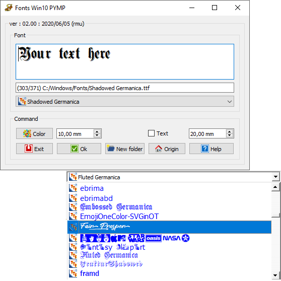
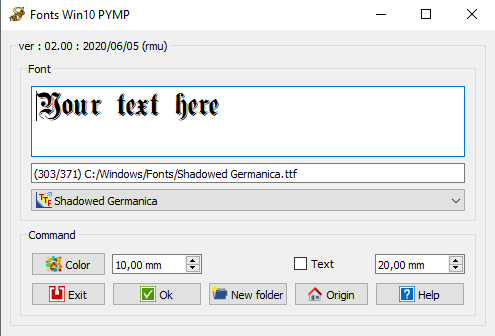

# Macro Fonts Win10 PYMP
{{Macro
|Name=Macro Fonts Win10 PYMP
|Icon=Macro_Fonts_Win10_PYMP.png
|Description= {{ColoredText|#ff0000|#ffffff|New version GUI modified for the HD dpi (QGridLayout) runs only FC version 0.18 and more (PySide2 Qt5)}}    For the previous version see [https://gist.githubusercontent.com/mario52a/e7aa19a9dc8ea28ad4f03944ffc8f731/raw/0f5d54209d6c242b49519c83e96c548b06a8f4c6/Macro_Fonts_Win10_PYMP.FCMacro Macro Fonts Win10 PYMP] and install it manually. This little macro is dedicate to users of Windows 10. The explorer fonts for use the ShapeString is empty and this little macro can help you see easily the font to use.
|Author=Mario52
|Version=02.00
|Date=2020-06-06
|FCVersion=0.18 and more
|Download=[https://www.freecadweb.org/wiki/images/f/fa/Macro_Fonts_Win10_PYMP.png ToolBar Icon]
}}

## Description

This little macro is dedicate to users of Windows 10. The explorer fonts for use the ShapeString is empty and this little macro can help you see easily the font to use.

   
*Macro Fonts Win10 PYMP*

## Uses

Launch the macro select the font and apply.

   
*Macro Fonts Win10 PYMP window *

-   **Text edit** : Window for your text

-   **Line edit** : for visualise your path and file used

-   **Combobox** : for choice your font

-    **Color**: choice the text color

-    {{SpinBox|10.00}}: dimension of text in 3D view

-    {{CheckBox|Text}}: create one text with the ShapeString

-    {{SpinBox|20.00}}: dimension of text displayed in the window macro

-    **Exit**: quit Fonts Win10 PYMP

-    **Ok**: validate your text

-    **New folder**: other choice path files font

-    **Origin**: return of the original directory font (system)

-    **Help**: display the wiki page in the FreeCAD browser

## Configuration

After the first launch, see :

{{Incode|Menu → Tools → User parameter : BaseApp/Preferences/Macros/FCMmacros/Fonts Win10 PYMP}}

-   **switchModeTextList**
    -   
        `False`
        
        normal (and black) text mode cuts the switchFontComBox

    -   
        `True`
        
        permit the switchFontComBox
-   **switchFontComBox**
    -   
        `False`
        
        (and switchModeTextList= `True`) faster text mode (in color) in ComboBox list

    -   
        `True`
        
        (and switchModeTextList= `True`) list in ComboBox is displayed to fontFamily, slower but more beautiful!
-   **setSystemFonts**
    -   
        `False`
        
        matplotlib.font\_manager.findSystemFonts(\"C:/\", \"ttf\")

        -   do all the fonts (in all the folders and sub-folders of the DD) time !!

    -   
        `True`
        
        fontman.findSystemFonts(self.pathFont)

        -   do all the fonts in the directory (and in all the sub-folders)
-   **seTtextAlignement**
    -   0 = AlignLeft (default)
    -   1 = AlignCenter
    -   2 = AlignRight
-   **setFontByDefault**
    -   the last font used is saved in this field
-   **setLastFontPath**
    -   the last path used is saved in this field

## Script

ToolBar Icon 

 **Macro Fonts Win10 PYMP.FCMacro**

{{MacroCode|code=

# -*- coding: utf-8 -*-
from __future__ import unicode_literals
"""
***************************************************************************
*   Copyright (c) 2019 2020 <mario52>                                     *
*                                                                         *
*   This file is a supplement to the FreeCAD CAx development system.      *
*                                                                         *
*   This program is free software; you can redistribute it and/or modify  *
*   it under the terms of the GNU Lesser General Public License (LGPL)    *
*   as published by the Free Software Foundation; either version 2 of     *
*   the License, or (at your option) any later version.                   *
*   for detail see the LICENCE text file.                                 *
**                                                                       **
*   Use at your own risk. The author assumes no liability for data loss.  *
*              It is advised to backup your data frequently.              *
*             If you do not trust the software do not use it.             *
**                                                                       **
*   This software is distributed in the hope that it will be useful,      *
*   but WITHOUT ANY WARRANTY; without even the implied warranty of        *
*   MERCHANTABILITY or FITNESS FOR A PARTICULAR PURPOSE.  See the         *
*   GNU Library General Public License for more details.                  *
*                                                                         *
*   You should have received a copy of the GNU Library General Public     *
*   License along with this macro; if not, write to the Free Software     *
*   Foundation, Inc., 59 Temple Place, Suite 330, Boston, MA  02111-1307  *
*   USA                                                                   *
***************************************************************************
*           WARNING! All changes in this file will be lost and            *  
*                  may cause malfunction of the program                   *
***************************************************************************
"""
#Macro_Fonts_Win10_PYMP 10/05/2019, 06/06/2020
#
###############################################################################################
#OS: Windows 10 (10.0)                         #OS: Ubuntu 20.04 LTS
#Word size of OS: 64-bit                       #Word size of OS: 64-bit
#Word size of FreeCAD: 64-bit                  #Word size of FreeCAD: 64-bit
#Version: 0.19.21280 (Git)                     #Version: 0.18.16131 (Git) AppImage
#Build type: Release                           #Build type: Release
#Branch: master                                #Branch: (HEAD detached at 0.18.3)
#Hash: 6f3160db3e88733536c7eaf97ad7d6ebd21baccd#Hash: 3129ae4296e40ed20e7b3d460b86e6969acbe1c3
#Python version: 3.6.8                         #Python version: 3.6.7
#Qt version: 5.12.1                            #Qt version: 5.6.2
#Coin version: 4.0.0a                          #Coin version: 4.0.0a
#OCC version: 7.3.0                            #OCC version: 7.3.0
#Locale: French/Mars (fr_MA)                   #
################################################################################################
#
__title__   = "Fonts Win10 PYMP"
__author__  = "Mario52"
__url__     = "https://wiki.freecadweb.org/Macro_Fonts_ Win10_PYMP"
__version__ = "02.00"
__date__    = "2020/06/06"    #YYYY/MM/DD
__icon__    = "https://wiki.freecadweb.org/images/f/fa/Macro_Fonts_Win10_PYMP.png"
__Gist__    = "https://gist.github.com/mario52a/e7aa19a9dc8ea28ad4f03944ffc8f731"
#
#### Test FreeCAD.Version simple ############################################################################################################
if int(FreeCAD.Version()[1]) < 18:      # Version de FreeCAD
    FreeCAD.Console.PrintMessage("This version " + __title__ + " rmu  work with the FreeCAD 0.18 or higher." + "\n\n")
    FreeCAD.Console.PrintMessage("For the precedent version see the page " + "\n\n")
    FreeCAD.Console.PrintMessage("https://gist.githubusercontent.com/mario52a/e7aa19a9dc8ea28ad4f03944ffc8f731/raw/0f5d54209d6c242b49519c83e96c548b06a8f4c6/Macro_Fonts_Win10_PYMP.FCMacro" + "\n\n")
#### Test FreeCAD.Version simple ############################################################################################################

import PySide2
from PySide2 import (QtWidgets, QtCore, QtGui)
from PySide2.QtWidgets import (QWidget, QApplication, QSlider, QGraphicsView, QGraphicsScene, QVBoxLayout, QStyle)
from PySide2.QtGui import (QPainter, QColor, QIcon)
from PySide2.QtSvg import *

import Draft, Part, PartGui, FreeCADGui, FreeCAD, FreeCADGui
from FreeCAD import Base
import os, time, sys

import math
from math import sqrt, pi, sin, cos, asin

App=FreeCAD
Gui=FreeCADGui
import WebGui
                                                       
global ui         ; ui = ""

#path#################################################################
global path                                                          #
#path  = FreeCAD.ConfigGet("AppHomePath")                             # path FreeCAD installation
#path  = FreeCAD.ConfigGet("UserAppData")                             # path FreeCAD User data
#path  = "your path"                                                  # your directory path
param = FreeCAD.ParamGet("User parameter:BaseApp/Preferences/Macro") # macro path
path  = param.GetString("MacroPath","") + "/"                        # macro path
path  = path.replace("\\","/")                                       # convert the "\" to "/"
#FreeCAD.Console.PrintMessage( "Path for the icons : " + path  + "\n")# 
######################################################################

#### matplotlib debut 1/5 #################################################################
#import PySide2
#from PySide2 import (QtWidgets, QtCore, QtGui)
#from PySide2.QtWidgets import (QWidget, QApplication, QSlider, QGraphicsView, QGraphicsScene, QVBoxLayout, QStyle)

import re
import operator
from operator import itemgetter #, attrgetter, methodcaller    # pour sort 
import platform

global newPolicePath
global PolicePath
global originalFontName
global originalFontPath
global searchFontName

if platform.system()   == "Windows" :
    PolicePath = newPolicePath = originalFontPath = "C:/Windows/Fonts/"
    originalFontName = "ARIAL"
elif platform.system() == "Linux" :
    PolicePath = newPolicePath = originalFontPath = "/usr/share/fonts/"
    originalFontName = "UBUNTU-M"
elif platform.system() == "Darwin":
    PolicePath = newPolicePath = originalFontPath = "/Library/Fonts/"
    originalFontName = "Arial"

#import glob
#files_TTF = glob.glob(self.pathFont + "/*.TTF") 
##################################
import matplotlib
import matplotlib.font_manager
import matplotlib.font_manager as fontman
import matplotlib.font_manager as fontconfig
from matplotlib.font_manager import FontProperties
#from matplotlib.ft2font import FT2Font
##################################

#### Config Begin matplotlib font #######################
                                                        # # https://en.wikipedia.org/wiki/Web_colors
global setColorTTF       ; setColorTTF       = "blue"   # .TTF   color by "extension name" or hexa "#0000FF" 
global setColorFON       ; setColorFON       = "orange" # .FON   color by "extension name" or hexa "#FFA500"
global setColorOTF       ; setColorOTF       = "green"  # .OTF   color by "extension name" or hexa "#008000"
global setColorPOL       ; setColorPOL       = "black"  # .OTHER color by "extension name" or hexa "#000000"
                                                      #####
global switchModeTextList; switchModeTextList= 1        # 0 = mode text normal (et noir) coupe le switchFontComBox
                                                        # 1 = permet le switchFontComBox 1 (default)
                                                      #####
global switchFontComBox  ; switchFontComBox  = 0        # 0 = (et switchModeTextList= 1) mode texte (en couleur) dans liste ComboBox plus rapide (default)
                                                        # 1 = (et switchModeTextList= 1) fontFamily dans liste ComboBox plus lent mais plus beau!
                                                      #####
global setSystemFonts    ; setSystemFonts    = 1        # 0 = matplotlib.font_manager.findSystemFonts("C:/", "ttf") 
                                                        #     fait toutes les fontes (dans tous les dossiers et sous dossiers du DD) time !!
                                                        # 1 = fontman.findSystemFonts(self.pathFont)
                                                        #     fait toutes les fontes du repertoire (et dans tous les sous dossiers) (default)
                                                      #####
global seTtextAlignement ; seTtextAlignement = 0        # 0 = AlignLeft (default)
                                                        # 1 = AlignCenter
                                                        # 2 = AlignRight
                                                      #####
global setFontByDefault  ; setFontByDefault  = "ARIAL"  # Font by Default
                                                      #####
global setLastFontPath   ; setLastFontPath   = PolicePath#directory font by start
                                                      #####
#### Config End matplotlib font #########################

###### Read Configuration begin ####
seTtextAlignement  = FreeCAD.ParamGet("User parameter:BaseApp/Preferences/Macros/FCMmacros/" + __title__).GetInt("seTtextAlignement")
setSystemFonts     = FreeCAD.ParamGet("User parameter:BaseApp/Preferences/Macros/FCMmacros/" + __title__).GetBool("setSystemFonts")
switchFontComBox   = FreeCAD.ParamGet("User parameter:BaseApp/Preferences/Macros/FCMmacros/" + __title__).GetBool("switchFontComBox")
switchModeTextList = FreeCAD.ParamGet("User parameter:BaseApp/Preferences/Macros/FCMmacros/" + __title__).GetBool("switchModeTextList")
setFontByDefault   = FreeCAD.ParamGet("User parameter:BaseApp/Preferences/Macros/FCMmacros/" + __title__).GetString("setFontByDefault")
setLastFontPath    = FreeCAD.ParamGet("User parameter:BaseApp/Preferences/Macros/FCMmacros/" + __title__).GetString("setLastFontPath")

if setLastFontPath == "":
    setLastFontPath = PolicePath
else:
    PolicePath = setLastFontPath

if setFontByDefault == "":
    if platform.system()   == "Windows" :
        setFontByDefault = "ARIAL"
    elif platform.system() == "Linux" :
        setFontByDefault = "UBUNTU-M"
    elif platform.system() == "Darwin":
        setFontByDefault = "Arial"
searchFontName = setFontByDefault
###### Read Configuration end   ####

homeIcon = [
"24 24 14 1",
"   c None",
".  c #EF2929",
"+  c #A40000",
"@  c #DDDFDC",
"#  c #888A85",
"$  c #DDDEDB",
"%  c #DCDEDB",
"&  c #DCDEDC",
"*  c #DBDDDA",
"=  c #BABDB6",
"-  c #555753",
";  c #729FCF",
">  c #3465A4",
",  c #8191AA",
"                        ",
"                        ",
"           .+           ",
"          ..++          ",
"         ....++         ",
"        .....+++        ",
"       ....@#++++       ",
"      ....@@@#++++      ",
"     ....@@@@@#++++     ",
"    ....@@@@$@@#++++    ",
"   ....@@@$@@%@@#++++   ",
"  ....@@@@@@@@%@@#++++  ",
"  ...@@@%%%%&%%*@@#+++  ",
"  ..@@@@@@@@@@@@@@@#++  ",
"   #@@=#---@@=====@#    ",
"   #@@=#---@@;>>>;@#    ",
"   #@@,#---@@;>>>;@#    ",
"   #@@,#---@@;>>>;@#    ",
"   #@@=#---@@-----@#    ",
"   #@@=#---@@@@@@@@#    ",
"   #@@=##--@@@@@@@@#    ",
"   #################    ",
"                        ",
"                        "]

folderNewIcon = [
"24 24 11 1",
"   c None",
".  c #FCE94F",
"+  c #EDD400",
"@  c #555753",
"#  c #BABDB6",
"$  c #2B4F89",
"%  c #D3D7CF",
"&  c #5479AB",
"*  c #B8BBB5",
"=  c #B6BAB4",
"-  c #2E5089",
" ......                 ",
"........                ",
"........                ",
".+++++++                ",
".+.....+@@@@@@@@@@@@    ",
".+......###########@    ",
".+....$$$$$########@    ",
" +....$%%%$$$$$$$$$$$$& ",
" @####$$$$$$$$$$$$$$$$& ",
" @####$$$$$$$$$$$$$$$$& ",
"  @###$$$$$$$$$$$$$$$$& ",
"  @#*$$$$$$$$$$$$$$$$$& ",
"  @#=$$$$$$$$$$$$$$$$$& ",
"  @#=$$$$$$$$$$$$$$$$$& ",
"  @#=$$$$$$$$$$$$$$$&&& ",
"  @##$$$$$$$$$$$$$$$&   ",
"   @$$$$$$$$$$$$$$$$&   ",
"   @$-$$$$$$$$$$$$$$&   ",
"   @$$$$$$$$$$$$$$$&&   ",
"   &&&&&&&&&&&&&&&&&    ",
"                        ",
"                        ",
"                        ",
"                        "]

helpIcon = [
"24 24 4 1",
"   c None",
".  c #016AC5",
"+  c #F8F8FF",
"@  c #FFFFFF",
"........................",
".++++++++++++++++++++++.",
".++++++++++++++++++++++.",
".++..................++.",
".++..................++.",
".++......@@@@@@......++.",
".++.....@@@@@@@@.....++.",
".++.....@@@..@@@.....++.",
".++.....@@....@@.....++.",
".++.....@@....@@.....++.",
".++...........@@.....++.",
".++..........@@@.....++.",
".++.........@@@......++.",
".++........@@@.......++.",
".++........@@........++.",
".++........@@........++.",
".++..................++.",
".++........@@........++.",
".++........@@........++.",
".++..................++.",
".++..................++.",
".++++++++++++++++++++++.",
".++++++++++++++++++++++.",
"........................"]

validIcon = [
"24 24 3 1",
"   c None",
".  c #4E9A06",
"+  c #FFFFFF",
"                        ",
"                        ",
"                        ",
"                  .     ",
"                 .+.    ",
"                .+.+.   ",
"               .+...+.  ",
"              .+.....+. ",
"     .       .+.......+.",
"    .+.     .+.......+. ",
"   .+.+.   .+.......+.  ",
"  .+...+. .+.......+.   ",
" .+.....+.+.......+.    ",
".+.......+.......+.     ",
" .+.............+.      ",
"  .+...........+.       ",
"   .+.........+.        ",
"    .+.......+.         ",
"     .+.....+.          ",
"      .+...+.           ",
"       .+.+.            ",
"        .+.             ",
"         .              ",
"                        "]

paintIcon = [
"24 24 9 1",
"   c None",
".  c #16D0D2",
"+  c #D3D7CF",
"@  c #C17D11",
"#  c #EDD400",
"$  c #73D216",
"%  c #F57900",
"&  c #3465A4",
"*  c #CC0000",
"         ....           ",
" +++     ....      @@@@ ",
" ++####  ....  $$$ @@@@ ",
" ++####%%%...&&$$$ @@@@ ",
"   ####%%% &&&&$$$ @@@@ ",
"   ####%%%+&&&&**       ",
"    $$$$ ++&&&&**##%%%  ",
"@@@@$$$$ ++++ ***##%%%  ",
"@@@@$$$$ ++++  ####%%%  ",
"@@@@      &&&$$$$##     ",
"@@@$$$$ %%&&&$$$$ %%%%  ",
"   $$$$ %%&***$$$ %%%%  ",
"...$$$$ %%%***$$$ %%%%  ",
"...$$$$*** ***&&&+%%%%  ",
"....%%%***### &&&+++@@@@",
"....%%%***### &&&+++@@@@",
"  +++%%   ### ....  @@@@",
"  +++ &&&  $$$..####@@@@",
"  +++ &&****$$..####    ",
" #### &&****$&&&###**** ",
" ####+++**...&&&###**** ",
" ####+++**...&&&&  **** ",
" ####+++  ...&&&&  **** ",
"          ....          "]

quitIcon = [
"24 24 3 1",
"   c None",
".  c #FFFFFF",
"+  c #CC0000",
"          ....          ",
"++++++++++....++++++++++",
"+.......++....++.......+",
"+.......++....++.......+",
"+.......++....++.......+",
"+...++++++....++++++...+",
"+...++++++....++++++...+",
"+...+++++......+++++...+",
"+...+++++......+++++...+",
"+...+++++......+++++...+",
"+...+++++......+++++...+",
"+...+++++......+++++...+",
"+...+++++......+++++...+",
"+...++++++++++++++++...+",
"+...++++++++++++++++...+",
"+...++++++++++++++++...+",
"+...++++++++++++++++...+",
"+...++++++++++++++++...+",
"+...++++++++++++++++...+",
"+...++++++++++++++++...+",
"+......................+",
"+......................+",
"+......................+",
"++++++++++++++++++++++++"]

setIconTTF = [
"16 16 6 1",
"   c None",
".  c #204A87",
"+  c None",
"@  c #729FCF",
"#  c #CC0000",
"$  c #EDD400",
".+++++++++++@@@@",
".++++++++@+@++@@",
".++#####++++@@+@",
".+++$#$$$++@+@+@",
".++++#$+++++++@+",
".++++#$#####++++",
".++++#$+$#$$$+++",
".++++#$++#$+++++",
".@++++$++#$+###+",
".@@++++++#$+#$$$",
"..@@+++++#$+#$++",
"...@@+++++$+###+",
"....@@++++++#$$$",
".....@@+++++#$++",
"......@@+++++$++",
"................"]

setIconFON = [
"16 16 6 1",
"   c None",
".  c #204A87",
"+  c None",
"@  c #F57900",
"#  c #CC0000",
"$  c #EDD400",
".+++++++++++@@@@",
".++++++++@+@++@@",
".++###++++++@@+@",
".++#$$$++++@+@+@",
".++#$+++++++++@+",
".++###+###++++++",
".++#$$$#$#$+++++",
".++#$++#$#$+++++",
".@++$++#$#$##+#+",
".@@++++#$#$##$#$",
"..@@+++###$#$##$",
"...@@+++$$$#$##$",
"....@@+++++#$+#$",
".....@@++++#$+#$",
"......@@++++$++$",
"................"]

setIconOTF = [
"16 16 6 1",
"   c None",
".  c #204A87",
"+  c None",
"@  c #4E9A06",
"#  c #CC0000",
"$  c #EDD400",
".+++++++++++@@@@",
".++++++++@+@++@@",
".++###++++++@@+@",
".++#$#$++++@+@+@",
".++#$#$+++++++@+",
".++#$#$###++++++",
".++#$#$+#$$+++++",
".++###$+#$++++++",
".@++$$$+#$+###++",
".@@+++++#$+#$$$+",
"..@@++++#$+#$+++",
"...@@++++$+###++",
"....@@+++++#$$$+",
".....@@++++#$+++",
"......@@++++$+++",
"................"]

setIconPOL = [
"16 16 12 1",
"   c None",
".  c #204A87",
"+  c None",
"@  c #06989A",
"#  c #73D216",
"$  c #000000",
"%  c #75507B",
"&  c #729FCF",
"*  c #CC0000",
"=  c #F57900",
"-  c #EDD400",
";  c #4E9A06",
".+++++++++++@#$%",
".++++++++$+#++&$",
".++***++++++=@+%",
".++*-*-++++*+&+$",
".++*-*-+++++++*+",
".++***-***++++++",
".++*---*-*-+++++",
".++*-++*-*-+++++",
".$++-++*-*-*++++",
".*@++++*-*-*-+++",
"..#*+++***-*-+++",
"...;#+++---*-+++",
"....%=+++++*-+++",
".....;$++++****+",
"......@%++++----",
"................"]

def createSpace(texte):    # detecte majuscule et ajoute un espace devant la lettre
    # return createSpace(TexTe) = Tex Te , if createSpace(TEXTE) = TEXTE
    if texte.isupper():
        stringSpace = texte
    else:
        try:
            stringSpace = texte[0]
            for i in texte[1:]:
                if re.search(r"[A-Z]", i): i = " " +  i
                stringSpace += i
        except Exception:
            stringSpace = texte
    return stringSpace

def family(chaine):
    # return family(chaine)[1] = Family , family(chaine)[2] = typeCar (form [a, b, c ...]
    famille = typeCar = ""
    try:
        if chaine.find('-') != -1:
            famille = chaine[:chaine.find('-')]
            typeCar = chaine[chaine.find('-')+1:]
        else:
            famille = chaine
            typeCar = ""
    except Exception:
        famille = chaine
        typeCar = ""
    typeCar = str(createSpace(typeCar)).split()
    return [createSpace(famille), typeCar]

class MyLabelPatience():        # fenetre image d'attente de chargement
    global path
    label = QtWidgets.QLabel()
    label.setText("<b>
Wait please
 \n\n
i search the fonts !\n\n</right></b>")
    ecran = FreeCADGui.getMainWindow().frameGeometry()
    xF = 250; yF = 250
    xW = (ecran.width()/2) - (xF/2)
    yW = (ecran.height()/2)- (yF/2)
    label.setGeometry(xW, yW, xF, yF)
    label.setStyleSheet("QLabel {background-color : #F0C300;font: 12pt; }");
    label.setWindowFlags(PySide2.QtCore.Qt.WindowFlags(PySide2.QtCore.Qt.FramelessWindowHint))        # pas de bords
    label.setWindowFlags(PySide2.QtCore.Qt.WindowStaysOnTopHint)         # PySide cette fonction met la fenetre en avant
#### matplotlib fin 1/5 #################################################################

try:
    _fromUtf8 = QtCore.QString.fromUtf8
except AttributeError:
    def _fromUtf8(s):
        return s

try:
    _encoding = QtGui.QApplication.UnicodeUTF8
    def _translate(context, text, disambig):
        return QtGui.QApplication.translate(context, text, disambig, _encoding)
except AttributeError:
    def _translate(context, text, disambig):
        return QtGui.QApplication.translate(context, text, disambig)

class Ui_MainWindow(object):

    def __init__(self ):
        self.window = MainWindow
        global path                                                          #
        self.path = path

        #### matplotlib font textEdit
        self.nomPolice     = "Arial"
        self.FontTextSize  = 20
        self.fonteComp     = ""
        self.font          = QtGui.QFont()
        ####font textEdit
        self.FontSize  = 10.0
        self.red       = (204.0 / 255.0)
        self.green     = (204.0 / 255.0)
        self.blue      = (204.0 / 255.0)
        self.alpha     = 1.0                      # 1.0 = visibility max (opacity)

        self.tableau   = []    #Index (), [chemin plus nom fichier (nomPathPolice), nom sans extension (nomSimple), nomSimpleExt (nomSimple + Ext)]
        self.index     = 0     #Index ()
        #### matplotlib font textEdit

    def searchFont(self,pathSearch):
        global ui
        global setSystemFonts
        global seTtextAlignement
        global switchFontComBox
        global switchModeTextList
        global setFontByDefault
        global searchFontName

        MyLabelPatience.label.show()
        FreeCADGui.updateGui()                                 # rafraichi l'ecran

        files_All_Fonts = ""
        ##https://matplotlib.org/_modules/matplotlib/font_manager.html

        if setSystemFonts == 0:
            files_All_Fonts = matplotlib.font_manager.findSystemFonts(pathSearch, "ttf")  # fait toutes les fontes ? ()
        else:
            files_All_Fonts = fontman.findSystemFonts(pathSearch)                         # fait toutes les fontes (et dans tous les sous dossiers)

        if len(files_All_Fonts) > 0:           
            self.tableau = []
            self.index = 0

            for fonte in files_All_Fonts:
                ####
                nomPathPolice = nomFichier = nomSimpleExt = nomSimple = nomExtension = nameName = ""

                nomPathPolice = fonte.replace("\\","/")     # convert the "\" to "/"
                nomFichier    = nomPathPolice.split("/")    # complet split
                nomSimpleExt  = nomFichier[-1]              # nom avec extension
                nomSimple     = nomFichier[-1][:-4]         # nom sans extension
                nomExtension  = nomSimpleExt[nomSimpleExt.rfind('.')+1:].upper() # extension

                ####
                try:
#                    nameFamily    = matplotlib.font_manager.FontProperties(fname=fonte).get_family()            ##['sans-serif']
#                    nameStyle     = matplotlib.font_manager.FontProperties(fname=fonte).get_style()              #normal
#                    nameVariant   = matplotlib.font_manager.FontProperties(fname=fonte).get_variant()            #normal
#                    nameWeight    = matplotlib.font_manager.FontProperties(fname=fonte).get_weight()             #normal
#                    nameStretch   = matplotlib.font_manager.FontProperties(fname=fonte).get_stretch()            #normal
#                    nameFileComp  = matplotlib.font_manager.FontProperties(fname=fonte).get_file()              ##c:\windows\fonts\NotoNaskhArabicUI-Regular.ttf
#                    nameSize      = matplotlib.font_manager.FontProperties(fname=fonte).get_size()               #10.0
                    nameName      = matplotlib.font_manager.FontProperties(fname=fonte).get_name()              ##Noto Naskh Arabic UI
#                    nameSizePoint = matplotlib.font_manager.FontProperties(fname=fonte).get_size_in_points()     #10.0
#                    nameSlant     = matplotlib.font_manager.FontProperties(fname=fonte).get_slant()              #normal
#                    namePattern   = matplotlib.font_manager.FontProperties(fname=fonte).get_fontconfig_pattern() #:family=sans-serif:style=normal:variant=normal:weight=normal:stretch=normal:file=c:\windows\fonts\NotoNaskhArabicUI-Regular.ttf:size=10.0
                except Exception:
                    nameFamily = nameStyle = nameVariant = nameWeight = nameStretch = nameFileComp = nameSize = nameName = nameSizePoint = nameSlant = namePattern = ""
                ####
                if nameName == "" :
                    nameName = nomSimple
                self.tableau.append([0, nomPathPolice, nomSimple, nomSimpleExt.upper(), nomExtension.upper(), nameName])
            self.tableau = sorted(self.tableau, key=itemgetter(3))          # sorted by nomSimple.upper()

            try:
                for line in range(len(self.tableau)):                       # enleve les doubles (bon)
                    if self.tableau[line][2] == self.tableau[line + 1][2]:  # enleve les doubles (bon)
                        del(self.tableau[line + 1])                         # enleve les doubles (bon)
            except Exception:
                None
            self.comboBoxPy.clear()

            for line in range(len(self.tableau)): 
                try:
                    self.tableau[line][0] = line                 # ajoute le numero de ligne
                    if self.tableau[line][2].upper() == searchFontName.upper(): # detecte la fonte de base
                        self.index = line
                        PolicePath = self.tableau[line][1]
                    ####Section common color and font begin ######################
                    model = self.comboBoxPy.model()

                    if switchModeTextList == 1:
                        if self.tableau[line][4] == "TTF":
                            item = QtGui.QStandardItem(QtGui.QPixmap(setIconTTF), str(line))
                            item.setForeground(QtGui.QColor(setColorTTF))
                        elif self.tableau[line][4] == "FON":
                            item = QtGui.QStandardItem(QtGui.QPixmap(setIconFON), str(line))
                            item.setForeground(QtGui.QColor(setColorFON))
                        elif self.tableau[line][4] == "OTF":
                            item = QtGui.QStandardItem(QtGui.QPixmap(setIconOTF), str(line))
                            item.setForeground(QtGui.QColor(setColorOTF))
                        else:
                            item = QtGui.QStandardItem(QtGui.QPixmap(setIconPOL), str(line))
                            item.setForeground(QtGui.QColor(setColorPOL))

                        if   seTtextAlignement == 0:
                            item.setTextAlignment(QtCore.Qt.AlignLeft)
                        elif seTtextAlignement == 1:
                            item.setTextAlignment(QtCore.Qt.AlignCenter)
                        elif seTtextAlignement == 2:
                            item.setTextAlignment(QtCore.Qt.AlignRight)
                        else:
                            self.comboBoxPy.addItem(self.tableau[line][2])    
                        model.appendRow(item)
                    else:
                        self.comboBoxPy.addItem("")
                    self.comboBoxPy.setItemText(line, self.tableau[line][2])
                    ####Section item color and font end ##########################                ####Section setfont Family switchFontComBox begin#############
                    if (switchFontComBox == 1) and (switchModeTextList == 1):
                        typeCar = font = ""
                        font = QtGui.QFont()
                        #font = item.font()
        
                        typeCar   = family(self.tableau[line][2])[1]
                        font.setBold(False)
                        font.setItalic(False)
        
                        if len(typeCar) > 0:
                            for option in typeCar:
                                if option == "Bold":
                                    font.setBold(True)
                                if (option == "Italic") or (option == "It") or (option == "Slanted"):
                                    font.setItalic(True)
                                if option == "Oblique":
                                    font.setItalic(True)
                        #'Bold''Regular''Slanted''Italic''Medium''Extra''Light''Condensed''Black''It''Semibold'
                        
                        font.setFamily(self.tableau[line][5])
                        font.setPixelSize(15)
                        if switchModeTextList == 1:
                            item.setFont(font)
                        else:
                            self.comboBoxPy.addItem("")
                    ####Section setfont Family switchFontComBox end###############
                except Exception:
                    FreeCAD.Console.PrintMessage("searchFont()")
                    None
            #for i in self.tableau: print(i)
            font = QtGui.QFont()
            font.setFamily(self.tableau[self.index][5])
            font.setPointSize(self.FontTextSize)
            self.textEditFont.setFont(font)
            self.textEditFont.setToolTip("Your text here" + "\n"
                                     "Title (" + str(self.index + 1) + "/" + str(len(self.tableau)) + ") = (index file, number file font)" + "\n"
                                     "Version " + __version__ + " : " + __date__ + ") of " + __title__  + ")" + "\n\n"
                                     "It is possible that a font is not visible in its normal design," + "\n"
                                     "but it is normal in the 3DView, sorry !")
            self.lineEdit_NameFile.setText("(" + str(self.index + 1) + "/" + str(len(self.tableau)) + ") " + self.tableau[self.index][1])
            self.comboBoxPy.setCurrentIndex(self.index)
            self.fonteComp  = self.tableau[self.index][1]
        else:
            self.PB_systemPath.setStyleSheet("background-color: rgb(0, 224, 0)")
            self.PB_newPathFont.setStyleSheet("background-color: rgb(0, 224, 0)")
        MyLabelPatience.label.close()

    def setupUi(self, MainWindow):
        global ui
        global PolicePath          
               
        self.window = MainWindow
        MainWindow.setObjectName(("MainWindow"))
        MainWindow.resize(470, 250)
#        MainWindow.setMinimumSize(QtCore.QSize(470, 250))
#        MainWindow.setMaximumSize(QtCore.QSize(470, 250))
        self.centralwidget = QtWidgets.QWidget(MainWindow)
        self.centralwidget.setObjectName(("centralwidget"))

        self.groupBox_00 = QtWidgets.QGroupBox()
        self.groupBox_01 = QtWidgets.QGroupBox()
        self.groupBox_02 = QtWidgets.QGroupBox()

        self.textEditFont = QtWidgets.QTextEdit(self.centralwidget)
        self.lineEdit_NameFile = QtWidgets.QLineEdit(self.centralwidget)

        self.PB_color = QtWidgets.QPushButton(self.centralwidget)
        self.PB_color.setIcon(QtGui.QIcon(QtGui.QPixmap(paintIcon))) # icone dans une variable 
        self.PB_color.clicked.connect(self.on_PB_color)                             # ""
                                        
        self.doubleSpinBox_1 = QtWidgets.QDoubleSpinBox(self.centralwidget)
        self.doubleSpinBox_1.setMinimum(0.0)
        self.doubleSpinBox_1.setMaximum(10000.0)
        self.doubleSpinBox_1.setSingleStep(1.0)
        self.doubleSpinBox_1.setValue(self.FontSize)
        self.doubleSpinBox_1.valueChanged.connect(self.on_doubleSpinBox_1_valueChanged)# ""

        self.checkBox_1 = QtWidgets.QCheckBox(self.centralwidget)
        self.checkBox_1.setChecked(False)
#        self.checkBox_1.clicked.connect(self.on_checkBox_1_clicked)

        self.doubleSpinBox_2 = QtWidgets.QDoubleSpinBox(self.centralwidget)
        self.doubleSpinBox_2.setMinimum(0.0)
        self.doubleSpinBox_2.setMaximum(10000.0)
        self.doubleSpinBox_2.setSingleStep(1.0)
        self.doubleSpinBox_2.setValue(self.FontTextSize)
        self.doubleSpinBox_2.valueChanged.connect(self.on_doubleSpinBox_2_valueChanged)#connect on def "on_doubleSpinBox_2_valueChanged"

        self.PU_Exit = QtWidgets.QPushButton(self.centralwidget)
        self.PU_Exit.setIcon(QtGui.QIcon(QtGui.QPixmap(quitIcon)))          # icone dans une variable 
        self.PU_Exit.clicked.connect(self.on_PU_Exit)

        self.PB_OK = QtWidgets.QPushButton(self.centralwidget)
        self.PB_OK.setIcon(QtGui.QIcon(QtGui.QPixmap(validIcon)))           # icone dans une variable 
        self.PB_OK.clicked.connect(self.on_PB_OK)
                                          
        self.PB_newPathFont = QtWidgets.QPushButton(self.centralwidget)
        self.PB_newPathFont.setIcon(QtGui.QIcon(QtGui.QPixmap(folderNewIcon)))# icone dans une variable 
        self.PB_newPathFont.clicked.connect(self.on_PB_newPathFont)

        self.PB_systemPath = QtWidgets.QPushButton(self.centralwidget)
        self.PB_systemPath.setIcon(QtGui.QIcon(QtGui.QPixmap(homeIcon)))    # icone dans une variable 
        self.PB_systemPath.clicked.connect(self.on_PB_systemPath)

        self.PB_Help = QtWidgets.QPushButton()
        self.PB_Help.setIcon(QtGui.QIcon(QtGui.QPixmap(helpIcon)))          # icone dans une variable 
        self.PB_Help.clicked.connect(self.on_PB_Help)
        ####
        self.comboBoxPy = QtWidgets.QComboBox(self.centralwidget)
        ui.searchFont(PolicePath)
#        ui.on_fontComboBoxPython(self.index)
        QtCore.QObject.connect(self.comboBoxPy, QtCore.SIGNAL("currentIndexChanged(int)"), self.on_fontComboBoxPython)
        ####

        ####Layout#########################################################
        gridLayout_00_Font = QtWidgets.QGridLayout(self.centralwidget)    # cadre principal
        gridLayout_00_Font.addWidget(self.groupBox_00)                    # cadre groupbox principal
        gridLayout_01_Font = QtWidgets.QGridLayout(self.groupBox_00)      # groupBox_00

        self.gridLayout_Font_Font = QtWidgets.QGridLayout(self.groupBox_01)
        self.gridLayout_Font_Font.setContentsMargins(10, 10, 10, 10)
        self.gridLayout_Font_Font.addWidget(self.textEditFont, 0, 0, 1, 1)
        self.gridLayout_Font_Font.addWidget(self.lineEdit_NameFile, 1, 0, 1, 1)
        self.gridLayout_Font_Font.addWidget(self.comboBoxPy, 2, 0, 1, 1)
        gridLayout_01_Font.addWidget(self.groupBox_01, 0, 0, 1, 1)
        ####
        self.gridLayout_Command_Font = QtWidgets.QGridLayout(self.groupBox_02)
        self.gridLayout_Command_Font.setContentsMargins(10, 10, 10, 10)
        self.gridLayout_Command_Font.addWidget(self.PB_color, 0, 0, 1, 1)
        self.gridLayout_Command_Font.addWidget(self.doubleSpinBox_1, 0, 1, 1, 1)
        self.gridLayout_Command_Font.addWidget(self.checkBox_1, 0, 3, 1, 1)
        self.gridLayout_Command_Font.addWidget(self.doubleSpinBox_2, 0, 4, 1, 1)
        self.gridLayout_Command_Font.addWidget(self.PU_Exit, 1, 0, 1, 1)
        self.gridLayout_Command_Font.addWidget(self.PB_OK, 1, 1, 1, 1)
        self.gridLayout_Command_Font.addWidget(self.PB_newPathFont, 1, 2, 1, 1)
        self.gridLayout_Command_Font.addWidget(self.PB_systemPath, 1, 3, 1, 1)
        self.gridLayout_Command_Font.addWidget(self.PB_Help, 1, 4, 1, 1)
        gridLayout_01_Font.addWidget(self.groupBox_02, 1, 0, 1, 1)
        ####Layout#########################################################

        MainWindow.setCentralWidget(self.centralwidget)
        self.retranslateUi(MainWindow)
        QtCore.QMetaObject.connectSlotsByName(MainWindow)

    def retranslateUi(self, MainWindow):

        MainWindow.setWindowTitle(_fromUtf8(__title__))
        MainWindow.setWindowFlags(PySide2.QtCore.Qt.WindowStaysOnTopHint)            # PySide cette fonction met la fenetre en avant
        MainWindow.setWindowIcon(QtGui.QIcon(_fromUtf8(self.path + "Macro_Fonts_Win10_PYMP.png")))  # change l'icone de la fenetre principale

        self.groupBox_00.setTitle(_fromUtf8("ver : " + __version__ + " : " + __date__ + " (rmu)"))
        self.groupBox_01.setTitle(_fromUtf8("Font"))
        self.textEditFont.setText("Your text here")
        self.textEditFont.setToolTip("Your text here" + "\n"
                                 "Title (" + str(self.index + 1) + "/" + str(len(self.tableau)) + ") = (index file, number file font)" + "\n"
                                 "Version " + __version__ + " : " + __date__ + ") of " + __title__  + ")" + "\n\n"
                                 "It is possible that a font is not visible in its normal design," + "\n"
                                 "but it is normal in the 3DView, sorry !")
        self.lineEdit_NameFile.setToolTip("Complete path and name of Font file")
        self.comboBoxPy.setToolTip("Choice your Font" + "\n" +
                                   "\n" +
                                   "You must modify the configuration of display" + "\n" +
                                   "Menu Edit parameter: User parameter:BaseApp/Preferences/Macros/FCMmacros/" + __title__ + ":" + "\n" +
                                   "####" + "\n" +
                                   "switchModeTextList= 1\t# 0 = mode text normal (the switchFontComBox is enabled)" + "\n"
                                   "\t\t\t# 1 = switchFontComBox authorized (default)" + "\n"
                                   "\t\t\t#####" + "\n"
                                   "switchFontComBox  = 1\t# 0 = mode text in color .. faster" + "\n"
                                   "\t\t\t# 1 = fontFamily listed ComboBox slower but beautiful (default)" + "\n"
                                   "\t\t\t#####" + "\n"
                                   "setSystemFonts    = 1\t# 0 = matplotlib.font_manager.findSystemFonts" + "\n"
                                   "\t\t\t#   all fonts in System font" + "\n"
                                   "\t\t\t# 1 = fontman.findSystemFonts(self.pathFont) (default)" + "\n"
                                   "\t\t\t# all fonts in all directory and sub directory" + "\n"
                                   "\t\t\t#####" + "\n"
                                   "seTtextAlignement = 0\t# 0 = AlignLeft (default)" + "\n"
                                   "\t\t\t# 1 = AlignCenter" + "\n"
                                   "\t\t\t# 2 = AlignRight" + "\n"
                                   "\t\t\t#####" + "\n"
                                   "setFontByDefault = ""ARIAL""\t # ARIAL" + "\n"
                                   "\t\t\t#####" + "\n"
                                   "setLastFontPath  = PolicePath# directory font by start" + "\n"
                                   "####" + "\n"
                                   "Actual configuration : " + str(switchModeTextList) + ", " + str(switchFontComBox) + ", " + str(setSystemFonts) + ", "
                                                             + str(seTtextAlignement) + ", " + setFontByDefault + ", " + setLastFontPath + "\n"
                                   "####" + "\n" +
                                   "Read the info")
        ####
        self.groupBox_02.setTitle(_fromUtf8("Command"))
        self.PB_OK.setText(_fromUtf8("Ok"))
        self.PB_OK.setToolTip(_fromUtf8("Validate"))
        self.PB_color.setText(_fromUtf8("Color"))
        self.PB_color.setToolTip(_fromUtf8("Text color"))
        self.doubleSpinBox_1.setToolTip(_fromUtf8("Dimension of the Shape"))
        self.doubleSpinBox_1.setSuffix(" mm")
        self.checkBox_1.setText(_fromUtf8("Text"))
        self.checkBox_1.setToolTip(_fromUtf8("Create text"))
        self.PB_newPathFont.setText(_fromUtf8("New folder"))
        self.PB_newPathFont.setToolTip(_fromUtf8("New directory font"))
        self.doubleSpinBox_2.setToolTip(_fromUtf8("Dimension of text in window macro"))
        self.PU_Exit.setText(_fromUtf8("Exit"))
        self.doubleSpinBox_2.setSuffix(" mm")
        self.PU_Exit.setToolTip(_fromUtf8("Quit Fonts Win10 PYMP by by"))
        self.PB_Help.setText(_fromUtf8("Help"))
        self.PB_Help.setToolTip(_fromUtf8("Help on line  " + __version__ + "  " + __date__ + " rmu"))
        self.PB_systemPath.setText(_fromUtf8("Origin"))
        self.PB_systemPath.setToolTip(_fromUtf8("Return origin font system"))

    def on_doubleSpinBox_1_valueChanged(self,value):    # 

        self.FontSize = value

    def on_doubleSpinBox_2_valueChanged(self,value):

        self.FontTextSize = value
        self.font.setPointSize(self.FontTextSize)
        self.textEditFont.setCurrentFont(self.font)
        self.textEditFont.setFont(self.font)

    def on_fontComboBoxPython(self,indeX):                                          # 0: for fontComboBoxPython
        global setFontByDefault

        self.index = indeX
        self.lineEdit_NameFile.setText("(" + str(self.index + 1) + "/" + str(len(self.tableau)) + ") " + self.tableau[self.index][1])

        famille   = typeCar = self.font = ""
        self.font = QtGui.QFont()
        typeCar   = family(self.tableau[self.index][2])[1]
        self.font.setBold(False)
        self.font.setItalic(False)

        if len(typeCar) > 0:
            for option in typeCar:
                if option == "Bold":
                    self.font.setBold(True)
                if (option == "Italic") or (option == "It") or (option == "Slanted"):
                    self.font.setItalic(True)
                if option == "Oblique":
                    self.font.setItalic(True)
        #'Bold''Regular''Slanted''Italic''Medium''Extra''Light''Condensed''Black''It''Semibold'#+
        
        self.font.setFamily(self.tableau[self.index][5])
        self.font.setPointSize(self.FontTextSize)

        self.textEditFont.setCurrentFont(self.font)
        self.textEditFont.setFont(self.font)
        ####
        self.fonteComp   = self.tableau[self.index][1]
        setFontByDefault = self.tableau[self.index][2]
#        FreeCAD.Console.PrintMessage(str(self.index) + " , " + self.tableau[self.index][1] + " , " + self.tableau[self.index][2] + " , ' " + famille + "' , ' " + typeCar + " ' \n")

    def on_PB_OK(self):
        texte = self.textEditFont.toPlainText()
        if texte != "":
            tx = Draft.makeShapeString(String=texte, FontFile = self.fonteComp, Size = self.FontSize, Tracking = 0.0)
            tx.Label = self.tableau[self.index][2]
            tx.ViewObject.ShapeColor = (self.red, self.green, self.blue)                # color of ShapeString

            ## section Texte
            if self.checkBox_1.isChecked():
                tx2 = Draft.makeText([texte],point=FreeCAD.Vector(0.0,0.0,0.0))
                tx2.ViewObject.FontName  = self.tableau[self.index][1]
                tx2.ViewObject.TextColor = (self.red, self.green, self.blue)            # color of text
                tx2.ViewObject.FontSize  = self.FontSize
                tx2.Label                = self.tableau[self.index][2]
                               
            FreeCAD.Console.PrintMessage("___________________" + "\n")
            FreeCAD.Console.PrintMessage(texte + "\n")
            FreeCAD.Console.PrintMessage(self.tableau[self.index][1] + "\n")
            FreeCAD.Console.PrintMessage(self.tableau[self.index][2] + "\n")
            FreeCAD.Console.PrintMessage(str(self.FontSize) + "\n")
            FreeCAD.Console.PrintMessage("___________________" + "\n")
            FreeCAD.ActiveDocument.recompute()
        else:
            FreeCAD.Console.PrintMessage("Not string" + "\n")

    def on_PB_color(self):
        self.PB_color.setStyleSheet("background-color: QPalette.Base")
        self.window.hide()
        couleur = QtWidgets.QColorDialog.getColor()
        if couleur.isValid():
            self.red   = couleur.redF()
            self.green = couleur.greenF()
            self.blue  = couleur.blueF()
            self.alpha = couleur.alphaF()
        self.PB_color.setStyleSheet("background-color: " + couleur.name())
        self.window.show()

    def on_PB_newPathFont(self):
        global ui
        global newPolicePath
        global setSystemFonts
        global setLastFontPath

        self.PB_systemPath.setStyleSheet("background-color: QPalette.Base")
        self.PB_newPathFont.setStyleSheet("background-color: QPalette.Base")
        newPolicePath = str(QtWidgets.QFileDialog.getExistingDirectory(None, "Select new font directory", newPolicePath, QtWidgets.QFileDialog.ShowDirsOnly))
        if newPolicePath:
            setLastFontPath = newPolicePath
            ui.searchFont(newPolicePath)
            setSystemFonts = 1

    def on_PB_systemPath(self):
        global ui
        global setSystemFonts
        global originalFontPath
        global originalFontName
        global setLastFontPath
        global searchFontName
        
        self.PB_systemPath.setStyleSheet("background-color: QPalette.Base")
        self.PB_newPathFont.setStyleSheet("background-color: QPalette.Base")
        setSystemFonts = 1
        setLastFontPath  = originalFontPath
        searchFontName   = originalFontName
        ui.searchFont(originalFontPath)

    def on_PB_Help(self):
        WebGui.openBrowser("https://wiki.freecadweb.org/Macro_Fonts_Win10_PYMP")
        App.Console.PrintMessage("https://wiki.freecadweb.org/Macro_Fonts_ Win10_PYMP" + "\n")

    def on_PU_Exit(self):                      # Exit
        global switchModeTextList
        global switchFontComBox
        global setSystemFonts
        global seTtextAlignement
        global setFontByDefault
        global setLastFontPath

        ###### Write Configuration begin ####
        FreeCAD.ParamGet("User parameter:BaseApp/Preferences/Macros/FCMmacros/" + __title__).SetString("setLastFontPath", setLastFontPath)     # "PolicePath"
        FreeCAD.ParamGet("User parameter:BaseApp/Preferences/Macros/FCMmacros/" + __title__).SetString("setFontByDefault", setFontByDefault)   # "Arial"
        FreeCAD.ParamGet("User parameter:BaseApp/Preferences/Macros/FCMmacros/" + __title__).SetBool("switchModeTextList", switchModeTextList) # True or False
        FreeCAD.ParamGet("User parameter:BaseApp/Preferences/Macros/FCMmacros/" + __title__).SetBool("switchFontComBox", switchFontComBox)     # True or False
        FreeCAD.ParamGet("User parameter:BaseApp/Preferences/Macros/FCMmacros/" + __title__).SetBool("setSystemFonts", setSystemFonts)         # True or False
        FreeCAD.ParamGet("User parameter:BaseApp/Preferences/Macros/FCMmacros/" + __title__).SetInt("seTtextAlignement", seTtextAlignement)    # 0, 1, 2
        ###### Write Configuration end   ####
        App.Console.PrintMessage("Fin " + __title__ + "\n")
        self.window.hide()
####
FreeCAD.ParamGet("User parameter:BaseApp/Preferences/Macros/FCMmacros/" + __title__).SetString("Version",__version__ + " (" + __date__ + ")")# 

doc = FreeCAD.ActiveDocument
if doc == None:
    doc = FreeCAD.newDocument()

MainWindow = QtWidgets.QMainWindow()
ui = Ui_MainWindow()
ui.setupUi(MainWindow)
MainWindow.show()

}}

## Link

The forum [TTF Text Font](https://forum.freecadweb.org/viewtopic.php?t=28900)

My macros on [mario52a](https://gist.github.com/mario52a) gists

## Version

Version = \"2.0 Date = 2020/06/06 : Layout adding button and icon

Version = \"00.01\" Date = \"2019/05/10\"

---
[documentation index](../README.md) > Macro Fonts Win10 PYMP
