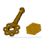

# Macro GMSH
{{Macro
|Name=GMSH Macro
|Icon=Macro_GMSH.png
|Description=Create FEM Meshes by GMSH Mesh Generator. It is possible to create linear or bilinear (quadratic) Beam-, Shell- and Volumeelements in
|Author=psicofil
|Version=1.0
|Date=2015-08-24
|FCVersion=All
|Download=[https://www.freecadweb.org/wiki/images/a/a2/Macro_GMSH.png ToolBar Icon]
|SeeAlso = [FEM Mesh from shape by Gmsh](FEM_MeshGmshFromShape.md)
}}

## Description

Simple macro to create FEM Meshes by the Mesh Generator GMSH. It is possible to create linear or bilinear (quadratic) Beam-, Shell- and Volumeelements in 

{{Codeextralink|https://raw.githubusercontent.com/psicofil/Macros_FreeCAD/master/Macros/GMSHMesh.FCMacro}}

## Script

The macro you can find in the following github repository: [GMSH Macro](https://github.com/psicofil/Macros_FreeCAD/blob/master/Macros/GMSHMesh.FCMacro)

 ToolBar Icon 

**GMSHMesh.FCMacro GMSH Macro.FCMacro**

## Additional Installations 

GMSH has to be installed. See [gmsh.info](http://gmsh.info/). The macro is intended to run on Linux, OSX and Windows operating system. The binary path of GMSH has to be adapted in the macro.

## Link

The page discussion [GMSH macro](http://forum.freecadweb.org/viewtopic.php?t=11182)

[See the how to use the macro on YouTube.](https://www.youtube.com/watch?v=ZcG5EEUe3yc)

---
⏵ [documentation index](../README.md) > Macro GMSH
