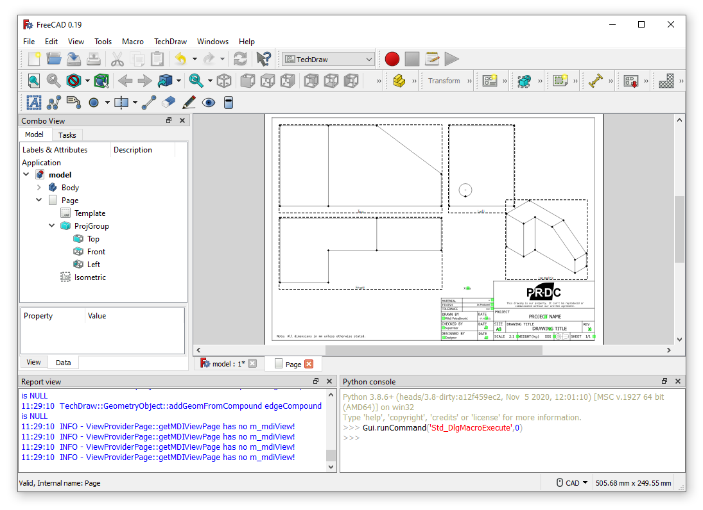
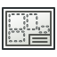

# Macro GenerateDrawing
{{Macro
|Name=GenerateDrawing
|Description=Macro for automatic drawing generation with 3 normal projections and one isometric.
|Author=PR-DC
|Download=[https://wiki.freecadweb.org/File:GenerateDrawing.svg ToolBar Icon]
|Date=2022-01-08
|Version=1.0.0
|FCVersion=0.18.4 and above
|SeeAlso=[https://github.com/PR-DC/PRDC_GenerateDrawing_FC Github repository]
}}

## Description

Macro for automatic drawing generation with 3 normal projections and one isometric.

## Usage

Open the model and run the macro program (check input parameters inside macro for adjustments).

  

## Script

ToolBar Icon  

**GenerateDrawing.FCMacro**

{{MacroCode|code=
# Macro for automatic drawing generation 
# with 3 normal projections and one isometric.
# Author: Milos Petrasinovic <mpetrasinovic@pr-dc.com>
# PR-DC, Republic of Serbia
# info@pr-dc.com
# 
# --------------------
#
# Copyright (C) 2022 PRDC <info@pr-dc.com>
# 
# This program is free software: you can redistribute it and/or modify
# it under the terms of the GNU Lesser General Public License as 
# published by the Free Software Foundation, either version 3 of the 
# License, or (at your option) any later version.
#  
# This program is distributed in the hope that it will be useful,
# but WITHOUT ANY WARRANTY; without even the implied warranty of
# MERCHANTABILITY or FITNESS FOR A PARTICULAR PURPOSE.  See the
# GNU Lesser General Public License for more details.
#  
# You should have received a copy of the GNU Lesser General Public License
# along with this program.  If not, see <https://www.gnu.org/licenses/>.
#
# ----- PARAMS -----
paper = [420, 297] # A3 paper size
border = [10, 10, 400, 277] # border position ans size
table = [190, 74] # table size
dx = 10 # space between views along x axis
dy = 10 # space between views along y axis
author = "Miloš Petrašinović" # author name
drawn_date = "07.01.2022." # drawing drawn date
template_file = "test\\PRDC_template_A3.svg" # drawing template
# --------------------

__Name__ = 'GenerateDrawing'
__Comment__ = 'Macro for automatic drawing generation.'
__Author__ = 'Milos Petrasinovic <mpetrasinovic@pr-dc.com>'
__Version__ = '1.0.0'
__Date__ = '2022-01-07'
__License__ = 'GPL-3.0-or-later'
__Web__ = 'https://github.com/PR-DC/PRDC_GenerateDrawing_FC'
__Wiki__ = 'https://wiki.freecadweb.org/Macro_GenerateDrawing'
__Icon__ = 'GenerateDrawing.svg'
__Help__ = 'Open model and run the macro program!'
__Status__ = 'stable'
__Requires__ = 'Freecad >= 0.18'
__Communication__ = 'https://github.com/PR-DC/PRDC_GenerateDrawing_FC/issues/'
__Files__ = 'GenerateDrawing.svg'

import FreeCAD as App
import FreeCADGui as Gui
from PySide import QtGui
import Draft
import math
import os

if not os.path.isabs(template_file):
    template_file = os.path.dirname(__file__) + '\\' + template_file
print(template_file)

doc = App.activeDocument()
doc_gui = Gui.activeDocument()
Gui.activateWorkbench("TechDrawWorkbench")
shapes = []

def GetShapes(objs, shapes):
    for obj in objs:
        if obj.TypeId == 'App::DocumentObjectGroup':
            GetShapes(obj.OutList, shapes)
        elif hasattr(obj, "Shape") and doc_gui.getObject(obj.Name).Visibility:
            shapes.append(obj)
    return shapes
    
if doc is not None:
    shapes = GetShapes(doc.RootObjects, shapes)
    if len(shapes):
        if len(shapes) == 1:
            model = shapes[0]
        else:
            model = doc.addObject("Part::Compound", "DrawingModel")
            model.Links = shapes
            doc.recompute()
        
        # Obtain model bounding box
        BB = model.Shape.BoundBox
        X = BB.XMax-BB.XMin
        Y = BB.YMax-BB.YMin
        Z = BB.ZMax-BB.ZMin
        
        Isometric = Draft.makeShape2DView(model, App.Vector(0.57735, 0.57735, 0.57735))
        doc.recompute()
        IBB = Isometric.Shape.BoundBox
        if App.Version()[1] < "19":
            Xrot = IBB.XMin+(IBB.XMax-IBB.XMin)/2
            Yrot = IBB.YMin+(IBB.YMax-IBB.YMin)/2
            Draft.rotate(Isometric, -120, center=App.Vector(Xrot, Yrot, 0), axis=App.Vector(0, 0, 1), copy=False)
            doc.recompute()
            IBB = Isometric.Shape.BoundBox
        IsometricBB = [IBB.XMax-IBB.XMin, IBB.YMax-IBB.YMin]
        
        doc.removeObject(Isometric.Name)
        if len(shapes) > 1:
            doc.removeObject(model.Name)
            for obj in shapes:
                doc_gui.getObject(obj.Name).Visibility = True
                
        # Page scale
        p1 = border[2]/(X+dx+Z)
        p2 = border[3]/(Y+dy+Z)
        
        if p1 < 1 or p2 < 1:
            # Decrease
            if p1 > p2:
                s = math.ceil(1/p2)
            else:
                s = math.ceil(1/p1)
            s = 1/s
            scale_str = "1:"+str(s)
        else:
            # Increase
            if p1 > p2:
                s = math.floor(p2)
            else:
                s = math.floor(p1)
            scale_str = str(s)+":1"
        
        # Add page with template
        page = doc.addObject('TechDraw::DrawPage', 'Page')
        template = doc.addObject('TechDraw::DrawSVGTemplate', 'Template')
        template.Template = template_file
        page.Template = template
        page.Scale = s
        
        # Add project group views
        views = doc.addObject('TechDraw::DrawProjGroup', 'ProjGroup')
        views.AutoDistribute = False
        page.addView(views)
        views.Source = shapes
        doc.recompute()
        Top = views.addProjection('Front')
        Top.Label = "Top"
        views.Anchor.Direction = App.Vector(0, 0, 1)
        if App.Version()[1] >= "19":
            views.Anchor.XDirection = App.Vector(1, 0, 0)
        views.Anchor.RotationVector = App.Vector(1, 0, 0)
        views.Anchor.recompute()
        views.ProjectionType = 'First Angle'
        Front = views.addProjection('Top')
        Front.Label = "Front"
        Left = views.addProjection('Left')
        Left.Label = "Left"
        
        # Isometric view
        Isometric = doc.addObject('TechDraw::DrawViewPart', 'Isometric')
        page.addView(Isometric)
        Isometric.Source = shapes
        Isometric.ScaleType = "Custom"
        Isometric.Scale = s/2
        Isometric.Label = "Isometric"
        Isometric.Direction = App.Vector(0.57735, 0.57735, 0.57735)
        if App.Version()[1] >= "19":
            Isometric.XDirection = App.Vector(0.57735, 0.57735, 0.57735)
        else: 
            Isometric.Rotation = -120.00
        Isometric.recompute()
           
        # Views position
        px0 = border[0]+dx
        py0 = paper[1]-dy-border[1]
        
        views.X = px0+s*X/2
        views.Y = py0-s*Y/2
        Front.Y = -(s*Y/2+dy+s*Z/2)
        Left.X = s*X/2+dx+s*Z/2
        Isometric.X = paper[0]-border[0]-dx-s/2*IsometricBB[0]/2
        Isometric.Y = border[1]+table[1]+dy+s/2*IsometricBB[1]/2
        
        # Change drawing text fields
        template.setEditFieldContent("AUTHOR_NAME", author)
        template.setEditFieldContent("AUTHOR_DATE", drawn_date)
        template.setEditFieldContent("DRAWING_SCALE", scale_str)
        template.setEditFieldContent("PROJECT_NAME", "PROJECT NAME")
        template.setEditFieldContent("DRAWING_TITLE", "DRAWING TITLE")
        template.setEditFieldContent("PCS_NUMBER", "X pcs")
        template.setEditFieldContent("MATERIAL_NAME", "x")
        template.setEditFieldContent("FINISH_TYPE", "As Produced")
        template.setEditFieldContent("TOLERANCE_VALUE", "xxx")
        template.setEditFieldContent("SUPERVISOR_NAME", "Supervisor")
        template.setEditFieldContent("SUPERVISOR_DATE", "xxx")
        template.setEditFieldContent("DESIGNER_NAME", "Designer")
        template.setEditFieldContent("DESIGNER_DATE", "xxx")
        template.setEditFieldContent("PAGE_SIZE", "A3")
        template.setEditFieldContent("REV_NUMBER", "X")
        template.setEditFieldContent("PART_WEIGHT", "XXX")
        template.setEditFieldContent("SHEET_NUMBER", "1/1")
        
        doc.recompute()        
        doc_gui.getObject(page.Name).show()
        Gui.updateGui()
    else:
        msgBox = QtGui.QMessageBox()
        msgBox.setWindowTitle("Error")
        msgBox.setText("No shapes for drawing!")
        msgBox.exec_()
        App.Console.PrintError("\nError: No shapes for drawing!\n")
else:
    msgBox = QtGui.QMessageBox()
    msgBox.setWindowTitle("Error")
    msgBox.setText("No active document!")
    msgBox.exec_()
    App.Console.PrintError("\nError: No active document!\n")
}}

## Links

The forum discussion [New Macros: GenerateViews and GenerateDrawing](https://forum.freecadweb.org/viewtopic.php?f=22&t=65135)

---
[documentation index](../README.md) > Macro GenerateDrawing
