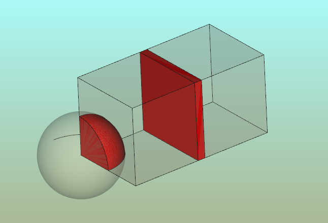

  {{Macro
|Name=HightlightCommon
|Icon=Macro_HighlightCommon.png
|Description=Highlight common parts by showing the common shape in red and setting half-transparency on original parts (the original objects are not modified)
|Author=JMG
|Version=1.0
|Date=2015-09-24
|FCVersion=0.17 and above
|Download=[https://www.freecadweb.org/wiki/images/8/85/Macro_HighlightCommon.png ToolBar Icon]
}}

## Description

Highlight common parts by showing the common shape in red and setting half-transparency on original parts (the original objects are not modified)

 

 *Volume common of objects selected*

## Script

ToolBar Icon 

**Macro\_HighlightCommon.FCMacro**

The code is visible on Github: [Utility/HighlightCommon.FCMacro](https://github.com/FreeCAD/FreeCAD-macros/blob/master/Utility/HighlightCommon.FCMacro).

## Links

-   See for the complementary macro [Macro\_HighlightDifference](Macro_HighlightDifference.md)
-   My blog [Linux for an engineer](http://linuxforanengineer.blogspot.com.es/) for the code and other interesting macros for FreeCAD
-   The discussion on forum [\"collision detection\", overlapping](http://forum.freecadweb.org/viewtopic.php?f=22&t=12426)

