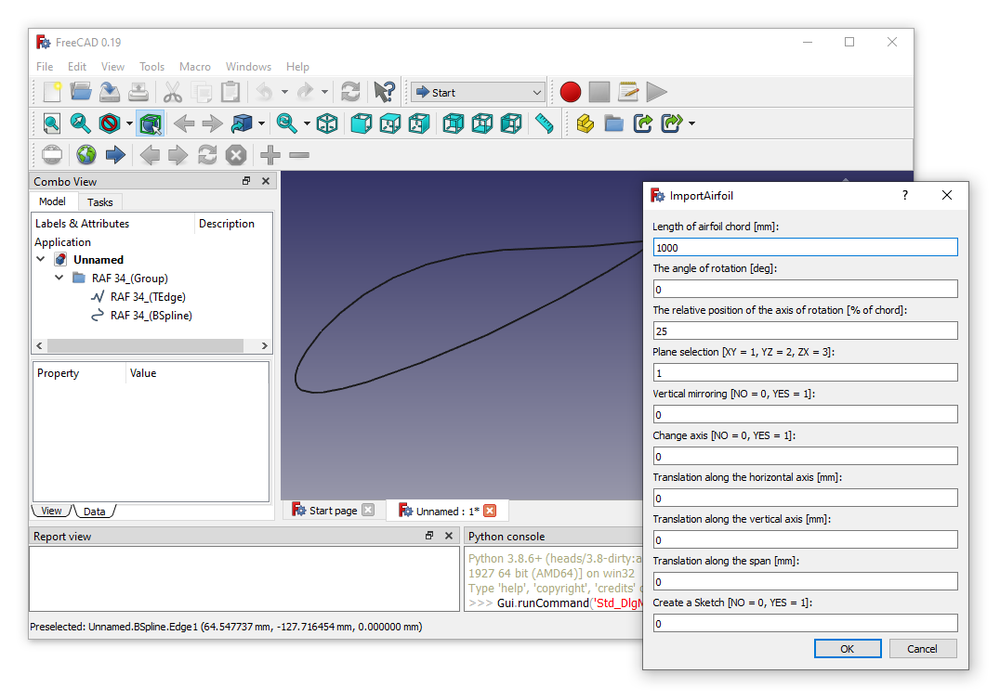

# Macro ImportAirfoil
{{Macro
|Name=ImportAirfoil
|Description=Macro for Airfoil coordinates import.
|Author=Miloš Petrašinović
|Download=[https://wiki.freecadweb.org/File:ImportAirfoil.svg ToolBar Icon]
|Date=2022-01-08
|Version=1.0.0
|FCVersion=0.18.4 and above
|SeeAlso=[https://github.com/VAZMFB/FreeCAD-ImportAirfoil Github repository]
}}

## Description

Macro for Airfoil coordinates import. It is possible, using simple dialog, to scale the airfoil, rotate, translate in the plane, translate along the span, select the plane and the main axis, as well as turn the geometry into a sketch. It is possible to import coordinates saved in the most commonly used formats.

## Usage

Run the macro program and follow the instructions.

  

## Script

ToolBar Icon  

**ImportAirfoil.FCMacro**

{{MacroCode|code=
# Airfoil import macro
# After selecting the file with the coordinates of the airfoil
# data processing and modeling of the airfoil are performed.
# It is possible, using simple dialog, to scale the airfoil, rotate, 
# translate in the plane, translate along the span, select the plane and 
# the main axis, as well as turn the geometry into a sketch. It is possible
# to import coordinates saved in the most commonly used formats.
# Airfoil import is based on:
#  https://github.com/VAZMFB/Python-importAirfoil
# Author: Milos D. Petrasinovic <mpetrasinovic@mas.bg.ac.rs>
# Structural Analysis of Flying Vehicles
# Faculty of Mechanical Engineering, University of Belgrade
# Department of Aerospace Engineering, Flying structures
# https://vazmfb.com
# Belgrade, 2022
# 
# 
#
# Copyright (C) 2022 Milos Petrasinovic <info@vazmfb.com>
# 
# This program is free software: you can redistribute it and/or modify
# it under the terms of the GNU Lesser General Public License as 
# published by the Free Software Foundation, either version 3 of the 
# License, or (at your option) any later version.
#  
# This program is distributed in the hope that it will be useful,
# but WITHOUT ANY WARRANTY; without even the implied warranty of
# MERCHANTABILITY or FITNESS FOR A PARTICULAR PURPOSE.  See the
# GNU Lesser General Public License for more details.
#  
# You should have received a copy of the GNU Lesser General Public License
# along with this program.  If not, see <https://www.gnu.org/licenses/>.
#
# 
#
# Based on:
# Airfoil Import and Scale 2.1.2
# (c) quick61
#
# 

__Name__ = 'ImportAirfoil'
__Comment__ = 'Airfoil import macro'
__Author__ = 'Milos Petrasinovic <mpetrasinovic@mas.bg.ac.rs>'
__Version__ = '1.0.0'
__Date__ = '2022-01-06'
__License__ = 'GPL-3.0-or-later'
__Web__ = 'https://github.com/VAZMFB/FreeCAD-ImportAirfoil'
__Wiki__ = 'https://wiki.freecadweb.org/Macro_ImportAirfoil'
__Icon__ = 'ImportAirfoil.svg'
__Help__ = 'Run the macro program and follow the instructions!'
__Status__ = 'stable'
__Requires__ = 'Freecad >= 0.19'
__Communication__ = 'https://github.com/VAZMFB/FreeCAD-ImportAirfoil/issues/'
__Files__ = 'ImportAirfoil.svg'

import FreeCAD as App
from PySide import QtCore, QtGui
from PySide.QtGui import QFileDialog, QLineEdit, QRadioButton, QMessageBox 
import Draft, importAirfoilDAT
import numpy as np
import subprocess
import sys
import os
import re

global filename
global nameFile

msgBox = QtGui.QMessageBox()
msgBox.setWindowTitle("ImportAirfoil")
msgBox.setText("In the next window, select the file with the coordinates of the airfoil.")
msgBox.exec_()

try:
    filename, filefilter = QtGui.QFileDialog.getOpenFileName(QtGui.qApp.activeWindow(), 'Select the file with the coordinates:', '*.dat;*.txt;*.af')
except Exception:
    param = FreeCAD.ParamGet("User parameter:BaseApp/Preferences/Macro")
    path = param.GetString("MacroPath", "") + "/"
    filename, filefilter = QFileDialog.getOpenFileName(None, "Select the file with the coordinates:", path, "*.dat;*.txt;*.af")

nameFile = filename.split("/")[-1][:-4]

class DrawAP():
    def __init__(self):
        self.dialog = None
        self.lt = 0
        self.alpha = 0
        self.h0 = 0
        self.plane = None
        self.mirror = None
        self.dh = 0
        self.dv = 0
        self.db = 0
        self.sketch = None

        # Dialog window
        self.dialog = QtGui.QDialog()
        self.dialog.resize(350, 100)
        self.dialog.setWindowTitle("ImportAirfoil")
        la = QtGui.QVBoxLayout(self.dialog)
        tx = QtGui.QLabel("Length of airfoil chord [mm]:")
        la.addWidget(tx)
        self.lt = QtGui.QLineEdit("1000")
        la.addWidget(self.lt)
        tx = QtGui.QLabel("The angle of rotation [deg]:")
        la.addWidget(tx)
        self.alpha = QtGui.QLineEdit("0")
        la.addWidget(self.alpha)
        tx = QtGui.QLabel("The relative position of the axis of rotation [% of chord]:")
        la.addWidget(tx)
        self.h0 = QtGui.QLineEdit("25")
        la.addWidget(self.h0)
        tx = QtGui.QLabel("Plane selection [XY = 1, YZ = 2, ZX = 3]:")
        la.addWidget(tx)
        self.plane = QtGui.QLineEdit("1")
        la.addWidget(self.plane)
        tx = QtGui.QLabel("Vertical mirroring [NO = 0, YES = 1]:")
        la.addWidget(tx)
        self.mirror = QtGui.QLineEdit("0")
        la.addWidget(self.mirror)
        tx = QtGui.QLabel("Change axis [NO = 0, YES = 1]:")
        la.addWidget(tx)
        self.flip = QtGui.QLineEdit("0")
        la.addWidget(self.flip)
        tx = QtGui.QLabel("Translation along the horizontal axis [mm]:")
        la.addWidget(tx)
        self.dh = QtGui.QLineEdit("0")
        la.addWidget(self.dh)
        tx = QtGui.QLabel("Translation along the vertical axis [mm]:")
        la.addWidget(tx)
        self.dv = QtGui.QLineEdit("0")
        la.addWidget(self.dv)
        tx = QtGui.QLabel("Translation along the span [mm]:")
        la.addWidget(tx)
        self.db = QtGui.QLineEdit("0")
        la.addWidget(self.db)
        tx = QtGui.QLabel("Create a Sketch [NO = 0, YES = 1]:")
        la.addWidget(tx)
        self.sketch = QtGui.QLineEdit("0")
        la.addWidget(self.sketch)

        # Add OK / Cancel buttons
        okBox = QtGui.QDialogButtonBox(self.dialog)
        okBox.setOrientation(QtCore.Qt.Horizontal)
        okBox.setStandardButtons(QtGui.QDialogButtonBox.Cancel|QtGui.QDialogButtonBox.Ok)
        la.addWidget(okBox)
        QtCore.QObject.connect(okBox, QtCore.SIGNAL("accepted()"), self.proceed)
        QtCore.QObject.connect(okBox, QtCore.SIGNAL("rejected()"), self.close)
        QtCore.QMetaObject.connectSlotsByName(self.dialog)
        self.dialog.show()
        self.dialog.exec_()

    def proceed(self):
        global filename
        global nameFile
        try:
            lt = float(self.lt.text())
            alpha = float(self.alpha.text())
            h0 = float(self.h0.text())
            plane = float(self.plane.text())
            mirror = float(self.mirror.text())
            flip = float(self.flip.text())
            dh = float(self.dh.text())
            dv = float(self.dv.text())
            db = float(self.db.text())
            sketch = float(self.sketch.text())
            af = importAirfoil(str(filename))
            
            # Open trailing edge
            af[1][0] += 0.000001;
            points = []
            for i in range(len(af[0])):
                point = App.Vector(af[0][i], af[1][i], 0)
                points.append(point)
            
            Line1 = Draft.makeLine(points[0], points[-1])
            Line1.Label = nameFile + "_(TEdge)"
            BSpline1 = Draft.makeBSpline(points, closed=False)
            BSpline1.Label = nameFile + "_(BSpline)"

            # Group elements
            Group1 = App.activeDocument().addObject('App::DocumentObjectGroup', 'Group')
            Group1.Label = nameFile + "_(Group)"
            Group1.addObject(Line1)
            Group1.addObject(BSpline1)

            App.activeDocument().recompute()

            # Scale airfoil
            if App.Version()[1] < "19":
                Draft.scale([Line1, BSpline1], App.Vector(lt, lt, lt), center=App.Vector(0.0, 0.0, 0.0), copy=False, legacy=True)
            else:
                Draft.scale([Line1, BSpline1], App.Vector(lt, lt, lt), center=App.Vector(0.0, 0.0, 0.0), copy=False)

            # Rotate airfoil
            Draft.rotate([Line1, BSpline1], -alpha, center=App.Vector(lt*h0/100, 0, 0), axis=App.Vector(0, 0, 1), copy=False)
            
            # Mirror
            if mirror == 1:
                Draft.rotate([Line1, BSpline1], 180, center=App.Vector(0, 0, 0), axis=App.Vector(0, 1, 0), copy=False)

            # Move airfoil in plane
            Draft.move([Line1, BSpline1], App.Vector(dh, dv, 0.0), copy=False)
                
            # Change axis
            Draft.rotate([Line1, BSpline1], -90, center=App.Vector(0, 0, 0), axis=App.Vector(0, 0, 1), copy=False)
            
            # Change plane
            if plane == 2: # YZ
                Draft.rotate([Line1, BSpline1], 90, center=App.Vector(0, 0, 0), axis=App.Vector(0, 0, 1), copy=False)
                Draft.rotate([Line1, BSpline1], 90, center=App.Vector(0, 0, 0), axis=App.Vector(0, 1, 0), copy=False)
            elif plane == 3: # ZX
                Draft.rotate([Line1, BSpline1], 90, center=App.Vector(0, 0, 0), axis=App.Vector(1, 0, 0), copy=False)
                Draft.rotate([Line1, BSpline1], -90, center=App.Vector(0, 0, 0), axis=App.Vector(0, 1, 0), copy=False)

            # Make sketch
            if sketch == 1:
                App.activeDocument().recompute()
                Sketch1 = Draft.makeSketch([Line1, BSpline1], autoconstraints=True)
                Sketch1.Label = nameFile + "_(Sketch)"

            # Move airfoil
            if plane == 2: # YZ
                Draft.move([Line1, BSpline1], App.Vector(db, 0, 0), copy=False)
                if sketch == 1:
                    Draft.move(Sketch1, App.Vector(0, 0, db), copy=False)
            elif plane == 3: # ZX
                Draft.move([Line1, BSpline1], App.Vector(0, db, 0), copy=False)
                if sketch == 1:
                    Draft.move(Sketch1, App.Vector(0, 0, db), copy=False)
            else:
                Draft.move([Line1, BSpline1], App.Vector(0, 0, db), copy=False)
                if sketch == 1:
                    Draft.move(Sketch1, App.Vector(0, 0, db), copy=False)
                    
        except Exception as e:
              exc_type, exc_obj, exc_tb = sys.exc_info()
              App.Console.PrintError("Error = "+str(e)+"\n")
              App.Console.PrintError("    Error line number = "+str(exc_tb.tb_lineno)+"\n")
              msgBox = QtGui.QMessageBox()
              msgBox.setWindowTitle("Error")
              msgBox.setText("An error occurred, see Report window for more information!")
              msgBox.setWindowModality(QtCore.Qt.NonModal)
              msgBox.show()

        App.activeDocument().recompute()
        Gui.SendMsgToActiveView("ViewFit")
        self.close() # close the window
        
    def close(self):
        self.dialog.hide() # close the window

def scanf(l):
    # scanf('%f %f', l)
    found = re.compile('([-+]?(?:\\d+(?:\\.\\d*)?|\\.\\d+)(?:[eE][-+]?\\d+)?)\\s+([-+]?(?:\\d+(?:\\.\\d*)?|\\.\\d+)(?:[eE][-+]?\\d+)?)').search(l)
    casts = [float, float]
    if found:
        groups = found.groups()
        return tuple([casts[i](groups[i]) for i in range(len(groups))])
    
def importAirfoil(file):
    af = [];
    if(os.path.isfile(file)):
        with open(file) as f:
            ls = [line.strip() for line in f]
            
        x = []
        y = []
        h = 1
        for l in ls:
            if l:
                data = scanf(l);
                if(h and data and len(data) == 2 and data[0] > -0.1
                        and data[0] < 1.1 and data[1] > -1.1 
                        and data[1] < 1.1):
                    # First coordinate if there is both x and y data
                    # Range for x is [-0.1, 1.1] and for y is [-1.1, 1.1]
                    h = 0;
                    x.append(data[0])
                    y.append(data[1])
                elif(not h and data and len(data) == 2):
                    x.append(data[0])
                    y.append(data[1])
        
        if(len(x) > 0):
            if(any(xi >= 1.1 for xi in x)):
                # Koordinate su verovatno pomnozene sa 100
                x = np.divide(x, 100)
                y = np.divide(y, 100)
                      
        d = np.diff(x)
        if(sum([di < 0 for di in d]) == 1):
            # Lednicer format
            i = np.where(d < 0)[0][0]
            x = [*np.flip(x[:i+1]).tolist(), *x[i+1:]]
            y = [*np.flip(y[:i+1]).tolist(), *y[i+1:]]

        af = np.array([x[1:-1], y[1:-1]])
        _, idx = np.unique(af, axis=1, return_index=True)
        af = [[x[0], *af[0][np.sort(idx)].tolist(), x[-1]],
            [y[0], *af[1][np.sort(idx)].tolist(), y[-1]]]
    return af
    
if os.path.isfile(filename):
    DrawAP()
else:
    msgBox = QtGui.QMessageBox()
    msgBox.setWindowTitle("Error")
    msgBox.setText("No valid file with coordinates!")
    msgBox.setWindowModality(QtCore.Qt.NonModal)
    msgBox.show()
}}

## Links

The forum discussion [New Macro: ImportAirfoil](https://forum.freecadweb.org/viewtopic.php?f=22&t=65085)

---
⏵ [documentation index](../README.md) > Macro ImportAirfoil
