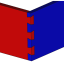

# Macro Joint
{{Macro
|Name=Macro Joint
|Icon=Macro_Joint_Icon.svg
|Description=Make joints of various types, including mortise/tenon, box joints, dovetail joints, and various snap joints
|Author=TheMarkster
|Version=0.2021.12
|Date=2021-10-12
|FCVersion=Python 3 versions
|Download=[https://wiki.freecadweb.org/File:Macro_Joint_Icon.svg ToolBar Icon]
|SeeAlso=
|Links=[https://github.com/mwganson/joint Full Documentation on Github]
}}

## Description

This macro is used to create joints of various types, including mortise and tenon joints, box joints, dovetail joints, finger joints (using dovetail type), and a few snap joints, including cantilever, annular, ball, and split types.

## Usage

1.  Select a face and run the macro.
2.  Select the joint type to create. You will then find a parametric joint object with some default property settings, which will need to be modified for your particular needs.

The macro works in [Part Design Workbench](PartDesign_Workbench.md), but also with solids created in any other workbench.

Full documentation can be found on github: [Joint](https://github.com/mwganson/joint).

   
*Macro Joint screenshot -- a few of the joint types that can be made‎*

## Legend

 

ToolBar Icon   

## Script

 **Macro Joint.FCMacro**

{{CodeDownload|https://gist.github.com/mwganson/09d70aa11183e57b5f5925169b4c70b9|Joint.FCMacro}}

---
[documentation index](../README.md) > Macro Joint
