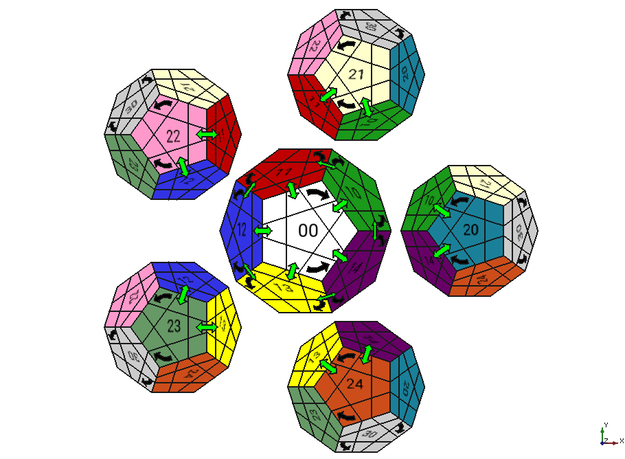

# Macro Megaminx
{{Macro
|Name=Macro_Megaminx
|Icon=Macro_Megaminx.png
|Description=This macro creates a virtual [https://en.wikipedia.org/wiki/Megaminx Megaminx].
|Author=aleph0
|SeeAlso=[Macro Rubik Cube](Macro_Rubik_Cube.md)
|Date=2019-02-17
|FCVersion=0.18 and higher
|Download=[https://www.freecadweb.org/wiki/images/4/43/Macro_Megaminx.png ToolBar Icon]
}}

## Description

This macro creates a FreeCAD document containing a virtual a virtual [Megaminx](https://en.wikipedia.org/wiki/Megaminx) and enables you to manipulate it. It displays six views of the Megaminx including each of the twelve faces at least once. There are various arrows (each with a tooltip which will be displayed as long as you hover the mouse over it). By clicking on arrows you can rotate faces of the Megaminx, rotate the whole Megaminx, or rotate or reflect the history which it maintains of the rotations that you have done so far. There is also a Megaminx menu which is shown at the right of the menu bar as long as you have at least one Megaminx document open. From the menu you can display some help text, reset the Megaminx to its initial (solved) state, undo the last rotation (and remove it from the history), copy the history to the clipboard, step through the history, randomise the Megaminx, and enable or disable the echoing of rotations to the Report View. All of these functions can also be invoked by typing suitable commands into the Python console window.

A history saved to the clipboard can be pasted into the Python console window or copied into a file which can be called as a macro into the active Megaminx document. You can have more than one Megaminx document open at a time, although only one can be active.

## Script

ToolBar icon 

 {{Codeextralink|https://raw.githubusercontent.com/rparkins999/Megaminx/master/Megaminx.FCMacro}}

**Macro_Megaminx.FCMacro**

## Use

Download the code from <https://github.com/rparkins999/Megaminx> into your macro directory. Run the macro to create a Megaminx document. Then you can play with it. The history functions can be used to construct and save operators (aka algorithms) which do useful transformations on the Megaminx. A suitable set of these will give you a complete solution. The step_history function can be used to help you play back an operator onto a real Megaminx.

---
⏵ [documentation index](../README.md) > Macro Megaminx
