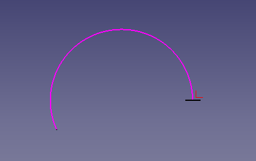
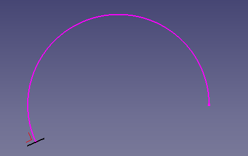
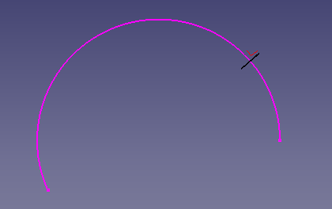
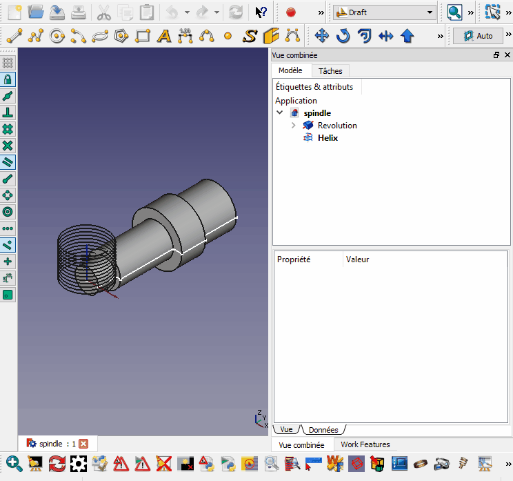

# Macro Perpendicular To Wire
{{Macro
|Name=Macro Perpendicular To Wire
|Icon=Macro_Perpendicular_To_Wire.png
|Description=This macro positions an object perpendicularly to the selected wire.
|Author=Mario52
|Version=00.03
|Date=2020-03-31
|FCVersion=All
|Download=[https://www.freecadweb.org/wiki/images/0/0c/Macro_Perpendicular_To_Wire.png ToolBar Icon].
}}

## Description

This macro positions an object perpendicularly to the selected wire.

## Usage

1.  Install the macro via the  [Addon Manager](Std_AddonMgr.md)
2.  Select the path (may be an element or sub-element)
3.  Select the object to align
4.  Execute the macro

## Script

The macro toolbar icon:  

**Macro Perpendicular To Wire.FCMacro**


{{MacroCode|code=
# -*- coding: utf-8 -*-
__title__   = "Macro Perpendicular To Wire"
__author__  = "Mario52"
__url__     = "https://wiki.freecadweb.org/Macro_Perpendicular_To_Wire"
__version__ = "00.03"
__date__    = "31/03/2020"

import Draft, Part

try:
    sel = FreeCADGui.Selection.getSelection()                               # Select an objectlineSelected = FreeCADGui.Selection.getSelectionEx()[0].SubObjects[0]   # first object the Path object or SubObjects
    myCircle     = sel[1]                                                   # second objectpointsDirection  = []pointsDirection = lineSelected.discretize(Number=500)                   # discretize the path line first selectionv=pointsDirection[0].sub(pointsDirection[1])                            # avec vecteurs 1 et 2 (direction debut ligne)
    r=App.Rotation(App.Vector(0,0,1),v)pl=FreeCAD.Placement()                                                  # placement object
    pl.Rotation.Q = r.Q
    pl.Base = pointsDirection[0]
    myCircle.Placement = pldel pointsDirection[:]
    FreeCAD.ActiveDocument.recompute()
except Exception:
    print( "Select two objects. 1:The path 2:The object to align" )

}}


## Options

Essentially the line is cut in x points with 


```python
    pointsDirection = lineSelected.Shape.discretize(Number=500)             # discretize the path line first selection
```

 1. The perpendicularity is calculated between 2 points:  
```python
v=pointsDirection[0].sub(pointsDirection[1])          # perpendicular of first > second point
```

:   


2:


```python
v=pointsDirection[-1].sub(pointsDirection[-2])       # perpendicular of last > before last point
pl.Base = pointsDirection[-1]                        # position base last point```


:   


3:


```python
v=pointsDirection[100].sub(pointsDirection[101])   # perpendicular of point 100 > point 101
pl.Base = pointsDirection[100]                     # position base point 100```


:   


4:


```python
v=pointsDirection[0].sub(pointsDirection[-1])         # perpendicular of first point > last point
pl.Base = pointsDirection[0]                          # position base first point```


:   


Other parameters to `discretize()` are as follows:

 
```python
# Discretizes the edge and returns a list of points.
# Forum thread: http://forum.freecadweb.org/viewtopic.php?f=12&t=16336#p129468
# The function accepts keywords as argument:
# discretize(Number=n) => gives a list of 'n' equidistant points
# discretize(QuasiNumber=n) => gives a list of 'n' quasi equidistant points (is faster than the method above)
# discretize(Distance=d) => gives a list of equidistant points with distance 'd'
# discretize(Deflection=d) => gives a list of points with a maximum deflection 'd' to the edge
# discretize(QuasiDeflection=d) => gives a list of points with a maximum deflection 'd' to the edge (faster)
# discretize(Angular=a,Curvature=c,[Minimum=m]) => gives a list of points with an angular deflection of 'a'
# and a curvature deflection of 'c'. Optionally a minimum number of points
# can be set which by default is set to 2.
```

## Example


 




## Discussions

-   [https://forum.freecadweb.org/viewtopic.php?f=13&t=19899&start=20 Spiralbohrer](https://forum.freecadweb.org/viewtopic.php?f=13&t=19899&start=20_Spiralbohrer.md) discussion on the FC forum.
-   <http://forum.freecadweb.org/viewtopic.php?f=12&t=16336#p129468>

## Version

Ver 00.03 2020-03-21: Source and comment typo fixes Ver 00.02 2019-04-06: Python 3


---
 [documentation index](../README.md) > Macro Perpendicular To Wire
