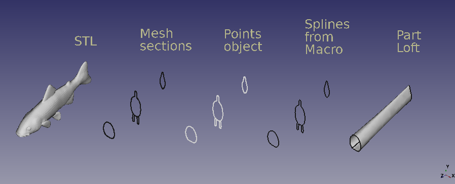
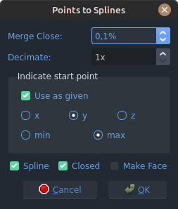
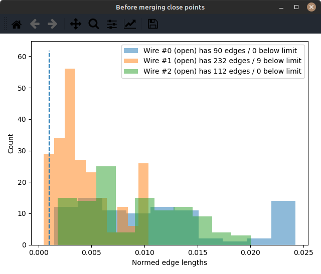

# Macro Points to Splines
{{Macro
|Name=Macro Points to Splines
|Description=Creates splines from Points object sections.
|Author=heda
|Version=0.1
|Date=2024-10-23
|FCVersion=
}}

## Description

This macro creates splines from Points object sections.

   
*Macro Points to Splines*

   
*Dialog for Macro Points to Splines*

   
*Initial edge length histogram shown by Macro Points to Splines*

## Usage

Select Points object (containing sections) and launch. See \_\_doc\_\_ in the [code](#Code.md) below.

## Install

Through the [Addon manager](Std_AddonMgr.md).

## Version

v0.1 2024-10-23: First release.

## Code

 **Macro_Points_to_Splines.FCMacro**

    #!/usr/bin/env python3
    # -*- coding: utf-8 -*-

    # ***************************************************************************
    # *   Copyright (c) 2024 heda <heda @ freecad forum>                        *
    # *                                                                         *
    # *   This file is part of the FreeCAD CAx development system.              *
    # *                                                                         *
    # *   This program is free software; you can redistribute it and/or modify  *
    # *   it under the terms of the GNU Lesser General Public License (LGPL)    *
    # *   as published by the Free Software Foundation; either version 2 of     *
    # *   the License, or (at your option) any later version.                   *
    # *   for detail see the LICENCE text file.                                 *
    # *                                                                         *
    # *   This program is distributed in the hope that it will be useful,       *
    # *   but WITHOUT ANY WARRANTY; without even the implied warranty of        *
    # *   MERCHANTABILITY or FITNESS FOR A PARTICULAR PURPOSE.  See the         *
    # *   GNU Library General Public License for more details.                  *
    # *                                                                         *
    # *   You should have received a copy of the GNU Library General Public     *
    # *   License along with this program; if not, write to the Free Software   *
    # *   Foundation, Inc., 59 Temple Place, Suite 330, Boston, MA  02111-1307  *
    # *   USA                                                                   *
    # *                                                                         *
    # ***************************************************************************

    __Name__ = 'Macro_Points_to_Splines'
    __Comment__ = 'Aligns 2 (or more) objects by bounding box..'
    __Author__ = 'heda @ fc-forum'
    __Version__ = '0.1'
    __Date__ = '2024-10-23'
    __License__ = 'LGPL-2.0-or-later'
    __Web__ = ''
    __Wiki__ = 'https://wiki.freecadweb.org/Macro_Points_to_Splines'
    __Icon__ = ''
    __Help__ = 'Select and launch.'
    __Status__ = 'functional'
    __Requires__ = 'tested on FreeCAD v0.21'
    __Communication__ = ''
    __Files__ = ''

    __doc__ = """

    points obj to draft-spline (or draft-wire)
    because a draft-spline is gui-editable allowing
    for fine-tuning by hand once created

    select a points-object and run the macro

    useful when reverse engineering meshes.
    make sections from a mesh-obj and
    run the macro on the resulting points-object.
    sections are assumed to be in the orthogonal system (xyz aligned).
    if not, it will not give usable results (or crash)

    the orientation of the splines are neither checked, nor touched,
    therefore reversing orientation could be needed
    if it turns out that the generated splines
    have different orientations.

    defaults:
    - merge close vertices < 0.1% (of total length)
    - decimate 1x (as in no decimation)
    - starting point (of created spline)
      a) as given after removal of duplicate points
      b) x/y/z with min/max
    - closed
    - not making a face
    - spline (as opposed to a wire)

    the code is by no means written for speed,
    it has an abundance of castings back and forth,
    as well as doing the same calculations multiple times.
    anyone is free to improve as they wish.

    if one wants to simplify a spline without distorting it,
    inkscape has tools for that.
    just export the spline as svg,
    open in inkscape and run simplify (ctrl+L) on the path.
    can then be reimported to fc as a sanitized path.

    """

    from enum import Enum # there is a StrEnum, but not until py 3.11
    from collections import deque

    import numpy as np

    import FreeCAD as App
    import FreeCADGui as Gui
    from FreeCAD.Plot import Plot

    import Part
    import Draft

    from PySide import QtCore, QtGui, QtWidgets

    ROUND_TO = 3 # decimals, meaning micro-meter significance
    Vector = App.Vector

    QtW = QtWidgets
    Qt = QtCore.Qt
    QMsgBox = QtW.QMessageBox
    QDlgBtnBox = QtW.QDialogButtonBox

    doc = App.ActiveDocument

    class FCType(Enum):
        PointsObj = 'Points::Feature'

    class Settings:
        merge_close = 0.1
        decimate = 1
        keep_original = True
        direction = 'y'
        minmax = 'max'
        spline = True
        closed = True
        make_face = False

    def plot_hist(normed, which='?', limit=0.1/100):
        plt = Plot.plt
        tpl = 'Wire #{} (open) has {} edges / {} below limit'
        label = tpl.format(which, len(normed), sum(normed < limit))
        plt.hist(normed, label=label, alpha=0.5)
        fig, ax = plt.gcf(), plt.gca()
        
        ax.set_xlabel('Normed edge lengths')
        ax.set_ylabel('Count')
        ax.legend()
        fig.tight_layout()
        ymin, ymax = ax.get_ylim()
        ax.vlines([limit], ymin, ymax, linestyle='--')
        plt.get_current_fig_manager().set_window_title('Before merging close points')
        fig.show()

    def points2array(points):
        return np.array([list(v) for v in points])

    def array2points(array):
        return [Vector(*p) for p in array]

    def remove_duplicates(points):
        # utilize occt auto-magical removal of duplicate points
        return [vtx.Point for vtx in Part.makePolygon(points).Vertexes]

    def extract_clusters(points):
        # assumes that sections are clustered in smaller to larger plane pos, and
        # in order, with start of a cluster at an arbitrary angle in the plane
        # which they appear to be in the limited testing done
        # the assumption is fragile, but cpu-cycle friendly
        d = dict()
        idx = list()
        for col in range(3):
            uq, uqn = np.unique(points[:, col], return_counts=True)
            idx.append(uqn)
            d[len(uqn)] = col
        
        dmin = min(d)
        normal = d.get(dmin)

        if dmin == 1:
            return [points], normal

        else:
            ij = np.zeros(dmin + 1, dtype=int)
            ij[1:] = idx[normal]
            ij = ij.cumsum()

            return [points[i:j, :] for i, j in zip(ij[:-1], ij[1:])], normal

    class ndeque(deque):
        def __init__(self, *args, **kwargs):
            super().__init__(*args, **kwargs)
            
        def drop_nth(self, n):
            self.rotate(-n)
            self.popleft()
            self.rotate(n)
            
        def get_first_three(self):
            # no native support of slicing deque's
            return self[0], self[1], self[2]

    def merge_close_verts(nbr, points, limit):
        # limit here is the threshold distance
        # this is a rather naive algorithm, could be made differently...
        start_len = len(points)
        
        rr = ndeque(points + points[:2] + [False])
        rotate = True
        
        while rotate:
            rr.rotate(-1)
            if rr[2] is False:
                rotate = False
                continue

            p1, p2, p3 = rr.get_first_three()
            l12, l23 = (p1-p2).Length, (p2-p3).Length
            
            no_touch = l12 > limit and l23 > limit
            if no_touch:
                continue
            
            remove_center = l12 < limit and l23 < limit
            if remove_center:
                rr.drop_nth(1)
                rr.rotate(1)
                continue

            move_left = l12 < l23
            if move_left:
                new_point = p1 + (p2 - p1)/2
                rr[0] = new_point
            else:
                new_point = p3 + (p2 - p3)/2
                rr[2] = new_point

            rr.drop_nth(1)
            rr.rotate(1)

        _ = [rr.popleft() for i in range(3)]
        msg = 'merging close verts on wire #{} - removed {} points of {}'     
        print(msg.format(nbr, start_len - len(rr), start_len))
        
        return list(rr)
        

    def remove_smallest_edge(array):
        def chord_lengths(array):
            # work with a closed one
            array = np.vstack((array, array[0]))
            diff = np.diff(array, axis=0)
            return np.sqrt( (diff**2).sum(axis=1) )
            
        cl = chord_lengths(array)
        shortest = np.argmin(cl)
        shortest = -1 if shortest == len(array) else shortest
        p1, p2, p3 = array[shortest - 1], array[shortest], array[shortest + 1]
        l12, l23 = p2 - p1, p2 - p3
        array[shortest - 1] += l12 / 2
        array[shortest + 1] += l23 / 2
        mask = list(range(len(array)))
        _ = mask.pop(shortest)
        array = array[mask]
        return array

        
    def decimation(points, factor):
        """
        decimate (as in just removing points) is a blunt instrument,
        can do fairly well though when using splines.
        best used when there is an abundance of points
        """
        remainder = len(points) % factor
        if remainder:
            array = points2array(points)
            for i in range(remainder):
                array = remove_smallest_edge(array)
            points = array2points(array)
        
        return points[::factor]
        

    def rotate(points, column, fcn):
        fcn = np.argmin if fcn == 'min' else np.argmax
        array = points2array(points)
        idx = fcn(array[:, column])
        return points[idx:] + points[:idx]
        

    def normalize_chords(array):
        # uses an open wire
        diff = np.diff(array, axis=0)
        cl = np.sqrt( (diff**2).sum(axis=1) )
        cls = cl.sum()
        return cls, cl / cls
        

    def make_splines(pobj, sts):
        print('* in making splines')
        pts = pobj.Points.Points
        start_pts = len(pts)

        pts = remove_duplicates(pts)
        msg = 'verts after removing dups: {} of {}'
        print(msg.format(len(pts), start_pts))

        pts = points2array(pts).round(ROUND_TO)
        clusters, normal = extract_clusters(pts)
        ndir = {0:'yz', 1:'xz', 2:'xy'}.get(normal)
        msg = 'found {} sections in {}-plane'
        print(msg.format(len(clusters), ndir))

        # make sure clusters are open
        for i, c in enumerate(clusters):
            closed = round( (c[0] - c[-1]).sum(), ROUND_TO) == 0
            if closed:
                clusters[i] = clusters[i][:-1]
        
        ol, nc = zip(*(normalize_chords(c) for c in clusters))
        
        limit = sts.merge_close / 100

        # make the plot, makes for some redundant cpu-cycles
        for i, c in enumerate(nc):
            plot_hist(c, i, limit)

        clusters = [array2points(c) for c in clusters]
        
        if sts.merge_close > 0:
            cit = tuple(clusters)
            for i, items in enumerate(zip(cit, ol, nc)):
                ci, oli, nci = items
                dirty1 = sum(nci < limit) > 0
                closed = ci[0] - ci[-1]
                dirty2 = closed.Length / oli < limit
                if any((dirty1, dirty2)):
                    clusters[i] = merge_close_verts(i, ci, limit * oli)
                else:
                    msg = 'Wire #{} has no close vertices to merge with given criterias'
                    print(msg.format(i))
                    
        
        if sts.decimate > 1:
            cit = tuple(clusters)
            for i, ci in enumerate(cit):
                clusters[i] = decimation(ci, sts.decimate)

        if not sts.keep_original:
            column = dict(x=0, y=1, z=2).get(sts.direction)
            cit = tuple(clusters)
            for i, ci in enumerate(cit):
                clusters[i] = rotate(ci, column, sts.minmax)

        maker = Draft.makeBSpline if sts.spline else Draft.makeWire        
        w = [maker(c, closed=sts.closed, face=sts.make_face)
             for c in clusters]
        doc.recompute()

        

    def infoDialog(msg):
        icon = QMsgBox.Information
        d = QMsgBox(icon, 'Points to Splines', msg)
        d.exec_()

    class Dialog(QtW.QDialog):

        def __init__(self, pobj=None, defaults=None):
            super().__init__()
            self.setWindowTitle('Points to Splines')
            self.makeUI(defaults)
            self.pobj = pobj
            self.open()

        def makeUI(self, ds):
            outer = QtW.QVBoxLayout(self)

            dupBox = QtW.QHBoxLayout()
            tip = ('0.0 % leaves the spline points untouched.\n'
                   'Percent limit of total cordal length of points\n'
                   'for which a point is considered duplicate and removed.\nThe '
                   'neighbouring point is relocated to the midpoint of the two.')
            dupLabel = QtW.QLabel('Merge Close:')
            dupLabel.setToolTip(tip)
            dupBox.addWidget(dupLabel)
            merge_close = self.merge_close = QtW.QDoubleSpinBox()
            merge_close.setRange(0, 5)
            merge_close.setSuffix('%')
            merge_close.setDecimals(1)
            merge_close.setSingleStep(0.1)
            merge_close.setValue(ds.merge_close)
            merge_close.setToolTip(tip)
            dupBox.addWidget(merge_close)
            
            outer.addLayout(dupBox)

            decBox = QtW.QHBoxLayout()
            tip = '1x leaves the spline points untouched.'
            decLabel = QtW.QLabel('Decimate:')
            decLabel.setToolTip(tip)
            decBox.addWidget(decLabel)
            decimate = self.decimate = QtW.QSpinBox()
            decimate.setRange(1, 10)
            decimate.setSuffix('x')
            decimate.setValue(ds.decimate)
            decimate.setToolTip(tip)
            decBox.addWidget(decimate)
            
            outer.addLayout(decBox)
            
            gBox = QtW.QGroupBox('Indicate start point')
            gvBox = QtW.QVBoxLayout()

            cb = self.cb = QtW.QCheckBox('Use as given')
            cb.setToolTip('Uncheck to use x/y/z & min/max.')
            cb.setChecked(ds.keep_original)
            cb.toggled.connect(self.toggled_keep_original)
            gvBox.addWidget(cb)
            
            xyz = self.xyz = QtW.QButtonGroup()
            tmpBox = QtW.QHBoxLayout()
            for s in 'xyz':
                rb = QtW.QRadioButton(s)
                rb.setEnabled(not ds.keep_original)
                xyz.addButton(rb)
                tmpBox.addWidget(rb)
            xyz.buttons()[1].setChecked(True)
            gvBox.addLayout(tmpBox)
            
            minmax = self.minmax = QtW.QButtonGroup()
            tmpBox = QtW.QHBoxLayout()
            for s in ('min', 'max'):
                rb = QtW.QRadioButton(s)
                rb.setEnabled(not ds.keep_original)
                minmax.addButton(rb)
                tmpBox.addWidget(rb)
            rb.setChecked(True)
            gvBox.addLayout(tmpBox)

            gBox.setLayout(gvBox)
            outer.addWidget(gBox)
            
            hbox = QtW.QHBoxLayout()
            spline = self.spline = QtW.QCheckBox('Spline')
            spline.setChecked(ds.spline)
            hbox.addWidget(spline)
            closed = self.closed = QtW.QCheckBox('Closed')
            closed.setChecked(ds.closed)
            hbox.addWidget(closed)
            make_face = self.make_face = QtW.QCheckBox('Make Face')
            make_face.setChecked(ds.make_face)
            hbox.addWidget(make_face)
            outer.addLayout(hbox)
            
            
            CancelOk = QDlgBtnBox(QDlgBtnBox.Cancel | QDlgBtnBox.Ok)
            CancelOk.accepted.connect(self.accept)
            CancelOk.rejected.connect(self.close)
            
            outer.addWidget(CancelOk)
            self.setLayout(outer)

        def toggled_keep_original(self):
            enabled = not self.cb.isChecked()
            _ = [b.setEnabled(enabled) for b in self.xyz.buttons()]
            _ = [b.setEnabled(enabled) for b in self.minmax.buttons()]
            
            
        def getSettings(self):
            sts = Settings()

            sts.merge_close = self.merge_close.value()
            sts.decimate = self.decimate.value()
            sts.keep_original = self.cb.isChecked()
            sts.direction = self.xyz.checkedButton().text()
            sts.minmax = self.minmax.checkedButton().text()
            sts.spline = self.spline.isChecked()
            sts.closed = self.closed.isChecked()
            sts.make_face = self.make_face.isChecked()
            
            return sts
            

        def accept(self):
            self.close()
            make_splines(self.pobj, self.getSettings())

            

    sel = Gui.Selection.getSelection()
    if len(sel) > 0:
        # take the first points object
        for obj in sel:
            if obj.TypeId == FCType.PointsObj.value:
                dlg = Dialog(obj, Settings())
                break

    else:
        infoDialog('Please select one Points-object\nand rerun macro.')

---
⏵ [documentation index](../README.md) > Macro Points to Splines
