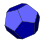
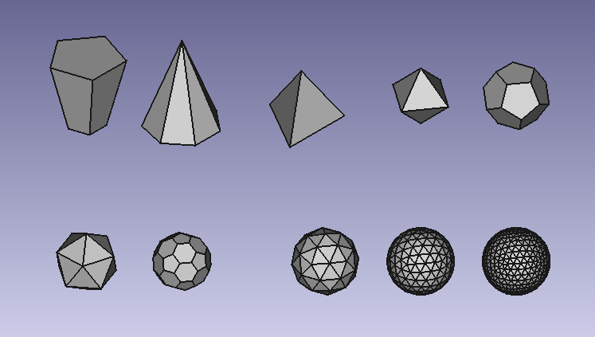

# Macro Pyramid
{{Macro
|Name=Macro Pyramid
|Icon=Pyramidicon.svg
|Description=This macro creates a parametric pyramid. The radiuses and the height will be set at creation time similar to Part Cone.
All parameters can be adjusted. It is possible to create pyramids with a perfect tip.
|Author=Eddy Verlinden, Genk, Belgium
|Version=01.01
|Date=2019-11-10
|FCVersion=All
|Download=[https   *//raw.githubusercontent.com/eddyverl/FreeCad-Pyramids-and-Polyhedrons/master/icons/pyramid.svg Icon ToolBar]
|SeeAlso=[Macro Polyhedrons](Macro_Polyhedrons.md) 
}}

## Description

This macro creates a parametric pyramid.

-   Both radiuses and the height will be set at creation time, similar to Part Cone.
-   All parameters can be adjusted.
-   It is possible to create pyramids with a perfect tip.

Note   *

If you\'re also interested in polyhedrons, then you can use Macro Polyhedrons.
You can also make use of the the external workbench [Pyramids\_and\_Polyhedrons](https   *//github.com/eddyverl/FreeCad-Pyramids-and-Polyhedrons) (github link) that contains the same function.

*Example creation with the external workbench [https   *//github.com/eddyverl/FreeCad-Pyramids-and-Polyhedrons Pyramids_and_Polyhedrons] (github link) that contains the same function.*

## Usage

-   Install   * use Tools / Addon manager / Macro\'s  to install the macro.
-   Once installed, open Menu → Macro → Macros. Click on pyramid.py and then click on button {{button|execute}}.
-   A knotted pyramid will appear, similar to Part Cone
-   Change the parameters just like with Part Cone.
--   More info at [Pyramids\_and\_Polyhedrons](https   *//github.com/eddyverl/FreeCad-Pyramids-and-Polyhedrons) (github README)

## Script

 Icon ToolBar 

**pyramid.py**

{{MacroCode|code=
# ***************************************************************************
# *   Copyright (c) 2019  Eddy Verlinden                                    *   
# *                                                                         *
# *   This file is part of the FreeCAD CAx development system.              *
# *                                                                         *
# *   This program is free software; you can redistribute it and/or modify  *
# *   it under the terms of the GNU Lesser General Public License (LGPL)    *
# *   as published by the Free Software Foundation; either version 2 of     *
# *   the License, or (at your option) any later version.                   *
# *   for detail see the LICENCE text file.                                 *
# *                                                                         *
# *   FreeCAD is distributed in the hope that it will be useful,            *
# *   but WITHOUT ANY WARRANTY; without even the implied warranty of        *
# *   MERCHANTABILITY or FITNESS FOR A PARTICULAR PURPOSE.  See the         *
# *   GNU Lesser General Public License for more details.                   *
# *                                                                         *
# *   You should have received a copy of the GNU Library General Public     *
# *   License along with FreeCAD; if not, write to the Free Software        *
# *   Foundation, Inc., 59 Temple Place, Suite 330, Boston, MA  02111-1307  *
# *   USA                                                                   *
# *                                                                         *
# ***************************************************************************

__Title__   = "Macro_Pyramid"
__Author__  = "Eddy Verlinden"
__Version__ = "01.02"
__Date__    = "2021-01-09"
__Comment__ = "This macro creates a parametric pyramid."

import sys
import FreeCAD,FreeCADGui
import Part
import math

def create(obj_name)   *
    obj=FreeCAD.ActiveDocument.addObject("Part   *   *FeaturePython",obj_name) 
    fpo = Pyramid(obj)
    ViewProviderBox(obj.ViewObject)  
    FreeCAD.ActiveDocument.recompute()
    return fpo

def horizontal_regular_polygon_vertexes(sidescount,radius,z, startangle = 0)   *
    vertexes = []
    if radius != 0    *
        for i in range(0,sidescount+1)   *
            angle = 2 * math.pi * i / sidescount + math.pi + startangle
            vertex = (radius * math.cos(angle), radius * math.sin(angle), z)
            vertexes.append(vertex)
    else   *
        vertex = (0,0,z)
        vertexes.append(vertex)
    return vertexes

def horizontal_regular_pyramid_vertexes(sidescount,radius,z, startangle = 0)   *
    vertexes = []
    odd = 0
    if (sidescount % 2) == 0   *
        odd = 1
    if radius != 0    *
        for i in range(0,sidescount+1)   *
            angle = 2 * math.pi * i / sidescount + (math.pi * (odd/sidescount + 1/2)) + startangle * math.pi / 180
            vertex = (radius * math.cos(angle), radius * math.sin(angle), z)
            vertexes.append(vertex)
    else   *
        vertex = (0,0,z)
        vertexes.append(vertex)
    return vertexes

# =========================================================================== 

class Pyramid   *
 
    radius1value = 0
    radius2value = 0
    sidescountvalue = 0
    side1value = 0
    side2value = 0
    anglez = 0

    def __init__(self, obj, sidescount = 5,radius_bottom = 2 , radius_top = 4, height = 10, angz = 0)   *
        obj.addProperty("App   *   *PropertyLength","Radius1","Pyramid","Radius of the pyramid").Radius1=radius_bottom
        obj.addProperty("App   *   *PropertyLength","Radius2","Pyramid","Radius of the pyramid").Radius2=radius_top
        obj.addProperty("App   *   *PropertyLength","Height","Pyramid","Height of the pyramid").Height = height
        obj.addProperty("App   *   *PropertyInteger","Sidescount","Pyramid","Sidescount of the pyramid").Sidescount = sidescount
        obj.addProperty("App   *   *PropertyLength","Sidelength1","Pyramid","Sidelength1 of the pyramid")
        obj.addProperty("App   *   *PropertyLength","Sidelength2","Pyramid","Sidelength2 of the pyramid")
        obj.addProperty("App   *   *PropertyAngle","Z_rotation","Pyramid","alfa angle around Z").Z_rotation = angz

        obj.Proxy = self

        
    def execute (self,obj)   *
              
        sidescount = int(obj.Sidescount)
        angle = 2 * math.pi / sidescount
        radius_bottom = float(obj.Radius1)
        radius_top = float(obj.Radius2)
        sidelength_top = float(obj.Sidelength2)
        sidelength_bottom = float(obj.Sidelength1)
        height = float(obj.Height)
        anglez = float(obj.Z_rotation)

        if radius_bottom != self.radius1value or sidescount != self.sidescountvalue   *
            obj.Sidelength1 = radius_bottom * math.sin(angle/2) * 2
            self.radius1value = radius_bottom
            self.side1value = float(obj.Sidelength1)
        elif sidelength_bottom != self.side1value   *
            self.radius1value = float(obj.Sidelength1 / 2) / math.sin(angle/2) 
            obj.Radius1 = self.radius1value
            radius_bottom = self.radius1value
            self.side1value = float(obj.Sidelength1)

        if radius_top != self.radius2value or sidescount != self.sidescountvalue   * 
            obj.Sidelength2 = radius_top * math.sin(angle/2) * 2
            self.radius2value = float(radius_top)
            self.side2value = float(obj.Sidelength2)
        elif sidelength_top != self.side2value   *
            self.radius2value = float(obj.Sidelength2 / 2) / math.sin(angle/2) 
            obj.Radius2 = self.radius2value
            radius_top = self.radius2value
            self.side2value = float(obj.Sidelength2)
            
        self.sidescountvalue = sidescount
        faces = []
        if radius_bottom == 0 and radius_top == 0   *
            FreeCAD.Console.PrintMessage("Both radiuses are zero" + "\n")
        else   *
            vertexes_bottom = horizontal_regular_pyramid_vertexes(sidescount,radius_bottom,0     ,anglez)
            vertexes_top    = horizontal_regular_pyramid_vertexes(sidescount,radius_top   ,height,anglez)

            if radius_bottom != 0   *
                polygon_bottom = Part.makePolygon(vertexes_bottom)
                face_bottom = Part.Face(polygon_bottom)
                faces.append(face_bottom)
            if radius_top != 0   *    
                polygon_top = Part.makePolygon(vertexes_top)
                face_top = Part.Face(polygon_top)
                faces.append(face_top)

            for i in range(sidescount)   *            
                if radius_top == 0   *
                    vertexes_side=[vertexes_bottom[i],vertexes_bottom[i+1],vertexes_top[0],vertexes_bottom[i]]
                elif radius_bottom == 0   *
                    vertexes_side=[vertexes_bottom[0],vertexes_top[i+1],vertexes_top[i],vertexes_bottom[0]]
                else   *
                    vertexes_side=[vertexes_bottom[i],vertexes_bottom[i+1],vertexes_top[i+1],vertexes_top[i],vertexes_bottom[i]]
                polygon_side=Part.makePolygon(vertexes_side)
                faces.append(Part.Face(polygon_side))

            shell = Part.makeShell(faces)   
            solid = Part.makeSolid(shell)
            obj.Shape = solid        
            

# ===========================================================================    

class ViewProviderBox   *
    def __init__(self, obj)   *
        obj.Proxy = self

    def attach(self, obj)   *
        return

    def updateData(self, fp, prop)   *
        return

    def getDisplayModes(self,obj)   *
        return "As Is"
        
    def getDefaultDisplayMode(self)   *
        return "As Is"

    def setDisplayMode(self,mode)   *
        return "As Is"

    def onChanged(self, vobj, prop)   *
        pass
        
    def getIcon(self)   *
        return """
        /* XPM */
        static char * xpm[] = {
        "32 32 9 1",
        "   c None",
        ".  c #01035E",
        "+  c #0F0C1D",
        "@  c #4849B7",
        "#  c #5F5E61",
        "$  c #6567FE",
        "%  c #8E9192",
        "&  c #A5A6A4",
        "*  c #FBFEFA",
        "                                ",
        "                                ",
        "                        #       ",
        "                       +#       ",
        "                     &++#       ",
        "                    #+++%       ",
        "                   ++.@+&       ",
        "                 &++.$++&       ",
        "                %++@$$++&       ",
        "               #++@$$@++&       ",
        "             &+++@$$$@++&       ",
        "            %+.+@$$$$+.+&       ",
        "           #+.+@$$$$$+.+&       ",
        "         &+..+@$$$$$@+.+&       ",
        "        &+..+@$$$$$$@+.+&       ",
        "       #+..+@$$$$$$$+..+&       ",
        "      +..++@$$$$$$$$+..+&       ",
        "    %+++++++@$$$$$$@+..+&       ",
        "   #++++...+++@$$$$.+..+&       ",
        "    +........+++@$$+...+&       ",
        "    &+.........+++.+...+        ",
        "     #+...........++...+        ",
        "      #+...........++..+        ",
        "       +............+..+        ",
        "       &++...........+.+        ",
        "         %+++........+++        ",
        "           &#++.......++        ",
        "              #++..+++++&       ",
        "                %++#%           ",
        "                                ",
        "                                ",
        "                                "};
        """
    def __getstate__(self)   *
        return None

    def __setstate__(self,state)   *
        return None
       
# ===========================================================================    

if FreeCAD.ActiveDocument == None   *
    FreeCAD.newDocument()

create ("Pyramid")
FreeCADGui.SendMsgToActiveView("ViewFit")

}}

## Link

The forum discussion [Macros for pyramids and polyhedrons](https   *//forum.freecadweb.org/viewtopic.php?f=22&t=40485&p=344116&hilit=Eddyverl#p344116)

---
 [documentation index](../README.md) > Macro Pyramid
