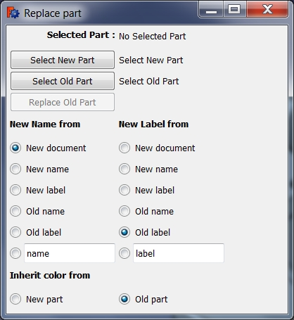

# Macro Replace Part in Assembly
{{Macro
|Name=Macro Replace Part in Assembly
|Icon=Replace_Part.png
|Description=Especially when doing "Assemblies" with simple copies of parts, one needs to replace one part by another from time to time.
|Author=ralvejd
|Version=1.0
|Date=2014-09-10
|FCVersion=All
|Download=[https   *//www.freecadweb.org/wiki/images/0/07/Replace_Part.png ToolBar Icon]
}}

## Description

Especially when doing \"Assemblies\" with simple copies of parts, one needs to replace one part by another from time to time. Then you can use this macro do do this.

## Usage

Be sure to have your files containing the old part and the new part open.

1.  Run the macro.
2.  Select the appropriate FreeCAD-document and select the new part in the tree-view.
3.  Then click on \"Select New Part\".
4.  Select the appropriate FreeCAD-document and select the part to be replaced in the tree-view.
5.  Then click on \"Select Old Part\".
6.  Use the other options to your liking.
7.  Then click on \"Replace Old Part\".

See also [Demo on Youtube](http   *//youtu.be/rTqqqy4n1RE).

## Script

ToolBar Icon 

**Macro Replace_Part_in_Assembly.py**

{{MacroCode|code=
#!/usr/bin/env python
# -*- coding   * utf-8 -*-

"""
Macro to replace parts in assembly FreeCAD.
Version 0.1 from 20140910

********************************************************************************************
*   Copyright (c) 2013 Joakim Isaksson <ralvejd[at]users.sourceforge.net>          *
*                                                                                                                                       *
*   This file is a supplement to the FreeCAD CAx development system.                *
*                                                                                                                                       *
*   This program is free software; you can redistribute it and/or modify                  *
*   it under the terms of the GNU Lesser General Public License (LGPL)               *
*   as published by the Free Software Foundation; either version 2 of                    *
*   the License, or (at your option) any later version.                                                  *
*   for detail see the LICENCE text file.                                                                        *
*                                                                                                                                        *
*   This software is distributed in the hope that it will be useful,                                  *
*   but WITHOUT ANY WARRANTY; without even the implied warranty of                *
*   MERCHANTABILITY or FITNESS FOR A PARTICULAR PURPOSE.  See the *
*   GNU Library General Public License for more details.                                           *
*                                                                                                                                          *
*   You should have received a copy of the GNU Library General Public                    *
*   License along with this macro; if not, write to the Free Software                            *
*   Foundation, Inc., 59 Temple Place, Suite 330, Boston, MA  02111-1307              *
*   USA                                                                                                                                *
*                                                                                                                                           *
***********************************************************************************************
"""

__author__ = "Joakim Isaksson <ralvejd[at]users.sourceforge.net>"

import FreeCAD, Part, math
from FreeCAD import Base
import DraftVecUtils
import sys
try   *
   from PySide import QtCore, QtGui
   from PySide.QtCore import SIGNAL, QTimer
   from PySide.QtGui import QApplication
except   *
   from PyQt4 import QtCore, QtGui
   from PyQt4.QtCore import SIGNAL, QTimer
   from PyQt4.QtGui import QApplication

try   *
   _fromUtf8 = QtCore.QString.fromUtf8
except AttributeError   *
   _fromUtf8 = lambda s   * s

try   *
   _encoding = QtGui.QApplication.UnicodeUTF8
   def _translate(context, text, disambig)   *
      return QtGui.QApplication.translate(context, text, disambig, _encoding)
except AttributeError   *
   def _translate(context, text, disambig)   *
      return QtGui.QApplication.translate(context, text, disambig)

#                     [document , name, label, position, rotation, group]
global newpart ; newpart = [ "" , "", "" , "", "" , "" ] ;
global oldpart ; oldpart = [ "" , "", "" , "", "" , "" ] ;
global newPartName ; newPartName = ""
global newPartLabel ; newPartLabel = ""
global uiRowOffset ; uiRowOffset = 30
global uiColWidth ; uiColWidth = 150
global uiPad ; uiPad = 5
global uiMainWidth ; uiMainWidth = 400

class Ui_ReplacePart(object)   *

   def setupUi(self, ReplacePart)   *
      global uiMainWidth
      global uiRowOffset
      global uiColWidth
      global uiPad
      uiTextPartWidth = uiMainWidth -(3*uiPad)-uiColWidth

      ReplacePart.setObjectName(_fromUtf8("ReplacePart"))
      ReplacePart.setLocale(QtCore.QLocale(QtCore.QLocale.English, QtCore.QLocale.UnitedKingdom))   

      captionFont = QtGui.QFont()
      captionFont.setBold(True)

      self.centralWidget = QtGui.QWidget(ReplacePart)
      self.centralWidget.setObjectName(_fromUtf8("centralWidget"))
      
      """
      #*** FIXME ***
      #self.centralWidget.setAttribute(QtCore.Qt.WA_DeleteOnClose)
      self.centralWidget.setAttribute(QtCore.Qt.WA_DeleteOnClose, True)
      #*** FIXME ***
      """
      
      self.groupBoxNewName = QtGui.QButtonGroup()
      self.groupBoxNewLabel = QtGui.QButtonGroup()
      self.groupBoxColorFrom = QtGui.QButtonGroup()

      self.labelCapSelected = QtGui.QLabel(self.centralWidget)
      self.labelCapSelected.setGeometry(QtCore.QRect(uiPad, uiPad, uiColWidth, uiRowOffset-10))
      self.labelCapSelected.setAlignment(QtCore.Qt.AlignRight)
      self.labelCapSelected.setFont(captionFont)
      self.labelCapSelected.setObjectName(_fromUtf8("labelCapSelected"))

      self.labelSelected = QtGui.QLabel(self.centralWidget)
      self.labelSelected.setGeometry(QtCore.QRect(uiColWidth+(2*uiPad), uiPad, uiTextPartWidth, uiRowOffset-10))
      self.labelSelected.setObjectName(_fromUtf8("labelSelected"))

      row = uiPad+uiRowOffset   
      self.pushButtonNew = QtGui.QPushButton(self.centralWidget)
      self.pushButtonNew.setGeometry(QtCore.QRect(uiPad, row, uiColWidth, uiRowOffset-2))
      self.pushButtonNew.setObjectName(_fromUtf8("pushButtonNew"))
      self.pushButtonNew.clicked.connect(self.on_pushButtonNew_clicked)   

      self.labelNew = QtGui.QLabel(self.centralWidget)
      self.labelNew.setGeometry(QtCore.QRect(uiColWidth+(2*uiPad), row, uiTextPartWidth, uiRowOffset-2))
      self.labelNew.setObjectName(_fromUtf8("labelNew"))

      row = row+uiRowOffset
      self.pushButtonOld = QtGui.QPushButton(self.centralWidget)
      self.pushButtonOld.setGeometry(QtCore.QRect(uiPad, row, uiColWidth, uiRowOffset-2))
      self.pushButtonOld.setObjectName(_fromUtf8("pushButtonOld"))
      self.pushButtonOld.clicked.connect(self.on_pushButtonOld_clicked)

      self.LabelOld = QtGui.QLabel(self.centralWidget)
      self.LabelOld.setGeometry(QtCore.QRect(uiColWidth+(2*uiPad), row, uiTextPartWidth, uiRowOffset-2))
      self.LabelOld.setObjectName(_fromUtf8("labelOld"))

      row = row+uiRowOffset
      self.pushButtonOk = QtGui.QPushButton(self.centralWidget)
      self.pushButtonOk.setGeometry(QtCore.QRect(uiPad, row, uiColWidth, uiRowOffset-2))
      self.pushButtonOk.setObjectName(_fromUtf8("pushButtonOk"))
      self.pushButtonOk.setEnabled(False)
      self.pushButtonOk.clicked.connect(self.on_pushButtonOk_clicked)

      row = row+uiRowOffset+uiPad
      self.labelCapNewName = QtGui.QLabel(self.centralWidget)
      self.labelCapNewName.setGeometry(QtCore.QRect(uiPad, row, uiColWidth, uiRowOffset-10))
      self.labelCapNewName.setFont(captionFont)
      self.labelCapNewName.setObjectName(_fromUtf8("labelCapNewName"))

      self.labelCapNewLabel = QtGui.QLabel(self.centralWidget)
      self.labelCapNewLabel.setGeometry(QtCore.QRect(uiColWidth+(2*uiPad), row, uiColWidth, uiRowOffset-10))
      self.labelCapNewLabel.setFont(captionFont)
      self.labelCapNewLabel.setObjectName(_fromUtf8("labelCapNewLabel"))

      row = row+uiRowOffset
      self.radioButtonNameFromNewDoc = QtGui.QRadioButton(self.centralWidget)
      self.radioButtonNameFromNewDoc.setGeometry(QtCore.QRect(uiPad, row, uiColWidth, uiRowOffset-2))
      self.radioButtonNameFromNewDoc.setObjectName(_fromUtf8("radioButtonNameFromNewDoc"))
      self.radioButtonNameFromNewDoc.clicked.connect(self.on_radioButtonNameFromNewDoc_clicked)

      self.radioButtonLabelFromNewDoc = QtGui.QRadioButton(self.centralWidget)
      self.radioButtonLabelFromNewDoc.setGeometry(QtCore.QRect(uiColWidth+(2*uiPad), row, uiColWidth, uiRowOffset-2))
      self.radioButtonLabelFromNewDoc.setObjectName(_fromUtf8("radioButtonLabelFromNewDoc"))
      self.radioButtonLabelFromNewDoc.clicked.connect(self.on_radioButtonLabelFromNewDoc_clicked)

      row = row+uiRowOffset
      self.radioButtonNameFromNewName = QtGui.QRadioButton(self.centralWidget)
      self.radioButtonNameFromNewName.setGeometry(QtCore.QRect(uiPad, row, uiColWidth, uiRowOffset-2))
      self.radioButtonNameFromNewName.setObjectName(_fromUtf8("radioButtonNameFromNewName"))
      self.radioButtonNameFromNewName.clicked.connect(self.on_radioButtonNameFromNewName_clicked)

      self.radioButtonLabelFromNewName = QtGui.QRadioButton(self.centralWidget)
      self.radioButtonLabelFromNewName.setGeometry(QtCore.QRect(uiColWidth+(2*uiPad), row, uiColWidth, uiRowOffset-2))
      self.radioButtonLabelFromNewName.setObjectName(_fromUtf8("radioButtonLabelFromNewName"))
      self.radioButtonLabelFromNewName.clicked.connect(self.on_radioButtonLabelFromNewName_clicked)

      row = row+uiRowOffset
      self.radioButtonNameFromNewLabel = QtGui.QRadioButton(self.centralWidget)
      self.radioButtonNameFromNewLabel.setGeometry(QtCore.QRect(uiPad, row, uiColWidth, uiRowOffset-2))
      self.radioButtonNameFromNewLabel.setObjectName(_fromUtf8("radioButtonNameFromNewLabel"))
      self.radioButtonNameFromNewLabel.clicked.connect(self.on_radioButtonNameFromNewLabel_clicked)

      self.radioButtonLabelFromNewLabel = QtGui.QRadioButton(self.centralWidget)
      self.radioButtonLabelFromNewLabel.setGeometry(QtCore.QRect(uiColWidth+(2*uiPad), row, uiColWidth, uiRowOffset-2))
      self.radioButtonLabelFromNewLabel.setObjectName(_fromUtf8("radioButtonLabelFromNewLabel"))
      self.radioButtonLabelFromNewLabel.clicked.connect(self.on_radioButtonLabelFromNewLabel_clicked)

      row = row+uiRowOffset
      self.radioButtonNameFromOldName = QtGui.QRadioButton(self.centralWidget)
      self.radioButtonNameFromOldName.setGeometry(QtCore.QRect(uiPad, row, uiColWidth, uiRowOffset-2))
      self.radioButtonNameFromOldName.setObjectName(_fromUtf8("radioButtonNameFromOldName"))
      self.radioButtonNameFromOldName.clicked.connect(self.on_radioButtonNameFromOldName_clicked)

      self.radioButtonLabelFromOldName = QtGui.QRadioButton(self.centralWidget)
      self.radioButtonLabelFromOldName.setGeometry(QtCore.QRect(uiColWidth+(2*uiPad), row, uiColWidth, uiRowOffset-2))
      self.radioButtonLabelFromOldName.setObjectName(_fromUtf8("radioButtonLabelFromOldName"))
      self.radioButtonLabelFromOldName.clicked.connect(self.on_radioButtonLabelFromOldName_clicked)

      row = row+uiRowOffset
      self.radioButtonNameFromOldLabel = QtGui.QRadioButton(self.centralWidget)
      self.radioButtonNameFromOldLabel.setGeometry(QtCore.QRect(uiPad, row, uiColWidth, uiRowOffset-2))
      self.radioButtonNameFromOldLabel.setObjectName(_fromUtf8("radioButtonNameFromOldLabel"))
      self.radioButtonNameFromOldLabel.clicked.connect(self.on_radioButtonNameFromOldLabel_clicked)

      self.radioButtonLabelFromOldLabel = QtGui.QRadioButton(self.centralWidget)
      self.radioButtonLabelFromOldLabel.setGeometry(QtCore.QRect(uiColWidth+(2*uiPad), row, uiColWidth, uiRowOffset-2))
      self.radioButtonLabelFromOldLabel.setObjectName(_fromUtf8("radioButtonLabelFromOldLabel"))
      self.radioButtonLabelFromOldLabel.clicked.connect(self.on_radioButtonLabelFromOldLabel_clicked)

      row = row+uiRowOffset
      self.radioButtonNameFromText = QtGui.QRadioButton(self.centralWidget)
      self.radioButtonNameFromText.setGeometry(QtCore.QRect(uiPad, row, 20, uiRowOffset-2))
      self.radioButtonNameFromText.setObjectName(_fromUtf8("radioButtonNameFromText"))
      self.radioButtonNameFromText.clicked.connect(self.on_radioButtonNameFromText_clicked)

      self.lineEditNameFromText = QtGui.QLineEdit(self.centralWidget)
      self.lineEditNameFromText.setGeometry(QtCore.QRect(uiPad+20, row, uiColWidth-20, uiRowOffset-2))
      self.lineEditNameFromText.setObjectName(_fromUtf8("lineEditNameFromText"))
      self.lineEditNameFromText.textChanged.connect(self.on_lineEditNameFromText_changed)

      self.radioButtonLabelFromText = QtGui.QRadioButton(self.centralWidget)
      self.radioButtonLabelFromText.setGeometry(QtCore.QRect(uiColWidth+(2*uiPad), row, 20, uiRowOffset-2))
      self.radioButtonLabelFromText.setObjectName(_fromUtf8("radioButtonLabelFromText"))
      self.radioButtonLabelFromText.clicked.connect(self.on_radioButtonLabelFromText_clicked)

      self.lineEditLabelFromText = QtGui.QLineEdit(self.centralWidget)
      self.lineEditLabelFromText.setGeometry(QtCore.QRect(uiColWidth+(2*uiPad)+20, row, uiColWidth-20, uiRowOffset-2))
      self.lineEditLabelFromText.setObjectName(_fromUtf8("lineEditLabelFromText"))
      self.lineEditLabelFromText.textChanged.connect(self.on_lineEditLabelFromText_changed)

      row = row+uiRowOffset+uiPad
      self.labelCapColorFrom = QtGui.QLabel(self.centralWidget)
      self.labelCapColorFrom.setGeometry(QtCore.QRect(uiPad, row, uiColWidth, uiRowOffset-10))
      self.labelCapColorFrom.setFont(captionFont)
      self.labelCapColorFrom.setObjectName(_fromUtf8("labelCapColorFrom"))

      row = row+uiRowOffset
      self.radioButtonColorFromNew = QtGui.QRadioButton(self.centralWidget)
      self.radioButtonColorFromNew.setGeometry(QtCore.QRect(uiPad, row, uiColWidth, uiRowOffset-2))
      self.radioButtonColorFromNew.setObjectName(_fromUtf8("radioButtonColorFromNew"))

      self.radioButtonColorFromOld = QtGui.QRadioButton(self.centralWidget)
      self.radioButtonColorFromOld.setGeometry(QtCore.QRect(uiColWidth+(2*uiPad), row, uiColWidth, uiRowOffset-2))
      self.radioButtonColorFromOld.setObjectName(_fromUtf8("radioButtonColorFromOld"))

      row = row+uiRowOffset+uiPad
      ReplacePart.resize(uiMainWidth,row)

      self.groupBoxNewName.addButton(self.radioButtonNameFromNewDoc)
      self.groupBoxNewName.addButton(self.radioButtonNameFromNewName)
      self.groupBoxNewName.addButton(self.radioButtonNameFromNewLabel)
      self.groupBoxNewName.addButton(self.radioButtonNameFromOldName)
      self.groupBoxNewName.addButton(self.radioButtonNameFromOldLabel)
      self.groupBoxNewName.addButton(self.radioButtonNameFromText)

      self.groupBoxNewLabel.addButton(self.radioButtonLabelFromNewDoc)
      self.groupBoxNewLabel.addButton(self.radioButtonLabelFromNewName)
      self.groupBoxNewLabel.addButton(self.radioButtonLabelFromNewLabel)
      self.groupBoxNewLabel.addButton(self.radioButtonLabelFromOldName)
      self.groupBoxNewLabel.addButton(self.radioButtonLabelFromOldLabel)
      self.groupBoxNewLabel.addButton(self.radioButtonLabelFromText)

      self.groupBoxColorFrom.addButton(self.radioButtonColorFromNew)
      self.groupBoxColorFrom.addButton(self.radioButtonColorFromOld)

      self.radioButtonNameFromNewDoc.setChecked(True)  #Set the default name to your preference
      self.radioButtonLabelFromOldLabel.setChecked(True) #Set the default label to your preference
      self.radioButtonColorFromOld.setChecked(True) #Set the default color inherit to your preference

      """
      #*** FIXME ***
      self.timer = QtCore.QTimer()
      QtCore.QObject.connect(self.timer, QtCore.SIGNAL("timeout()"), self.my_update)
      self.timer.start(2000)

      #*** FIXME ***
      """
      self.retranslateUi(ReplacePart)
      
      QtCore.QMetaObject.connectSlotsByName(ReplacePart)

   def retranslateUi(self, ReplacePart)   *
      ReplacePart.setWindowFlags(QtCore.Qt.WindowStaysOnTopHint)
      ReplacePart.setAttribute(QtCore.Qt.WA_DeleteOnClose, True)
      ReplacePart.setWindowTitle(_translate("ReplacePart", "Replace part", None))
      self.labelCapSelected.setText(_translate("ReplacePart", "Selected Part    *", None))
      self.labelSelected.setText(_translate("ReplacePart", "No Selected Part", None))
      self.labelNew.setText(_translate("ReplacePart", "Select New Part", None))
      self.LabelOld.setText(_translate("ReplacePart", "Select Old Part", None))
      self.pushButtonNew.setText(_translate("ReplacePart", "Select New Part", None))
      self.pushButtonOld.setText(_translate("ReplacePart", "Select Old Part", None))
      self.pushButtonOk.setText(_translate("ReplacePart", "Replace Old Part", None))
      self.labelCapNewName.setText(_translate("ReplacePart", "New Name from", None))
      self.radioButtonNameFromNewDoc.setText(_translate("ReplacePart", "New document", None))
      self.radioButtonNameFromNewName.setText(_translate("ReplacePart", "New name", None))
      self.radioButtonNameFromNewLabel.setText(_translate("ReplacePart", "New label", None))
      self.radioButtonNameFromOldName.setText(_translate("ReplacePart", "Old name", None))
      self.radioButtonNameFromOldLabel.setText(_translate("ReplacePart", "Old label", None))
      self.radioButtonNameFromText.setText(_translate("ReplacePart", "t", None))
      self.lineEditNameFromText.setText(_translate("ReplacePart", "name", None))
      self.labelCapNewLabel.setText(_translate("ReplacePart", "New Label from", None))
      self.radioButtonLabelFromNewDoc.setText(_translate("ReplacePart", "New document", None))
      self.radioButtonLabelFromNewName.setText(_translate("ReplacePart", "New name", None))
      self.radioButtonLabelFromNewLabel.setText(_translate("ReplacePart", "New label", None))
      self.radioButtonLabelFromOldName.setText(_translate("ReplacePart", "Old name", None))
      self.radioButtonLabelFromOldLabel.setText(_translate("ReplacePart", "Old label", None))
      self.radioButtonLabelFromText.setText(_translate("ReplacePart", "t", None))
      self.lineEditLabelFromText.setText(_translate("ReplacePart", "label", None))
      self.labelCapColorFrom.setText(_translate("ReplacePart", "Inherit color from", None))
      self.radioButtonColorFromNew.setText(_translate("ReplacePart", "New part", None))
      self.radioButtonColorFromOld.setText(_translate("ReplacePart", "Old part", None))

   """
   #*** FIXME ***

   def my_update(self)   *
      selectedPart = self.getSelectedPart()
      self.labelSelected.setText(selectedPart[0] + "," + selectedPart[1] + ","+ selectedPart[2])
      FreeCAD.Console.PrintMessage("Selected part   * " + selectedPart[0] + "," + selectedPart[1] + ","+ selectedPart[2] + "," + "\n")

   def closeEvent(self, event)   *
      FreeCAD.Console.PrintMessage("closeEvent\n")
      if self.timer.stop()   *
         self.timer.stop()
         event.accept() # let the window close
      else   *
         event.ignore()

   def on_exit(self, event)   *
      FreeCAD.Console.PrintMessage("exitEvent\n")
      if self.timer.stop()   *
         self.timer.stop()
         event.accept() # let the window close
      else   *
         event.ignore()

   def hideEvent(self, event)   *
      FreeCAD.Console.PrintMessage("hideEvent\n")
      if self.timer.stop()   *
         self.timer.stop()
         event.accept() # let the window close
      else   *
         event.ignore()

   #
   """

   def on_pushButtonNew_clicked(self)   *
      global oldpart
      global newpart
      newpart = self.getSelectedPart()
      if str(newpart[0]) == ""   *
         self.labelNew.setText("No part selected")
      else   *
         self.labelNew.setText(str(newpart[0])+ " , " + str(newpart[1]))
         self.radioButtonName()
         self.radioButtonLabel()
         Gui.Selection.clearSelection()
      if str(oldpart[0]) == str(newpart[0])   *
         self.pushButtonOk.setEnabled(False)
      elif str(oldpart[0]) == ""   *
         self.pushButtonOk.setEnabled(False)
      elif str(newpart[0]) == ""   *
         self.pushButtonOk.setEnabled(False)
      else   *
         self.pushButtonOk.setEnabled(True)

   def on_pushButtonOld_clicked(self)   *
      global oldpart
      global newpart
      oldpart = self.getSelectedPart()
      if str(oldpart[0]) == ""   *
         self.LabelOld.setText("No part selected")
      else   *
         self.LabelOld.setText(str(oldpart[0])+ " , " + str(oldpart[1]))
         self.radioButtonName()
         self.radioButtonLabel()
         Gui.Selection.clearSelection()
      if str(oldpart[0]) == str(newpart[0])   *
         self.pushButtonOk.setEnabled(False)
      elif str(oldpart[0]) == ""   *
         self.pushButtonOk.setEnabled(False)
      elif str(newpart[0]) == ""   *
         self.pushButtonOk.setEnabled(False)
      else   *
         self.pushButtonOk.setEnabled(True)

   def on_pushButtonOk_clicked(self)   *
      if self.radioButtonColorFromNew.isChecked()   *
         colors = self.getColors("new")
      if self.radioButtonColorFromOld.isChecked()   *
         colors = self.getColors("old")
      self.deleteOldPart()
      newPartName = self.makeSimple(colors)
      self.moveNew2Old(newPartName)
      self.move2Group(newPartName)
      App.ActiveDocument.recompute()
      App.Console.PrintMessage("Part replaced\n")
      #self.window.hide()

   def on_radioButtonNameFromNewDoc_clicked(self)   *
      self.radioButtonName()

   def on_radioButtonNameFromNewName_clicked(self)   *
      self.radioButtonName()

   def on_radioButtonNameFromNewLabel_clicked(self)   *
      self.radioButtonName()

   def on_radioButtonNameFromOldName_clicked(self)   *
      self.radioButtonName()

   def on_radioButtonNameFromOldLabel_clicked(self)   *
      self.radioButtonName()

   def on_radioButtonNameFromText_clicked(self)   *
      self.radioButtonName()

   def on_lineEditNameFromText_changed(self)   *
      self.radioButtonName()

   def on_radioButtonLabelFromNewDoc_clicked(self)   *
      self.radioButtonLabel()

   def on_radioButtonLabelFromNewName_clicked(self)   *
      self.radioButtonLabel()

   def on_radioButtonLabelFromNewLabel_clicked(self)   *
      self.radioButtonLabel()

   def on_radioButtonLabelFromOldName_clicked(self)   *
      self.radioButtonLabel()

   def on_radioButtonLabelFromOldLabel_clicked(self)   *
      self.radioButtonLabel()

   def on_radioButtonLabelFromText_clicked(self)   *
      self.radioButtonLabel()

   def on_lineEditLabelFromText_changed(self)   *
      self.radioButtonLabel()

   def radioButtonName(self)   *
      global newPartName
      if self.radioButtonNameFromNewDoc.isChecked()   *
         newPartName=self.getFromNew(0)
      elif self.radioButtonNameFromNewName.isChecked()   *
         newPartName=self.getFromNew(1)
      elif self.radioButtonNameFromNewLabel.isChecked()   *
         newPartName=self.getFromNew(2)
      elif self.radioButtonNameFromOldName.isChecked()   *
         newPartName=self.getFromOld(1)
      elif self.radioButtonNameFromOldLabel.isChecked()   *
         newPartName=self.getFromOld(2)
      elif self.radioButtonNameFromText.isChecked()   *
         newPartName=str(self.lineEditNameFromText.displayText())
      else   *
         FreeCAD.Console.PrintError("Error   * Unknown Name error\n")

   def radioButtonLabel(self)   *
      global newPartLabel
      if self.radioButtonLabelFromNewDoc.isChecked()   *
         newPartLabel=self.getFromNew(0)
      elif self.radioButtonLabelFromNewName.isChecked()   *
         newPartLabel=self.getFromNew(1)
      elif self.radioButtonLabelFromNewLabel.isChecked()   *
         newPartLabel=self.getFromNew(2)
      elif self.radioButtonLabelFromOldName.isChecked()   *
         newPartLabel=self.getFromOld(1)
      elif self.radioButtonLabelFromOldLabel.isChecked()   *
         newPartLabel=self.getFromOld(2)
      elif self.radioButtonLabelFromText.isChecked()   *
         newPartLabel=str(self.lineEditLabelFromText.displayText())
      else   *
         FreeCAD.Console.PrintError("Error   * Unknown Label error\n")

   def getFromNew(self, index)   *
      global newpart
      return newpart[index];

   def getFromOld(self, index)   *
      global oldpart
      return oldpart[index];

   def getSelectedPart(self)   *
      sel = FreeCADGui.Selection.getSelection()
      if sel   *
         sel = sel[0]
         name = sel.Name
         label = sel.Label
         doc = FreeCAD.ActiveDocument.Name
         pos = App.ActiveDocument.getObject(name).Placement.Base   
         rot = App.ActiveDocument.getObject(name).Placement.Rotation
         grp = self.inGroup(name)
         the_part=[doc , name, label, pos, rot, grp];
         return the_part;
      else   *
         FreeCAD.Console.PrintError("Error   * One object must be selected\n")
         the_part=["" , ""];
         return the_part;

   def makeSimple(self, colors)   *
      global oldpart
      global newpart
      global newPartName
      global newPartLabel
      fixPartName = newPartName
      #newPartLabel = newPartLabel
      newPartName = self.uniqeName(fixPartName)
      App.setActiveDocument(oldpart[0])
      Gui.ActiveDocument=Gui.getDocument(oldpart[0])
      App.ActiveDocument=App.getDocument(oldpart[0])
      App.ActiveDocument.addObject('Part   *   *Feature',newPartName).Shape=App.getDocument(newpart[0]).getObject(newpart[1]).Shape
      App.ActiveDocument.ActiveObject.Label = newPartLabel
      App.ActiveDocument.getObject(newPartName).Label = newPartLabel
      Gui.getDocument(oldpart[0]).getObject(newPartName).ShapeColor = colors[0]
      Gui.getDocument(oldpart[0]).getObject(newPartName).LineColor =  colors[1]
      Gui.getDocument(oldpart[0]).getObject(newPartName).PointColor = colors[2]
      return newPartName;

   def moveNew2Old(self, newPartName)   *
      global oldpart
      global newpart
      App.ActiveDocument.getObject(newPartName).Placement = App.Placement(oldpart[3], oldpart[4])

   def deleteOldPart(self)   *
      global oldpart
      App.setActiveDocument(oldpart[0])
      Gui.ActiveDocument=Gui.getDocument(oldpart[0])
      App.ActiveDocument=App.getDocument(oldpart[0])
      App.ActiveDocument.removeObject(oldpart[1])

   def inGroup(self, partName)   *
      try   *
         grp = App.ActiveDocument.getObject(partName).InList
         grpName = grp[0].Name
      except   *
         grpName = ""
      return grpName;

   def move2Group(self,  newPartName)   *
      global oldpart
      grp = App.ActiveDocument.getObject(oldpart[5])
      part = App.ActiveDocument.getObject(newPartName)
      grp.addObject(part)

   def getColors(self, newORold)   *
      global oldpart
      global newpart
      if newORold == "new"   *
         shape = Gui.getDocument(newpart[0]).getObject(newpart[1]).ShapeColor
         line = Gui.getDocument(newpart[0]).getObject(newpart[1]).LineColor
         point = Gui.getDocument(newpart[0]).getObject(newpart[1]).PointColor
      elif newORold == "old"   *
         shape = Gui.getDocument(oldpart[0]).getObject(oldpart[1]).ShapeColor
         line = Gui.getDocument(oldpart[0]).getObject(oldpart[1]).LineColor
         point = Gui.getDocument(oldpart[0]).getObject(oldpart[1]).PointColor
      else   *
         FreeCAD.Console.PrintMessage("Error! Color from newpart or old?\n")
      colors = [ shape, line, point ];
      return colors;

   def uniqeName(self, newPartName)   *
      global oldpart
      objs = App.getDocument(oldpart[0]).Objects
      for obj in objs   *
         if obj.Name  == newPartName   *
            if obj.Name != oldpart[1]   *
               i = 0
               for iobj in objs   *
                  if iobj.Name == newPartName + "_" + str(i) and iobj.Name != oldpart[1]   *
                     i += 1
               return newPartName + "_" + str(i);
      return newPartName;

class replace()   *
   Gui.Selection.clearSelection()
   d = QtGui.QWidget()
   d.ui = Ui_ReplacePart()
   d.ui.setupUi(d)
   d.show()

}}

---
 [documentation index](../README.md) > Macro Replace Part in Assembly
