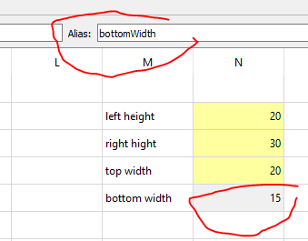
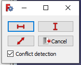
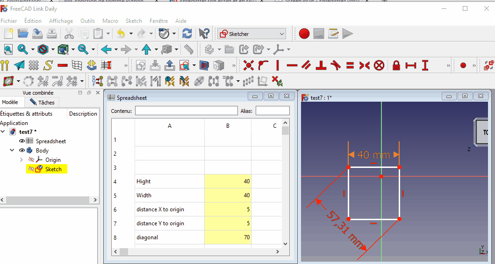
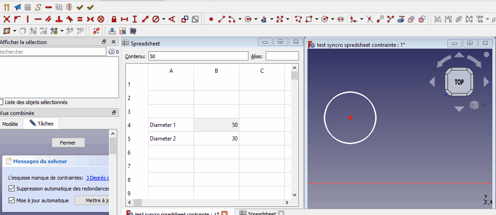
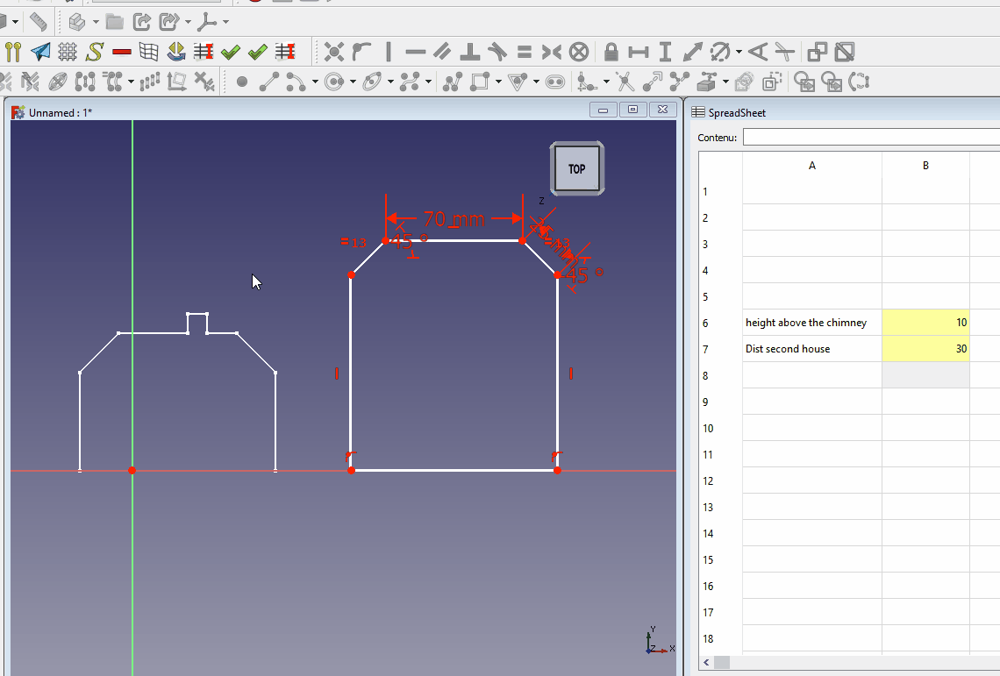
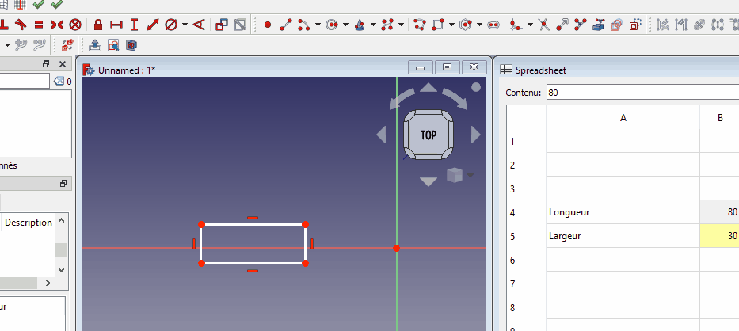

# Macro Sketch Constraint From Spreadsheet
{{Macro
|Name=Macro Sketch Constraint From Spreadsheet
|Description=Macro which, with a simple click on a spreadsheet cell, adds a length constraint to a line or between 2 points using a spreadsheet cell alias or address (ex. C2). Macro can create alias for you.
|Author=2cv001
|Download=[https://wiki.freecad.org/Images/1/15/Macro_Sketch_Constraint_From_Spreadsheet.svg ToolBar icon]
|Version=00.03
|Date=2023-03-25
|FCVersion=All
}}

## Description

**Work in progress. It works for me. Tell me if anything is wrong.**

Macro which, with a simple click on a spreadsheet cell, adds a length constraint to a line or between 2 points using a spreadsheet cell alias or address (ex. C2). Future changes to the spreadsheet will update the constraint. The macro can create alias for you.

Just select 1 line, 2 points or a constraint, click on a spreadsheet cell and run the macro. You can select lines, points at the ends of a line, points, circles or arcs of circles.

  

## Usage

If you run the macro and have not yet created a spreadsheet, the macro suggests to create one and then opens it so that you can start filling it.

  

It is not mandatory, but it is better to use aliases in your spreadsheet. The macro can create aliases from texts in cells.

1\) Select:

-   a line,
-   two points (end of a line, center of a circle, etc.)
-   or a length constraint.

  

2\) Click on a spreadsheet cell, with or without an alias, that has a numerical value:

  

3\) Run the macro.

4\) Select the desired type of constraint:

  

If the cell has an alias, the length property of the constraint will be something like \'Spreadsheet.alias\'. Otherwise, something like \'Spreadsheet.D4\'.

  

5\) If the constraint causes a conflict in the sketch and the \"conflict detection\" box is checked, the macro will offer to delete the new constraint:

  

If you select an existing constraint, you can change its value for a value from a spreadsheet:

   

The macro can also handle external geometry from another sketch:   

To make things even more refined, if, for example, a line is horizontal rather than vertical, when the dialogue box opens, the focus will be on the button for apply a horizontal constraint. If the line is vertical rather than horizontal, the focus will be on the button to apply a vertical constraint. In both cases, simply press the enter key if you are happy with this choice.

## Links

-   [Forum discussion (French)](https://forum.freecad.org/viewtopic.php?t=75972)
-   [Macros recipes](Macros_recipes.md)
-   [How to install macros](How_to_install_macros.md)
-   [How to customize toolbars](Customize_Toolbars.md)

## Credits

Thanks to openBrain, mario52 and onekk for their help on the code!
Thanks to Syres for tests and for the help on the format in the code.
Thanks to Roy043 and David69 for the various reviews and improvements to the wiki.

## Script

ToolBar Icon 

### Code

 ver 00.02.41 25/03/2023 by 2cv001 **Macro_Sketch_Constraint_From_Spreadsheet.FCMacro**

    #!/usr/bin/env python
    # -*- coding: utf-8 -*-
    # =========================================================================
    # Macro Sketch Constraint From Spreadsheet
    # file name : sketchConstraintFromSpreadsheet.FCMacro
    # ========================================================================
    # ==                                                                    ==
    # == Adds a length constraint to a line or between 2 points             ==
    # == using a spreadsheet cell alias or name (ex. C2).                   ==
    # == Future changes to the spreadsheet will update the constraint.      ==
    # == if necessary, the macro help you to create alias                   ==
    # == USE:                                                               ==
    # == 1) Select 1 line, 2 points or a constraint                         ==
    # == 2) Click on a spreadsheet cell                                     ==
    # == 3) Launch the macro                                                ==
    # ==    if the cell has an alias, the length property will be something ==
    # ==    like 'Spreadsheet.alias'.                                       ==
    # ==    if not, just something like 'Spreadsheet.C2'                    ==
    # == You can select lines, points line, points, circle...               ==
    # == You can't select external objetcs  (next version will be able to   ==
    # ========================================================================
    # ========================================================================
    __author__ = "2cv001"
    __title__   = "Macro Sketch Constraint From Spreadsheet"
    __date__    = "2023/03/25"    #YYYY/MM/DD
    __version__ = __date__
    __icon__    = "https://wiki.freecad.org/Images/1/15/Macro_Sketch_Constraint_From_Spreadsheet.svg"
    __Wiki__    = "https://wiki.freecad.org/Macro_sketchConstraintFromSpreadsheet"

    import FreeCAD, FreeCADGui
    from PySide import QtGui, QtCore
    import PySide2
    from PySide2.QtGui import QGuiApplication
    import PySide
    from PySide2 import QtWidgets
    import Draft, Part, Sketcher
    import itertools
    import configparser
    import os
    from importlib import reload 
    importAliasOk = True

    #################################################################################
    # part code for alias
    #################################################################################
    # parameters for alias creation
    separateur = " "      # typically put " " so blanks will be replaced by nouveauCaract
    nouveauCaract = ''    #Put for example "_" to have the separators replaced by "_". Put "" to have no separator
    majuscule = True      #set to True if you want  "Diametre du cercle" to be "DiametreDuCercle"
    changeTexteCellule = False  # the text will only be changed if changeCellText is True. 
                              # This does not change anything for the allias itself
    premierCaractereEnMinuscule = True # Force the first character to be in lower case

    # list of characters to be replaced by an equivalent. for example an @ will be replaced by 'a'
    # if you add characters, please send me a private message. Il will eventually add it in my code.
    caracEquivalents = [ ['é','e'],['è','e'],['à','a'],['@','a'],['&','e'],['ç','c'],
                      ['²','2'],["'",''],['?',''],['"',''],['(',''],[')',''],['#',''],
                      ['$',''],['+',''],['-',''],['*',''],['/',''],['\\',''] ]
                      

                        
                        
    def remplaceCartatParEquivalent(caractere):
    # replaces a character with its equivalent if it exists
        caracResult = caractere   
        for couple in caracEquivalents:
            if (couple[0] == caractere):
                caracResult = couple[1]
                break
        return caracResult

    def remplaceCararcDansMot(mot):
    #replaces all characters of the word with its equivalent if it exists
        motResult = mot
        for caract in mot:
            a = remplaceCartatParEquivalent(caract)
            motResult = motResult.replace(caract, a)
        return motResult

    def traitementChaineSource(chaineSource, separateur, nouveauCaract, majuscule):
    # If separator is ' ' and nouveauCaract is '_', and majuscule is True
    # transforms "Diametre du cylindre" into "Diametre_Du_Cylindre
        chaineResult = ''
        first = True
        carctDeSeparation = ''
        for mots in chaineSource.split(separateur): 
            mots = remplaceCararcDansMot(mots)
            if (not (first)):
                carctDeSeparation = nouveauCaract 
            if (majuscule):
                chaineResult = chaineResult + nouveauCaract + mots[:1].upper() + mots[1:]
                # We use "[:1]" instead of "[0]", 
                # for no crash in case of an empty string (which happens if the cell is empty)
            else:
                chaineResult = chaineResult + nouveauCaract + mots
        if premierCaractereEnMinuscule :
            chaineResult = chaineResult[:1].lower() + chaineResult[1:]
        return chaineResult

    def setAlias():
        sels = Gui.Selection.getSelectionEx()
        # If the user wants to trigger the creation of alias
        # it is sufficient that he does not select any objects in the sketch 
        # but select cells containing strings in the left hand column 
        # of where he want the alias to be created
        # so test if an object is selected :
        # result : False if macro can continue.
     
        if len(sels) != 0 and len(sels[0].SubElementNames) != 0 : # something selected
            return False
        else :
             ### Ask the user if he is sure
            if QtGui.QMessageBox.warning(Gui.getMainWindow(),
            'Warning', 'You did not select any object in an active sketch.' +  
            '\nDoes it mean you want to create alias automatiquely for cells at the right of selected cells ?',
            QtGui.QMessageBox.Ok | QtGui.QMessageBox.Cancel) == QtGui.QMessageBox.Cancel: 
                # if user dont want
                return True              
        aw = Gui.getMainWindow().centralWidget().activeSubWindow() # Store the active window       
        try :
            mySpreadSheet = Gui.ActiveDocument.ActiveView.getSheet()
        except :
             QtWidgets.QMessageBox.warning(Gui.getMainWindow(), "Warning", "No active spreadsheet with selected cells.")
             return True
        # To get list of all selected cells
        sel_items = aw.widget().findChild(QtGui.QTableView).selectedIndexes() 

        ### We define a function that will return the cell identifier from its row (r) and column (c) numbers
        ### Numbers start at 0 for the first row/column
        ### Columns are correctly managed with a 2-letter identifier
        cellName = lambda r,c:'{}{}{}'.format(chr(c//26 + 64) if c//26 > 0 else '', chr(c%26 + 65), r + 1)

        # we check that one of the cells is not a numeric. If not, message and exit
        for item in sel_items: # The selected cells are scanned
            cell = cellName(item.row(), item.column()) # We retrieve the cell ID
            activeCellContenu = mySpreadSheet.getContents(cell)
            f = ''
            try :
                f = float(activeCellContenu)
            except :
                pass            
            if f != '' :
                QtWidgets.QMessageBox.warning(Gui.getMainWindow(), 
                    "Warning", "There is a number in one of the selected cells." + 
                    " Alias is not possible. \nTry again after correction")
                return False
             
            
        for item in sel_items: # The selected cells are scanned
            cell = cellName(item.row(), item.column()) # The cell identifier is retrieved
            next_cell = cellName(item.row(), item.column() + 1) # We get the ID of the cell next to the right
            activeCellContenu = mySpreadSheet.getContents(cell)
            # processing the character string contained in the cell
            activeCellContenu = traitementChaineSource(activeCellContenu, separateur, nouveauCaract, majuscule)
            if changeTexteCellule:# if the changeCellText parameter is set to True then we replace the text in the cell
                mySpreadSheet.set(cell, activeCellContenu)
            alias = activeCellContenu

            try: # Bloc try to recover errors
                mySpreadSheet.setAlias(next_cell, alias) # The alias is assigned to the right-hand neighbouring cell

            except ValueError: # If a "ValueError" is triggered (which happens when the alias is not valid)
                # The user is warned in the report
                App.Console.PrintWarning("Can't set alias for cell {} : {} isn't valid\n".format(next_cell, alias))
        return True        

    #################################################################################
    # End part code for alias
    #################################################################################

    #=======================================================
    # Test if an object of a type exist and ask for a creation if not.
    # return :
    # 'exist' if one already exists
    # 'new' if a new is create
    # 'no' if user does not want it
    #=======================================================
    def isExistObjectType(type) :
        def firstObject(doc = App.ActiveDocument):
            for obj in doc.Objects:
                if obj.TypeId == type:
                    return obj
            return None
        myObject = firstObject()
        if not myObject :
            if type == 'Spreadsheet::Sheet' :
                messageText = "No spreadsheet in your document. Create one ?"
                objectName = 'SpreadSheet'

            elif type == 'PartDesign::Body' :
                messageText = "No Body in your document. Create one ?"
                objectName = 'Body'
            wantNewObjet = QtWidgets.QMessageBox.question(None, "object not detected",
            messageText, QtWidgets.QMessageBox.Yes | QtWidgets.QMessageBox.No)
            if wantNewObjet == QtWidgets.QMessageBox.Yes:
                myObject = App.activeDocument().addObject(type, objectName)
                myObject.ViewObject.doubleClicked()
                return 'new'
            else :
                return 'no'
        return 'exist'

    #=======================================================
    # Dialog box
    # Ask user which sort of constraint is required
    #=======================================================
    class getConstraintType(QtGui.QDialog):
        def __init__(self, widgetToFocus = None):
            super(getConstraintType, self).__init__()
            self.widgetToFocus = widgetToFocus
            self.initUI()

        def initUI(self):
            self.setWindowIcon(QtGui.QIcon('dialog_icon.png'))
            gridLayout = QtGui.QGridLayout()
            option1Button = QtGui.QPushButton(QtGui.QIcon(":/icons/constraints/Constraint_HorizontalDistance.svg"), "")
            option2Button = QtGui.QPushButton(QtGui.QIcon(":/icons/constraints/Constraint_VerticalDistance.svg"), "")
            option3Button = QtGui.QPushButton(QtGui.QIcon(":/icons/constraints/Constraint_Length.svg"), "")
            option1Button.setText("Lenght constrainte X")
            option2Button.setText("Lenght constrainte Y")
            option3Button.setText("Lenght constrainte")
            option1Button.setToolTip("Lenght constrainte X")
            option2Button.setToolTip("Lenght constrainte Y")
            option3Button.setToolTip("Lenght constrainte")
            option1Button.clicked.connect(self.onOption1)
            option2Button.clicked.connect(self.onOption2)
            option3Button.clicked.connect(self.onOption3)

            option4Button = QtGui.QPushButton(QtGui.QIcon(":/icons/application-exit.svg"), "Cancel")
            option4Button.setToolTip("Option 4 tooltip")
            option4Button.clicked.connect(self.onOption4)

            gridLayout.addWidget(option1Button, 0, 0)
            gridLayout.addWidget(option2Button, 0, 1)
            gridLayout.addWidget(option3Button, 1, 0)
            gridLayout.addWidget(option4Button, 1, 1)

            self.setLayout(gridLayout)
            self.setGeometry(250, 250, 0, 50)
            self.setWindowTitle("Choose a constraint type")
            self.setWindowFlags(QtCore.Qt.WindowStaysOnTopHint)
            self.choiceConstraint = ''

            option1Button.setFocusPolicy(QtCore.Qt.NoFocus)
            option2Button.setFocusPolicy(QtCore.Qt.NoFocus)
            option3Button.setFocusPolicy(QtCore.Qt.NoFocus)
            option4Button.setFocusPolicy(QtCore.Qt.NoFocus)

            # set focus to specified widget
            if self.widgetToFocus == 'DistanceX':
                option1Button.setFocus()
            elif self.widgetToFocus == 'DistanceY':
                option2Button.setFocus()
            elif self.widgetToFocus == 'Distance':
                option3Button.setFocus()

            # Add checkbox
            self.checkBox = QtGui.QCheckBox("Conflict detection")
            self.checkBox.setChecked(True)
            gridLayout.addWidget(self.checkBox, 2, 0, 1, 2)
            self.checkBox.clicked.connect(self.onOptionCheckBox)

            # read ini file to get last checkBoxState
            config = configparser.ConfigParser()
            # macroDirectory = FreeCAD.ParamGet("User parameter:BaseApp/Preferences/Macro").GetString("MacroPath") + "\\"
            macroDirectory = FreeCAD.getUserMacroDir(True)
            try :
                filePath = os.path.join(macroDirectory, "sketchConstraintFromSpreadsheet.ini")
                config.read(filePath)
                # read ini file to know last time state
                lasChecked = config.getboolean('DEFAULT', 'save_checkbox_state')
                self.checkBox.setChecked(lasChecked)
            except :
                # print('no ini file. Ini file will be create for next launch')
                pass

            # window positioning
            centerPoint = QGuiApplication.screens()[0].geometry().center()
            self.move(centerPoint - self.frameGeometry().center())

        def onOption1(self):
            self.choiceConstraint = 'DistanceX'
            self.close()

        def onOption2(self):
            self.choiceConstraint = 'DistanceY'
            self.close()

        def onOption3(self):
            self.choiceConstraint = 'Distance'
            self.close()

        def onOption4(self):
            self.choiceConstraint = 'Cancel'
            self.close()

        def onOptionCheckBox(self):
            #macroDirectory = FreeCAD.ParamGet("User parameter:BaseApp/Preferences/Macro").GetString("MacroPath") + "\\"
            macroDirectory = FreeCAD.getUserMacroDir(True)
            # Save checkbox state to file
            filePath = os.path.join(macroDirectory, "sketchConstraintFromSpreadsheet.ini")
            config = configparser.ConfigParser()
            config['DEFAULT'] = {'save_checkbox_state': str(int(self.getCheckBoxState()))}
            with open(filePath, 'w') as configfile:
                config.write(configfile)

        def getCheckBoxState(self):
            return self.checkBox.isChecked()

    #=======================================================
    # Give the focus to editing sketch window
    # no parameter
    # use : activateSketchEditingWindow()
    #=======================================================
    def activateSketchEditingWindow():
        def searchForNode(tree, childName, maxLevel = 0):
            return recursiveSearchForNode(tree, childName, maxLevel, 1)

        def recursiveSearchForNode(tree, childName, maxLevel, currentLevel):
            try:
                if tree.getByName(childName):
                    return True;
                elif maxLevel > 0 and currentLevel >= maxLevel:
                    return False;
                else:
                    for child in tree.getChildren():
                        if recursiveSearchForNode(child, childName, maxLevel, currentLevel + 1):
                            return True
            except:
                pass
            return False

        doc = Gui.ActiveDocument
        if not doc:
            QtWidgets.QMessageBox.information(Gui.getMainWindow(), "Activate window", "No active document")
            return
        views = Gui.ActiveDocument.mdiViewsOfType("Gui::View3DInventor")
        if not views:
            QtWidgets.QMessageBox.information(Gui.getMainWindow(), "Activate window", "No 3D view opened for active document")
            return
        editView = None
        for view in views:
            if searchForNode(view.getSceneGraph(), "Sketch_EditRoot", 3):
                editView = view
                break
        if not editView:
            QtWidgets.QMessageBox.information(Gui.getMainWindow(), "Activate window", "No 3D view has sketch in edit mode for active document")
            return
        for win in Gui.getMainWindow().centralWidget().subWindowList():
            if editView.graphicsView() in win.findChildren(QtWidgets.QGraphicsView):
                    Gui.getMainWindow().centralWidget().setActiveSubWindow(win)
                    break

    ######################################################################################
    # to get necessary values for the constraint
    # Parameters :
    # sel : selection of objects (a line, 2 points..).
    # numOrdreObjSelected if we want the first objetc selected or the second.
    # indexExtremite if we want the start point (1) or the end point (2), if exist, of the sel
    # return features of a point
    # - typeIdGeometry : Part::GeomLineSegment ....
    # - typeInSubElementName : Edge, vertex ...
    # - indexObjectHavingPoint index of the object having the point (line...)
    # - indexExtremiteLine index of the ends (points) of the line (= start point or end point)
    # - x, y : coordinates of the point
    # - isInternalObject : True if the objetct is on the active sketch
    #####################################################################################
    def featuresObjSelected (mySketch, sel, numOrdreObjSelected, indexExtremite) :
        indexExtremiteLine = 1
        indexObjectHavingPoint = -10
        typeIdGeometry = None
        x, y = 0, 0
        isInternalObject=True
        itemName = sel.SubElementNames[numOrdreObjSelected] # ex Edge5 ( line)
            
        tabExternalGeomery = []
        for item in ActiveSketch.ExternalGeometry :
            for objName in item [1] :
                # to get something like
                # [('Sketch', 'Edge2'), ('Sketch001', 'Edge2'), ('Sketch001', 'Edge1'), ('Sketch', 'Edge1')]
                tabExternalGeomery.append((item[0].Name, objName))
            
        if itemName == 'RootPoint' :
            typeInSubElementName = 'RootPoint'
            indexObjectHavingPoint = -1
            typeIdGeometry = mySketch.Geometry[indexObjectHavingPoint].TypeId
            x, y = 0, 0
        else :
            # for Edge5, typeInSubElementName ->'Edge' and '5'
            typeInSubElementName, numInNameStr = [''.join(c) for _, c in itertools.groupby(itemName, str.isalpha)] 
            numInName = int(numInNameStr)

        # only one selected object
        if typeInSubElementName == 'Edge'and len(sel.SubElementNames) == 1: # selection is only one line
            indexObjectHavingPoint = numInName - 1
            indexExtremiteLine = indexExtremite
            typeIdGeometry = mySketch.Geometry[indexObjectHavingPoint].TypeId
            # typeIdGeometry : 'Part::GeomCircle' or 'Part::GeomLineSegment'
            if typeIdGeometry in  ['Part::GeomLineSegment'] :
                if indexExtremite == 1 :
                    x = mySketch.Geometry[indexObjectHavingPoint].StartPoint.x
                    y = mySketch.Geometry[indexObjectHavingPoint].StartPoint.y
                elif indexExtremite == 2 :
                    x = mySketch.Geometry[indexObjectHavingPoint].EndPoint.x
                    y = mySketch.Geometry[indexObjectHavingPoint].EndPoint.y
                    
        if typeInSubElementName == 'ExternalEdge' :
            isInternalObject = False
            indexObjectHavingPoint = - numInName - 2 
            indexExtremiteLine = indexExtremite 
            externalSketchName, externalGeometryName = tabExternalGeomery[numInName - 1]
            iTypeExternal, iNumStr = [''.join(c) for _, c in itertools.groupby(externalGeometryName, str.isalpha)]
            iNumExtGeometry = int(iNumStr)
            typeIdGeometry = App.ActiveDocument.getObject(externalSketchName).Geometry[iNumExtGeometry - 1].TypeId
            
            if len(sel.SubElementNames) == 1 :  
                if typeIdGeometry == 'Part::GeomLineSegment' : 
                    if   indexExtremite == 1 :
                        x = App.ActiveDocument.getObject(externalSketchName).Geometry[iNumExtGeometry - 1].StartPoint.x
                        y = App.ActiveDocument.getObject(externalSketchName).Geometry[iNumExtGeometry - 1].StartPoint.y
                    elif indexExtremite == 2 :    
                        x = App.ActiveDocument.getObject(externalSketchName).Geometry[iNumExtGeometry - 1].EndPoint.x
                        y = App.ActiveDocument.getObject(externalSketchName).Geometry[iNumExtGeometry - 1].EndPoint.y

            if typeIdGeometry in ['Part::GeomCircle', 'Part::GeomArcOfCircle'] :       
                x = App.ActiveDocument.getObject(externalSketchName).Geometry[iNumExtGeometry - 1].Center.x
                y = App.ActiveDocument.getObject(externalSketchName).Geometry[iNumExtGeometry - 1].Center.y
                indexExtremiteLine = 3 # 3 for center
                    

        # We selected an internal circle but for center (two objects selected)
        if typeInSubElementName == 'Edge'and len(sel.SubElementNames) == 2 :
            typeIdGeometry = mySketch.Geometry[numInName - 1].TypeId
            if typeIdGeometry in  ['Part::GeomCircle', 'Part::GeomArcOfCircle'] :
                indexObjectHavingPoint = numInName - 1
                x = mySketch.Geometry[indexObjectHavingPoint].Location.x
                y = mySketch.Geometry[indexObjectHavingPoint].Location.y
                indexExtremiteLine = 3 # 3 for center
                
                
     
                
                

        # We selected a vertex
        if typeInSubElementName == 'Vertex' : # selection is 2 points. sel is a vertex (a point of a line) :
            indexObjectHavingPoint, indexExtremiteLine = sel.Object.getGeoVertexIndex(numInName - 1)
            
            if indexObjectHavingPoint >= 0 : # internal vertex
                typeIdGeometry = mySketch.Geometry[indexObjectHavingPoint].TypeId
                if mySketch.Geometry[indexObjectHavingPoint].TypeId == 'Part::GeomLineSegment' :
                    if indexExtremiteLine == 1 :
                        x = mySketch.Geometry[indexObjectHavingPoint].StartPoint.x
                        y = mySketch.Geometry[indexObjectHavingPoint].StartPoint.y
                    if indexExtremiteLine == 2:
                        x = mySketch.Geometry[indexObjectHavingPoint].EndPoint.x
                        y = mySketch.Geometry[indexObjectHavingPoint].EndPoint.y
                if mySketch.Geometry[indexObjectHavingPoint].TypeId == 'Part::GeomPoint' :
                    x = mySketch.Geometry[indexObjectHavingPoint].X
                    y = mySketch.Geometry[indexObjectHavingPoint].Y
                # we select a vertex Circle (so the center)
                if mySketch.Geometry[indexObjectHavingPoint].TypeId in ['Part::GeomCircle', 'Part::GeomArcOfCircle'] :
                    x = mySketch.Geometry[indexObjectHavingPoint].Location.x
                    y = mySketch.Geometry[indexObjectHavingPoint].Location.y
                    
            if indexObjectHavingPoint < 0 : # external vertex = vertex of another sketch
                isInternalObject = False
                externalSketchName, externalGeometryName = tabExternalGeomery[-indexObjectHavingPoint-3]
                
                iType, iNumStr = [''.join(c) for _, c in itertools.groupby(externalGeometryName, str.isalpha)]
                iNumExtGeometry = int(iNumStr)
                typeExternal=App.ActiveDocument.getObject(externalSketchName).Geometry[iNumExtGeometry-1].TypeId   
                typeIdGeometry = typeExternal
                        
                if typeExternal=='Part::GeomLineSegment' :
                    if indexExtremiteLine == 1 :
                        x = App.ActiveDocument.getObject(externalSketchName).Geometry[iNumExtGeometry-1].StartPoint.x
                        y = App.ActiveDocument.getObject(externalSketchName).Geometry[iNumExtGeometry-1].StartPoint.y
                    if indexExtremiteLine == 0 :
                        x = App.ActiveDocument.getObject(externalSketchName).Geometry[iNumExtGeometry-1].EndPoint.x
                        y = App.ActiveDocument.getObject(externalSketchName).Geometry[iNumExtGeometry-1].EndPoint.y
                if typeExternal == 'Part::GeomCircle' :
                    x = App.ActiveDocument.getObject(externalSketchName).Geometry[iNumExtGeometry-1].Center.x
                    y = App.ActiveDocument.getObject(externalSketchName).Geometry[iNumExtGeometry-1].Center.y

        if typeInSubElementName == 'Constraint' and len(sel.SubElementNames) == 1 :
            indexConstraint = numInName - 1
            indexObjectHavingPoint = indexConstraint
            typeIdGeometry = 'Constraint'
        return typeIdGeometry, typeInSubElementName, indexObjectHavingPoint, indexExtremiteLine, x ,y, isInternalObject

    ##########################################
    # function returning selected objects at GUI level
    #  = Sketch, SpreadSheet ....
    # parameter :
    # '' = no filter
    # 'Spreadsheet::Sheet' for spreadsheets only
    # 'Sketcher::SketchObject' for sketches etc...
    # output: an array of sketch objects, spreadsheets etc.
    ##########################################
    def getGuiObjsSelect(type = ''):
        tabGObjSelect = []
        selections = Gui.Selection.getCompleteSelection()
        for sel in (selections):
            if hasattr(sel, 'Object'):   # depend freecad version
                if type == '' or sel.Object.TypeId == type :
                    tabGObjSelect.append(sel.Object)
            else :
                obj=App.ActiveDocument.getObject(sel.Name)
                if type == '' or obj.TypeId == type :
                    tabGObjSelect.append(obj)
        return tabGObjSelect

    ##########################################
    # Main proceddure
    ##########################################
    def main():
        #initialization
        sheckBoxConstraintConflicState = False
        indexConstraint = -1    
        try :
            FreeCAD.ActiveDocument.Objects
        except :
            a = QtWidgets.QMessageBox.question(None, "",
                "No document find. Create one ? ",
                QtWidgets.QMessageBox.Yes | QtWidgets.QMessageBox.No, QtWidgets.QMessageBox.No)
            if a == QtWidgets.QMessageBox.Yes :
                App.newDocument()
            if a == QtWidgets.QMessageBox.No:
                return
        existBodyNew = isExistObjectType ('PartDesign::Body')  in ['no', 'new']
        existSpreadSheetNew = isExistObjectType ('Spreadsheet::Sheet') in ['no', 'new']
        if existBodyNew or existSpreadSheetNew :
            return

        
        
        # have a look if user wants alias
        if importAliasOk :
            if setAlias():
                return     
        try :
            mySketch = ActiveSketch
        except :
            QtWidgets.QMessageBox.information(None, "Warning", "Select object must be done in edition mode")
            activateSketchEditingWindow()
            return

        # Part SpreadSheet
        #
        sheets = getGuiObjsSelect('Spreadsheet::Sheet')
        for sheet in sheets :
            Gui.Selection.removeSelection(FreeCAD.ActiveDocument.Name, sheet.Name)
        try :
            mySpreadSheet = Gui.ActiveDocument.ActiveView.getSheet()
        except :
            QtWidgets.QMessageBox.information(None, "Warning",
                    "1- Select a line or 2 points" + 
                    "\n 2- go to a spreadsheet" + 
                    "\n 3- select the cell containing the value." + 
                    "\n 4- stay in the spreadsheet and launch the macro")
            activateSketchEditingWindow()
            return
        mySpreadSheetName = mySpreadSheet.Name
        # select the Spreadsheet To be able to retrieve the selected cell :
        mySpreadSheet.ViewObject.doubleClicked()
        # retrieve the selected cell
        ci = lambda :Gui.getMainWindow().centralWidget().activeSubWindow().widget().findChild(QtGui.QTableView).currentIndex()
        cellCode = '{}{}{}'.format(chr(ci().column()//28 + 64) if ci().column()//26 > 0 else '', chr(ci().column()%26 + 65), ci().row() + 1)
        try:
           cellContents = float(mySpreadSheet.get(cellCode))
        except:
            QtWidgets.QMessageBox.information(None, "Warning",
                     "Click on a cell with a numeric value before runing the macro")
            return
        cellAlias = App.ActiveDocument.getObject(mySpreadSheetName).getAlias(cellCode)

        # Part sketch
        #
        sels = Gui.Selection.getSelectionEx()

        if len(sels) == 0 or len(sels[0].SubElementNames) == 0 :
            QtWidgets.QMessageBox.information(None, "Warning", "Anathing is select.\n" + 
                  "Select 1 line, 2 points or a constraint in a sketch before selecting a cell in the spreadsheet")
            activateSketchEditingWindow()
            return
        elif len(sels[0].SubElementNames) > 2  :
            QtWidgets.QMessageBox.information(None, "Warning", "Too many objects selected.\n" + 
                  "Select 1 line, 2 points or a constraint in a sketch before selecting a cell in the spreadsheet")
            activateSketchEditingWindow()
            return
        else :

            # only one obj selected
            #
            if len(sels[0].SubElementNames) == 1 : # only one obj selected
                #startPoint of the line
                (typeIdGeometry1, typeInSubElementName1, indexObjectHavingPoint1, indexExtremiteLine1, 
                    x1 ,y1, isInternalObject1)=featuresObjSelected (ActiveSketch, sels[0], 0, 1)
                
                if typeInSubElementName1 == 'Constraint' and len(sels[0].SubElementNames) == 1 :
                    indexConstraint=indexObjectHavingPoint1
                elif typeIdGeometry1 == 'Part::GeomLineSegment' :
                    (typeIdGeometry2, typeInSubElementName2, indexObjectHavingPoint2, indexExtremiteLine2, 
                    x2 ,y2, isInternalObject2) = featuresObjSelected (ActiveSketch, sels[0], 0, 2)
                    
            # two obj selected
            #
            if len(sels[0].SubElementNames) == 2: # two obj selected
                (typeIdGeometry1,typeInSubElementName1, indexObjectHavingPoint1, indexExtremiteLine1, 
                x1 ,y1, isInternalObject1) = featuresObjSelected (ActiveSketch, sels[0], 0, 1)
                (typeIdGeometry2,typeInSubElementName2, indexObjectHavingPoint2, indexExtremiteLine2, 
                x2 ,y2, isInternalObject2) = featuresObjSelected (ActiveSketch, sels[0], 1, 1)

                if ((typeInSubElementName1 not in ('Vertex', 'RootPoint', 'ExternalEdge') \
                    or typeInSubElementName2 not in ('Vertex', 'RootPoint', 'ExternalEdge'))
                        and not(typeIdGeometry1 in ('Part::GeomCircle', 'Part::GeomArcOfCircle') \
                        and typeInSubElementName1 in ['Edge'])) :
                    QtWidgets.QMessageBox.information(None, "Warning", "2 objects are selected but not 2 points .\n" + 
                    "Select 1 line, 2 points or a constraint in a sketch before selecting a cell in the spreadsheet")
                    activateSketchEditingWindow()
                    return

        #
        # line or points have been selected have a look if we need to swap points
        # 
        if ((len(sels[0].SubElementNames) == 1 and typeIdGeometry1 in['Part::GeomLineSegment'] )
               or (len(sels[0].SubElementNames) == 2 and typeIdGeometry1
                in['Part::GeomLineSegment', 'Part::GeomCircle', 'Part::GeomArcOfCircle', 'Part::GeomPoint'] )) :

            # to give focus on the good button
            # (Button DistanceX if the two points are more horizontal than vertical)
            if abs(x1 - x2) > abs(y1 - y2) :
                buttonHavingFocus = 'DistanceX'
            else :
                buttonHavingFocus = 'DistanceY'
            # ask the user what kind of constraint he wants
            #
            form = getConstraintType(buttonHavingFocus)
            form.exec_()
            # is the checkboxSheced ?
            sheckBoxConstraintConflicState = form.getCheckBoxState()
            if form.choiceConstraint in ('Cancel', '') :
                activateSketchEditingWindow()
                return
            myConstraint = form.choiceConstraint # 'DistanceX' or 'DistanceY' or 'Distance'

            if (myConstraint == 'DistanceX' and x1 > x2) or  (myConstraint == 'DistanceY' and y1 > y2) :
                    indexObjectHavingPoint1, indexObjectHavingPoint2 = indexObjectHavingPoint2, indexObjectHavingPoint1
                    indexExtremiteLine1, indexExtremiteLine2 = indexExtremiteLine2, indexExtremiteLine1
                    isInternalObject1, isInternalObject2 = isInternalObject2, isInternalObject1
                    x1, x2, y1, y2 = x2, x1, y2, y1

        # create constraint
        #=================================
        # get value for constraint 
        if cellAlias == None :
            cellExpression = mySpreadSheetName + '.' + cellCode
        else :
            cellExpression = mySpreadSheetName + '.' + cellAlias
            
        # create constraint for internal or external circle
        if (len(sels[0].SubElementNames) == 1 and typeIdGeometry1 in['Part::GeomCircle', 'Part::GeomArcOfCircle'] ) :
            indexConstraint = mySketch.addConstraint(Sketcher.Constraint('Diameter'
            , indexObjectHavingPoint1, cellContents))

        # create constraint for line or points
        elif typeIdGeometry1 != 'Constraint' : # no selected constraint, just line or points
            #create the constraint
            indexConstraint = mySketch.addConstraint(Sketcher.Constraint(myConstraint
                     , indexObjectHavingPoint1, indexExtremiteLine1, indexObjectHavingPoint2
                     , indexExtremiteLine2, cellContents))
             
        # if one external line or only one external circle or two external object
        # was selected : constraint is a reference    
        if  len(sels[0].SubElementNames) == 1 and not isInternalObject1 \
            or len(sels[0].SubElementNames) == 2 and not isInternalObject1 and not isInternalObject2 :
            mySketch.setDriving(indexConstraint, False)  # External edge constraint is a reference
        else : # set the constraint'formula' (ex : 'spreadSheet.unAlias')
            mySketch.setExpression('Constraints[' + str(indexConstraint) + ']', cellExpression)
        # put Sketch window ahead
        activateSketchEditingWindow()
        FreeCADGui.Selection.clearSelection()
        # FreeCAD.ActiveDocument.recompute()
        ActiveSketch.touch()
        ActiveSketch.recompute()
        #if Gui.ActiveDocument.getInEdit() == Gui.ActiveDocument.Sketch:
            #Gui.ActiveDocument.Sketch.doubleClicked()

        # is ther constraintes conflicts ?
        if sheckBoxConstraintConflicState :
            #if App.activeDocument().isTouched(): # isTouched is not ok in Daily Freecad
            if 'Invalid' in mySketch.State :
                a = QtWidgets.QMessageBox.question(None, "",
                    "Constraints conflic detected. Cancel constraint creation ? ",
                    QtWidgets.QMessageBox.Yes | QtWidgets.QMessageBox.No, QtWidgets.QMessageBox.No)
                if a == QtWidgets.QMessageBox.Yes:
                    mySketch.delConstraint(indexConstraint)
                    FreeCAD.ActiveDocument.recompute()

        activateSketchEditingWindow()
        return

    if __name__ == '__main__':
        main()

---
 [documentation index](../README.md) > Macro Sketch Constraint From Spreadsheet
