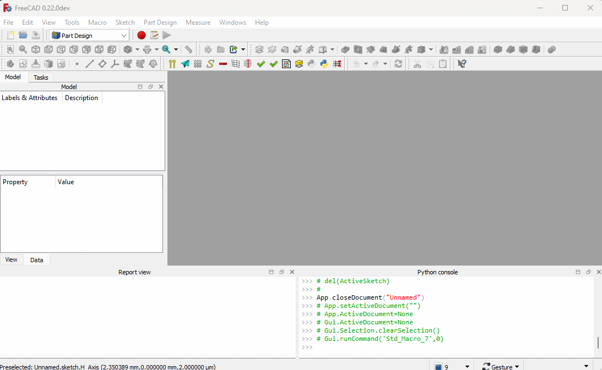
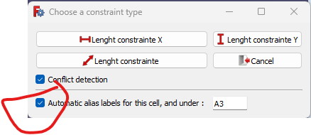
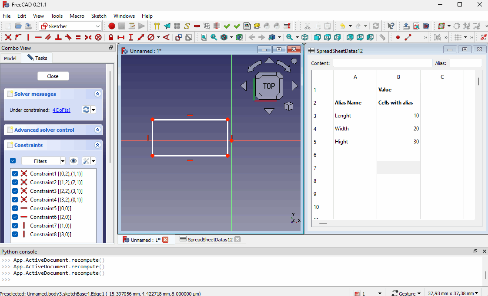
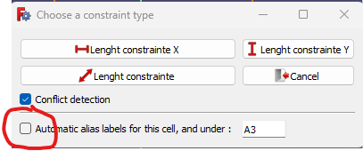
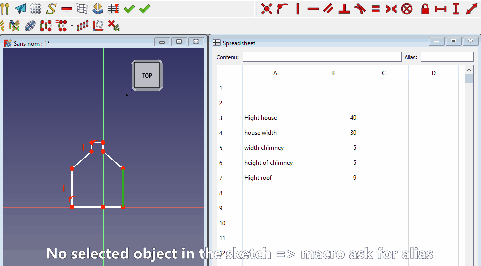
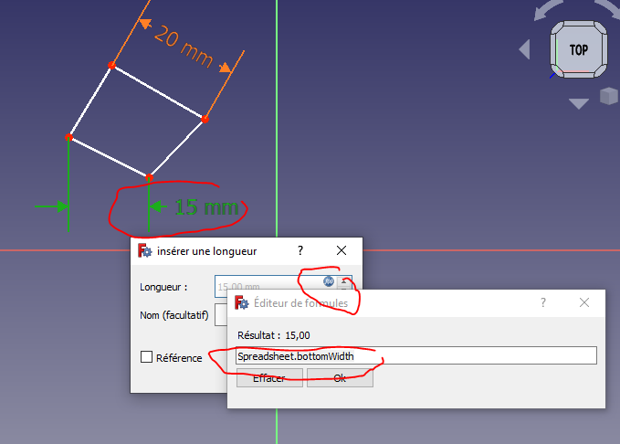
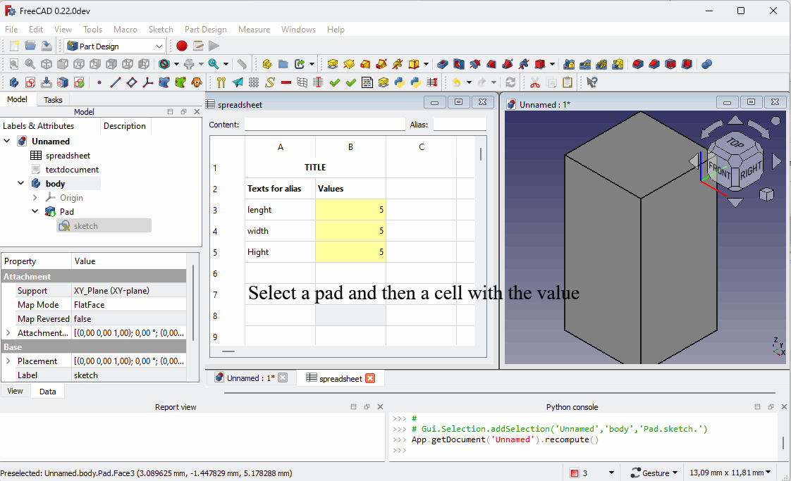

# Macro Sketch Constraint From Spreadsheet
{{Macro
|Name=Macro Sketch Constraint From Spreadsheet
|Description=Macro which, with a simple click on a spreadsheet cell, adds a length constraint to a line, a circle, or between 2 points using a spreadsheet cell alias or address (ex. C2). Future changes to the spreadsheet will update the constraint. The macro can create alias for you. Just select 1 line, 2 points or a constraint, click on a spreadsheet cell and run the macro. You can select lines, points at the ends of a line, points, circles or arcs of circles. 
|Author=2cv001
|Download=[https://wiki.freecad.org/images/d/dc/Macro_Sketch_Constraint_From_Spreadsheet.svg ToolBar icon]
|Version=01.04
|Date=2024-11-25
|FCVersion=All
}}

## Description

**Contact me in case of any problems.**

Macro which, with a simple click on a spreadsheet cell, adds a length constraint to a line or between 2 points using a spreadsheet cell alias or address (ex. C2). Future changes to the spreadsheet will update the constraint. The macro can create alias for you.

Just select 1 line, 2 points or a constraint, click on a spreadsheet cell and run the macro. You can select lines, points at the ends of a line, points, circles or arcs of circles.

  

 

## Usage

### Automatic Object creation 

If you run the macro and have not yet created a spreadsheet, a body or a sketch, the macro suggests to create one and then opens the sketch in edition mode and the spreadsheet so that you can start filling it.

  

### Automatic Alias creation 

It is not mandatory, but it is better to use aliases in your spreadsheet. The macro can create aliases from texts in cells.
Two modes:

-   a manual mode where you select yourself the cells with text for alias and an automatic mode.
-   and an automatic mode:

#### Automatic mode 

An automatic mode where alias are automatically created using a text zone defined by a cell. The zone includes the cell and those below. These texts correspond to the alias name. The alias is created to the right of its text. The designated cell (here A3) is editable in these dialog boxes:

 

 

#### Manual mode 

To use manual mode don\'t check the \"Automatic alias\" option.

  

  

### Constraints creation 

1\) Select:

-   a line,
-   two points (end of a line, center of a circle, etc.)
-   or a length constraint.

  

2\) Click on a spreadsheet cell, with or without an alias, that has a numerical value:

  

3\) Run the macro.

4\) Select the desired type of constraint:

  

If the cell has an alias, the length property of the constraint will be something like \'Spreadsheet.alias\'. Otherwise, something like \'Spreadsheet.D4\'.

  

5\) If the constraint causes a conflict in the sketch and the \"conflict detection\" box is checked, the macro will offer to delete the new constraint:

  

If you select an existing constraint, you can change its value for a value from a spreadsheet:

   

The macro can also handle external geometry from another sketch:   

To make things even more refined, if, for example, a line is horizontal rather than vertical, when the dialogue box opens, the focus will be on the button for apply a horizontal constraint. If the line is vertical rather than horizontal, the focus will be on the button to apply a vertical constraint. In both cases, simply press the enter key if you are happy with this choice.

  

The macro also works for Pads (property Length), Pockets (property Length), Fillets (property Radius), Chamfers (property Size) and Thicknesses (property Value). If you click on a Pad, for example, and then on a cell with the desired value, the Length property of the pad is automatically modified. 
 

## Links

-   [Forum discussion (French)](https://forum.freecad.org/viewtopic.php?t=75972)
-   [Forum discussion (English)](https://forum.freecad.org/viewtopic.php?style=5&t=76990)
-   [Macros recipes](Macros_recipes.md)
-   [How to install macros](How_to_install_macros.md)
-   [How to customize toolbars](Customize_Toolbars.md)

## Credits

Thanks to openBrain, mario52 and onekk for their help on the code!
Thanks to Syres for tests and for the help on the format in the code.
Thanks to Roy043 and David69 for the various reviews and improvements to the wiki.
Thanks to L\'ami René for tests and ideas.

## Script

ToolBar Icon 

### Code

 ver 01.04 2024/11/25 by 2cv001 **Macro_Sketch_Constraint_From_Spreadsheet.FCMacro** 

#### Download

---
⏵ [documentation index](../README.md) > Macro Sketch Constraint From Spreadsheet
