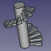

# Macro Stairs
{{Macro
|Name=Macro Stairs
|Icon=Macro_Stairs.png
|Description=Creates a stair helix. Create your stair nosing, select your object and launch the macro
|Author=Mario52
|Version=00.04
|Date=2019-07-24
|FCVersion=All
|Download=[https://www.freecadweb.org/wiki/images/a/a3/Macro_Stairs.png ToolBar Icon]
}}

## Description

Create a stair elliptical

  

## Use

Create your stair nosing, select your object and launch the macro

-   **Hmarche** : head marche
-   **nombre** : number objects for 1 turn
-   **rayon** : radius (axe to object)
-   **tours** : nomber turns pitch
-   **cloner** : 1=create clone 0=create copy
-   **cylindre** : 1=create cylinder 0=not cylinder

## Script

ToolBar Icon 

**Macro_Stairs.FCMacro**

{{MacroCode|code=

# Select your object(s) give :
#     head marche
#     number objects for 1 turn
#     radius (axe to object)
#     number turns
# the original object is not modify
# Macro_Stairs.FCMacro
# 
#01/03/2015 
import FreeCAD, Draft, Part

__title__   = "CircularStair"
__author__  = "Mario52"
__date__    = "2019/07/24"
__url__     = "http://www.freecadweb.org/index-fr.html"
__wiki__    = "https://www.freecadweb.org/wiki/Macro_Stairs"
__version__ = "00.04"

sel = FreeCADGui.Selection.getSelection()

############## Modify here ####################
Hmarche  = 10  # head marche
nombre   = 18  # number objects for 1 turn
rayon    = 20  # radius (axe to object)
tours    = 5  # nomber turns pitch 
cloner   = 1   # 1=clone    0=copy
cylindre = 1   # 1=create cylinder  0=not cylinder
###############################################

vecligne=[FreeCAD.Vector(0.0,0.0,0.0),FreeCAD.Vector(rayon,0.0,0.0)]   # vector for line directrice
ligne = Draft.makeWire(vecligne,closed=False,face=False,support=None)  # creation de la ligne de base

coor_X = coor_Y = coor_Z = 0.0
for i0 in range(tours):
    for i in range(0,360,(int(360/nombre))):                                  # boucle principale 0 to 360 degrees
        FreeCAD.ActiveDocument.getObject(ligne.Name).Placement=App.Placement(App.Vector(0,0,coor_Z), App.Rotation(App.Vector(0,0,1),i), App.Vector(0,0,0))
        try:
            a = ligne.Shape.Edges[0].Vertexes[1]       # fin de la ligne
            coor_X = (a.Point.x)
            coor_Y = (a.Point.y)
        except Exception:
            a = ligne.End         
            coor_X = (ligne.End.x)                      # fin de la ligne X
            coor_Y = (ligne.End.y)                      # fin de la ligne Y

        if cloner == 1:
            obj=Draft.clone(sel)
        else:
            obj = Draft.scale(sel,delta=App.Vector(1, 1, 1),center=App.Vector(),copy=True,legacy=True)
        try:
            for io in range(len(obj)):
                obj[io].Placement=App.Placement(App.Vector(coor_X,coor_Y,coor_Z), App.Rotation(i,0,0), App.Vector(0,0,0))
        except Exception:
            obj.Placement=App.Placement(App.Vector(coor_X,coor_Y,coor_Z), App.Rotation(i,0,0), App.Vector(0,0,0))

        coor_Z += Hmarche
App.ActiveDocument.removeObject(ligne.Name)                            # remove ligne de base directrice

# create cylinder
if cylindre == 1:
    App.ActiveDocument.addObject("Part::Cylinder","Cylinder")
    App.ActiveDocument.ActiveObject.Label = "Cylindre"
    FreeCAD.ActiveDocument.ActiveObject.Height = (Hmarche * nombre * tours)    # heigth of cylinder
    FreeCAD.ActiveDocument.ActiveObject.Radius = (rayon)                       # radius of cylinder

FreeCAD.ActiveDocument.recompute()

}}

## Links

The discussion on the forum [Newbie question - spiral stairs reloaded](http://forum.freecadweb.org/viewtopic.php?f=3&t=9921)

---
⏵ [documentation index](../README.md) > Macro Stairs
