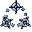

# Macro TechDrawTools
{{Macro
|Name=Macro TechDrawTools
|Icon=TechDraw_TechDrawTools.svg
|Description=TechDrawTools is a container, including 38 helper tools to improve the appearance of drawings.
|Author=edi and domad
|Date=2021-09-24
|Version=0.4.5
|FCVersion=<small>(v0.18)</small> 
|Download=[https://github.com/FreeCAD/FreeCAD-macros/blob/master/TechDraw/TechDrawTools.FCMacro]
}}

## Description

**TechDrawTools** macro is a **multilingual** container, including 38 helper tools to improve the appearance of drawings created in the TechDraw workbench.

All written user informations appear in English/German/Italian/French/Russian/Spanish depending on the selected FreeCAD language.

**There are tools to:**

-   create circle and bolt cicle center lines
-   draw cosmetic threads in ground and side view
-   create vertexes at intersection of elements
-   change attributes of center lines and cosmetic lines
-   change the number of decimal places of the dimension value
-   append special characters ahead of dimension values
-   create chain- and coordinate dimensions
-   position and cascade dimensions
-   create dimension/development of arches
-   create cosmetic circumferences
-   create a line cosmetic perpendicular
-   create a line cosmetic parallel
-   create a hole table
-   extend and shorten cosmetic lines
-   create a cosmetic line arch
-   position section view orthogonal to ancestor view
-   create an annotation showing the area

**Workflow:**

1.  Start the macro
2.  Select the desired line attributes and cascade spacing
3.  Change the *Tab* if needed
4.  Select any of the 38 tools

The macro stays open until it is closed.

## Using the tools 

The 38 tools are split into three tabs:

-   [Attributes and Modifications](Macro_TechDrawTools#Attributes_and_Modifications.md)
-   [Centerlines and Threading](Macro_TechDrawTools#Centerlines_and_Threading.md)
-   [Dimensions](Macro_TechDrawTools#Dimensions.md)

#### Select Line Attributes 

Before starting the work, select the desired line attributes. This is done by clicking the appropriate radio buttons in the boxes displayed in the *Attributes and Modifications* tab.

  

-   When creating a new line object, the preset line attributes will be used.
-   To change attributes of existing lines use the ** [Change the line attributes](void.md)** button.

#### Attributes and Modifications 

Tools setting/changing attributes and positions of objects.

-    ** [Extend a line](void.md)**Extend a line at both ends.

-    ** [Shorten a line](void.md)**Shorten a line at both ends.

-    ** [Lock/Unlock a view](void.md)**Lock/unlock a view.

-    ** [Orthogonal projection group: section view positioning](void.md)**Position a section view at same x or y as its base view.

-    ** [Position a horizontal chain dimension](void.md)**Arranges the selected horizontal dimensions at the same line.

-    ** [Position a vertical chain dimension](void.md)**Arranges the selected vertical dimensions at the same line.

-    ** [Position an oblique dimension chain](void.md)**Position an oblique dimension chain.

-    ** [Cascade horizontal dimensions](void.md)**Spaces (vertically) at the set value the selected horizontal dimensions.

-    ** [Cascade vertical dimensions](void.md)**Spaces (horizontally) at the set value the selected vertical dimensions.

-    ** [Cascade oblique dimensions](void.md)**Cascade oblique dimensions.

-    ** [Change the line attributes](void.md)**Change the attributes of the selected lines.

#### Centerlines and Threading 

Tools creating centerlines and threads.

-    ** [Draw circle centerlines](TechDraw_ExtensionCircleCenterLines.md)**Draw a centerline cross at circles.

-    ** [Draw bolt circle centerlines](TechDraw_ExtensionHoleCircle.md)**Draw the centerlines of a bolt circle.

-    ** [Create vertex(es) at intersection](TechDraw_ExtensionVertexAtIntersection.md)**Create the vertexes at the intersection of lines.

-    ** [Draw a cosmetic arc (center and two vertexes)](TechDraw_ExtensionDrawCosmArc.md)**Draw an arc rotating math. positive.

-    ** [Draw a cosmetic circunference (center and 2 vertexes)](void.md)**Draw a cosmetic arc.

-    ** [Create a line perpendicular to another line](void.md)**Create a perpendicular to another line through a vertex.

-    ** [Create a line parallel to another line](void.md)**Create a line parallel to another line through a vertex.

-    ** [Draw one center line](void.md)**Draw a center line between two lines.

-    ** [Cosmetic hole thread ground view](TechDraw_ExtensionThreadHoleBottom.md)**Draw cosmetic holes thread ground view.

-    ** [Screw/pin/shaft thread in plan](TechDraw_ExtensionThreadBoltBottom.md)**Draw a technical symbol of the thread in plant.

-    ** [Cosmetic thread side view](TechDraw_ExtensionThreadHoleSide.md)**Draw a cosmetic thread.

-    ** [Thread screw/pin/shaft side view/section](TechDraw_ExtensionThreadBoltSide.md)**Draw a technical symbol of the thread in side or section view.

#### Dimensions

Tools creating dimensions.

-    ** [Insert a '⌀' sign](Void.md)**Insert a \'⌀\'sign in a measure.

-    ** [Insert a '〼' sign](Void.md)**Insert a\'〼\'sign in a measure.

-    ** [Create horizontal chain dimensions](Void.md)**Create horizontal chain dimensions.

-    ** [Create vertical chain dimensions](Void.md)**Create vertical chain dimensions.

-    ** [Create an oblique chain dimension](Void.md)**Create an oblique chain dimension.

-    ** [Create horizontal coordinate dimensions](Void.md)**Create horizontal coordinate dimensions.

-    ** [Create vertical coordinate dimensions](Void.md)**Create vertical coordinate dimensions.

-    ** [Create an oblique coordinate dimension](Void.md)**Create an oblique coordinate dimension.

-    ** [Create a horizontal chamfer dimension](Void.md)**Create a horizontal chamfer dimension.

-    ** [Create a vertical chamfer dimension](Void.md)**Create a vertical chamfer dimension.

-    ** [Create development/length arc](Void.md)**Enter the development length of an arc with the symbol \'∩\'.

-    ** [Create a hole table](Void.md)**Create a hole table.

-    ** [Increase decimal places (max. 9)](Void.md)**Increase decimal places (max. 9).

-    ** [Decrease decimal places](Void.md)**Decrease decimal places.

-    ** [Create an annotation showing the area](Void.md)**Creates an anotation of the area value, the unit of which is determined by the preferences.

---
 [documentation index](../README.md) > Macro TechDrawTools
