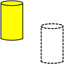

# Macro Toggle Drawstyle Optimized
{{Macro
|Name=Macro Toggle Drawstyle Optimized
|Description=Script optimized for all languages and to object selected or all objects. When working with FreeCAD there are times when you want to quickly change the Drawstyle of the object you are working with. This is available through the Drawstyle pull-down menu where any Drawstyle may be selected. This macro makes 2 of the Drawstyles available as a clickable button on a toolbar which the user may click to toggle back and forth between the two Drawstyles. See also: Toggle global display mode: [https://www.freecadweb.org/wiki/Macro_Toggle_Drawstyle_Optimized#Script_2 Macro_Toggle_Drawstyle_Optimized_2.FCMacro] Toggle selected object(s) display mode (changes visible only in global As is (located on View toolbar) display mode): [https://www.freecadweb.org/wiki/Macro_Toggle_Drawstyle_Optimized#Script_3 Macro_Toggle_Drawstyle_Optimized_3.FCMacro]
|Author=Piffpoof , triplus  
|Version=2.0
|Date=2020-29-01
|FCVersion=0.17 and above
|Download=[https://www.freecadweb.org/wiki/images/8/8c/Macro_Toggle_Drawstyle_Optimized.png ToolBar Icon]
|SeeAlso=[Macro Toggle Drawstyle](Macro_Toggle_Drawstyle.md) 
}}

## Description

Script optimized for all languages and to object selected or all objects.

Tree macro are available:

-   Combination that toggle global display mode when nothing is selected and/or toggle selected objects display mode if objects are selected. When objects are selected global display mode is automatically set to As is: [Macro\_Toggle\_Drawstyle\_Optimized.FCMacro](#Script.md) 
-   Toggle global display mode: [Macro\_Toggle\_Drawstyle\_Optimized\_2.FCMacro](#Script_2.md) 
-   Toggle selected object(s) display mode (changes visible only in global As is (located on View toolbar) display mode): [Macro\_Toggle\_Drawstyle\_Optimized\_3.FCMacro](#Script_3.md) 

When working with FreeCAD there are times when you want to quickly change the Drawstyle of the object you are working with. This is available through the Drawstyle pull-down menu where any Drawstyle may be selected. This macro makes 2 of the Drawstyles available as a clickable button on a toolbar which the user may click to toggle back and forth between the two Drawstyles.

## Installation

Installation is comprised of copying the two code to the appropriate Macro directory and invoking it from the Macro menu. It is much preferable to add it both to a toolbar so as to be more easily available.

-   see [How to install macros](How_to_install_macros.md) for information on how to install this macro code
-   see [Customize Toolbars](Customize_Toolbars.md) for information how to install as a button on a toolbar

## Usage

Select an object, then click on the associated toolbar button, or invoke from the Macro menu. The Drawstyle of the slected object will toggle between the two drawstyles specified in the macro code (see code listing below).

## Script

Combination that toggle global display mode when nothing is selected and/or toggle selected objects display mode if objects are selected. When objects are selected global display mode is automatically set to As is:

The icon ToolBar 

**Macro\_Toggle\_Drawstyle\_Optimized.FCMacro**

{{MacroCode|code=
# triplus @ 2016, 2020
# Toggle object/global display mode
# ==============================

# 0 = "As is"
# 1 = "Flat lines"
# 2 = "Shaded
# 3 = "Wireframe"
# 4 = "Points"
# 5 = "Hidden line"
# 6 = "No shading"

globalA = 0
globalB = 3

a = "Flat Lines"
b = "Shaded"
c = "Wireframe"
d = "Points"

objectA = a
objectB = c

# ==============================

from PySide import QtGui
import FreeCADGui as Gui

mw = Gui.getMainWindow()
sel = Gui.Selection.getSelectionEx()

act = {
    0: mw.findChild(QtGui.QAction, "Std_DrawStyleAsIs"),
    1: mw.findChild(QtGui.QAction, "Std_DrawStyleFlatLines"),
    2: mw.findChild(QtGui.QAction, "Std_DrawStyleShaded"),
    3: mw.findChild(QtGui.QAction, "Std_DrawStyleWireframe"),
    4: mw.findChild(QtGui.QAction, "Std_DrawStylePoints"),
    5: mw.findChild(QtGui.QAction, "Std_DrawStyleHiddenLine"),
    6: mw.findChild(QtGui.QAction, "Std_DrawStyleNoShading"),
}

default = act[0]
actionA = act[globalA]
actionB = act[globalB]

if sel:
    obj = []
    default.trigger()
    for s in sel:
        if s.Object.TypeId == "App::Link":
            if s.Object.LinkedObject not in obj:
                obj.append(s.Object.LinkedObject)
        elif s.Object not in obj:
            obj.append(s.Object)
        else:
            pass

    for o in obj:
        if o.ViewObject.DisplayMode == objectA:
            o.ViewObject.DisplayMode = objectB
        else:
            o.ViewObject.DisplayMode = objectA
else:
    if actionA.isChecked():
        actionB.trigger()
    else:
        actionA.trigger()

}}

## Script 2 

Toggle global display mode: 

The icon ToolBar 

**Macro\_Toggle\_Drawstyle\_Optimized\_2.FCMacro**

{{MacroCode|code=
# triplus @ 2016, 2020
# Toggle global display mode
# ==============================

# 0 = "As is"
# 1 = "Flat lines"
# 2 = "Shaded
# 3 = "Wireframe"
# 4 = "Points"
# 5 = "Hidden line"
# 6 = "No shading"

styleA = 0
styleB = 3

# ==============================

from PySide import QtGui
import FreeCADGui as Gui

mw = Gui.getMainWindow()

act = {
    0: mw.findChild(QtGui.QAction, "Std_DrawStyleAsIs"),
    1: mw.findChild(QtGui.QAction, "Std_DrawStyleFlatLines"),
    2: mw.findChild(QtGui.QAction, "Std_DrawStyleShaded"),
    3: mw.findChild(QtGui.QAction, "Std_DrawStyleWireframe"),
    4: mw.findChild(QtGui.QAction, "Std_DrawStylePoints"),
    5: mw.findChild(QtGui.QAction, "Std_DrawStyleHiddenLine"),
    6: mw.findChild(QtGui.QAction, "Std_DrawStyleNoShading"),
}

actionA = act[styleA]
actionB = act[styleB]

if actionA.isChecked():
    actionB.trigger()
else:
    actionA.trigger()
}}

## Script 3 

Toggle selected object(s) display mode (changes visible only in global As is (located on View toolbar) display mode):

 The icon ToolBar 

**Macro\_Toggle\_Drawstyle\_Optimized\_3.FCMacro**

{{MacroCode|code=
# triplus @ 2016, 2020
# Toggle selected object(s) display mode
# ==============================

a = "Flat Lines"
b = "Shaded"
c = "Wireframe"
d = "Points"

styleA = a
styleB = c

# ==============================

from PySide import QtGui
import FreeCADGui as Gui

obj = []
mw = Gui.getMainWindow()
sel = Gui.Selection.getSelectionEx()
mw.findChild(QtGui.QAction, "Std_DrawStyleAsIs").trigger()

for s in sel:
    if s.Object.TypeId == "App::Link":
        if s.Object.LinkedObject not in obj:
            obj.append(s.Object.LinkedObject)
    elif s.Object not in obj:
        obj.append(s.Object)
    else:
        pass

for o in obj:
    if o.ViewObject.DisplayMode == styleA:
        o.ViewObject.DisplayMode = styleB
    else:
        o.ViewObject.DisplayMode = styleA
}}

## Link

The Forum link (2016-11-27 ver:1.0 FC =\< 0.17) : [Keyboard shortcut, View toolbar - Wireframe](https://forum.freecadweb.org/viewtopic.php?f=3&t=14336&start=40#p146239)

The Forum link (2020-29-01 ver:2.0 FC =\> 0.17) : [Keyboard shortcut, View toolbar - Wireframe](https://forum.freecadweb.org/viewtopic.php?f=3&t=14336&start=50#p364692)

---
 [documentation index](../README.md) > Macro Toggle Drawstyle Optimized
