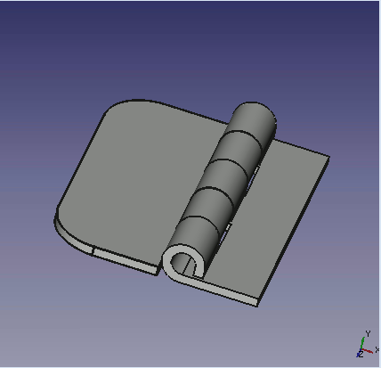

# Macro hinge
{{Macro
|Name=Simulates hinge movement
|Icon=Macro hinge.png
|Description=Hinge simulation.
|Author=Mario52
|Version=1.0
|Date=2014-09-09
|FCVersion=All
|Download=The File [http://forum.freecadweb.org/download/file.php?id=7628 20140908b_Hinge-1.fcstd] [https://www.freecadweb.org/wiki/images/a/a8/Macro_hinge.png ToolBar Icon]
}}

## Description

Simulates hinge movement

## Uses

Open the 2 files (20140908b_Hinge-1.FCMacro and 20140908b_Hinge-1.FCStd) in FreeCAD with 2 screens (Menu: Windows \> Tile) and click in the window and the macro and click F6 (debug macro) to run the macro or run the macro with 

## The File 

 [20140908b_Hinge-1.fcstd](http://forum.freecadweb.org/download/file.php?id=7628) 

## Script

 ToolBar Icon 

**20140908b_Hinge-1.FCMacro**

{{MacroCode|code=
import FreeCAD, FreeCADGui, Draft, Part
from FreeCAD import Base
import time

ii = 0
pas = 0
for ii2 in range(180):
    if pas == 0:
        if ii > 90:
            pas = 1
        ii += 5
    else:
        if ii < 1:
            pas = 0
        ii -= 5
   
    App.getDocument("_0140908b_Hinge_1").Fusion.Placement=App.Placement(App.Vector(0,0,0), App.Rotation(App.Vector(0,0,1),ii), App.Vector(44.4,6.9,0))
    App.Console.PrintMessage(str(ii2)+"  " + str(ii)+"  " + str(pas) +"\n")
    Gui.updateGui()
    time.sleep(0) #modify the time here

}}

## Link

The discussion page [Struggling with LinearPattern (again)](http://forum.freecadweb.org/viewtopic.php?f=3&t=7606&p=62086#p62086)

---
 [documentation index](../README.md) > Macro hinge
