# Manual:Modeling for product design

  

{{Manual:TOC}}

[Product design](https://en.wikipedia.org/wiki/Product_design) is originally a commercial term, but in the 3D world, it often means modeling something with the idea to have it [3D-printed](https://en.wikipedia.org/wiki/3D_printing) or, more generally, manufactured by a machine, for example a 3D printer or a [CNC machine](https://en.wikipedia.org/wiki/Numerical_control).

When you print objects in 3D, it is of ultimate importance that your objects are **solid**. As they will become real, solid objects, this is obvious. Nothing prevents them from being hollow inside, of course. But you always need to have a clear notion of which point is inside the material, and which point is outside, because the 3D printer or the CNC machine needs to know exactly what is filled with material and what is not. For this reason, in FreeCAD, the [PartDesign Workbench](PartDesign_Workbench.md) is the perfect tool to build such pieces, because it will always take care for you that your objects stay solid and buildable.

To illustrate how the PartDesign Workbench works, let\'s model this well-known piece of [Lego](https://en.wikipedia.org/wiki/Lego):

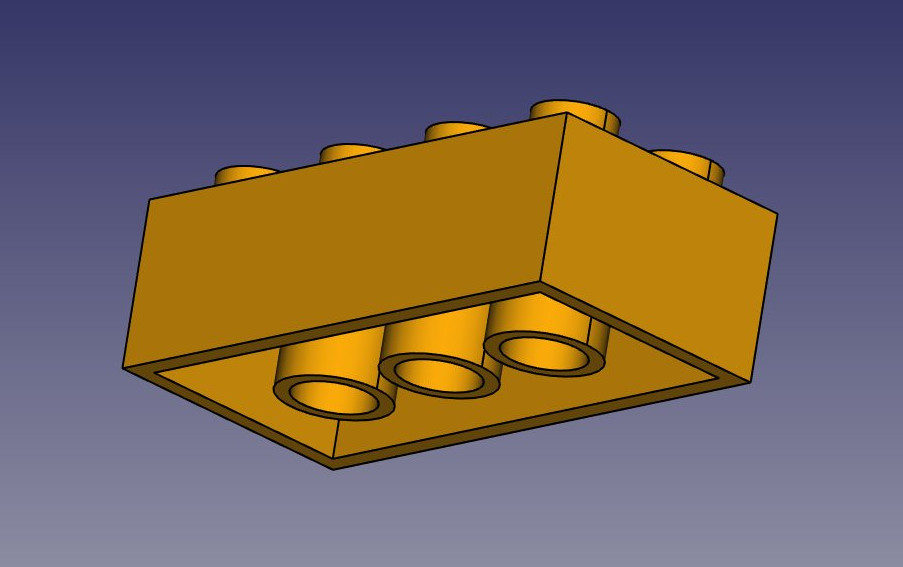

The cool thing with Lego pieces is that the dimensions are easy to obtain on the Internet, at least for the standard pieces. These are pretty easy to model and print on a 3D printer, and with a bit of patience (3D printing often requires much adjustment and fine-tuning) you can make pieces that are totally compatible and click perfectly into original Lego blocks. In the example below, we will make a piece that is 1.5 times bigger than the original.

We will now use exclusively the [Sketcher](Sketcher_Workbench.md) and [PartDesign](PartDesign_Workbench.md) tools. Since all the tools from the Sketcher Workbench are also included in the Part Design Workbench, we can stay in Part Design and we will not need to switch back and forth between the two.

Part Design objects are fully based on **Sketches**. A Sketch is a 2D object, made of linear segments (lines, arcs of circle or ellipses) and constraints. These constraints can be applied either on linear segments or on their endpoints or center points, and will force the geometry to adopt certain rules. For example, you can place a vertical constraint on a line segment to force it to stay vertical, or a position (lock) constraint on an endpoint to prohibit it to move. When a sketch has an exact amount of constraints that prohibits any point of the sketch to be moved anymore, we talk about a fully constrained sketch. When there are redundant constraints, that could be removed without allowing the geometry to be moved, it is called over-constrained. This should be avoided, and FreeCAD will notify you if such a case occurs.

Sketches have an edit mode, where their geometry and constraints can be changed. When you are done with editing, and leave edit mode, sketches behave like any other FreeCAD object, and can be used as building blocks for all the Part Design tools, but also in other workbenches, such as [Part](Part_Workbench.md) or [Arch](Arch_Workbench.md). The [Draft workbench](Draft_Workbench.md) also has a tool that converts Draft objects to Sketches, and vice-versa.

-   Let\'s start by modeling a cubic shape that will be the base of our Lego brick. Later on we will carve the insides, and add the 8 dots on top of it. So let\'s start this by making a rectangular sketch that we will then extrude:
-   Switch to the [PartDesign Workbench](PartDesign_Workbench.md)
-   Click on the  [New Sketch](Sketcher_NewSketch.md) button. A dialog will appear asking where you want to lie the sketch, choose the **XY** plane, which is the \"ground\" plane. The sketch will be created and will immediately be switched to edit mode, and the view will be rotated to look at your sketch orthogonally.
-   Now we can draw a rectangle, by selecting the  [Rectangle](Sketcher_CreateRectangle.md) tool and clicking 2 corner points. You can place the two points anywhere, since their correct location will be set in the next step.
-   You will notice that a couple of constraints have automatically been added to our rectangle: the vertical segments have received a vertical constraint, the horizontal ones a horizontal constraint, and each corner a point-on-point constraint that glues the segments together. You can experiment moving the rectangle around by dragging its lines with the mouse, all the geometry will keep obeying the constraints.

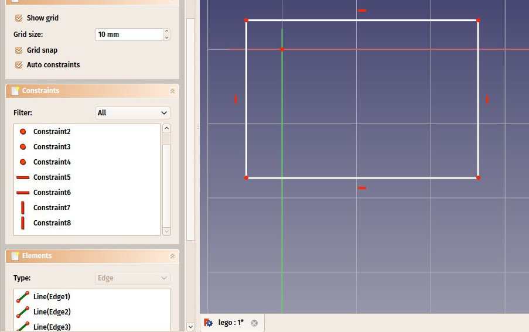

-   Now, let\'s add three more constraints:
    -   Select one of the vertical segments and add a  [Vertical Distance Constraint](Sketcher_ConstrainDistanceY.md). Give it a size of 23.7mm.
    -   Select one of the horizontal segments and add a  [Horizontal Distance Constraint](Sketcher_ConstrainDistanceX.md). Make it 47.7mm.
    -   Finally, select one of the corner points, then the origin point (which is the dot at the crossing of the red and green axes), then add a  [Coincident Constraint](Sketcher_ConstrainCoincident.md). The rectangle will then jump to the origin point, and your sketch will turn green, meaning it is now fully constrained. You can try moving its lines or points, nothing will move anymore.

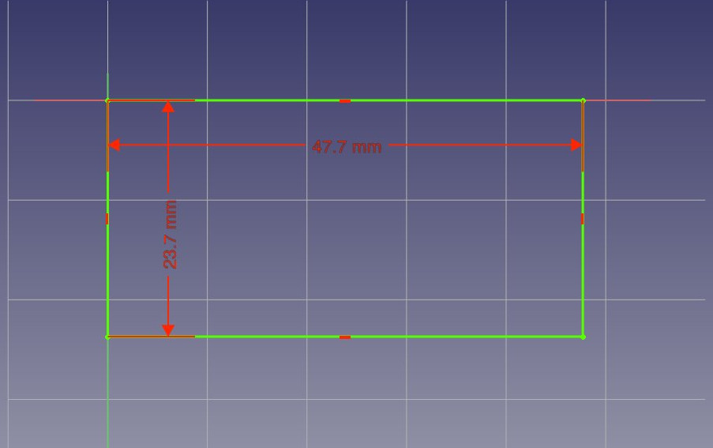

Note that the last point-on-point constraint was not absolutely necessary. You are never forced to work with fully constrained sketches. However, if we are going to print this block in 3D, it will be necessary to maintain our piece close to the origin point (which will be the center of the space where the printer head can move). By adding that constraint we are making sure that our piece will always stay \"anchored\" to that origin point.

-   Our base sketch is now ready, we can leave edit mode by pressing the **Close** button on top of its task panel, or simply by pressing the **Escape** key. If needed later on, we can reenter edit mode anytime by double-clicking the sketch in the tree view.
-   Let\'s extrude it by using the  [Pad](PartDesign_Pad.md) tool, and giving it a distance of 14.4mm. The other options can be left at their default values:

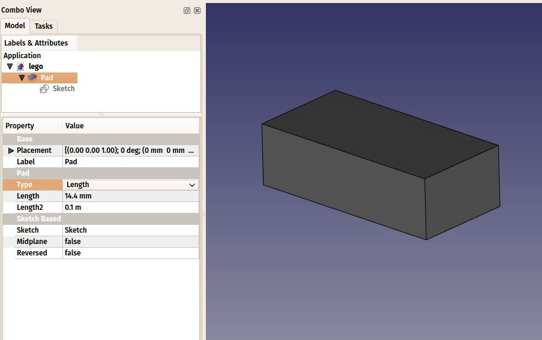

The **Pad** behaves very much like the [Extrude](Part_Extrude.md) tool that we used in the previous chapter. There are a couple of differences, though, the main one being that a pad cannot be moved. It is attached forever to its sketch. If you want to change the position of the pad, you must move the base sketch. In the current context, where we want to be sure nothing will move out of position, this is an additional security.

-   We will now carve the inside of the block, using the  [Pocket](PartDesign_Pocket.md) tool, which is the PartDesign version of [Part Cut](Part_Cut.md). To make a pocket, we will create a sketch on the bottom face of our block, which will be used to remove a part of the block.
-   With the bottom face selected, press the  [New sketch](Sketcher_NewSketch.md) button.
-   Draw a rectangle on the face.

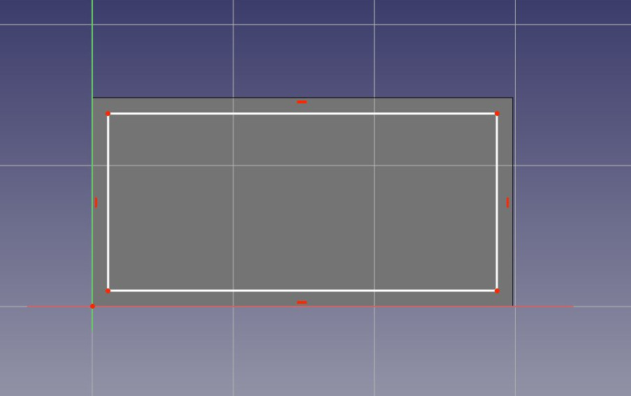

-   We will now constrain the rectangle in relation to the bottom face. To do this, we need to \"import\" some edges of the face with the  [External geometry](Sketcher_External.md) tool. Use this tool on the two vertical lines of the bottom face:

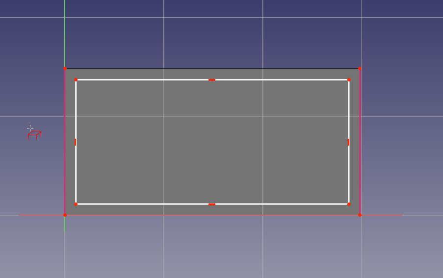

You will notice that only edges from the base face can be added by this tool. When you create a sketch with a face selected, a relation is created between that face and the sketch, which is important for further operations. You can always remap a sketch to another face later with the  [Map sketch](Sketcher_MapSketch.md) tool.

-   The external geometry is not \"real\", it will be hidden when we leave edit mode. But we can use it to place constraints. Place the 4 following constraints:
    -   Select the top left point of the rectangle and the top point of the imported line and add a  [Horizontal Distance Constraint](Sketcher_ConstrainDistanceX.md) of 1.8mm
    -   Select again the top left point of the rectangle and the top point of the imported line and add a  [Vertical Distance Constraint](Sketcher_ConstrainDistanceY.md) of 1.8mm
    -   Select the bottom right point of the rectangle and the bottom point of the right imported line and add a  [Horizontal Distance Constraint](Sketcher_ConstrainDistanceX.md) of 1.8mm
    -   Select again the bottom right point of the rectangle and the bottom point of the right imported line and add a  [Vertical Distance Constraint](Sketcher_ConstrainDistanceY.md) of 1.8mm

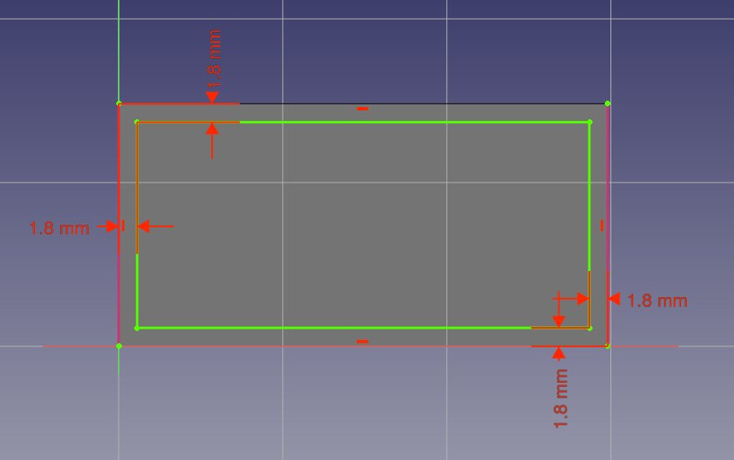

-   Leave edit mode and we can now perform the pocket operation: With the sketch selected, press the  [Pocket](PartDesign_Pocket.md) button. Give it a length of 12.6mm, which will leave the upper face of our pad with a thickness of 1.8mm (remember, the total height of our pad was 14.4mm).

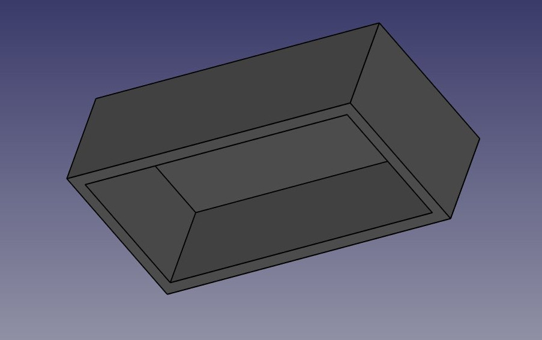

-   We will now attack the 8 dots on the top face. To do this, since they are a repetition of a same feature, we will use the handy  [Linear pattern](PartDesign_LinearPattern.md) tool of the Part Design Workbench, which allows to model once and repeat the shape.
-   Start by selecting the top face of our block
-   Create a  [New sketch](Sketcher_NewSketch.md).
-   Create two  [circles](Sketcher_CreateCircle.md).
-   For each circle, select it and add a  [Radius Constraint](Sketcher_ConstrainRadius.md) of 3.6mm to each of them
-   Import the left edge of the base face with the  [External geometry](Sketcher_External.md) tool.
-   Place two vertical constraints and two horizontal constraints of 6mm between the center point of each circle and the corner points of the imported edge, so each circle has its center at 6mm from the border of the face:

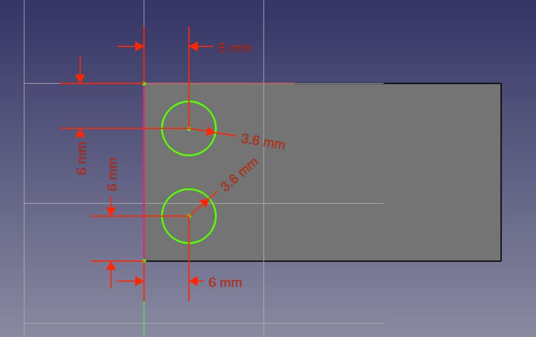

-   Notice how, once again, when you lock the position and dimension of everything in your sketch, it becomes fully constrained. This always keeps you on the safe side. You could change the first sketch now, everything we did afterwards would keep tight.
-   Leave edit mode, select this new sketch, and create a  [Pad](PartDesign_Pad.md) of 2.7mm:

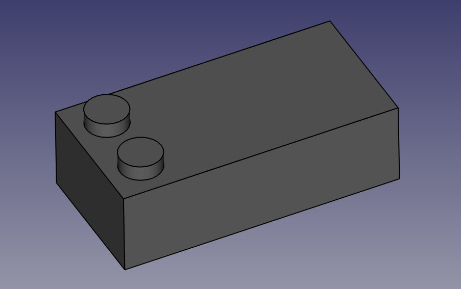

-   Notice that, as earlier with the pocket, since we used the top face of our base block as a base for this latest sketch, any PartDesign operation we do with this sketch will correctly be built on top of the base shape: The two dots are not independent objects, they have been extruded directly from our brick. This is the great advantage of working with the Part Design Workbench, as long as you take care of always building one step on top of the previous one, you are actually building one final solid object.
-   We can now duplicate our two dots four times, so we get eight. Select the latest Pad we just created.
-   Press the  [Linear pattern](PartDesign_LinearPattern.md) button.
-   Give it a length of 36mm (which is the total \"span\" we want our copies to fit in), in the \"horizontal sketch axis\" direction, and make it 4 occurrences:

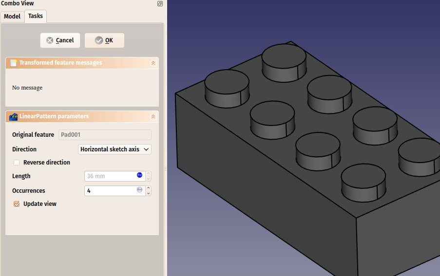

-   Once again, see that this is not just a duplication of an object, it is a \*feature\* of our shape that has been duplicated, the final object is still only one solid object.
-   Now let\'s work on the three \"tubes\" that fill the void we created on the bottom face. We have several possibilities: create a sketch with three circles, pad it then pocket it three times, or create a base sketch with one circle inside the other and pad it to form the complete tube already, or even other combinations. Like always in FreeCAD, there are many ways to achieve the same result. Sometimes one way will not work the way we want, and we must try other ways. Here, we will take the safest approach, and do things one step at a time.
-   Select the face that is at the bottom of the hollow space we carved earlier inside the block.
-   Create a new sketch, add a circle with a radius of 4.8825mm, import the left border of the face, and constrain it vertically and horizontally at 10.2mm from the upper corner of the face:

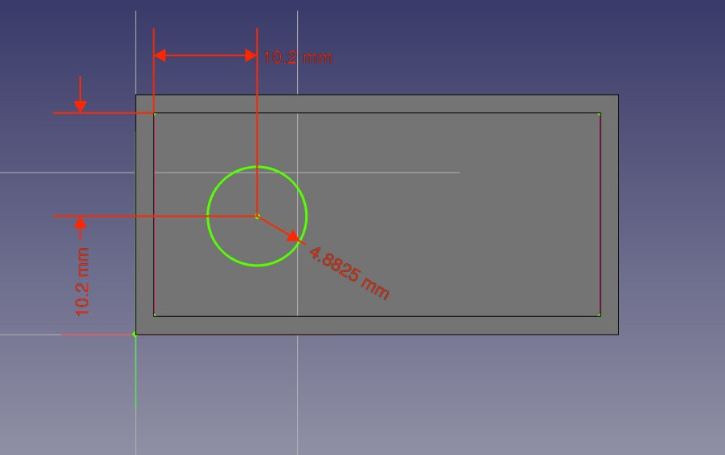

If you have trouble to select features hiding part of the model can help. To hide a feature select it from tree view and press Space-key to toggle visibility.

-   Leave edit mode, and pad this sketch with a distance of 12.6mm
-   Create a linear pattern from this last pad, give it a length of 24mm and 3 occurrences. We now have three filled tubes filling the hollow space:

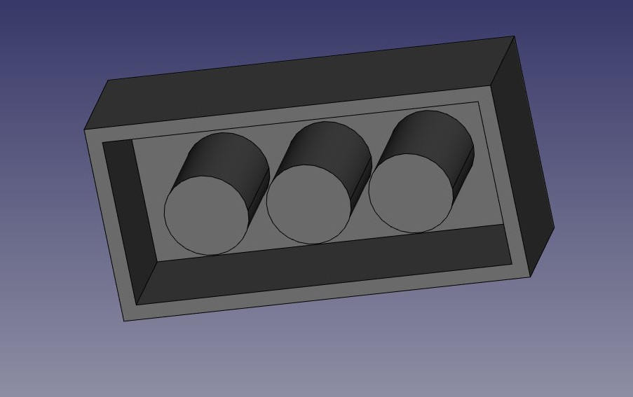

-   Now let\'s make the final holes. Select the circular face of the first of our three \"pins\"
-   Create a new sketch, import the circular border of our face, create a circle with a radius constraint of 3.6mm, and add a  [Point on Point Constraint](Sketcher_ConstrainCoincident.md) between the center of the imported circle and our new circle. We now have a perfectly centered circle,and once again fully constrained:

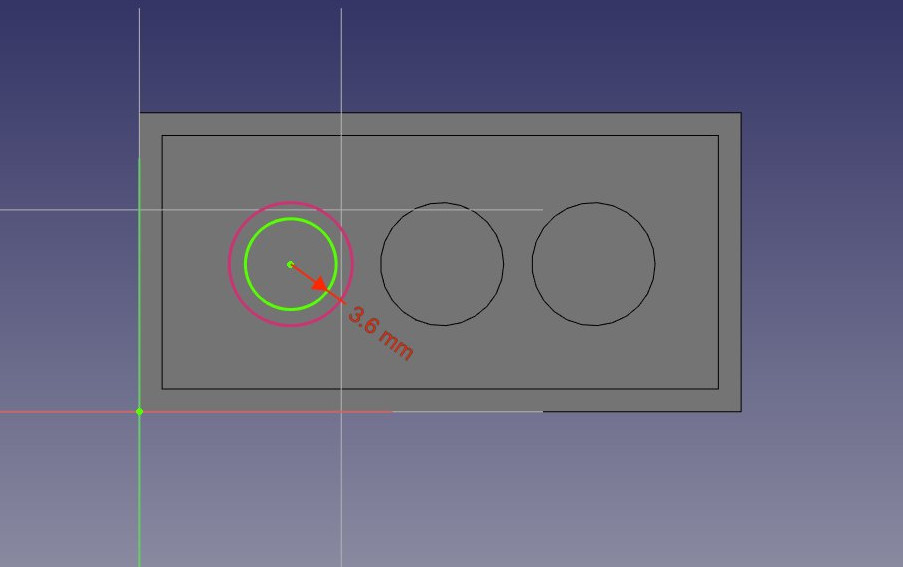

-   Leave edit mode, and create a pocket from this sketch, with a length of 12.6mm
-   Create a linear pattern from this pocket, with a length of 24mm and 3 occurrences. That\'s the last step, our piece of lego is now complete, so we can give it a nice color to mark our victory!

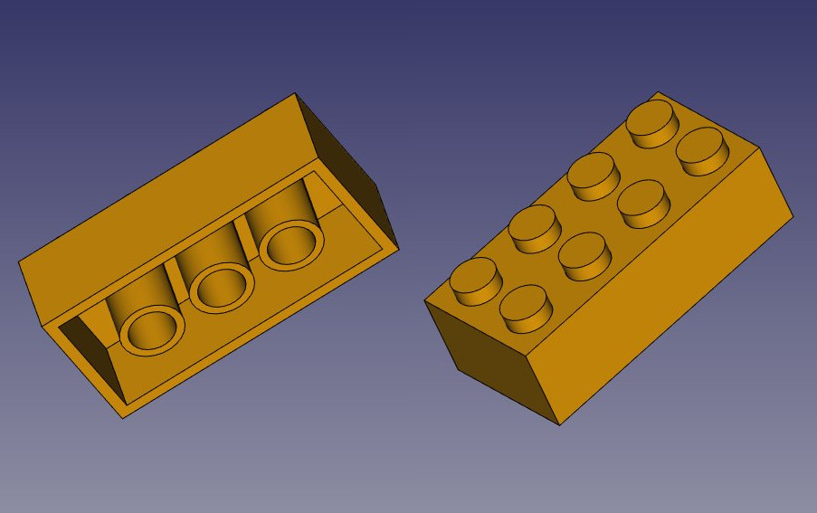

You will notice that our modeling history (what appears in the tree view) has become quite long. This is precious because every single step of what we did can be changed later on. Adapting this model for another kind of brick, for example one with 2x2 dots, instead of 2x4, would be a piece of cake, we would just need to change a couple of dimensions and the number of occurrences in linear patterns. We could as easily create bigger pieces that don\'t exist in the original Lego game.

But we could also want to get rid of the history, for example if we are going to model a castle with this brick, and we don\'t want to have this whole history repeated 500 times in our file.

There are two simple ways to get rid of the history, one is using the [Create simple copy](Part_SimpleCopy.md) tool from the [Part Workbench](Part_Workbench.md), which will create a copy of our piece that doesn\'t depend anymore on the history (you can delete the whole history afterwards), the other way is exporting the piece as a STEP file and reimporting it.

**Assembling**

But the best of both worlds also exists, which is the [Assembly2 Workbench](https://github.com/hamish2014/FreeCAD_assembly2), an addon that can be installed from the [FreeCAD-addons](https://github.com/FreeCAD/FreeCAD-addons) repository. This Workbench is named \"2\" because there is also an official built-in Assembly Workbench in development, which is not ready yet. The Assembly2 Workbench, however, already works very well to construct assemblies, and also features a couple of object-to-object constraints which you can use to constrain the position of one object in relation to another. In the example below, however, it will be quicker and easier to position the pieces using  [Draft Move](Draft_Move.md) and  [Draft Rotate](Draft_Rotate.md) than using the Assembly2 constraints.

-   Save the file as it is now
-   Install the [Assembly2 Workbench](https://github.com/hamish2014/FreeCAD_assembly2) and restart FreeCAD
-   Create a new empty document
-   Switch to the Assembly2 workbench
-   Press the **Import a part from another FreeCAD document** button
-   Select the file we saved above
-   The final piece will be imported in the current document. The Assembly2 workbench will determine automatically what is the final piece in our file that needs to be used, and the new object stays linked to the file. If we go back and modify the contents of the first file, we can press the **Update parts imported into the assembly** button to update the pieces here.
-   By using the **Import a part from another FreeCAD document** button several times, and moving and rotating the pieces (with the Draft tools or by manipulating their Placement property), we can quickly create a small assembly:

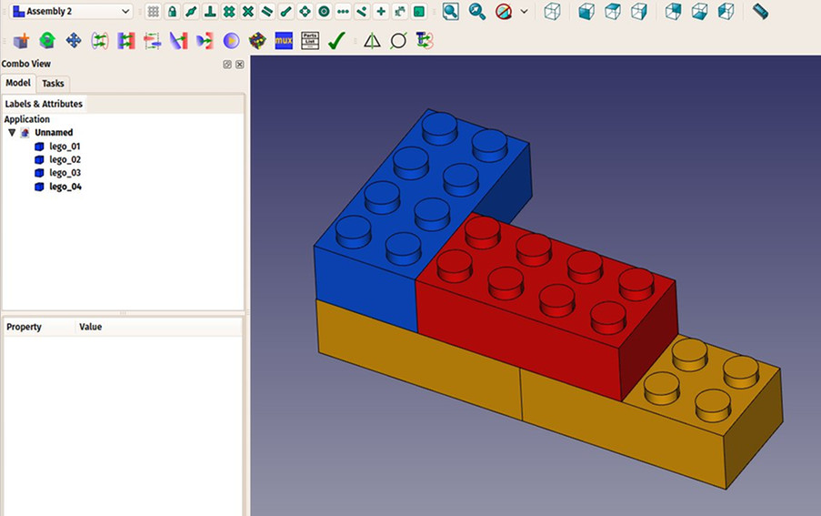

**Downloads**

-   The model produced during this exercise: <https://github.com/yorikvanhavre/FreeCAD-manual/blob/master/files/lego.FCStd>

**Read more**

-   [The Sketcher](Sketcher_Workbench.md)
-   [The Part Design Workbench](PartDesign_Workbench.md)
-   [The Assembly2 Workbench](https://github.com/hamish2014/FreeCAD_assembly2)

[Category:Tutorials](Category:Tutorials.md)
