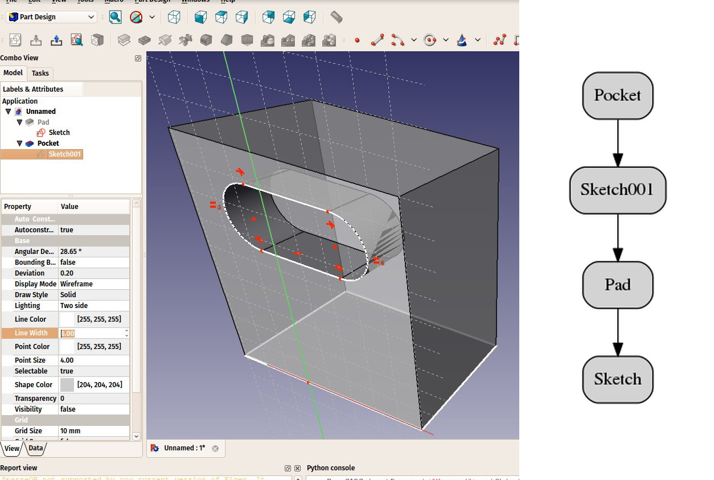

# Manual:Parametric objects
 

{{Manual:TOC}}

FreeCAD is designed for parametric modeling. This means that the geometry that you create, instead of being freely sculptable, is produced by rules and parameters. For example, a cylinder might be produced from a radius and a height. With these two parameters, the program has enough information to build the cylinder.

Parametric objects, in FreeCAD, are in reality small pieces of a program that run whenever one of the parameters has changed. Objects can have a lot of different kinds of parameters: numbers (integers like 1, 2, 3 or floating-point values like 3.1416), real-world sizes (1mm, 2.4m, 4.5ft), (x,y,z) coordinates, text strings (\"hello!\") or even another object.

This last type allows to quickly build complex chains of operations, each new object being based on a previous one, and adding new features to it.

In the example below, a solid, cubic object (Pad) is based on a rectangular 2D shape (Sketch) and has an extrusion distance. With these two properties, it produces a solid shape by extruding the base shape by the given distance. You can then use this object as a base for further operations, such as drawing a new 2D shape on one of its faces (Sketch001) and then making a subtraction (Pocket), until arriving at your final object.

All the intermediary operations (2D shapes, pad, pocket, etc) are still there, and you can still change any of their parameters anytime. The whole chain will be rebuilt (recomputed) whenever needed.

Two important things are necessary to know:

1.  Recomputation is not always automatic. Heavy operations, that might modify a big portion of your document, and therefore take some time, are not performed automatically. Instead, the object (and all the objects that depend on it) will be marked for recomputation (a small blue icon appears on them in the tree view). You must then press the recompute button (or **Edit->Refresh**) to have all the marked objects recomputed.
2.  The dependency tree must always flow in the same direction. Loops are forbidden. (See [DAG](Glossary#Directed_Acyclic_Graph.md), and [DAG view](DAG_view.md)) You can have object A which depends on object B which depend on object C. But you cannot have object A which depends on object B which depends on object A. That would be a circular dependency. However, you can have many objects that depend on the same object, for example objects B and C both depend on A. Menu **Tools -> Dependency graph** shows you a dependency diagram like on the image above. It can be useful to detect problems.

Not all objects are parametric in FreeCAD. Often, the geometry that you import from other files won\'t contain any parameter, and will be simple, non-parametric objects. However, these can often be used as a base, or starting point for newly created parametric objects, depending, of course, on what the parametric object requires and the quality of the imported geometry.

All objects, however, parametric or not, will have a couple of basic parameters, such as a Name, which is unique in the document and cannot be edited, a Label, which is a user-defined name that can be edited, and a [placement](placement.md), which holds its position in the 3D space.

Finally, it is worth noting that custom parametric objects are [easy to program in python](Scripted_objects.md).

**Read more**

-   [The properties editor](Property_editor.md)
-   [How to program parametric objects](Scripted_objects.md)
-   [Positioning objects in FreeCAD](Placement.md)
-   [Enabling the dependency graph](Std_DependencyGraph.md)

[Category:Poweruser Documentation](Category:Poweruser_Documentation.md) [Category:Tutorials](Category:Tutorials.md)
