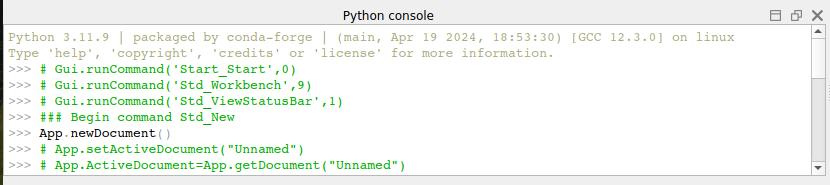
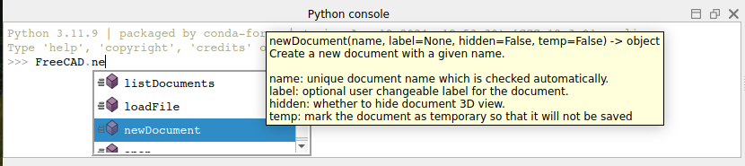
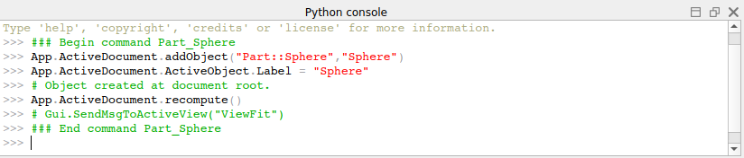

# Manual:A gentle introduction
[Python](https://en.wikipedia.org/wiki/Python_%28programming_language%29) is a widely-used, open-source programming language, recognized for its simplicity, versatility, and readability. It is often embedded in applications as a scripting language, and FreeCAD is no exception. This integration allows users to automate tasks, customize workflows, and extend the software's functionality far beyond its graphical interface.

Python offers several advantages that make it particularly suitable for FreeCAD users. It is beginner-friendly, with a clear and intuitive syntax that makes it easy to learn---even for individuals with no prior programming experience. This accessibility is especially valuable in the FreeCAD community, where many users come from diverse backgrounds, such as engineering, architecture, and design, without extensive coding expertise.

Additionally, Python\'s widespread adoption in other applications, such as [Blender](https://www.blender.org) for 3D modeling, [Inkscape](https://www.inkscape.org) for vector graphics, and [GRASS GIS](https://grass.osgeo.org) for geospatial analysis, makes it an essential skill for anyone looking to expand their scripting capabilities. Mastering Python in FreeCAD not only enhances your ability to create custom tools and macros but also provides transferable skills that can be applied across various software platforms.

In FreeCAD, Python scripting enables you to:

-   Automate repetitive tasks to save time and reduce errors.
-   Create custom parametric objects that dynamically adapt to changes.
-   Develop personalized macros and tools tailored to specific workflows.
-   Interact with FreeCAD's Application Programming Interface (API) to access and manipulate geometry, scenes, and user interface elements programmatically.

By leveraging Python, FreeCAD users can unlock the full potential of the software, transforming it into a powerful and flexible tool tailored to their unique needs.

FreeCAD includes an advanced Python console, accessible via **View → Panels → Python** Console. This tool lets users perform operations beyond the graphical interface, such as accessing advanced features, troubleshooting geometry, and automating tasks. It also logs Python commands for GUI actions if the option *Show script commands in Python console* is enabled under **Edit → Preferences → Python → Macro**). By keeping the console open, you can watch Python code unfold as you work, offering an intuitive way to learn the language while exploring FreeCAD\'s capabilities. Lastly, FreeCAD also has a [macros system](Macros.md), which allows you to record actions to be replayed later. This system also uses the Python console, by simply recording everything that is done in it.



In this chapter, we will discover very generally the Python language. If you are interested in learning more, the FreeCAD documentation wiki has an extensive section related to [Python programming](Power_users_hub.md).

### Writing Python code 

In FreeCAD, you can write Python code in two main ways: through the Python console (**View → Panels → Python Console**) or using the Macro editor (**Macro → Macros → Create**). The Python console allows you to enter commands one at a time, which are executed immediately upon pressing Return, making it perfect for quick testing or interactive exploration. The Macro editor, on the other hand, is used for writing and saving more complex scripts consisting of multiple lines of code. These macros can be executed as a whole later from the Macros window, providing a powerful way to automate repetitive tasks and extend FreeCAD\'s functionality. In this chapter, you will be able to use both methods, but it is highly recommended to use the Python Console since it will immediately inform you of any errors you make while typing.

If this is your first time using Python, consider reading this short [introduction to Python programming](Introduction_to_Python.md) before going any further, it will make the basic concepts of Python clearer.

### Manipulating FreeCAD objects 

Let\'s start by creating a new empty document:

 
```python
doc = FreeCAD.newDocument()
```

In the FreeCAD Python console, as soon as you type FreeCAD. (the word \"FreeCAD\" followed by a dot), an autocomplete window appears. This feature not only speeds up your workflow by suggesting available commands but also helps you discover new functions and features within FreeCAD. Each entry in the list includes a tooltip explaining its purpose, making it easier to understand and explore the available functionality. This autocomplete feature is especially helpful for beginners learning Python scripting and for advanced users navigating FreeCAD's extensive API efficiently. Take a moment to explore the options in the autocomplete window---you may uncover commands that simplify your workflow or open up new possibilities.



Typing **FreeCAD.newDocument()** creates a new, empty document in FreeCAD, just like clicking the **New Document** button in the toolbar. When you execute **doc = FreeCAD.newDocument()**, the new document object is assigned to the variable **doc**, allowing you to manipulate it programmatically. By using doc, you can add objects, change properties, or save the document.

In Python, the dot (.) is used to indicate that one element is contained within another. For example, **newDocument** is a function within the **FreeCAD module**, which is why we write FreeCAD.newDocument. The autocomplete window that appears shows everything available within the FreeCAD module. If you were to type a dot after newDocument (without adding the parentheses), it would display everything that belongs to the newDocument function. This illustrates how Python organizes and accesses objects and their components. It\'s important to note that the parentheses are mandatory when calling a Python function, as they signal the execution of the function.

Now let\'s get back to our document. Let\'s see what we can do with it. Type the following and explore the available options:

 
```python
doc.
```

In FreeCAD, the naming conventions for Python commands can help you understand their purpose:

-   Names that begin with an upper-case letter are typically attributes, which store values or data, such as properties of an object.
-   Names that begin with a lower-case letter are usually functions (also called methods), which perform actions or operations, such as creating or modifying objects.
-   Names that begin with an underscore (\_) are generally intended for internal use within the module and can usually be ignored.

This distinction helps you navigate FreeCAD's API and select the appropriate command for your needs. For example, you might use a method to add a new object to a document. The method performs the action of creating and adding the object, while attributes store the object\'s properties. Understanding this structure makes it easier to explore the functionality available, especially when using the autocomplete feature or reading tooltips. Let\'s add a box.

 
```python
box = doc.addObject("Part::Box", "myBox")
```

The command **box = doc.addObject(\"Part::Box\", \"myBox\")** adds a new 3D box object to the document. Here\'s a simple explanation:

-   **doc.addObject**: This tells FreeCAD to add a new object to the document.
-   **Part::Box**: This specifies the type of object to create, in this case, a 3D box.
-   **myBox**: This assigns a name to the new object, making it easier to identify and reference later.

The result of this command is that a box appears in the active document, and the variable box stores a reference to it so you can modify or interact with it later. Our box is added in the tree view, but nothing happens in the 3D view yet, because when working from Python, the document is never recomputed automatically. We must do that manually, whenever required:

 
```python
doc.recompute()
```

Now our box has appeared in the 3D view. Many of the toolbar buttons that add objects in FreeCAD actually do two things: add the object, and recompute. Try now adding a sphere with the appropriate button in the Part Workbench, and you will see the two lines of Python code being executed one after the other.



You can get a list of all possible object types like Part::Box:

 
```python
doc.supportedTypes()
```

Now let\'s explore the contents of our box:

 
```python
box.
```

You\'ll immediately see a couple of very interesting things such as:

 
```python
box.Height
```

This will print the current height of our box. Now let\'s try to change that:

 
```python
box.Height = 5
```

If you select your box with the mouse, you will see that in the properties panel, under the **Data** tab, our **Height** property appears with the new value. All properties of a FreeCAD object that appear in the **Data** and **View** tabs are directly accessible by Python too, by their names, like we did with the Height property. Data properties are accessed directly from the object itself, for example:

 
```python
box.Length
```

In FreeCAD, visual properties are managed by a **ViewObject**. Every FreeCAD object has an associated ViewObject, which stores information about how the object is displayed in the graphical interface, such as color, transparency, or visibility. However, the ViewObject is only accessible when FreeCAD is running with its graphical interface. If FreeCAD is launched in a non-graphical mode---such as from a terminal with the -c command line option or when used as a Python library in an external script---the ViewObject is not available. This is because there is no visual representation of the object in these modes, as the graphical interface is not loaded.

Try the following example to access the line color of our box:

 
```python
box.ViewObject.LineColor
```

### Vectors and Placements 

Vectors are a fundamental concept in any 3D application. A vector is essentially a list of three numbers (x, y, and z) that describe a point, position, or direction in 3D space. Vectors are crucial for defining geometry, transformations, and interactions in the 3D environment. They serve as building blocks for operations such as translations, rotations, and scaling.

In FreeCAD, vectors are used extensively for creating and manipulating objects. They enable a wide range of mathematical operations, such as addition, subtraction, cross products, dot products, and projections. These operations allow you to calculate distances, angles, and directions or define relationships between objects in space.

Understanding vectors and how they work is essential for effective scripting and customization in FreeCAD. For example, vectors are used to position objects, define their orientation, or even calculate the paths for complex operations like sweeps or lofts.

In FreeCAD, vectors are represented using the **Vector** class, which provides various methods and properties for performing operations and accessing their components. Mastering these capabilities will significantly enhance your ability to interact with FreeCAD's 3D environment programmatically. In FreeCAD vectors work like this:

 
```python
myvec = FreeCAD.Vector(2, 0, 0)
print(myvec)
print(myvec.x)
print(myvec.y)
othervec = FreeCAD.Vector(0, 3, 0)
sumvec = myvec.add(othervec)
```

Here is a short breakdown of the above commands:

-   **myvec = FreeCAD.Vector(2,0,0)**: Creates a vector myvec with X = 2, Y = 0, Z = 0.
-   **print(myvec)**: Prints the vector myvec with its components (X, Y, Z).
-   **print(myvec.x)**: Prints the X-component of myvec.
-   **print(myvec.y)**: Prints the Y-component of myvec.
-   **othervec = FreeCAD.Vector(0,3,0)**: Creates a second vector othervec with X = 0, Y = 3, Z = 0.
-   **sumvec = myvec.add(othervec)**: Adds myvec and othervec to create a new vector sumvec containing the sum of their components.

Another common feature of FreeCAD objects is their **Placement**. As we saw in earlier chapters, each object has a Placement property, which contains the position (Base) and orientation (Rotation) of the object. These properties are easy to manipulate from Python, for example, to move our object:

 
```python
print(box.Placement)
print(box.Placement.Base)
box.Placement.Base = sumvec
otherpla = FreeCAD.Placement()
otherpla.Base = FreeCAD.Vector(5, 5, 0)
box.Placement = otherpla
```

Here is a short breakdown of the above commands:

-   **print(box.Placement)**: Prints the placement of the box, which includes its position, rotation, and orientation in 3D space.
-   **print(box.Placement.Base)**: Prints the position (Base) of the box, which is a vector representing its location in 3D space.
-   **box.Placement.Base = sumvec**: Sets the base position (location) of the box to the vector sumvec, effectively moving the box to this new position.
-   **otherpla = FreeCAD.Placement()**: Creates a new placement object named otherpla.
-   **otherpla.Base = FreeCAD.Vector(5,5,0)**: Sets the base position of otherpla to a vector at coordinates (5, 5, 0).
-   **box.Placement = otherpla**: Applies otherpla to the box, updating its placement to the new position and orientation defined by otherpla.

**Read more**

-   [Python](https://www.python.org)
-   [Macros](Macros.md)
-   [Introduction to Python](Introduction_to_Python.md)
-   [Python scripting tutorial](Python_scripting_tutorial.md)
-   [Power users hub](Power_users_hub.md)


---
⏵ [documentation index](../README.md) > [Developer Documentation](Category_Developer%20Documentation.md) > [Python Code](Category_Python%20Code.md) > Manual:A gentle introduction
