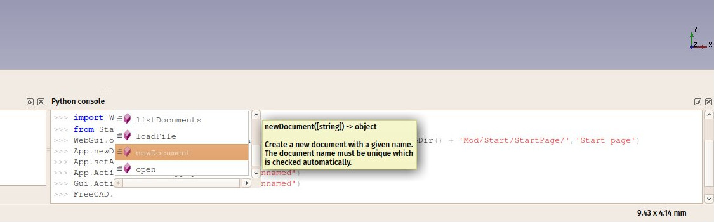

# Manual:A gentle introduction
{{Manual:TOC}}

[Python](https://en.wikipedia.org/wiki/Python_%28programming_language%29) is a popular, open source programming language, very often embedded in applications as a scripting language, as is the case with FreeCAD. It has a series of features that make it suitable for us FreeCAD users: It is very easy to learn, especially for people who had never programmed before, and it is embedded in many other applications. This make it a valuable tool to learn, as you will be able to use it in other software, such as [Blender](http://www.blender.org), [Inkscape](http://www.inkscape.org) or [GRASS](http://grass.osgeo.org/).

FreeCAD makes extensive use of Python. With it, you can access and control almost any feature of FreeCAD. For example, you can create new objects, modify their geometry, analyze their contents, or even create new interface controls, tools and panels. Some FreeCAD workbenches and most of the addon workbenches are fully programmed in Python. FreeCAD has an advanced Python console, available from menu **View-\>Panels-\>Python console**. It is often useful to perform operations for which there is no toolbar button yet, or to check shapes for problems, or to perform repetitive tasks:

But the Python console has another very important use: Every time you press a toolbar button, or perform other operations in FreeCAD, some Python code is printed in the console (if the option to **Show script commands in Python console** is enabled in **Edit → Preferences → General → Macro**) and executed. By leaving the Python console open, you can literally see the Python code unfold as you work, and in no time, almost without knowing it, you will find yourself learning some of the Python language.

FreeCAD also has a [macros system](Macros.md), which allows you to record actions to be replayed later. This system also uses the Python console, by simply recording everything that is done in it.

In this chapter, we will discover very generally the Python language. If you are interested in learning more, the FreeCAD documentation wiki has an extensive section related to [Python programming](Power_users_hub.md).

### Writing Python code 

There are two easy ways to write Python code in FreeCAD: From the Python console (**View → Panels → Python Console**), or from the Macro editor (**Tools → Macros → New**). In the console, you write Python commands one by one, which are executed when you press return, while macros can contain a more complex script made of several lines, which is executed only when the macro is launched from the same Macros window.

In this chapter, you will be able to use both methods, but it is highly recommended to use the Python Console, since it will immediately inform you of any errors you make while typing.

If this is your first time using Python, consider reading this short [introduction to Python programming](Introduction_to_Python.md) before going any further, it will make the basic concepts of Python clearer.

### Manipulating FreeCAD objects 

Let\'s start by creating a new empty document:

doc = FreeCAD.newDocument()

If you type this in the FreeCAD Python console, you will notice that as soon as you type \"FreeCAD.\" (the word FreeCAD followed by a dot), a window pops up, allowing you to quickly autocomplete the rest of the line. Even better, each entry in the autocomplete list has a tooltip explaining what it does. This makes it very easy to explore the functionality available. Before choosing \"newDocument\", have a look at the other options available.

As soon as you press **Enter** our new document will be created. This is similar to pressing the \"new document\" button on the toolbar. In Python, the dot is used to indicate something that is contained inside something else (newDocument is a function that is inside the FreeCAD module). The window that pops up therefore shows you everything that is contained inside \"FreeCAD\". If you would add a dot after newDocument, instead of the parentheses, it would show you everything that is contained inside the newDocument function. The parentheses are mandatory when you are calling a Python function, such as this one. We will illustrate that better below.

Now let\'s get back to our document. Let\'s see what we can do with it. Type the following and explore the available options:

doc.

Usually names that begin with an upper-case letter are attributes: they contain a value. Names that begin with a lower-case letter are functions (also called methods): they \"do something\". Names that begin with an underscore are usually there for the internal use of the module, and you should ignore them. Let\'s use one of the methods to add a new object to our document:

box = doc.addObject(\"Part::Box\",\"myBox\")

Our box is added in the tree view, but nothing happens in the 3D view yet, because when working from Python, the document is never recomputed automatically. We must do that manually, whenever required:

doc.recompute()

Now our box has appeared in the 3D view. Many of the toolbar buttons that add objects in FreeCAD actually do two things: add the object, and recompute. Try now adding a sphere with the appropriate button in the Part Workbench, and you will see the two lines of Python code being executed one after the other.

You can get a list of all possible object types like Part::Box:

doc.supportedTypes()

Now let\'s explore the contents of our box:

box.

You\'ll immediately see a couple of very interesting things such as:

box.Height

This will print the current height of our box. Now let\'s try to change that:

box.Height = 5

If you select your box with the mouse, you will see that in the properties panel, under the **Data** tab, our **Height** property appears with the new value. All properties of a FreeCAD object that appear in the **Data** and **View** tabs are directly accessible by Python too, by their names, like we did with the Height property. Data properties are accessed directly from the object itself, for example:

box.Length

View properties are stored inside a **ViewObject**. Each FreeCAD object possesses a ViewObject, which stores the visual properties of the object. When running FreeCAD without its Graphical Interface (for example when launching it from a terminal with the -c command line option, or using it from another Python script), the ViewObject is not available, since there is no visual at all.

Try the following example to access the line color of our box:

box.ViewObject.LineColor

### Vectors and Placements 

Vectors are a fundamental concept in any 3D application. It is a list of 3 numbers (x, y and z), describing a point or position in the 3D space. A lot of things can be done with vectors, such as additions, subtractions, projections and much more. In FreeCAD vectors work like this:

myvec = FreeCAD.Vector(2,0,0)

print(myvec)
print(myvec.x)
print(myvec.y)
othervec = FreeCAD.Vector(0,3,0)
sumvec = myvec.add(othervec)

Another common feature of FreeCAD objects is their **Placement**. As we saw in earlier chapters, each object has a Placement property, which contains the position (Base) and orientation (Rotation) of the object. These properties are easy to manipulate from Python, for example to move our object:

print(box.Placement)

print(box.Placement.Base)
box.Placement.Base = sumvec
otherpla = FreeCAD.Placement()
otherpla.Base = FreeCAD.Vector(5,5,0)
box.Placement = otherpla

**Read more**

-   [Python](https://www.python.org)
-   [Macros](Macros.md)
-   [Introduction to Python](Introduction_to_Python.md)
-   [Python scripting tutorial](Python_scripting_tutorial.md)
-   [Power users hub](Power_users_hub.md)

---
 [documentation index](../README.md) > [Developer Documentation](Category_Developer Documentation.md) > [Python Code](Category_Python Code.md) > Manual:A gentle introduction
