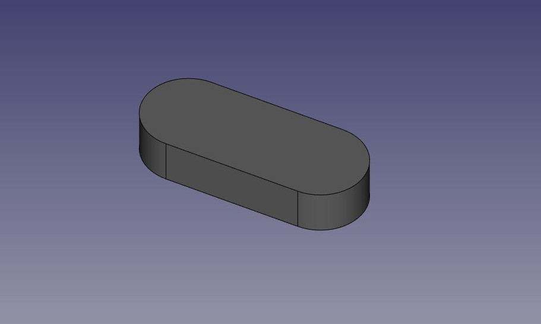
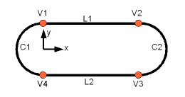
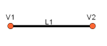
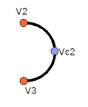

# Manual:Creating and manipulating geometry
{{Manual:TOC}}

In the previous chapters, we learned about the different workbenches of FreeCAD, and how each of them implement their own tools and geometry types. The same concept applies when working from Python code.

We also saw that the vast majority of FreeCAD workbenches depend on a very fundamental one: the [Part Workbench](Part_Workbench.md). In fact, many other workbenches, such as [Draft](Draft_Workbench.md) and [Arch](Arch_Workbench.md), do exactly what we will do in this chapter: use Python code to create and manipulate Part geometry.

So the first thing we need to do to work with Part geometry, is to do the Python equivalent to switching to the Part Workbench: import the Part module:

 
```python
import Part 
```

Take a minute to explore the contents of the Part module, by typing Part. and browsing through the different methods available. The Part module offers several convenient functions such as makeBox, makeCircle, etc\... which will instantly build an object for you. Try this, for example:

 
```python
Part.makeBox(3,5,7) 
```

When you press Enter after typing the line above, nothing will appear in the 3D view, but something like this will be printed on the Python Console:

 
```python
<Solid object at 0x5f43600> 
```

This is where an important concept takes place. What we created here is a Part Shape. It is not a FreeCAD document object (yet). In FreeCAD, objects and their geometry are independent. Think of a FreeCAD document object as a container, that will host a shape. Parametric objects will also have properties such as Length and Width, and will **recalculate** their Shape on-the-fly, whenever one of the properties changes. What we did here is calculate a shape manually.

We can now easily create a \"generic\" document object in the current document (make sure you have at least one new document open), and give it a box shape like the one we just made:

 
```python
boxShape = Part.makeBox(3,5,7)
myObj = FreeCAD.ActiveDocument.addObject("Part::Feature","MyNewBox")
myObj.Shape = boxShape
FreeCAD.ActiveDocument.recompute()
```

Note how we handled myObj.Shape. Notice that it is done exactly like we did it in the previous chapter, when we changed other properties of an object, such as box.Height = 5 . In fact, **Shape** is also a property, just like **Height**. Only it takes a Part Shape, not a number. In the next chapter we will have a better look at how these parametric objects are constructed.

For now, let\'s explore our Part Shapes in more detail. At the end of the chapter about [traditional modeling with the Part Workbench](Manual:Traditional_modeling,_the_CSG_way.md) we showed a table that explains how Part Shapes are constructed, and their different components (vertices, edges, faces, etc). The exact same components exist here and can be retrieved from Python. Part Shapes always have the following attributes: Vertexes, Edges, Wires, Faces, Shells and Solids. All of them are lists, that can contain any number of elements or be empty:

 
```python
print(boxShape.Vertexes)
print(boxShape.Edges)
print(boxShape.Wires)
print(boxShape.Faces)
print(boxShape.Shells)
print(boxShape.Solids)
```

For example, let\'s find the area of each face of our box shape above: (Make sure to indent the second line, as it appears below. Press Enter twice after the last line to run the Python command.)

 
```python
for f in boxShape.Faces:
   print(f.Area)
```

Or, for each edge, its start point and end point:

 
```python
for e in boxShape.Edges:
   print("New edge")
   print("Start point:")
   print(e.Vertexes[0].Point)
   print("End point:")
   print(e.Vertexes[1].Point)
```

As you see, if our boxShape has a \"Vertexes\" attribute, each Edge of the boxShape also has a \"Vertexes\" attribute. As we can expect, the boxShape will have 8 vertices, while the edge will only have 2, which are both part of the list of 8.

We can always check what is the type of a shape:

 
```python
print(boxShape.ShapeType)
print(boxShape.Faces[0].ShapeType)
print(boxShape.Vertexes[2].ShapeType)
```

So to resume the topic of Part Shapes: Everything starts with Vertices. With one or two vertices, you form an Edge (full circles have only one vertex). With one or more Edges, you form a Wire. With one or more closed Wires, you form a Face (the additional Wires become \"holes\" in the Face). With one or more Faces, you form a Shell. When a Shell is fully closed (watertight), you can form a Solid from it. And finally, you can join any number of Shapes of any types together, which is then called a Compound.

We can now try creating complex shapes from scratch, by constructing all their components one by one. For example, let\'s try to create a volume like this:



We will start by creating a planar shape like this:



First, let\'s create the four base points:

 
```python
V1 = FreeCAD.Vector(0,10,0)
V2 = FreeCAD.Vector(30,10,0)
V3 = FreeCAD.Vector(30,-10,0)
V4 = FreeCAD.Vector(0,-10,0)
```

Then we can create the two linear segments:



 
```python
L1 = Part.LineSegment(V1,V2)
L2 = Part.LineSegment(V4,V3)
```

Note that we didn\'t need to create Vertices. We could immediately create Part.LineSegments from FreeCAD Vectors. This is because here we haven\'t created Edges yet. A Part.LineSegment (as well as Part.Circle, Part.Arc, Part.Ellipse or Part.BSpline) does not create an Edge, but rather a base geometry on which an Edge will be created. Edges are always made from such a base geometry, which is stored in its Curve attribute. So if you have an Edge, doing:

 
```python
print(Edge.Curve) 
```

will show you what kind of Edge it is, i.e. if it\'s based on a line, an arc, etc\... But let\'s come back to our exercise, and build the arc segments. For this, we will need a third point, so we can use the convenient Part.Arc, which takes 3 points:



 
```python
VC1 = FreeCAD.Vector(-10,0,0)
C1 = Part.Arc(V1,VC1,V4)
VC2 = FreeCAD.Vector(40,0,0)
C2 = Part.Arc(V2,VC2,V3)
```

Now we have 2 lines (L1 and L2) and 2 arcs (C1 and C2). We need to turn them into edges:

 
```python
E1 = Part.Edge(L1)
E2 = Part.Edge(L2)
E3 = Part.Edge(C1)
E4 = Part.Edge(C2)
```

Alternatively, base geometries also have a toShape() function that does exactly the same thing:

 
```python
E1 = L1.toShape()
E2 = L2.toShape()
 ...
```

Once we have a series of Edges, we can now form a Wire, by giving it a list of Edges. We do need to pay attention to the order. Also, note the brackets.

 
```python
W = Part.Wire([E1,E4,E2,E3]) 
```

And we can check if our Wire was correctly understood, and that it is correctly closed:

 
```python
print( W.isClosed() ) 
```

Which will print \"True\" or \"False\". In order to make a Face, we need closed Wires, so it is always a good idea to check that before creating the Face. Now we can create a Face, by giving it a single Wire (or a list of Wires if we want holes):

 
```python
F = Part.Face(W) 
```

Then we extrude it:

 
```python
P = F.extrude(FreeCAD.Vector(0,0,10)) 
```

Note that P is already a Solid:

 
```python
print(P.ShapeType) 
```

This is because when we extrude a single Face, we always get a Solid. This wouldn\'t be the case, for example, if we had extruded the Wire instead:

 
```python
S = W.extrude(FreeCAD.Vector(0,0,10))
print(S.ShapeType)
```

Which will of course give us a hollow shell, with the top and bottom faces missing.

Now that we have our final Shape, we are anxious to see it on screen! So let\'s create a generic object, and assign our new Solid to it:

 
```python
myObj2 = FreeCAD.ActiveDocument.addObject("Part::Feature","My_Strange_Solid")
myObj2.Shape = P
FreeCAD.ActiveDocument.recompute()
```

Alternatively, the Part module also provides a shortcut that does the above operation quicker (but you cannot choose the name of the object):

 
```python
Part.show(P) 
```

All of the above, and much more, is explained in detail on the [Part Scripting](Topological_data_scripting.md) page, together with examples.

**Read more**:

-   [The Part Workbench](Part_Workbench.md)
-   [Part scripting](Topological_data_scripting.md)


---
⏵ [documentation index](../README.md) > [Developer Documentation](Category_Developer Documentation.md) > [Python Code](Category_Python Code.md) > Manual:Creating and manipulating geometry
