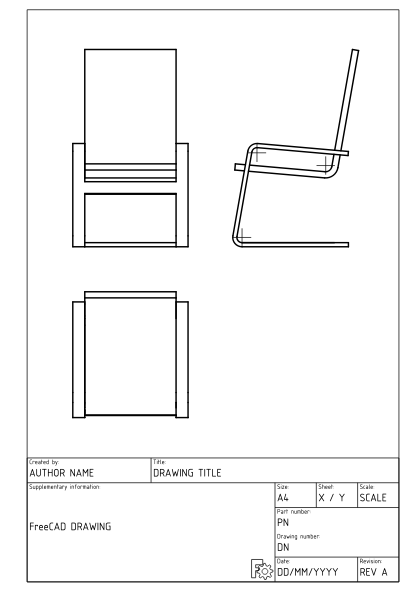

# Manual:Generating 2D drawings
{{Manual:TOC}}

When your model cannot be printed or milled directly by a machine, for example it is too big (a building) or it requires manual assembly after the pieces are ready, you will usually need to explain to another person how to do it. In technical fields (engineering, architecture, etc), this is usually done with drawings. The drawings are handed over to the person responsible for assembling the final product and will explain how to do it.

Typical examples are Ikea instructions, [architectural drawings](https://en.wikipedia.org/wiki/Architectural_drawing), and [blueprints](https://en.wikipedia.org/wiki/Blueprint). These drawings usually contain not only the drawing itself, but also many annotations, such as text, dimensions, numbers, and symbols that will help other people to understand what needs to be done and how.

In FreeCAD, the workbench responsible for making such drawings is the  [TechDraw Workbench](TechDraw_Workbench.md).

The TechDraw Workbench allows you to create sheets, which can be blank or use a pre-made [template](TechDraw_Templates.md) to already have a series of items on the sheet, such as borders and a title. On these sheets, you can then place views of the 3D objects you modeled previously, and configure how these views will appear on the sheet. You can also place all kinds of annotations on the sheet, such as dimensions, texts, and other symbols commonly used in technical drawings.

Drawing sheets, once complete, can be printed or exported as [SVG](https://en.wikipedia.org/wiki/Scalable_Vector_Graphics), PDF or [DXF](https://en.wikipedia.org/wiki/AutoCAD_DXF) files.

In the following exercise, we will see how to create a simple drawing of a chair model found in the [FreeCAD library](https://github.com/FreeCAD/FreeCAD-library) (Furniture → Chairs → IkeaLikeChair). The FreeCAD library can easily be added to your FreeCAD installation (refer to the [installing](Manual_Installing.md) chapter of this manual), or you can simply download the model from the library webpage, or via the direct link provided at the bottom of this chapter.

-   Load the IkeaLikeChair file from the library. You can choose between the .[FCStd](File_Format_FCStd.md) version, which will load the full modeling history, or the .[step](STEP.md) version, which will create only one object, without the history. Since we won\'t need to model any further now, it is best to choose the .step version, as it will be easier to manipulate.

-   Switch to the  [TechDraw Workbench](TechDraw_Workbench.md)
-   Press the  [TechDraw PageTemplate](TechDraw_PageTemplate.md) button.
-   Select the **A4\_Portrait\_ISO7200TD** template. A new tab will open in your FreeCAD window, showing the new page.
-   In the [tree view](tree_view.md) (or in the model tab), select the chair model. It will most likely be named something like \"Open CASCADE STEP translator.\"
-   Press the  [TechDraw View](TechDraw_View.md) button.
-   A View object will be created on our page. Select the view object in the tree view, and then give the view the following [properties](TechDraw_View#Properties.md) in the data tab of the combo view:
    -   Under the Base category:
        -   X: 70 mm
        -   Y: 120 mm
        -   Rotation: 0
        -   Scale: 0.1
    -   Under the Projection category (hit the drop down arrow to modify the x, y, and z components of these properties individually):
        -   Direction: \[0 0 1\]
        -   XDirection: \[0 -1 0\] (Change the y field first, then the x field)
-   We now have a nice top view of our chair. Hit the  [TechDraw ToggleFrame](TechDraw_ToggleFrame.md) button to turn the View frames, labels, and vertices off.

-   Let\'s repeat the operation twice, to create two more views. We will set their X and Y values, which indicate the position of the view on the page, in order to show them apart from the top view, and their direction, to create different view orientations. Give each new view the following properties:
    -   View001 (front view): X: 70, Y: 220, Scale: 0.1, Rotation: 0, Direction: (-1,0,0), XDirection: (0,-1,0)
    -   View002 (side view): X: 150, Y: 220, Scale: 0.1, Rotation: 0, Direction: (0,-1,0), XDirection: (1,0,0)
-   After that, we obtain the following page:

-   Note that there may be easier ways to get the views that you want. You can simply [rotate](Manual_Navigating_in_the_3D_view.md) the 3D view of your model, and once you have the view you want, select the model in the tree view and hit  New View. This will automatically insert a view with the desired rotation and direction properties. You can also use the  [TechDraw ProjectionGroup](TechDraw_ProjectionGroup.md) tool.

-   We can tweak the aspect of our views if we want, for example we can change their **Line Width** property (under the View tab in the Combo View) to 0.5.

We will now place dimensions and indications on our drawing. There are two ways to add dimensions to a model: one is placing the dimensions inside the 3D model, using the  [Dimension](Draft_Dimension.md) tool of the [Draft Workbench](Draft_Workbench.md), and then placing a view of these dimensions on our sheet with the  [TechDraw DraftView](TechDraw_DraftView.md) tool. The other is to do things directly on the TechDraw sheet. We\'ll use the latter method.

-   Hit the  Toggle button to turn the vertices on.
-   Use Ctrl + Left Mouse Click to select the two vertices you want to measure the distance between.
-   Hit the  [TechDraw LengthDimension](TechDraw_LengthDimension.md) button.

-   Repeat the operation, until all the dimensions you wish to indicate are placed. Use the  [TechDraw VerticalDimension](TechDraw_VerticalDimension.md) and  [TechDraw HorizontalDimension](TechDraw_HorizontalDimension.md) tools as necessary.
-   Take a minute to look at the [properties](TechDraw_LengthDimension#Properties.md) of the Dimension object in the Combo View.
-   Please note that if you are dimensioning an [axonometric](https://en.wikipedia.org/wiki/Axonometric_projection) view (e.g., isometric view) instead of a [multiview](https://en.wikipedia.org/wiki/Multiview_projection) view (e.g., front view) like we have done here, you will need to use the  [TechDraw LinkDimension](TechDraw_LinkDimension.md) tool to get an accurate dimension.

-   We will now place the two callouts shown in the image above, using the  [TechDraw Balloon](TechDraw_Balloon.md) tool.

1.  Looking at the Page in the [3D view](3D_view.md) window, select the View to which the Balloon will be attached, as shown in the image above.
2.  Press the  Balloon button.
3.  The cursor is now displayed as a balloon icon. Click on the page to place the balloon origin at the desired position.
4.  The balloon bubble may be dragged to the desired position.
5.  Change the balloon properties by double clicking the balloon label or the balloon object in the [tree view](Tree_view.md). This will open the Balloon Task dialog. Set the Value field to the desired text and change the Symbol drop-down menu selection to **None**
6.  Press **OK**
7.  Repeat the operation for the second callout.

-   We will now fill in the sheet title block.
    -   Make sure that the View frames, labels, and vertices are visible. If not, hit the  Toggle button.
    -   Edit the text in each section of the sheet title block by clicking on the small green square on the left side of the text.

Our page can now be exported to SVG for further work in graphical applications like [Inkscape](http://www.inkscape.org) or to DXF. Select the page in the [tree view](Tree_view.md) and then select menu **File → Export**. The DXF format is importable in almost all existing 2D CAD applications. TechDraw pages can also be directly printed or exported to PDF.

**Downloads**

-   The file created during this exercise: [drawing.FCStd](https://github.com/JoshuaCall/FreeCAD-manual/blob/master/files/drawing.FCStd)
-   The SVG sheet produced from that file: [drawing.svg](https://github.com/JoshuaCall/FreeCAD-manual/blob/master/files/drawing.svg)

**Read more**

-   [The TechDraw workbench](TechDraw_Workbench.md)
-   [Create custom templates](TechDraw_TemplateHowTo.md)
-   [Another TechDraw tutorial](Basic_TechDraw_Tutorial.md)
-   [The FreeCAD library](https://github.com/FreeCAD/FreeCAD-library)
-   [Inkscape](http://www.inkscape.org)

**Watch tutorials**

-   [Sliptonic\'s TechDraw playlist](https://www.youtube.com/watch?v=7LbOmSGW9F0&list=PLEuOia-QxyFKQnmM1U9yVo7eNrK_Mcln8)
-   [Symbols and Views](https://www.youtube.com/watch?v=cggBR1Ghq7k)

[ Tutorials](Category_Tutorials.md)

---
[documentation index](../README.md) > [Tutorials](Category_Tutorials.md) > Manual:Generating 2D drawings
