# Manual:Installing
FreeCAD is licensed under the [LGPL](https://en.wikipedia.org/wiki/GNU_Lesser_General_Public_License) license, which allows you to download, install, redistribute, and use it for any purpose, commercial or non-commercial, without any restrictions. You retain full ownership of the files you create.

FreeCAD operates consistently across Windows, macOS, and Linux, although the installation process varies by platform. For Windows and Mac users, the FreeCAD community offers ready-to-use precompiled installers. On Linux, the source code is provided to distribution maintainers who package the software for their specific systems. Typically, Linux users can install FreeCAD directly through their system's software manager.

The official FreeCAD download page can be found at the [FreeCAD download page](https://www.freecad.org/downloads.php). Additional information about the installation process can be found at the dedicated [download wiki](https://wiki.freecad.org/Download).

**FreeCAD versions**

The official stable releases of FreeCAD are available on the referenced download page and within your distribution\'s software manager. However, FreeCAD\'s development pace is brisk, with new features and bug fixes incorporated almost daily. Due to the extended periods between stable releases, you may want to experiment with more current, bleeding-edge versions of FreeCAD. These development versions, or pre-releases, can be found at the same download page. For users on Ubuntu or Fedora, the FreeCAD community also provides [PPA](https://launchpad.net/~freecad-maintainers/+archive/ubuntu/freecad-daily) (Personal Package Archives) and [copr](https://copr.fedorainfracloud.org/groups/g/freecad/coprs/) \'daily builds\', which are regularly updated with the latest developments.

If you plan to install FreeCAD on a virtual machine, be aware that its performance might be significantly impaired, and perhaps unusable, due to limited OpenGL support in many virtual machines.

### Installing on Windows 

1.  Download an installer (.exe) from the download page. The FreeCAD installers should work on any Windows version starting from Windows 7.
2.  Accept the terms of the LGPL license; this will be one of the few cases where you can really, safely click the \"accept\" button without reading the text. No hidden clauses: 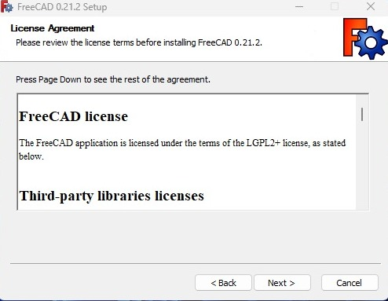
3.  You can leave the default path here, or change it if you wish: 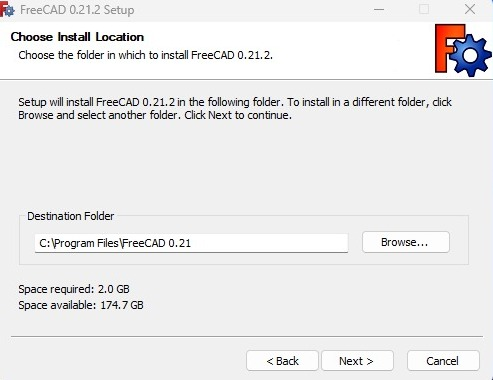
4.  Make sure to check all the components to install: 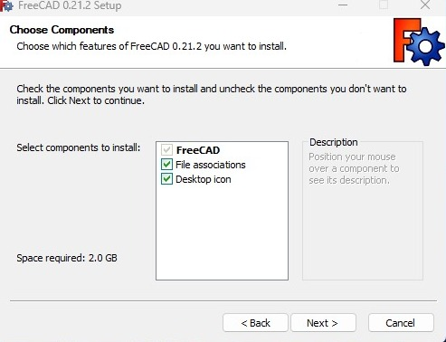
5.  That's it. The installation is now complete and you can start exploring the capabilities of FreeCAD.

**Installing a development version**

Packaging FreeCAD and developing an installer involves a considerable investment of time and effort. As a result, development versions (also referred to as pre-release versions) are typically delivered in the form of .zip or .7z archives located at the [FreeCAD download page](https://www.freecad.org/downloads.php). There\'s no need for a formal installation process with these files; simply extract the contents and start FreeCAD by double-clicking the FreeCAD.exe file located inside. This approach also enables you to maintain both the stable and the \"unstable\" versions on the same computer. It's like having both a dependable daily car and an experimental jet pack in your garage!

### Installing on Linux 

For users of modern Linux distributions such as Ubuntu, Fedora, openSUSE, Debian, Mint, and Elementary, installing FreeCAD is as simple as a single click. You can seamlessly install it through the software management tool provided by your distribution, though the appearance of these tools may differ from any illustrative images since each distribution employs its own distinct application.

1.  Open the software manager and search for \"freecad\":
2.  Click the \"install\" button and that\'s it, FreeCAD gets installed. Don\'t forget to rate it afterwards!
    

**Alternative ways**

One of the great pleasures of using Linux is the vast array of options available for customizing your software experience, so don\'t hold back. For users of Ubuntu and its derivatives, FreeCAD can be installed from a [PPA](https://launchpad.net/~freecad-maintainers) maintained by the FreeCAD community, which includes both stable and development versions. On Fedora, you can access the latest development versions of FreeCAD via [copr](https://copr.fedorainfracloud.org/groups/g/freecad/coprs/). Additionally, since FreeCAD is open source, you also have the freedom to [compile FreeCAD yourself](Compiling.md).

### Installing on Mac OS 

Installing FreeCAD on Mac OSX is nowadays as easy as on other platforms. However, since there are fewer people in the community who own a Mac, the available packages sometimes lag a few versions behind the other platforms.

1.  Download a zipped package corresponding to your version.
2.  Open the Downloads folder, and expand the downloaded zip file: 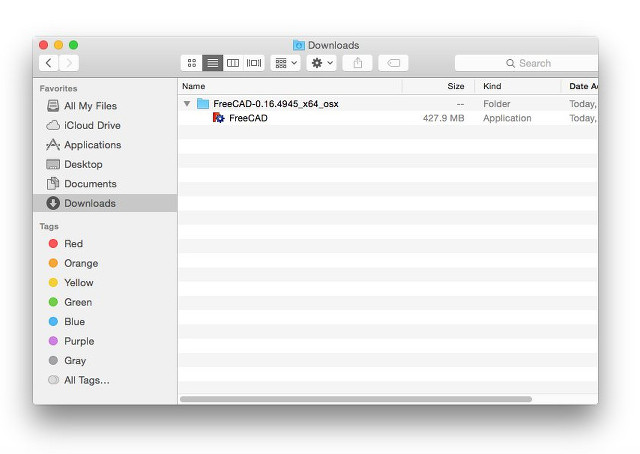
3.  Drag the FreeCAD application from inside the zip to the Applications folder: 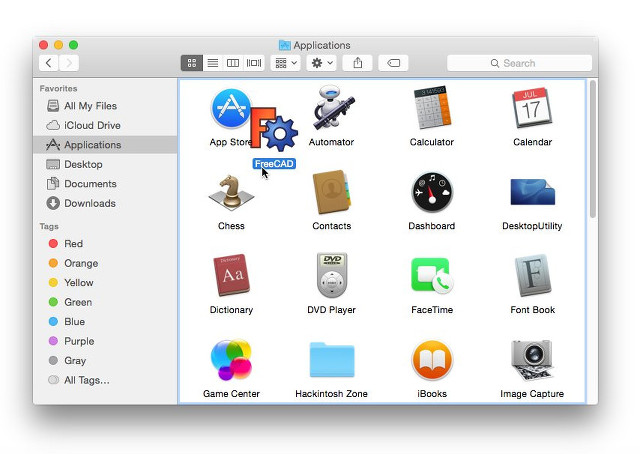
4.  That\'s it, FreeCAD is installed! 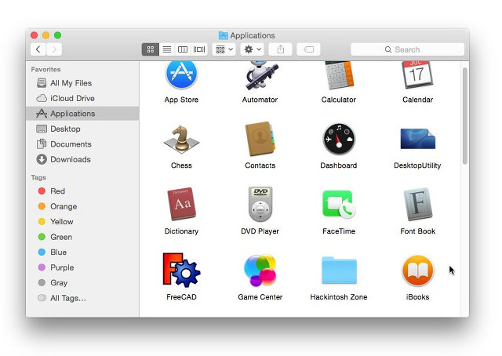
5.  If the system prevents FreeCAD from launching due to restricted permissions for applications not coming from the App store, you will need to enable it in the system settings: 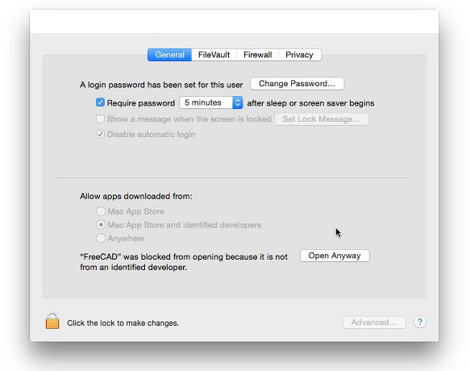

### Uninstalling

Ideally, you\'ll never want to part ways with FreeCAD, but should you ever need to uninstall it, rest assured the process is simple. On Windows, use the familiar \"remove software\" option from the control panel. For Linux users, uninstall it using the same software manager you employed to install it. Mac users have it easiest---just drag FreeCAD from the Applications folder to the trash.

### Setting basic preferences 

After installing FreeCAD, you\'ll likely want to personalize it by adjusting some settings. You can find the preference settings in FreeCAD by navigating to **Edit → Preferences** in the menu. Below are a few basic settings you might consider modifying right away, but feel free to explore the various pages of preferences to tailor the software to your needs even further.

#### General category, General tab 

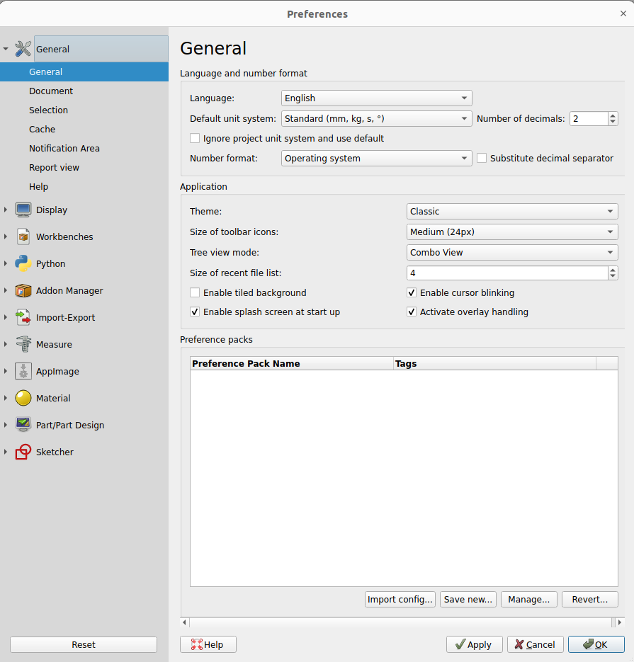

1.  **Language**: By default, FreeCAD will select your operating system\'s language, but you have the option to change it. Thanks to the dedication of many contributors, FreeCAD is available in a wide array of languages.
2.  **Units**: This setting allows you to choose the default units system for your projects.

#### General category, Document tab 

1.  **Create a new document at startup**: FreeCAD will automatically open a new document each time the program starts.
2.  **Storage options**: Configure settings here to help you recover your work in the event of a crash.
3.  **\'Authoring and license**\': In this area, you can determine the settings for new files. To facilitate sharing, consider starting with a more permissive, copyleft license like Creative Commons.

#### Display category, Navigation tab 

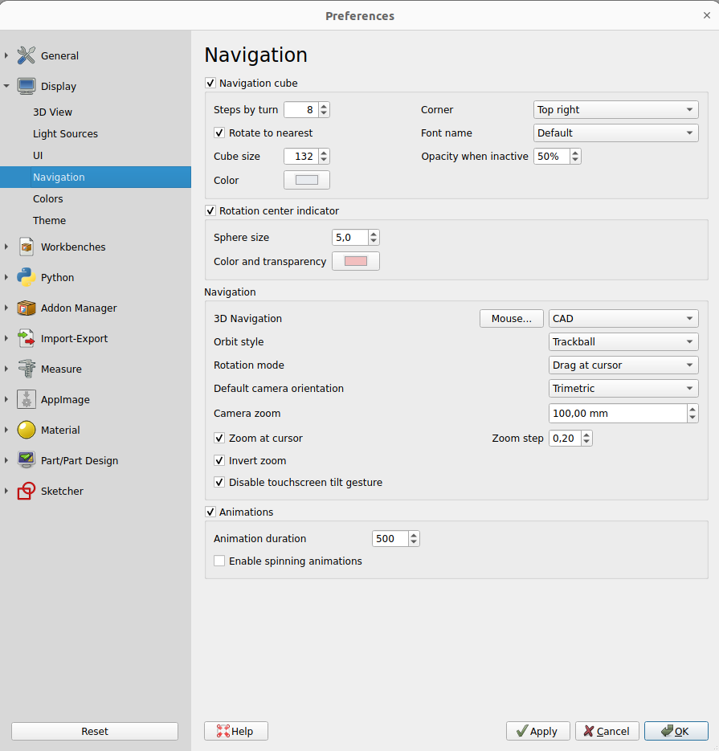

1.  **Zoom at cursor**: When enabled, zoom actions center on the mouse cursor. If disabled, zoom focuses on the center of the view.
2.  **Invert zoom**: This option reverses the zoom direction in relation to mouse movement.

#### Workbenches tab 

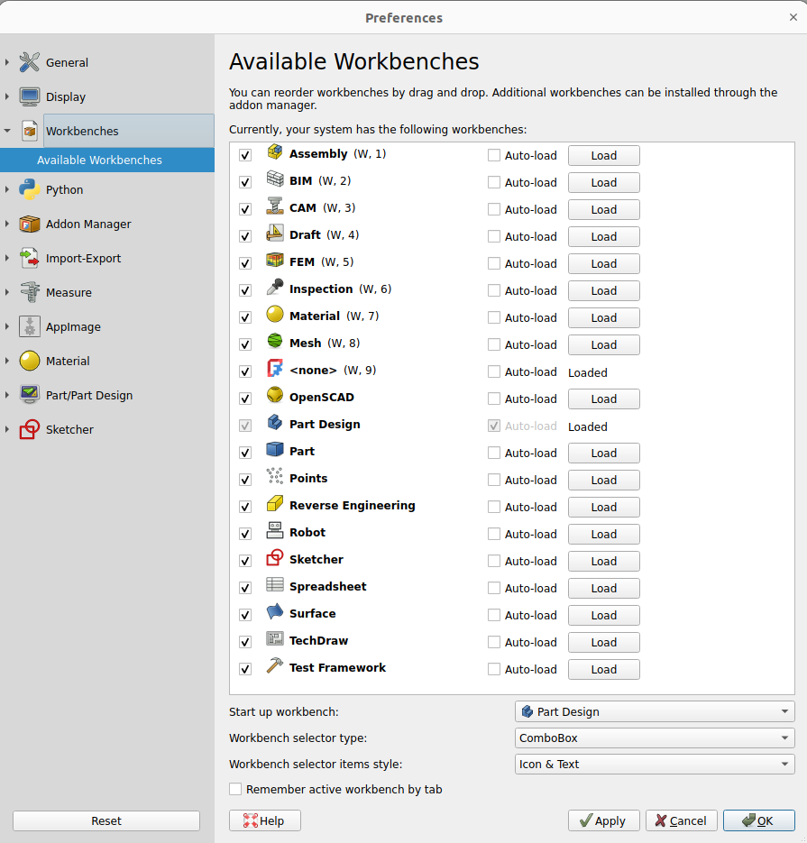

Although FreeCAD typically opens to the start page, this setting lets you bypass it. You can start directly in your preferred workbench. Additionally, you can customize which workbenches are displayed in the selector menu.

#### Import-Export tab 

Here, define basic parameters for importing and exporting in various formats.

### Installing additional content 

As the FreeCAD community expands and the ease of customization grows, numerous external contributions and side projects by community members and enthusiasts start popping up all over the internet. Many of these projects take the form of workbenches or macros, and you can easily add them to your toolbox via the [Addon Manager](Std_AddonMgr.md), which is accessible from the Tools menu. The Addon Manager opens up a world of possibilities, allowing you to install various interesting components, such as:

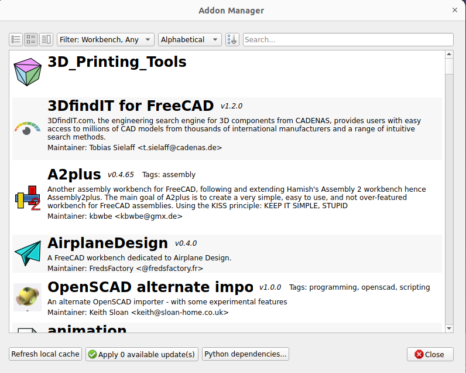

1.  A [Parts library](https://github.com/FreeCAD/FreeCAD-library). This library is a treasure trove of useful models or model fragments crafted by FreeCAD users. All items in this library are freely available for use in your projects and can be accessed directly within your FreeCAD setup.
2.  [Additional workbenches](https://github.com/FreeCAD/FreeCAD-addons). These are specialized extensions that enhance FreeCAD's functionality for specific tasks. Example applications include animating model parts or managing specific construction processes like sheet metal folding or BIM (Building Information Modeling). Detailed information about each workbench, including an overview of the tools it contains, is provided on each addon\'s page, accessible through the corresponding link in the addon manager.
3.  A wide range of [macros](https://github.com/FreeCAD/FreeCAD-macros) is also available for download. These can significantly streamline your workflow, and detailed documentation on how to use them can be found on the [FreeCAD wiki](Macros_recipes.md).

As of FreeCAD v0.17.9940, the recommended installation method of any of the above tools is the built-in Addon Manager. However, if for any reason this option is not available, then manual installation is always possible. More information can be found at the [FreeCAD addons page](https://github.com/FreeCAD/FreeCAD-addons)

**Read more**

-   [More download options](Download.md)
-   [FreeCAD PPA for Ubuntu](https://launchpad.net/~freecad-maintainers)
-   [FreeCAD addons PPA for Ubuntu](https://launchpad.net/freecad-extras)
-   [Compile FreeCAD yourself](Compiling.md)
-   [FreeCAD translations](https://crowdin.com/project/freecad)
-   [FreeCAD github page](https://github.com/FreeCAD)
-   [The FreeCAD addons manager](Std_AddonMgr.md)

---
⏵ [documentation index](../README.md) > [Poweruser Documentation](Category_Poweruser Documentation.md) > [Tutorials](Category_Tutorials.md) > Manual:Installing
