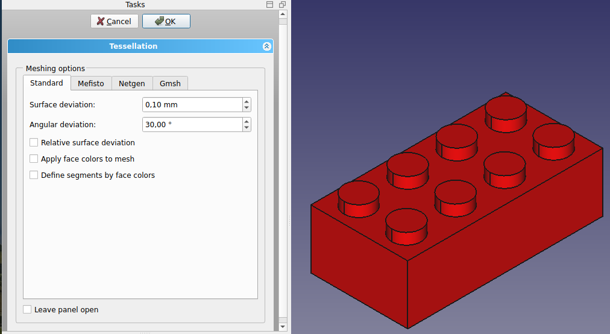
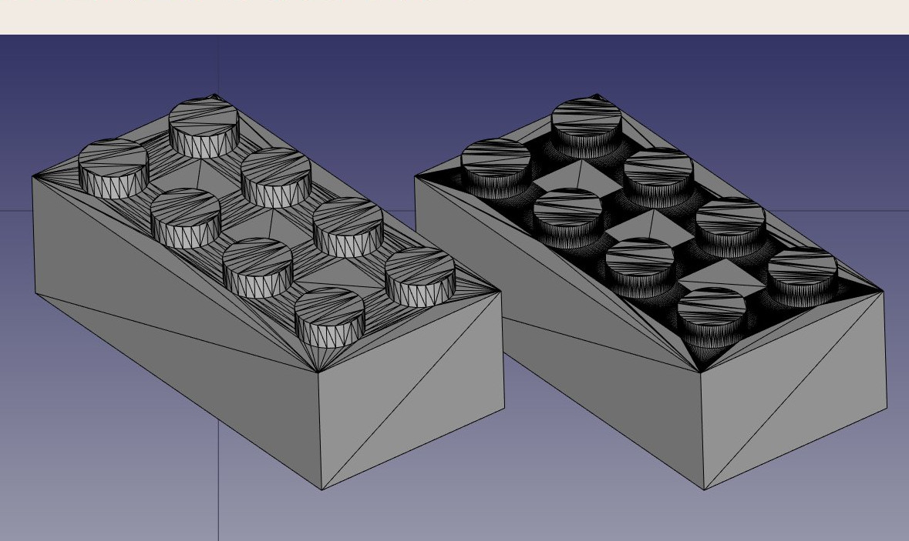
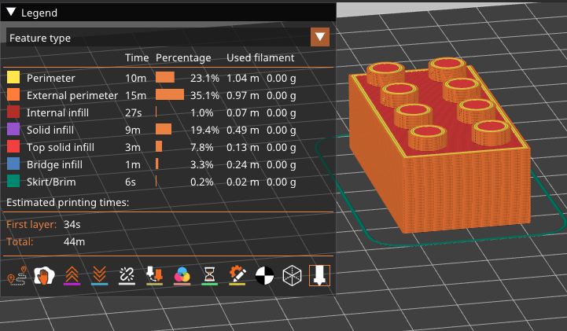
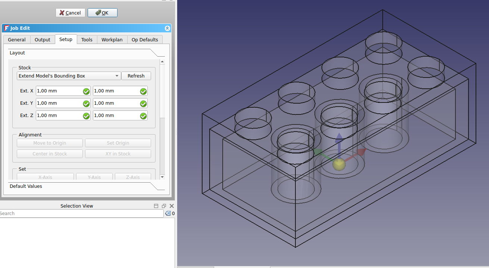
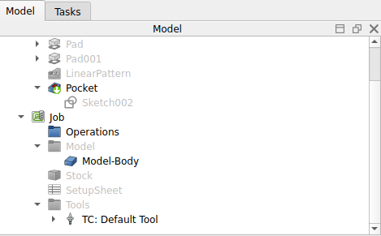
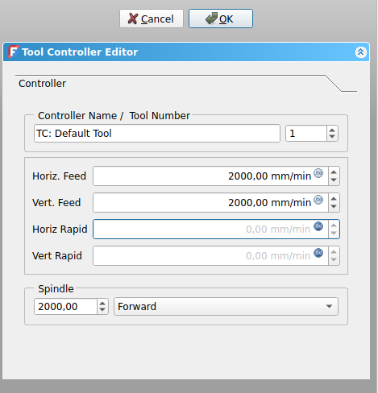
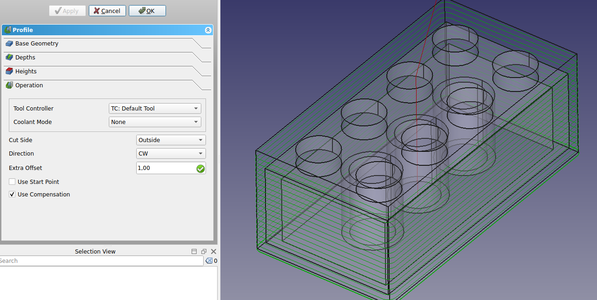

# Manual:Preparing models for 3D printing
One of the primary purposes of FreeCAD is to design objects that can be turned into real-world, physical products. These designs can be shared with others for manufacturing or, increasingly, exported directly to [3D printers](https://en.wikipedia.org/wiki/3D_printing) or a [CNC mill &CNC machines](https://en.wikipedia.org/wiki/Milling_%28machining%29) for automated fabrication. With FreeCAD, you can create precise, detailed models that are ready for various production methods. This chapter will guide you through the process of preparing your models for these machines, ensuring they meet the necessary specifications for successful manufacturing, whether you\'re working with a team or handling the entire process yourself.

If you\'ve been careful while modeling, most of the challenges associated with 3D printing your model should already be minimized. The key aspects to focus on include:

-   **Ensuring Your Objects Are Solid**: Just like real-world objects, your 3D models must be solid. FreeCAD, especially within the PartDesign Workbench, helps you ensure that your models remain solid throughout the design process. The software will notify you if an operation compromises the solid nature of the object. Additionally, the Part Workbench offers a  [Check Geometry](Part_CheckGeometry.md) tool, which allows you to identify potential defects or issues that might interfere with the 3D printing process.

-   **Confirming the Accuracy of Dimensions**: Precision is critical---what you design in FreeCAD will translate directly to real-world measurements. A millimeter in FreeCAD is a millimeter in the physical object, so each dimension must be carefully considered and verified to ensure accuracy.

-   **Managing Degradation**: It\'s important to remember that no 3D printer or CNC mill can directly process FreeCAD files. These machines use G-Code, a machine language with various dialects depending on the machine or vendor. The process of converting your model into G-Code can often be done automatically through slicer software, but you also have the option to do it manually for greater control. However, during this conversion, some loss of detail or quality is inevitable, particularly when converting the model to a mesh format for printing. You must ensure that this degradation remains within acceptable limits and doesn't affect the functionality or appearance of your final object.

-   **Export Format Compatibility**: For 3D printing, STL is the most commonly used format, but it inherently converts your model into a mesh of triangles, which can result in some loss of detail. It's essential to choose the right resolution when exporting to STL, balancing between detail retention and file size. Similarly, for CNC machining, formats like STEP or IGES are preferable as they maintain the original geometric integrity of the design better than STL. Choosing the right format ensures that the conversion to G-Code remains accurate.

-   **Mesh Analysis and Calibration**: Before exporting your model to a slicer or CNC toolpath generator, it's advisable to run a mesh analysis using FreeCAD's [Mesh Workbench](Mesh_Workbench.md) to detect irregularities, non-manifold edges, or other mesh issues that might complicate the manufacturing process. Additionally, even with a perfect model, make sure your 3D printer or CNC machine is properly calibrated (e.g., for bed leveling, stepper motor settings, or extruder configuration) to avoid quality problems in the final product.

In the following sections, we\'ll assume that you\'ve already taken care of creating solid models with the correct dimensions. Our focus will now shift to managing the conversion process to G-Code, ensuring that your model maintains the necessary quality for 3D printing or CNC machining. By addressing these considerations, you\'ll be better equipped to produce successful physical objects directly from your FreeCAD models.

### Exporting to slicers 

The most common technique for preparing a 3D model for printing involves exporting the 3D object from FreeCAD to a specialized software known as a slicer. The slicer generates G-code by slicing the model into thin layers, which the 3D printer will follow to build the object layer by layer. Because many 3D printers---especially home-built or hobbyist models---have unique configurations, slicer programs provide a wide range of advanced settings. These settings allow you to customize key parameters, such as layer height, print speed, infill density, and support structures, ensuring the G-code is tailored to the specific features and capabilities of your printer.

Many slicers also offer simulation and print validation features that are invaluable for previewing the print process. You can visualize the toolpath for each layer, which helps detect potential issues like overhangs that may require supports or areas where cooling might be insufficient. This pre-print validation ensures your model is properly prepared before the print begins, avoiding failed prints or wasted material.

Slicers often include additional insights, such as estimating print time, material usage, and cost based on the filament or resin being used. This allows you to make informed decisions about the printing process and tweak settings for efficiency or material conservation. Although the deeper intricacies of 3D printing---such as machine calibration, material selection, and post-processing---are beyond the scope of this guide, we will focus on how to properly export your FreeCAD model and use slicer software to ensure the output is correct and optimized for your specific printer

### Converting objects to meshes 

None of the slicers currently available can directly accept the solid geometry produced in FreeCAD. Slicers like Cura and PrusaSlicer work with [mesh](https://en.wikipedia.org/wiki/Polygon_mesh)-based formats such as STL, OBJ, or 3MF, which represent the object's surface geometry using a network of triangles. Therefore, to use a model created in FreeCAD, it must first be converted into a mesh format that these slicers can interpret.

The most commonly used format for 3D printing is STL. One reason STL is preferred is its simplicity---it represents the 3D geometry as a mesh of triangles without including complex details like colors, materials, or textures. This minimalistic approach ensures that STL files are lightweight and compatible with virtually all slicers and 3D printers, making it the industry standard. While OBJ and 3MF are also supported, they can carry additional information like textures and materials, which is unnecessary for most 3D printing tasks and can complicate the slicing process.

Fortunately, converting a solid object to a mesh in FreeCAD is straightforward, even though converting a mesh back into a solid is a more complicated operation. During the conversion process, it is crucial to keep in mind that some degradation of the model's quality may occur, especially when reducing complex geometry to a simple triangular mesh. You must ensure that this degradation remains within acceptable limits to maintain the accuracy of your printed object.

In FreeCAD, the [Mesh Workbench](Mesh_Workbench.md) handles all mesh-related tasks. This workbench contains tools not only for converting between Part and Mesh objects but also for analyzing and repairing meshes. While mesh manipulation isn't the primary focus of FreeCAD, it becomes essential when preparing models for 3D printing. Mesh objects are widely used in other applications, and the Mesh Workbench allows you to fully manage and adjust these objects, ensuring they are ready for the next step in the printing process.

-   Let\'s convert the Lego piece we created in the last chapter into an STL mesh. The geometry can be downloaded at the end of said chapter.
-   Open the FreeCAD file containing the Lego piece.
-   Switch to the [Mesh Workbench](Mesh_Workbench.md)
-   Select the Lego brick
-   Select menu **Meshes → Create Mesh from Shape**
-   A task panel will open with several options. Some additional meshing algorithms (Mefisto or Netgen) might not be available, depending on how your version of FreeCAD was compiled. The Standard meshing algorithm will always be present. It offers fewer possibilities than the two others, but is totally sufficient for small objects that fit into the maximum print size of a 3D printer.

-   Select the **Standard** mesher, and leave the deviation value to the default value of **0.10**. Press **Ok**.
-   A mesh object will be created, exactly on top of our solid object. Either hide the solid or move one of the objects aside, so you can compare both.
-   Change the **View → Display Mode** property of the new mesh object to **Flat Lines**, in order to see how the triangulation occurred.
-   If you are not happy, and think that the result is too coarse, you can repeat the operation, lowering the deviation value. In the example below, the left mesh used the default value of **0.10**, while the right one uses **0.01**:

In most cases, though, the default values will give a satisfying result.

-   We can now export our mesh to a mesh format, such as [STL](https://en.wikipedia.org/wiki/STL_%28file_format%29), which is currently the most widely used format in 3D printing, by using menu **File → Export** and choosing the STL file format.

In FreeCAD, the Mesh Workbench provides several algorithms for converting a solid model into a mesh, including Standard, Mefisto, Netgen, and Gmsh. The Standard algorithm is commonly used for small to medium-sized objects as it provides a balance between speed and mesh quality. When creating a mesh, two critical parameters are the surface deviation and angular deviation. Surface deviation controls how closely the mesh follows the original geometry, with smaller values providing a finer, more accurate mesh but potentially leading to larger file sizes. Angular deviation defines how much deviation is allowed based on changes in the model\'s angles, particularly for curves and sharp edges. Other options like relative surface deviation allow you to adjust the precision dynamically based on the model\'s scale, and features like applying face colors or defining mesh segments by color are useful for advanced rendering or grouping different regions of the model. Once the mesh is generated, it can be exported in formats like STL, OBJ, or 3MF, which are essential for preparing models for 3D printing. Mesh quality is crucial for ensuring that 3D printers interpret the model correctly, so selecting the right meshing algorithm and deviation settings can significantly affect the final print outcome.

### Using PrusaSlicer 

[PrusaSlicer](https://github.com/prusa3d/prusaslicer/releases) is an application that converts STL, OBJ, and 3MF objects into G-code that can be sent directly to 3D printers. Like FreeCAD, it is free, open-source, and available on Windows, Mac OS, and Linux. Although it is developed by Prusa Research and optimized for Prusa 3D printers, PrusaSlicer can be used with almost any 3D printer, making it versatile for a wide range of machines. PrusaSlicer is based on Slic3r, the original slicer software, but with significant improvements and more frequent updates. Slic3r is no longer actively updated, while PrusaSlicer continues to evolve, adding new features such as adaptive layer heights, tree supports, and improved print strategies.

Correctly configuring a slicer for 3D printing is a complex process that requires a good understanding of your 3D printer\'s capabilities. While generating G-code without this knowledge might result in a file that doesn\'t work well on other printers, PrusaSlicer still provides an excellent way to verify that your STL file is correctly formatted and printable. The slicer\'s simulation features allow you to preview the G-code paths and check for any potential printing issues before you begin the actual print.

This is our exported STL file opened in PrusaSlicer. By just pressing on the **slice** button, the software divides your model into layers, generates the toolpaths for the 3D printer, and applies the necessary speed and temperature settings. It calculates the infill, support structures, and perimeters, then creates the G-code, which contains detailed instructions for the printer. You can preview the sliced model layer by layer, check estimated print time and filament usage, and finally save or send the G-code to your printer for the actual printing process.

Apart from PrusaSlicer, there are several other slicer software options available for 3D printing. [Cura](https://ultimaker.com/fr/software/ultimaker-cura/), developed by Ultimaker, is one of the most popular open-source slicers and supports a wide range of printers with extensive customization. [Simplify3D](https://www.simplify3d.com/) is a paid slicer known for its advanced features and efficient toolpath generation.[MatterControl](https://www.matterhackers.com/store/l/mattercontrol/sk/MKZGTDW6) is an open-source slicer that also includes basic CAD tools, while [IdeaMaker](https://www.raise3d.com/fr/ideamaker/) offers a user-friendly interface with adaptive layer heights, developed by Raise3D. Finally, [OrcaSlicer](https://github.com/SoftFever/OrcaSlicer), a newer open-source option based on PrusaSlicer and Bambu Studio, provides additional features for various printers. Each slicer has unique strengths, making the best choice dependent on specific printer models and print requirements.

### Generating G-code 

The  [CAM Workbench](CAM_Workbench.md) in FreeCAD provides advanced options for generating G-code directly for CNC machines, offering greater flexibility and control compared to automatic slicing tools like those used for 3D printing. While 3D printing slicers can automatically convert a model into G-code with minimal input, CNC milling requires much more user involvement to ensure precise control over the toolpaths, speeds, depths, and other machining parameters. This makes the CAM Workbench essential for tasks that demand fine-tuned G-code, particularly for CNC milling, where machine complexity and the variety of operations (like cutting, drilling, and contouring) require careful planning.

In the CAM Workbench, G-code path generation is highly customizable. It features tools to generate complete machine paths for various operations, or, alternatively, you can build partial G-code segments and assemble them into a full milling operation. This modular approach allows you to tailor each step of the machining process, optimizing the toolpaths for efficiency, material type, and specific machine capabilities.

The CAM process is indeed much more intricate than 3D printing because CNC machines use different tools and must account for material removal, tool geometry, and safety margins, all of which are configured manually. In FreeCAD, building a simple CAM project requires defining toolpaths, adjusting cutting depths, selecting appropriate tools, and configuring work offsets, feeds, and speeds. Unlike slicer software, which handles most of this automatically, the CAM Workbench places the control in your hands, making it highly customizable but also more complex.

Though generating CNC milling paths is a topic too broad to cover in detail here, we'll demonstrate how to create a simple CAM project in FreeCAD. While we won't focus on every detail of real-world CNC machining, this guide will introduce you to the essential steps, emphasizing the level of input required to ensure accurate and efficient results. This added complexity is essential for CNC projects, where precision and customizability are critical to achieving desired machining outcomes.

-   Load the file containing our Lego piece, and switch to the  [CAM Workbench](CAM_Workbench.md).
-   Press on the  [Job](CAM_Job.md) button and select our lego piece.
-   Since this section doesn't aim to provide an in-depth tutorial of the CAM Workbench, we will be using the default values. If you would like a more detailed tutorial, please refer to [CAM walk-through](CAM_Walkthrough_for_the_Impatient.md). Keep in mind that in the CAM Workbench, a stock body is automatically created around your object, representing the raw material that will be machined. Right now, this stock body extends 1 mm in all directions from the object.

-   The first step is to remove the unnecessary material from around our object. At this stage, we're starting with a solid block of raw material, and we need to carve out the Lego brick from this block. This process involves defining the toolpaths that will gradually cut away the excess material, leaving behind the desired shape of the Lego.

-   The following image shows the FreeCAD CAM Workbench setup for machining a Lego block. The model tree includes solid modeling operations like Pad, Pocket, and LinearPattern, which were used to shape the part. A Job is created, containing toolpaths under Operations that define how the material will be removed from the Stock. The Default Tool is selected for machining, and the Model-Body represents the 3D part being worked on. This setup prepares the object for generating G-code to control the CNC machine.

-   Before we begin cutting away the excess material, let\'s make some adjustments to the milling tool that will be used. Although the CAM Workbench allows you to define custom tools, for simplicity, we will modify the default tool. This will ensure the settings are optimized for our project without needing to create a new tool from scratch.

-   Click on the **TC:Default Tool** text. This will open up the **Tool Controller Editor**. Change the feed rates and spindle velocities as shown in the picture. The feed rates for horizontal and vertical cutting are set to 2000 mm/min, while the spindle speed is set to 2000 RPM with forward rotation. These settings control the movement and cutting speed of the tool during the machining process.

-   Double-click on the tool itself and change its diameter to 1mm.
-   Now we are ready to begin removing the excess material from the block, gradually carving out the Lego geometry. This process will involve the toolpaths we set, ensuring the final shape matches the intended design.
-   Click on the  [Profile](CAM_Profile.md). This option is used to carve out the unnecessary material around the perimeter of the part, effectively shaping the outer boundaries to achieve the general dimensions of the Lego piece.
-   Normally you will not have to change any of the default values, except the **Extra Offset** located in the Operation tab. Set this option to 1 mm to ensure that the remaining object corresponds correctly to the Lego\'s boundaries.
-   Once you press **apply** you should be able to see those green lines around the object. Those lines visualize the path our cutting object will follow when cutting the initial block.

-   Our next step is to create the 6 extruding cylinders on the top of the Lego block.
-   Choose the top face and click on the  [Pocket Shape](CAM_Pocket_Shape.md) button. On the **Extensions** tab, enable Extensions and click on the edge of the top face (it should normally be automatically added in the default length box.
-   Finally, on the **Operation** tab input -1.5 mm in the **Pass Extension box** and change the pattern option to a ZigZagOffset.
-   Press **apply** and then close the tab.
-   In a similar manner we can create the three cylinders on the bottom of the Lego piece.
-   We can easily visualize the steps followed during the milling of the object by using the  [SimulatorGL](CAM_SimulatorGL.md) option.

**Downloads**

-   The STL file generated in this exercise: <https://github.com/yorikvanhavre/FreeCAD-manual/blob/master/files/lego.stl>
-   The file generated during this exercise: <https://github.com/yorikvanhavre/FreeCAD-manual/blob/master/files/path.FCStd>
-   The G-code file generated in this exercise: <https://github.com/yorikvanhavre/FreeCAD-manual/blob/master/files/lego.gcode>

**Read more**

-   [The Mesh Workbench](Mesh_Workbench.md)
-   [The STL file format](https://en.wikipedia.org/wiki/STL_%28file_format%29)
-   [Slic3r](http://slic3r.org/)
-   [Cura](https://ultimaker.com/en/products/cura-software)
-   [The Cura Workbench](https://github.com/cblt2l/FreeCAD-CuraEngine-Plugin)
-   [The CAM Workbench](CAM_Workbench.md)
-   [Camotics](http://camotics.org/)

### Videos

-   [How To Use FreeCAD For 3D Printing \| Using The Realthunder Branch](https://www.youtube.com/playlist?list=PL6Fiih6ItYsWCE20KtUJYpiDPrCA2rVpN) A video playlist by Maker Tales about how to use FreeCAD for 3D printing.

---
⏵ [documentation index](../README.md) > [CAM](Category_CAM.md) > [Mesh](Category_Mesh.md) > [Tutorials](Category_Tutorials.md) > Manual:Preparing models for 3D printing
