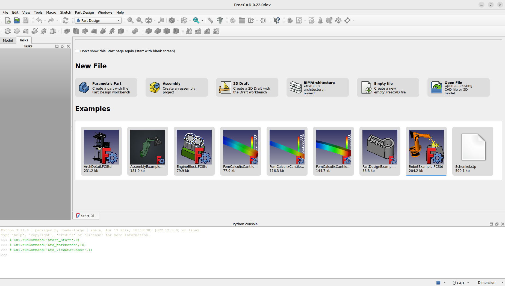
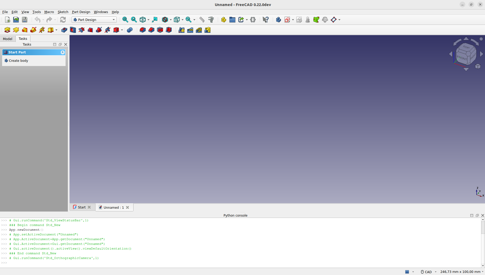
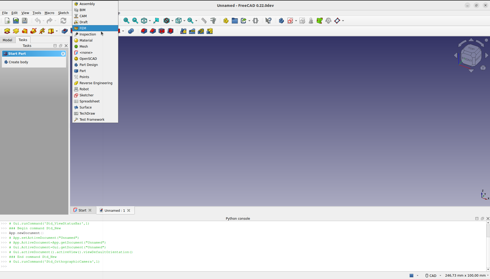
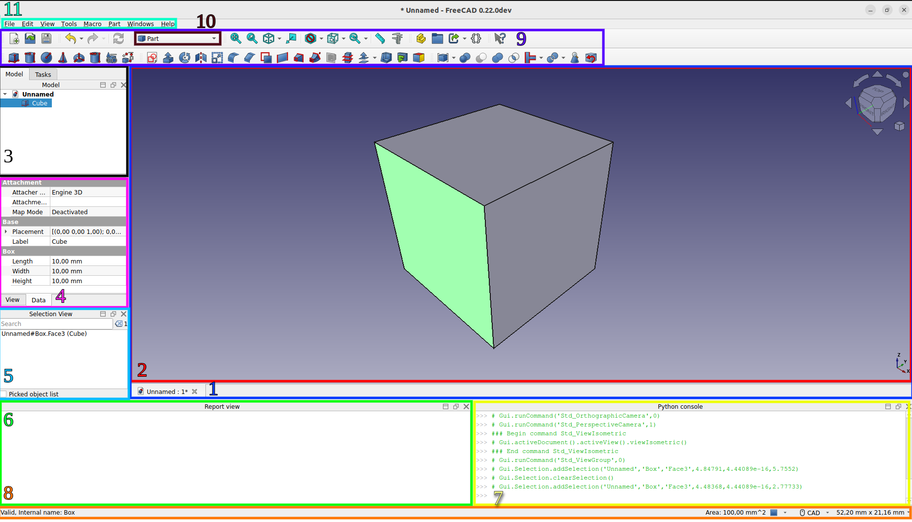
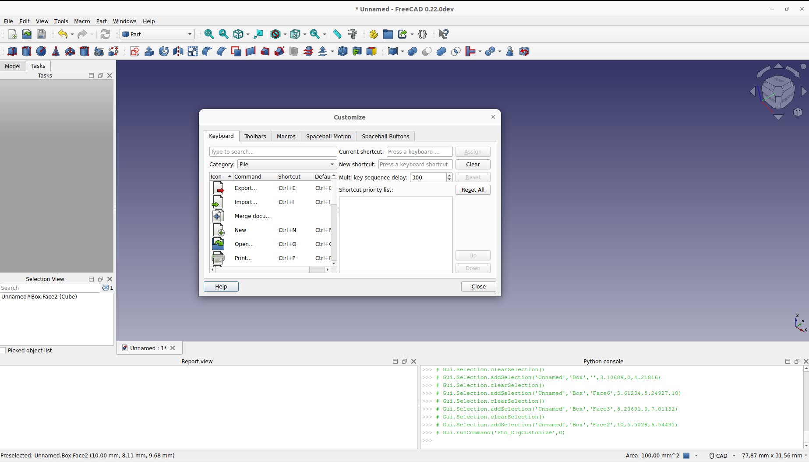

# Manual:The FreeCAD Interface
FreeCAD is based on the [Qt framework](https://en.wikipedia.org/wiki/Qt_(software)) and is characterized by a simple and straightforward interface. More experienced CAD users will be able to identify similarities with other software, while new users will find it easy to navigate and discover the various options FreeCAD offers. Here is the default look of FreeCAD:

The Start Page serves as the welcoming screen, designed to facilitate quick and easy access to the main areas of FreeCAD that a user might wish to explore. Through it, users can effortlessly create new parts, open recent files, and initiate 2D drafting. Additionally, it features shortcuts to helpful resources like tutorials and user forums, which are invaluable for both beginners and experienced users seeking guidance or tips. Users can easily customize the appearance of the Start Page according to their preferences.

As you become more proficient with FreeCAD, you might adjust the settings under preferences. This can configure FreeCAD to open directly into one of the Workbenches with a new document ready to go when you launch it. Alternatively, you can simply close the Start Page tab and manually create a new document.

### Workbenches

FreeCAD employs a system called \"Workbenches,\" similar to the conceptual frameworks used in advanced design software like Revit or CATIA. The idea of a Workbench is analogous to specialized stations in a scientific lab, where different workstations are equipped for distinct types of experiments. In a lab, you might have one area dedicated to chemistry, another to biology, and a third to physics, each outfitted with the specific tools needed for those disciplines.

In the context of FreeCAD, each Workbench is tailored to a particular type of task, organizing all the necessary tools for that activity in one interface. When switching between Workbenches, the set of tools and controls visible in the user interface adjusts to reflect the needs of the selected task, though the actual project contents or \"scene\" you are working on does not change. This allows for seamless transitions in workflow, such as beginning a design with basic 2D shapes in the Draft Workbench and then elaborating on these designs with advanced modeling tools in the Part Workbench.

The terms \"Workbench\" and \"Module\" are sometimes used interchangeably, but they have distinct meanings within FreeCAD. A Module is any extension that adds functionality to FreeCAD, while a Workbench is a specific kind of Module equipped with its own user interface components such as toolbars and menus, designed to facilitate specific types of tasks. Thus, every Workbench is a Module, but not every Module qualifies as a Workbench.

The most important control of the FreeCAD interface is the Workbench selector, which you use to switch from one Workbench to the other:

-    The [Assembly Workbench](Assembly_Workbench.md) for building and solving mechanical assemblies. <small>(v1.0)</small> 

-    The [BIM Workbench](BIM_Workbench.md) for working with architectural elements and creating [BIM](https://en.wikipedia.org/wiki/Building_information_modeling) models. It combines the Arch Workbench and the formerly external BIM Workbench available in {{VersionMinus|0.21}}.

-    The [CAM Workbench](CAM_Workbench.md) is used to produce G-Code instructions. This workbench was called \"Path Workbench\" in {{VersionMinus|0.21}}.

-    The [Draft Workbench](Draft_Workbench.md) contains 2D tools and basic 2D and 3D CAD operations.

-    The [FEM Workbench](FEM_Workbench.md) provides Finite Element Analysis (FEA) workflow.

-    The [Inspection Workbench](Inspection_Workbench.md) is made to give you specific tools for the examination of shapes. Still in the early stages of development.

-    The [Material Workbench](Material_Workbench.md) handles the FreeCAD material system. <small>(v1.0)</small> 

-    The [Mesh Workbench](Mesh_Workbench.md) for working with triangulated meshes.

-    The [OpenSCAD Workbench](OpenSCAD_Workbench.md) for interoperability with OpenSCAD and repairing [constructive solid geometry](Constructive_solid_geometry.md) (CSG) model history.

-    The [Part Workbench](Part_Workbench.md) for working with geometric primitives and boolean operations.

-    The [Part Design Workbench](PartDesign_Workbench.md) for building Part shapes from sketches.

-    The [Points Workbench](Points_Workbench.md) for working with point clouds.

-    The [Reverse Engineering Workbench](Reverse_Engineering_Workbench.md) is intended to provide specific tools to convert shapes/solids/meshes into parametric FreeCAD-compatible features.

-    The [Robot Workbench](Robot_Workbench.md) for studying robot movements. Currently unmaintained.

-    The [Sketcher Workbench](Sketcher_Workbench.md) for working with geometry-constrained sketches.

-    The [Spreadsheet Workbench](Spreadsheet_Workbench.md) for creating and manipulating spreadsheet data.

-    The [Surface Workbench](Surface_Workbench.md) provides tools to create and modify surfaces. It is similar to the [Part Builder](Part_Builder.md) Face from edges option.

-    The [TechDraw Workbench](TechDraw_Workbench.md) for producing technical drawings from 3D models. It is the successor of the [Drawing Workbench](Drawing_Workbench.md).

-    The [Test Framework Workbench](Testing.md) is for debugging FreeCAD.

Workbenches often confuse new users, since it\'s not always easy to know in which Workbench to look for a specific tool. But they are quick to learn, and after a short while, they will feel natural. New users quickly realize that Workbenches are a convenient way to organize the multitude of tools FreeCAD has to offer. In addition, Workbenches are also fully customizable.

### The interface 

Let\'s have a better look at the different parts of the interface:

The main window of the application can be roughly divided into 11 sections:

1.  The [Main view area](Main_view_area.md), which can contain different tabbed windows.
2.  The [3D view](3D_view.md), normally embedded in the [main view area](Main_view_area.md). The 3D view is the central element of the interface, displaying and allowing manipulation of the objects you are working on. It is possible to have multiple views of the same document (or objects) or to have several documents open simultaneously. Additionally, each view can be detached from the main window separately.
3.  The Model and and the [Tasks](Task_panel.md) tab.
    1.  The Model tab shows you the contents and structure of your document.
    2.  The Tasks tab is where FreeCAD will prompt you for values specific to the workbench and tool you are currently using (for example dimensions of an object).
4.  The [Property editor](Property_editor.md) which appears when the Model tab is active in the interface. It allows managing the publicly exposed properties of the objects in the document. It consists of the Data and View sections, showing the visualization properties and the parametric properties of the objects respectively.
5.  The [Selection view](Selection_view.md) which indicates the objects or sub-elements of objects (vertices, edges, faces) that are selected.
6.  The [Report view](Report_view.md) where messages, warnings and errors are shown.
7.  The [Python console](Python_console.md).The Python console, where all the commands executed are printed, and where you can enter Python code.
8.  The [Status bar](Status_bar.md) where some messages and tooltips appear.
9.  The toolbar area, where the toolbars are docked.
10. The [workbench selector](Std_Workbench.md), where you select the active [workbench](Workbenches.md).
11. The [standard menu](Standard_Menu.md), which holds basic operations of the program.

Most of the above panels can be hidden or revealed using the **View → Panels menu**

### Customizing the interface 

The FreeCAD interface is designed for extensive customization. All toolbars and panels can be relocated, stacked, or even docked in various configurations according to user preference. Additionally, they can be closed and then reopened as required. Beyond these capabilities, users have numerous other options including the ability to create custom toolbars with tools selected from any of the available Workbenches, and to assign or modify keyboard shortcuts to streamline workflow. This flexibility ensures that users can tailor the environment to fit their specific needs and preferences.

These advanced customization options are available from the **Tools → Customize menu**:

**Read more**

-   [Getting started with FreeCAD](Getting_started.md)
-   [Customizing the interface](Interface_Customization.md)
-   [Workbenches](Workbenches.md)
-   [More about Python](https://www.python.org)

---
⏵ [documentation index](../README.md) > Manual:The FreeCAD Interface
