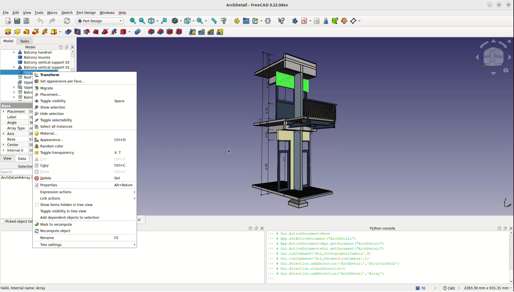

# Manual:The FreeCAD document
A FreeCAD document forms the core of your design environment, encapsulating all the objects and elements that make up your scene. It can contain a variety of objects created across different workbenches, allowing for seamless integration and flexibility as you can switch between workbenches while working within the same document. A document is essentially the file that you save to your disk containing all your work, and FreeCAD allows you to open multiple documents simultaneously, as well as multiple views of the same document.

Within the document, you can organize objects into groups, each with a unique name for easy identification and management. This management of groups, objects, and their names chiefly occurs within the [tree view](tree_view.md). Here, users can craft new groups, assign objects to these groups, and perform deletions. More detailed customizations such as renaming objects, changing their visual properties like color, or adjusting visibility, can be done by right-clicking an object or a group in the Tree View. Additional functionalities may also be available depending on the active workbench.

Objects in a FreeCAD document vary widely in type, as each workbench introduces its unique kind of objects. For example, the [Mesh Workbench](Mesh_Workbench.md) is known for adding mesh objects, while the [Part Workbench](Part_Workbench.md) provides Part objects. In any FreeCAD session, if at least one document is open, that document is considered active and is displayed in the current 3D view. This is the document you are actively modifying. Switching tabs to another document makes the newly selected tab the active document, and most operations will be applied to it.

FreeCAD documents are saved in the .FCStd file format, which utilizes a zip-based compound structure akin to formats used by software like LibreOffice. If technical issues arise, the document can often be unzipped, allowing direct access to its contents for troubleshooting or data recovery purposes. This capability provides an additional safety net, ensuring that your design work can be preserved and recovered even under unexpected circumstances.

**Read more**

-   [The FreeCAD document](Document_structure.md)
-   [File Format FCStd](File_Format_FCStd.md)

---
⏵ [documentation index](../README.md) > Manual:The FreeCAD document
