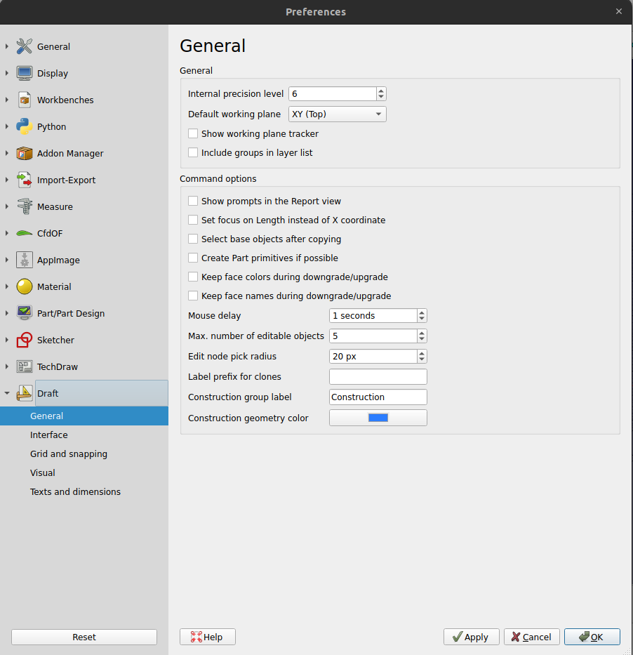

# Manual:Traditional 2D drafting
FreeCAD\'s Draft Workbench acts as a bridge between 2D drafting and 3D modeling, making it unique compared to traditional 2D CAD systems like AutoCAD. While FreeCAD operates in a fully 3D environment, the Draft Workbench is designed to provide users with familiar 2D drawing tools while offering the flexibility of transitioning smoothly between 2D sketches and 3D objects. For instance, you can set custom working planes to draw on specific surfaces or orientations, allowing for the construction of parametric models. Since FreeCAD is parametric, any changes made to dimensions update automatically across the entire project.

One of the strengths of the Draft Workbench is its comprehensive toolset, which includes both basic drawing and advanced modification tools. These tools can be used not only for 2D drafting but also for manipulating objects in 3D space. You can set working planes, define grids, and apply constraints to ensure geometric relationships remain intact across your design. Draft objects can be modified and repositioned using snapping modes and a variety of constraints, making precise drafting much easier.

Some of the tools found in the Draft Workbench:

1.  Drawing Tools:

-    [Line](Draft_Line.md),  [Wire](Draft_Wire.md) (polyline): These tools allow for creating straight line segments or continuous polylines, which can be constrained and converted into 3D shapes.
-    [Circle](Draft_Circle.md),  [Ellipse](Draft_Ellipse.md), and  [Arc](Draft_Arc.md): Used to define basic circular and elliptical shapes, with options for further manipulation.

1.  Manipulation Tools:

-    [Move](Draft_Move.md),  [Rotate](Draft_Rotate.md) or  [Scale](Draft_Scale.md): These operations work in 3D as well as 2D, offering flexibility in positioning objects.
-    [Offset](Draft_Offset.md): Similar to traditional CAD systems, this allows you to create parallel lines or curves.
-    [Trimex](Draft_Trimex.md) and  [Stretch](Draft_Stretch.md): Modify lines and shapes by trimming or extending them to intersect or meet other objects.
-    [Mirror](Draft_Mirror.md) and  [Array](Draft_Array.md): These tools replicate and pattern objects, ideal for repetitive components.

The snapping system in FreeCAD's Draft Workbench is designed for precision. Whether working in 2D or 3D, you can snap to critical points like endpoints, midpoints, and centers of circles, making it easy to position elements relative to one another. Modes such as perpendicular, tangent, and intersection snapping further enhance precision. Combined with the working plane and grid system, these tools ensure the accurate alignment of objects and components.

FreeCAD's parametric nature enables constraints to be applied to drafted elements, ensuring geometric relationships stay intact. For example, you can make lines parallel or perpendicular and set fixed distances between elements. These constraints can be adjusted later, making design changes smooth and consistent across the project. The Draft Workbench also integrates seamlessly with other FreeCAD workbenches, such as Sketcher, which is designed for more constrained parametric 2D design, and TechDraw, which produces technical 2D drawings for documentation purposes.

Advanced features of the Draft Workbench include the ability to import and export files in formats like DXF and SVG, allowing you to work with or share designs with users of other CAD programs. Python scripting further enhances FreeCAD's capabilities, allowing you to automate tasks or create custom workflows. You can write scripts that generate draft objects based on specific geometric rules, streamlining repetitive tasks.

To showcase the workflow and possibilities of the Draft Workbench, we will walk through a simple exercise, the result of which will be this little drawing, showing the floor plan of a small house that contains only a kitchen top (A pretty absurd floor plan, but we can do what we want here, can\'t we?):

-   Switch to the **Draft Workbench**
-   As in all technical drawing applications, it is wise to set up your environment correctly, it will save you a lot of time. If you wish to personalize your experience in the Draft Workbench, you can easily do so by adjusting various settings in the Draft Preferences Panel by going to **Edit → Preferences → Draft**. In this exercise, however, we will act as if these settings were left at their default values.

-   The Draft Preferences Panel in FreeCAD allows you to customize various aspects of your 2D drafting environment. In the **General Settings**, you can define the default working plane, adjust decimal precision, and set the default line width, style, and color for objects. The **Grid and Snapping** section enables you to control grid visibility, spacing, and snapping modes, allowing for precise alignment and positioning of elements. The **Visual Style** options let you customize the appearance of objects and the grid, including line and fill colors. In **Text and Dimensions**, you can configure the default text size, font, and color for annotations, ensuring clarity in technical drawings.

-   Turning on all the snap buttons is convenient, but also makes drawing slower, as more calculation needs to be done when you move the mouse cursor. It is often better to keep only the ones you will actually use.

-   Let\'s start by turning **construction mode** on, which will allow us to draw some guidelines on which we will draw our final geometry. You can do that by pressing on the  [Toggle construction mode](Draft_ToggleConstructionMode.md) command.
-   If you prefer, you can set the working plane to XY. This will lock the working plane, ensuring it remains on the XY plane regardless of how you change the view. If you choose not to do this, the working plane will automatically adapt to the current view, meaning you\'ll need to ensure you\'re in the top view whenever you want to draw on the XY (ground) plane to avoid unintended shifts in orientation.

Now we can switch to the Part Workbench and start to create our first table leg.

-   Press the  **Draft Rectangle** button
-   Draw a 2-meter by 2-meter rectangle starting from point (0,0,0), leave the Z coordinate at zero. You can efficiently complete this entire process using the keyboard, without needing the mouse. Simply type:
    -   **re**, **Enter**, **Enter**, **Enter**, 2m, **Enter**, 2m, **Enter**, 0 and **Enter**.

This keyboard-driven workflow speeds up drafting, especially when working with repetitive tasks or precision input, making it ideal for users looking to streamline their workflow. You can view the keystrokes for every object by hovering over the corresponding button.

-   Duplicate that rectangle by 15cm inside, using the  [Offset](Draft_Offset.md) tool, turning its Copy mode on, and giving it a distance of 15cm:

-   We can then draw a couple of vertical lines to define where our doors and windows will be placed, using the  [Line](Draft_Line.md) tool (note that the \"relative\" mode box should be unchecked for this step). The crossing of these lines with our two rectangles will give us useful intersections to snap our walls to. Draw the first line by defining the following points:
    -   **P1** (15cm, 1m, 0) and **P2** (15cm, 3m, 0).
-   We will now duplicate this line 5 times. Press on the  [Move](Draft_Move.md) tool with  [Clone](Draft_Clone.md) mode turned on. Make sure **Relative mode** is enabled. Copy mode ensures that each movement creates a new line instead of shifting the original, while Relative mode allows you to define movements based on relative distances, making positioning easier without needing to calculate exact coordinates. Start by selecting the original line, and initiate the move operation by choosing any starting point, such as (0,0,0). After each move, perform the next operation on the newly created line, so each copy builds on the previous one. Define the relative endpoints for each new line
    -   line001: x: 10cm
    -   line002: x: 120cm
    -   line003: x: -55cm, y: -2m
    -   line004: x: 80cm
    -   line005: x: 15cm

-   That is all we need now, so we can switch construction mode off. Check that all the construction geometry has been placed into a \"Construction\" group, which makes it easy to hide it all at once or even delete it completely later on.
-   Now let\'s draw our two wall pieces using the  [Wire](Draft_Wire.md) tool. Make sure the  [intersection snap](Draft_Snap.md) is turned on, as we will need to snap to the intersections of our lines and rectangles. Draw two wires as follows, by clicking all the points of their contours. To close them, either click on the first point again or press the **Close** button:

-   We can give the walls a nice hatch pattern. Select both walls, make sure their **Make Face** property (located on the Data tab) is set to **TRUE**, then set their **Pattern** property (located on the View tab) to **Simple**, and their **Pattern size** to your liking, for example **0.005**.

-   We can now hide the construction geometry by right-clicking the Construction group and choose **Hide Selection**.
-   Let\'s now draw the windows and doors. Make sure the  [midpoint snap](Draft_Snap.md) is turned on, and draw six lines as shown below:

-   We will now change the door line to create an opened door symbol. Start by rotating the line using the  [Rotate](Draft_Rotate.md) tool. Click the endpoint of the line as rotation center, give it a start angle of **0**, and an end angle of **-90**.
-   Then create the opening arc with the  [Arc](Draft_Arc.md) tool. Pick the same point as the rotation center we used in the previous step as the center, click the other point of the line to give the radius, then the start and end points as follows:

-   We can now start placing some furniture. To begin with, let\'s place a counter by drawing a rectangle from the upper left inner corner, and giving it a width of 170cm and a height of -60cm. In the image below, the **Transparency** property of the rectangle is set to 80%, to give it a nice furniture look.
-   Then let\'s add a sink and a cooktop. Drawing these kinds of symbols by hand can be very tedious, and they are usually easy to find on the internet, for example on <http://www.cad-blocks.net>. In the **Downloads** section below, for convenience, we separated a sink and a cooktop from this project and saved them as DXF files. You can download these two files by visiting the links below, and right-clicking the **Raw** button, then choosing **save as**.
-   Inserting a DXF file into an opened FreeCAD document can be done either by choosing the **File → Import** menu option, or by dragging and dropping the DXF file from your file explorer into the FreeCAD window. The contents of the DXF files might not appear right on the center of your current view, depending on where they were in the DXF file. You can use the menu **View → Standard views → Fit all** to zoom out and find the imported objects. Insert the two DXF files, and move them to a suitable location on the tabletop:

-   We can now place a couple of dimensions using the  [Dimension](Draft_Dimension.md) tool. To create a dimension, you start by selecting three points: the first point sets the start of the measurement, the second point defines the endpoint, and the third point determines where the dimension line and text will be placed. By clicking these points carefully, you ensure that the dimension accurately represents the distance between the two selected points. If you want to force the dimension to be perfectly horizontal or vertical, even if the start and end points are not aligned, hold down the **Shift** key while clicking the second point. This locks the dimension into the desired orientation. You can further refine the dimension by adjusting properties such as text size, precision, and color in the properties panel, ensuring the dimensions fit your project's visual and technical standards.
-   You can change the position of a dimension text by double-clicking the dimension in the tree view. A control point will allow you to move the text graphically. In our exercise, the \"0.15\" texts have been moved away for better clarity.
-   You can change the contents of the dimension text by editing their **Override** property. In our example, the texts of the door and window dimensions have been edited to indicate their heights:

-   Let\'s add some description texts using the  [Text](Draft_Text.md) tool. Click a point to position the text, then enter the lines of text, pressing Enter after each line. To finish, press Enter twice.
-   The indication lines (also called \"leaders\") that link the texts to the item they are describing are simply done with the Wire tool. Draw wires, starting from the text position, to the place being described. Once that is done, you can add a bullet or arrow at the end of the wires by setting their **End Arrow** property to **TRUE**

-   Our drawing is now complete! Given the number of objects in the design, it's a good idea to do some tidying up and restructuring before we consider it finished. Organizing everything into clear, logical groups will not only help keep the project well-structured but also make it significantly easier for others to navigate and understand the file. By grouping related elements---such as furniture, appliances, or architectural features---you can simplify the layout and improve the clarity of the design. This will also make future modifications or adjustments far more manageable, especially if the project needs to be shared or collaborated on. Additionally, a clean structure ensures that anyone reviewing the drawing can quickly locate specific elements without sifting through a cluttered workspace, ultimately contributing to a more professional and polished final product. Taking the extra time to organize now can save considerable time and effort later on.:

-   We can now print our work by placing it on a Drawing sheet, which we will show later in this manual, or directly export our drawing to other CAD applications, by exporting it to a DXF file. Simply select our \"Floor plan\" group, select the menu **File → Export**, and select the **Autodesk DXF** format. The file can then be opened in any other 2D CAD application such as [LibreCAD](http://www.librecad.org). You might notice some differences, depending on the configurations of each application.

-   The most important aspect of the Draft Workbench, however, is that the 2D geometry you create can serve as the foundation for creating 3D objects. You can easily extrude these shapes into 3D using the  [Part Extrude](Part_Extrude.md) tool found in the [Part Workbench](Part_Workbench.md). Alternatively, if you prefer to stay within the Draft Workbench, you can use the  [Trimex](Draft_Trimex.md) tool, which combines trim, extend, and extrusion functionalities. The Trimex tool essentially performs a Part Extrusion under the hood but does so \"the Draft way,\" allowing you to visually indicate and snap the extrusion length, giving you greater control and precision when working directly within your drafting environment. This flexibility makes transitioning from 2D to 3D seamless and intuitive, especially for those familiar with 2D workflows, while still offering advanced 3D modeling capabilities.
-   By pressing the  [working plane](Draft_SelectPlane.md) button after selecting a face of an object, you are also able to place the working plane anywhere, and therefore draw Draft objects in different planes, for example on top of the walls. These can then be extruded to form other 3D solids. Experiment with setting the working plane on one of the top faces of the walls, then draw some rectangles up there.

-   All kinds of openings can also be done as easily by drawing Draft objects on the faces of walls, then extruding them, and then using the boolean tools from the Part Workbench to subtract them from another solid, as we saw in the previous chapter.

Fundamentally, the Draft Workbench provides a more graphical and intuitive approach to creating basic operations, similar to those found in the Part Workbench. In the Part Workbench, positioning objects often involves manually adjusting parameters like the Placement values (for position, rotation, etc.), which gives you precise control but can sometimes feel less intuitive, especially for quick edits. In contrast, the Draft Workbench allows you to perform these same operations visually on-screen, making it easier to move, rotate, and manipulate objects directly in the workspace with snapping tools and relative positioning options.

This difference is where the workbenches complement each other. The Draft Workbench is ideal for fast, interactive design, allowing you to draw and position objects without constantly entering precise numerical values. On the other hand, the Part Workbench offers more detailed, parametric control over object properties, making it better suited for highly accurate adjustments, especially in engineering or technical design projects.

The beauty of FreeCAD is that you don\'t need to choose between one or the other. You can create [custom toolbars](Interface_Customization.md) by combining tools from both the Draft and Part Workbenches, giving you the flexibility to switch between graphical and parametric methods as needed. This allows you to enjoy the best of both worlds---quick, on-screen adjustments from the Draft Workbench and the precision of the Part Workbench---depending on the needs of your project. Additionally, using keyboard shortcuts and custom toolbars can speed up your workflow, making it easy to transition between different operations without interrupting your design process.

## Downloads

-   The file created during this exercise: <https://github.com/yorikvanhavre/FreeCAD-manual/blob/master/files/cabin.FCStd>
-   The sink DXF file: <https://github.com/yorikvanhavre/FreeCAD-manual/blob/master/files/sink.dxf>
-   The cooktop DXF file: <https://github.com/yorikvanhavre/FreeCAD-manual/blob/master/files/cooktop.dxf>
-   The final DXF file produced during this exercise: <https://github.com/yorikvanhavre/FreeCAD-manual/blob/master/files/cabin.dxf>

## Related

-   [The Draft Workbench](Draft_Workbench.md)
-   [Snapping](Draft_Snap.md)
-   [The Draft working plane](Draft_SelectPlane.md)

---
⏵ [documentation index](../README.md) > [Tutorials](Category_Tutorials.md) > [Draft](Category_Draft.md) > Manual:Traditional 2D drafting
