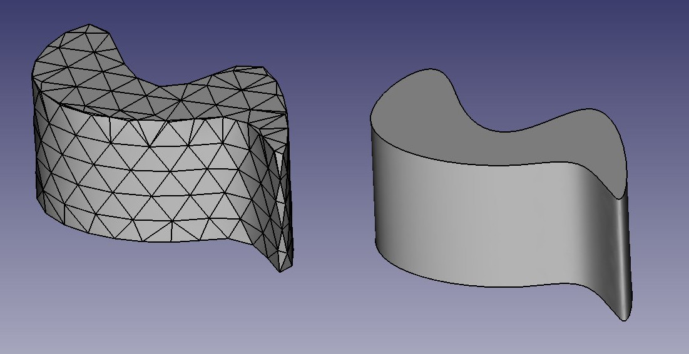
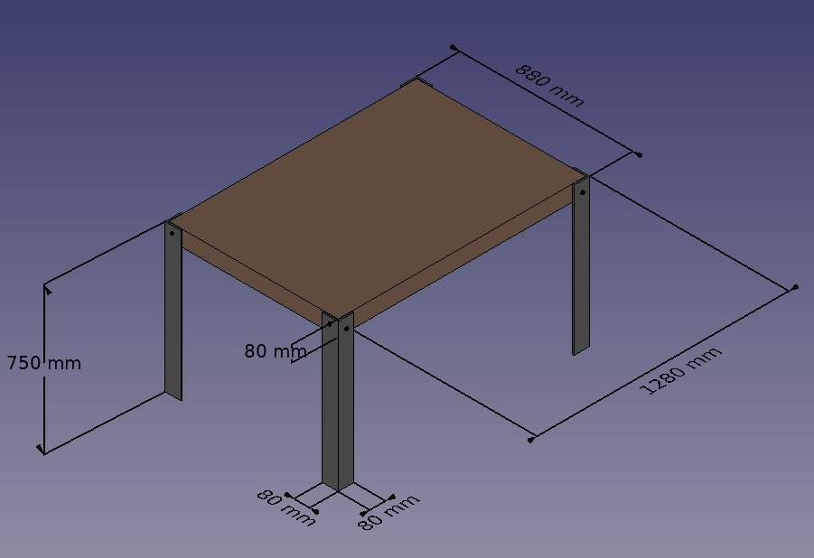
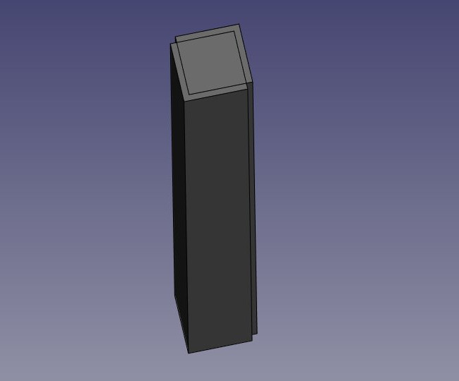
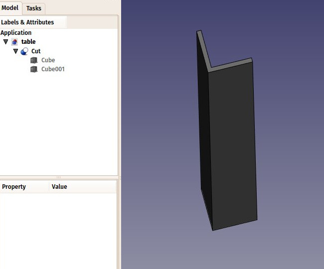
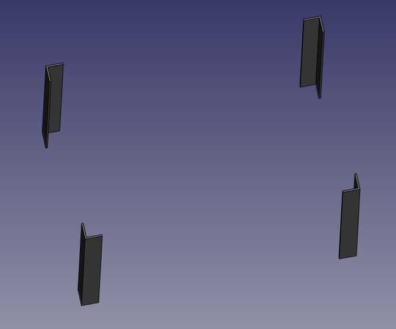
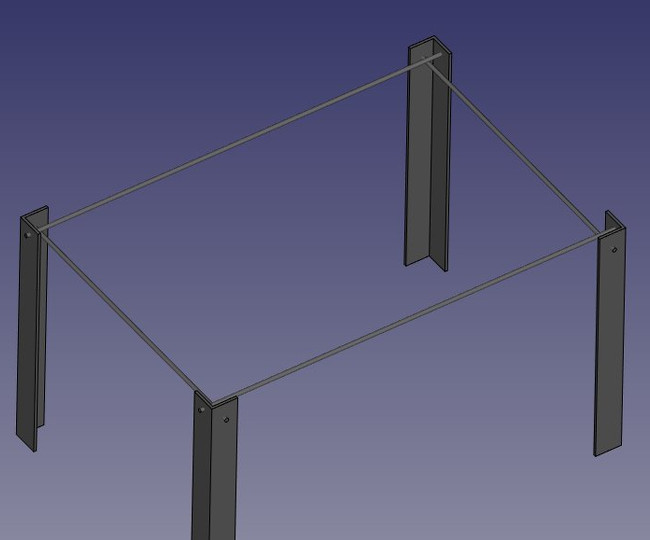
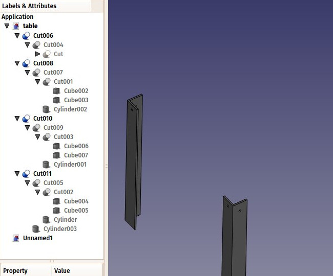
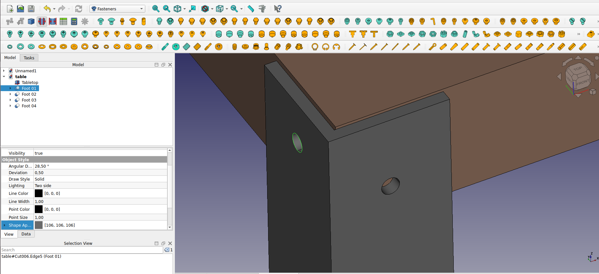
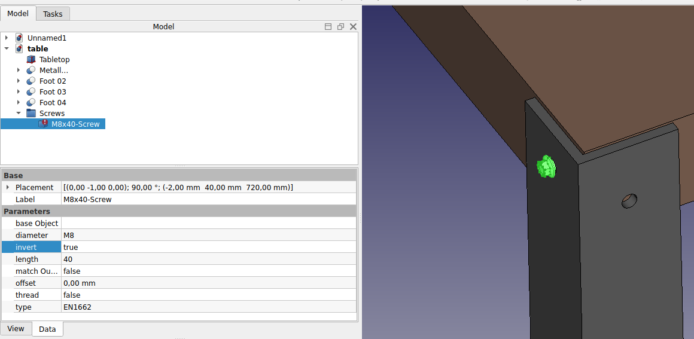
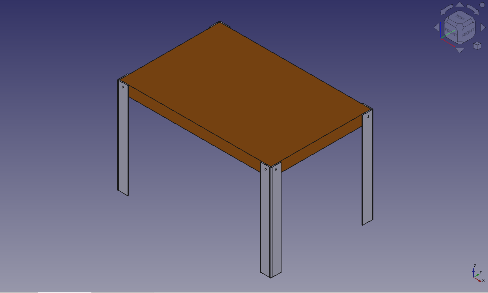

# Manual:Traditional modeling, the CSG way
[CSG](https://en.wikipedia.org/wiki/Constructive_solid_geometry) stands for Constructive Solid Geometry and describes the fundamental way to work with solid 3D geometry. It involves creating complex objects by adding or removing pieces from solids using Boolean operations such as union, subtraction, or intersection.

As discussed earlier in this manual, FreeCAD supports various types of geometry. However, the most preferred and practical type for designing real-world 3D objects in FreeCAD is solid [BREP](https://en.wikipedia.org/wiki/Boundary_representation) geometry, primarily handled by the Part Workbench. Boundary Representation is a method for representing shapes using their spatial boundaries. It defines a 3D object by specifying its surfaces, edges, and vertices. The key aspects of BREP include faces, which are the surface elements of the object, edges, the boundary lines where two faces meet, and vertices, the points where edges converge.

BREP offers several advantages. Firstly, it defines surfaces using mathematical equations, enabling precise and accurate modeling. This precision is crucial for engineering applications where exact dimensions are required. Additionally, BREP provides smooth and detailed surfaces, unlike [polygon meshes](https://en.wikipedia.org/wiki/Polygon_mesh) that approximate curved surfaces with facets. This is similar to the difference between vector images, which scale without losing quality, and bitmap images, which can appear pixelated when enlarged. BREP retains comprehensive topological information about the object, including relationships between faces, edges, and vertices, which is essential for complex operations like Boolean calculations and filleting.

Polygon meshes consist of vertices, edges, and faces that form triangles or quadrilaterals. They are simpler and faster for rendering but lack precision. When zoomed in or printed at large scales, meshes show faceted surfaces rather than smooth curves. In contrast, BREP utilizes curves and surfaces defined mathematically, offering superior accuracy and smoothness. BREP models are preferable for CAD applications where precision is non-negotiable.

In FreeCAD, BREP-based geometry is managed by [OpenCasCade](https://en.wikipedia.org/wiki/Open_Cascade_Technology), an open-source software library. The primary interface between FreeCAD and the OpenCasCade kernel is the Part Workbench, which serves as the foundation for most other workbenches, providing essential tools for creating and manipulating BREP objects. The Part Workbench includes tools for creating primitives, such as basic shapes like boxes, cylinders, and spheres, performing Boolean operations like combining, intersecting, and subtracting shapes, and conducting transformations, including moving, rotating, scaling, and cloning objects.

While other workbenches in FreeCAD, such as the Part Design and Surface Workbenches, offer more advanced tools for building and manipulating geometry, they rely on the underlying Part Workbench. Understanding how Part objects work internally and being adept with the basic Part tools is beneficial. Often, these simpler tools can resolve issues that more complex tools may not handle effectively.

The difference between the two can be compared to the difference between bitmap and vector images. As with bitmap images, polygon meshes have their curved surfaces divided into a series of points. If you look at it closely or print it very large, you will see not a curved but a faceted surface. In both vector images and BREP data, the position of any point on a curve is not stored in the geometry but calculated on the fly, with exact precision.

To illustrate the working of the Part Workbench, we will model this table, using only CSG operations (except the screws, for which we will use one of the add-ons, and the dimensions, which will see in the next chapter):

Let\'s create a new document (**Ctrl+N** or menu **File → New**) to hold our table design. The document is initially called \"unnamed\" in the Model tab in the Combo View panel, but if you save the document (**Ctrl+Shift+S** or menu **File → Save As**) as a new FreeCAD document called \"table.FCStd\" the document will be renamed \"table\", which more clearly identifies the project. We will be working using mm as our units of length. Feel free to change that based on preference by using the menu located on the lower right corner.

Now we can switch to the Part Workbench and start to create our first table leg.

-   Press the  **Cube** button
-   Select the Cube, then set the following properties (in the **Data** tab):
    -   Length: 80 mm
    -   Width: 80 mm
    -   Height: 750 mm
-   Duplicate the Cube by pressing **Ctrl+C** then **Ctrl+V** (or menu **Edit → Copy** and **Paste**) (No change will be evident, as the second object is overlaying the first.)
-   Select the new object named Cube001 that has been created (Click on Cube001 in the left side Model tab)
-   Change its position by editing its Placement property:
    -   Position x: 8 mm
    -   Position y: 8 mm

You should obtain two high cubes, one 8mm apart from the other:

-   Now we can subtract one from the other: Select the **first** one, that is, the one that will **stay**, then, with the CTRL key pressed, select the **other** one, that will be **subtracted** (the order is important) and press the  **Cut** button:

Observe that the newly created object, called \"Cut\", still contains the two cubes we used as operands. In fact, the two cubes are still there in the document, they have merely been hidden and grouped under the Cut object in the tree view. You can still select them by expanding the arrow next to the Cut object, and, if you wish, turn them visible again by right-clicking them or change any of their properties.

You can use the Cut tool and other Boolean tools also through \"Combo view\" with  [Boolean](Part_Boolean.md). It gives more explicit but longer way to do it.

-   Now let\'s create the three other feet by duplicating our base cube 6 other times. Since it is still copied, you can simply paste (Ctrl+V) 6 times. Change their position as follows:
    -   Cube002: x: 0, y: 800 mm
    -   Cube003: x: 8 mm, y: 792 mm
    -   Cube004: x: 1200 mm, y: 0
    -   Cube005: x: 1192 mm, y: 8 mm
    -   Cube006: x: 120 mm, y: 800 m
    -   Cube007: x: 1192 mm, y: 792 mm

-   Now let\'s do the three other cuts, selecting first the \"host\" cube and then the cube to be cut off. We now have four Cut objects:

You might have been thinking that, instead of duplicating the base cube six times, we could have duplicated the complete foot three times. This is totally true, as always in FreeCAD, there are many ways to achieve the same result. This is a precious thing to remember, because, as we will advance into more complex objects, some operations might not give the correct result and we often need to try other ways.

-   We will now make holes for the screws, using the same Cut method. Since we need 8 holes, two in each foot, we could make 8 objects to be subtracted. Instead, let\'s explore other ways and make 4 tubes, that will be reused by two of the feet. So let\'s create four tubes by using the  **Cylinder** tool. You can again, make only one and duplicate it afterwards. Give all cylinders a radius of 6mm. This time, we will need to rotate them, which is also done via the **Placement** property under the Data tab *(**Note:** change the Axis property*before*setting the Angle, or the rotation will not be applied)*:
    -   Cylinder: height: 1300 mm, angle: 90°, axis: x:0, y:1, z:0, position: x:-10 mm, y:40 mm, z: 720 mm
    -   Cylinder001: height: 1300 mm, angle: 90°, axis: x:0, y:1, z:0, position: x:-10 mm, y:840 m, z: 720 mm
    -   Cylinder002: height: 900 mm, angle: 90°, axis: x:-1, y:0, z:0, position: x:40 mm, y:-10 mm, z: 700 m
    -   Cylinder003: height: 900 mm, angle: 90°, axis: x:-1, y:0, z:0, position: x:1240 mm, y:-10 mm, z:700 mm

You will notice that the cylinders are a bit longer than needed. This is because, as in all solid-based 3D applications, boolean operations in FreeCAD are sometimes oversensitive to face-on-face situations and might fail. By doing this, we put ourselves on the safe side.

-   Now let\'s do the subtractions. Select the first foot, then, with CTRL pressed, select one of the tubes that cross it, and press the **Cut** button. The hole will be done, and the tube hidden. Find it in the tree view by expanding the pierced foot.
-   Select another foot pierced by this hidden tube, then repeat the operation, this time Ctrl+ selecting the tube in the tree view, as it is hidden in the 3D view (you can also make it visible again and select it in the 3D view). Repeat this for the other feet until each of them has its two holes:

As you can see, each foot has become a quite long series of operations. All this stays parametric, and you can go change any parameter of any of the older operations anytime. In FreeCAD, we often refer to this pile as \"modeling history\", since it in fact carries all the history of the operations you did.

Another particularity of FreeCAD is that the concept of 3D object and the concept of 3D operation tend to blend into one same thing. The Cut is at the same time an operation, and the 3D object resulting from this operation. In FreeCAD this is called a \"feature\", rather than object or operation.

Now let\'s do the tabletop, it will be a simple block of wood, let\'s do it with another **Box**:

-   Box: length: 1260 mm, width: 860 mm, height: 80 mm, position: x: 10 mm, y: 10 mm, z: 670 mm.

In the **View** tab, you can give it a nice brownish, wood-like color by changing its **Shape Color** property:

Now that our five pieces are complete, it is a good time to give them more proper names than \"Cut015\". By right-clicking the objects in the tree view (or pressing **F2**), you can rename them to something more meaningful to yourself or to another person who would open your file later. It is often said that simply giving proper names to your objects is much more important than the way you model them.

-   We will now place some screws. There is nowadays an extremely useful addon developed by a member of the FreeCAD community, that you can find on the [FreeCAD addons](https://github.com/FreeCAD/FreeCAD-addons) repository, called [Fasteners](https://github.com/shaise/FreeCAD_FastenersWB), that makes the insertion of screws very easy. Installing additional workbenches is easy and described on the [addons pages](Std_AddonMgr.md).
-   Once you have installed the Fasteners Workbench and restarted FreeCAD, it will appear in the workbenches list, and we can switch to it. Adding a screw to one of our holes is done by first selecting the circular edge of our hole:

-   Then we can press one of the screw buttons of the Fasteners Workbench, for example, the **EN 1665 Hexagon bolt with flanges, heavy series**. The screw will be placed and aligned with our hole, and the diameter will automatically be selected to match the size of our hole. Sometimes the screw will be placed inverted, which we can correct by flipping its **invert** property. We can also set its offset to 2mm, to follow the same rule we used between the tabletop and the feet:

-   Repeat this for all the holes, and our table is complete!

As mentioned earlier, in FreeCAD, you can achieve the same result by following different steps. To demonstrate this, let\'s create the same table using a different methodology. Remember, there is no right or wrong way---just individual creativity.

We will start similarly: by creating a cube with the following dimensions: length 80 mm, width 8 mm, and height 750 mm

-   Create a cube by selecting the  **Cube** button and set the following properties (in the **Data** tab):
    -   Length: 80 mm
    -   Width: 8 mm
    -   Height: 750 mm
-   Next, we will create a  **Cylinder** with the following properties:
    -   radius: 6 mm, height: 100 mm, angle: 90°, axis: x: 1, y: 0, z: 0, position: x: 40 mm, y: 40 mm, z: 720 mm
-   Next, we will apply the cut tool. Select the cube and with the CTRL key pressed select the cylinder. Keep in mind that the order is important to define which one stays. Then press the  **Cut** button.
-   We will then copy and paste the cut object by pressing **Ctrl+C** then **Ctrl+V** (or menu **Edit → Copy** and **Paste**):
    -   angle: 90°, axis: x: 0, y: 0, z: 1, position: x: 8 mm
-   Select the two objects and apply the  **fuse** tool. Now the two objects are fused, and we have a foot.
-   Copy and paste the fused leg, positioning it at
    -   angle: 90°, axis: x: 0, y: 0, z: 1, position y: 800 mm.
-   Select the two feet and create a  **compound**.
-   Copy and paste the compound, positioning it at:
    -   angle: 180°, axis: x:0, y:0, z:1, position x: 1200 mm, y: 800 mm. We have our feet.

Let\'s create the table top.

-   Create a cube with the dimensions:
    -   Length: 752 mm
    -   Width: 1184 mm
    -   Height: 784 mm
    -   position x: 8 mm, y: 8 mm, z: 670 mm.

Now, we continue similarly as before if we wish to add screws (hopefully we wish).

**The internal structure of Part objects**

As we saw above, it is possible in FreeCAD to select not only whole objects but parts of them, such as the circular border of our screw hole. This is a good time to have a quick look at how Part objects are constructed internally. Every workbench that produces Part geometry will be based on these:

-   **Vertices**: These are points (usually endpoints) on which all the rest is built. For example, a line has two vertices.
-   **Edges**: the edges are linear geometry like lines, arcs, ellipses or [NURBS](https://en.wikipedia.org/wiki/Non-uniform_rational_B-spline) curves. They usually have two vertices, but some special cases have only one (a closed circle for example).
-   **Wires**: A wire is a sequence of edges connected by their endpoints. It can contain edges of any type, and it can be closed or not.
-   **Faces**: Faces can be planar or curved, and can be formed by one closed wire, which forms the border of the face, or more than one, in case the face has holes.
-   **Shells**: Shells are simply a group of faces connected by their edges. It can be open or closed.
-   **Solids**: When a shell is tightly closed, that is, it has no \"leak\", it becomes a solid. Solids carry the notion of inside and outside. Many workbenches rely on this to make sure the objects they produce can be built in the real world.
-   **Compounds**: Compounds are simply aggregates of other shapes, no matter their type, into a single shape.

In the 3D view, you can select individual **vertices**, **edges** or **faces**. Selecting one of these also selects the whole object.

**A note about shared design**

You might look at the table above, and think its design is not good. The tightening of the feet with the tabletop is probably too weak. You might want to add reinforcing pieces, or simply you have other ideas to make it better. This is where sharing becomes interesting. You can download the file made during this exercise from the link below, and modify it to make it better. Then, if you share that improved file, others might be able to make it even better or use your well-designed table in their projects. Your design might then give other ideas to other people, and maybe you will have helped a tiny bit to make a better world\...

**Downloads**

-   The file produced in this exercise: <https://github.com/yorikvanhavre/FreeCAD-manual/blob/master/files/table.FCStd>

**Read more**

-   [The Part Workbench](Part_Workbench.md)
-   [The FreeCAD addons repository](https://github.com/FreeCAD/FreeCAD-addons)
-   [The Fasteners Workbench](https://github.com/shaise/FreeCAD_FastenersWB)

---
⏵ [documentation index](../README.md) > [Tutorials](Category_Tutorials.md) > Manual:Traditional modeling, the CSG way
