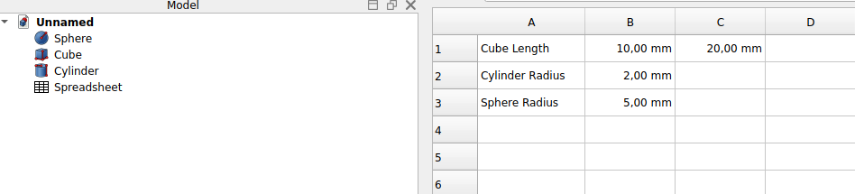
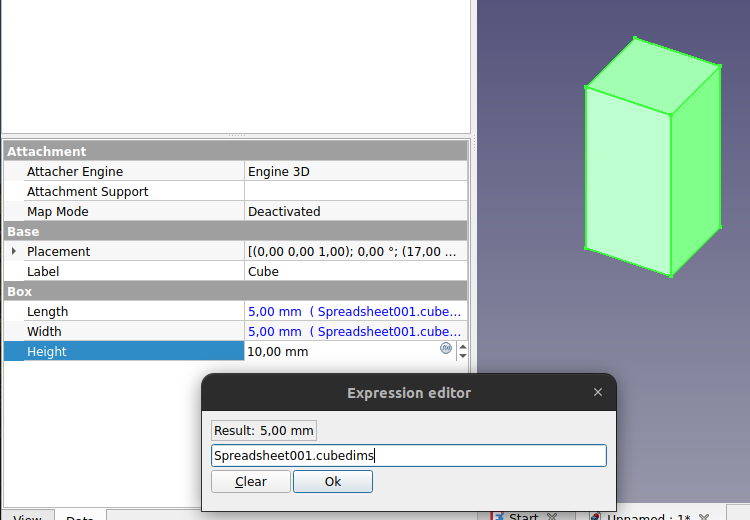

# Manual:Using spreadsheets
The  [Spreadsheet Workbench](Spreadsheet_Workbench.md) in FreeCAD allows users to create and manage [spreadsheets](https://en.wikipedia.org/wiki/Spreadsheet), such as those made with [Excel](https://en.wikipedia.org/wiki/Microsoft_Excel) or [Calc from LibreOffice](https://en.wikipedia.org/wiki/LibreOffice_Calc), directly within their design projects. It enables inputting, organizing, and manipulating data in a table format, which can then be linked to various parameters and models in the project.

One of the key advantages is its use in parametric modeling. Spreadsheets can be linked to the dimensions and properties of 3D models, making them an essential tool for dynamic design changes. For example, adjusting a value in the spreadsheet will automatically update the corresponding dimension in the model.

In addition to managing values, the workbench is excellent for data management, storing critical information such as material properties, dimensions, and project-wide parameters. This becomes particularly useful in complex projects where multiple values need to be referenced or adjusted.

Spreadsheets also allow users to input formulas for calculations and data management. These formulas can reference other spreadsheet cells or parameters within the 3D model, making the entire design process adaptable and responsive to changes.

It can integrate seamlessly with other FreeCAD workbenches, allowing interaction between data and model components. This integration centralizes control over different aspects of the project, making it easier to manage. The interface is straightforward, resembling traditional spreadsheet software, which makes it familiar and easy to use for those already accustomed to programs like Excel or LibreOffice Calc.

In practice, the Spreadsheet Workbench is versatile for different use cases, including defining project-wide parameters, managing bills of materials (BOM), and performing custom calculations that influence design decisions. It simplifies complex projects by centralizing the control of parameters in one location.

In the following example, we will create a couple of objects, retrieve some of their properties in a spreadsheet, then use the spreadsheet to directly drive the properties of other objects.

### Reading properties 

-   Start by switching to the  [Part Workbench](Part_Workbench.md), and create a couple of objects: a  [box](Part_Box.md), a  [cylinder](Part_Cylinder.md) and a  [sphere](Part_Sphere.md).
-   Edit their **Placement** property (or use the  [Draft Move](Draft_Move.md) tool) to place them a little apart, so we can better see the effects of what we\'ll do:

-   Now, let\'s extract some information about these objects. Switch to the  [Spreadsheet Workbench](Spreadsheet_Workbench.md)
-   Press the  **New Spreadsheet** button
-   Double-click the new Spreadsheet object in the tree view. The spreadsheet editor opens:

Although FreeCAD\'s spreadsheet editor is not as feature-rich as dedicated applications like Excel or LibreOffice Calc, it provides essential tools for most design tasks. Users can adjust cell properties such as size, color, and alignment, and merge or split cells for better organization. Basic formulas or references to other cells are supported, allowing for simple data manipulation. What sets it apart is its deep integration with FreeCAD\'s modeling environment, where changes in the spreadsheet can automatically update model dimensions in real time. While it may lack advanced features like pivot tables or charts, its focus on parametric-driven design makes it a powerful tool for managing design data directly within FreeCAD.

In FreeCAD, beyond the standard spreadsheet features, there is a particularly useful function: the ability to reference not just other cells, but also objects within the document and extract values from their properties. For instance, you can retrieve properties from 3D objects that are visible in the **Data** tab of the **Properties Editor** when an object is selected. This allows for seamless integration between the spreadsheet and the 3D model, making it easy to link and automate changes based on the parameters of objects within the design, offering a more dynamic and interconnected workflow.

-   Let\'s start by entering a couple of texts in the cells A1, A2 and A3, so we remember what is what later on, for example **Cube Length**, **Cylinder Radius** and **Sphere Radius**. To enter text, just write in the \"Contents\" field above the spreadsheet, or double-click a cell.
-   Now let\'s retrieve the actual length of our cube. In cell B1, type **=Cube.Length**. You will notice that the spreadsheet has an auto-completion mechanism, which is actually the same as the expression editor we used in the previous chapter.
-   Do the same for cell B2 (**=Cylinder.Radius**) and B3 (**=Sphere.Radius**).

-   Although these results are expressed with their units, the values can be manipulated as any number, try for example entering in cell C1: **=B1\*2**.
-   We can now change one of these values in the properties editor, and the change will be immediately reflected in the spreadsheet. For example, let\'s change the length of our cube to **20mm**:

The  [Spreadsheet Workbench](Spreadsheet_Workbench.md) page will describe in more detail all the possible operations and functions available in spreadsheets.

### Writing properties 

Another powerful feature of the Spreadsheet Workbench in FreeCAD is the ability to not only read values from the properties of 3D objects but also assign values to them. This allows for controlling the dimensions and attributes of objects directly from the spreadsheet. However, one of FreeCAD's fundamental rules is that circular dependencies are forbidden---meaning a spreadsheet cannot both read from and write to the same object. Doing so would create a situation where the object depends on the spreadsheet while the spreadsheet also depends on the object, leading to an invalid configuration. To avoid this, a second spreadsheet is typically created to handle writing values, ensuring a clear separation between the reading and writing processes.

-   We can now close the spreadsheet tab (under the 3D view). This is not mandatory, there is no problem in keeping several spreadsheet windows open.
-   Press the  **New Spreadsheet** button again
-   Change the name of the new spreadsheet to something more meaningful, such as **Input** (do this by right-clicking the new spreadsheet object, and choosing **Rename**).
-   Double-click the Input spreadsheet to open the spreadsheet editor.
-   In cell A1, let\'s put a descriptive text, for example: \"Cube dimensions\"
-   In cell B1, write **=5mm** (using the = sign makes sure the value is interpreted as a unit value, not a text).
-   Now to be able to use this value outside the spreadsheet, we need to give a name, or alias, to the B1 cell. Right-click the cell, click **Properties** and select the **Alias** tab. Give it a name, such as **cubedims**:

-   Press **OK**, then close the spreadsheet tab
-   Select the cube object
-   In the properties editor, click the little  **expression** icon at the right side of the **Length** field. This will open the [expressions editor](Expressions.md), where you can write **Spreadsheet001.cubedims**. Repeat this for **Height** and **Width**:

The reason we use \"Spreadsheet001\" instead of \"Input\" in the expression is that every object in a FreeCAD document has a unique internal name and a more user-friendly label. While the label is what appears in the tree view, the internal name is used to uniquely identify objects within the document. FreeCAD allows you to assign the same label to multiple objects if you adjust your preferences, but the internal name remains unique. For any operation that requires identifying an object without ambiguity, FreeCAD uses the internal name rather than the label, as the label could refer to more than one object. To find the internal name of an object, it\'s useful to keep the Selection Panel (accessible via View → Panels) open. This panel will always display the internal name of the selected object, ensuring you use the correct reference in your expressions.

By using cell aliases in FreeCAD\'s Spreadsheet Workbench, it\'s possible to store \"master values\" within the document, making it easy to manage and modify key parameters. For instance, a spreadsheet can hold the dimensions of a model, allowing these values to be referenced throughout the design. This approach simplifies the process of updating the model; if new dimensions are required, you can simply open the spreadsheet, adjust the values, and the model will automatically update to reflect these changes. This method streamlines versioning and improves efficiency, especially in parametric modeling, where dimensions frequently change based on project requirements.

Finally, note that the constraints inside a sketch can also receive the value of a spreadsheet cell:

You can also give aliases to dimensional constraints (horizontal, vertical or distance) in a sketch (you can then use that value from outside the sketch as well):

**Download**

-   The file produced in this exercise: <https://github.com/yorikvanhavre/FreeCAD-manual/blob/master/files/spreadsheet.FCStd>

**Read more**

-   [The Spreadsheet Workbench](Spreadsheet_Workbench.md)
-   [The Expressions engine](Expressions.md)

---
⏵ [documentation index](../README.md) > [Tutorials](Category_Tutorials.md) > Manual:Using spreadsheets
