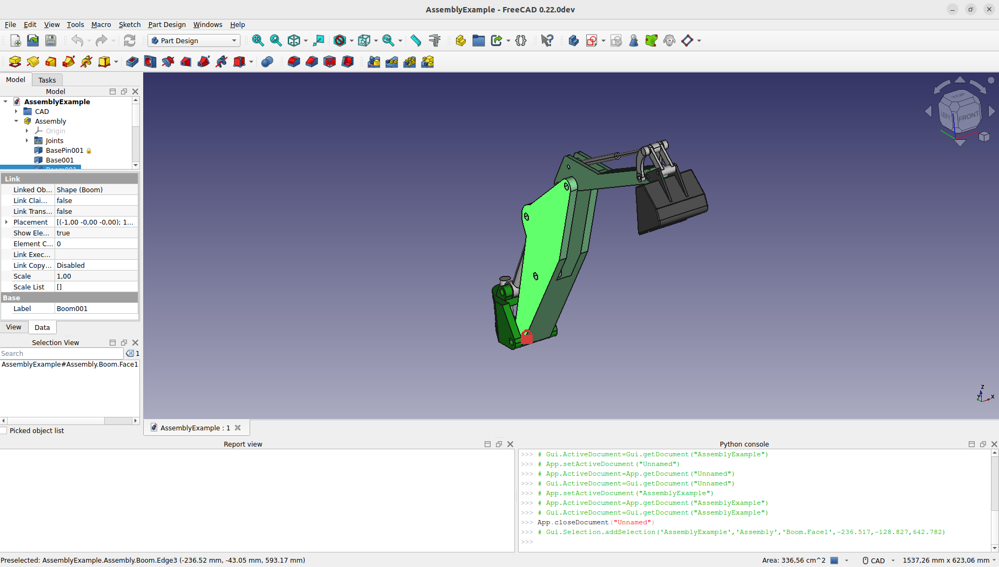

# Manual:What is FreeCAD

As mentioned in the previous section, FreeCAD is a parametric 3D computer-aided design (CAD) modeling application. [Parametric design](https://en.wikipedia.org/wiki/Parametric_design) is a method of designing objects based on defining parameters and relationships between them. In this approach, changes to parameters automatically propagate throughout the associated elements of the design, allowing for rapid iterations and adaptations.

Commonly used in fields such as architecture, engineering, and product design, parametric design helps create complex shapes and forms efficiently, with the ability to adjust and fine-tune various design aspects through the modification of input values. This approach is especially powerful in software like FreeCAD, where users can set these parameters dynamically to automate and optimize the design process.

FreeCAD is a multiplatform application that runs on Windows, macOS, and Linux, and is completely [open-source](https://en.wikipedia.org/wiki/Open_source). This means it is free to use, modify, and distribute. FreeCAD is developed by an enthusiastic community rather than a single company, which allows for constant improvements and updates.

The software includes many open-source components and can be integrated into other applications. It is known for being highly customizable and supports a variety of file formats. This flexibility and the robust support from its community make FreeCAD a powerful tool in the open-source world. Developed collectively by a global community of programmers, enthusiasts, and users, FreeCAD exemplifies the collaborative spirit of open-source projects. It offers significant advantages such as customization and scriptability, bringing sophisticated features typically found in professional software within the reach of any user interested in 3D modeling and design.

The official website of FreeCAD is at <http://www.freecad.org>

**Read more:**

-   [About FreeCAD](About_FreeCAD.md)
-   [List of features](Feature_list.md)
-   [Screenshots and user cases](https://forum.freecad.org/viewforum.php?f=24)

---
⏵ [documentation index](../README.md) > Manual:What is FreeCAD
