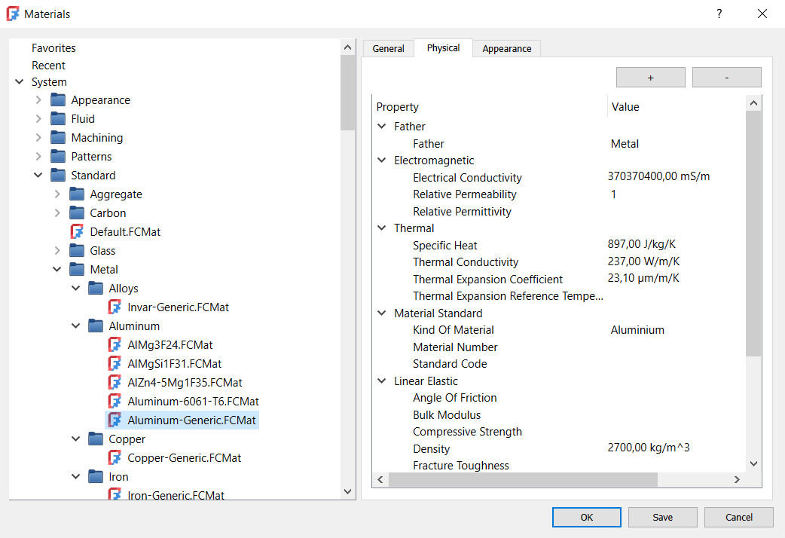

---
 GuiCommand:
   Name: Materials Edit
   MenuLocation: Materials , Edit... Model , Materials , Material editor
   Workbenches: Material_Workbench, FEM_Workbench
   Version: 1.0
   SeeAlso: FEM_MaterialEditor
---

# Materials Edit

## Description

The **Materials Edit** tool provides access to the new material editor implemented as part of the [Material](Material.md) handling system improvements made for FreeCAD 1.0. The new materials system can be used in multiple workbenches, also for appearance properties.

## Usage

1.  The new material editor can currently be accessed by either:
    -    [Material Workbench](Material_Workbench.md):
        -   The ** [Edit...](Materials_Edit.md)** button.
        -   The menu **Materials →  Edit** entry.

    -    [FEM Workbench](FEM_Workbench.md):
        -   The ** [Material editor](FEM_MaterialEditor.md)** button.
        -   The menu **Model → Materials →  Material editor** entry.

    -   
        **View →  Material... → Launch editor
**
        
        menu option or ** Material... → Launch editor** context menu option in any workbench after selecting a feature in the [tree view](Tree_view.md).
2.  Select a material from the multilevel list on the left. The following categories are available:
    -   Favorites
    -   Recent
    -   System
        -   Appearance
        -   Fluid
        -   Machining
        -   Patterns
        -   Standard
        -   Test
    -   User
3.  Use the three tabs on the right side of the editor to edit the properties of the selected material:
    -   General:
        -   Name
        -   Author
        -   License
        -   Parent
        -   Source URL
        -   Source Reference
        -   Tags
        -   Description
    -   Physical - various physical properties
    -   Appearance:
        -   Basic Rendering:
            -   Ambient Color
            -   Diffuse Color
            -   Emissive Color
            -   Shininess
            -   Specular Color
            -   Transparency
4.  In the General tab, press the **New** button to create a new material with empty properties, **Inherit New** to create a new material with properties copied from the selected material or ***** to add a material to favorites.
5.  Press the **OK** button to confirm, **Save** to save the changes or **Cancel** to cancel them.

{{FEM Tools navi}}

---
⏵ [documentation index](../README.md) > [FEM](Category_FEM.md) > Materials Edit
