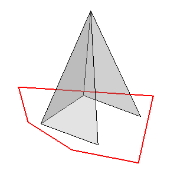

---
- GuiCommand:
   Name:MeshPart CreateFlatMesh
   MenuLocation:Meshes → Unwrap Mesh
   Workbenches:[Mesh](Mesh_Workbench.md)
   SeeAlso:[Mesh Part Create Flat Face](MeshPart_CreateFlatFace.md)
---

## Description

The **MeshPart CreateFlatMesh** command creates a flat representation of a mesh object by unwrapping, unfolding, it. The created outline is a [Part Feature](Part_Feature.md).

   *A mesh object and, in red, its flat representation*

## Usage

1.  Select a single mesh object. The mesh must be \'unwrappable\'. For example, to unwrap a cylindrical mesh it must have open ends and an open seam. Also curved surfaces must have a relatively fine mesh. Use the [Mesh RemeshGmsh](Mesh_RemeshGmsh.md) command if necessary.
2.  Select the {{MenuCommand|Meshes →  Unwrap Mesh}} option from the menu.

## Properties

See: [Part Feature](Part_Feature.md).

 {{Mesh Tools navi}}  
