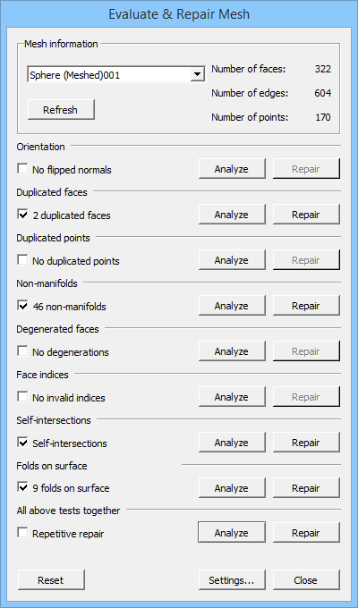

---
- GuiCommand:
   Name:Mesh Evaluation
   MenuLocation:Meshes → Analyze → Evaluate and repair mesh...
   Workbenches:[Mesh](Mesh_Workbench.md)
---

## Description

The **Mesh Evaluation** command evaluates and repairs a mesh object.

   *The Evaluate & Repair Mesh dialog box with the Folds on surface option enabled*

## Usage

1.  Optionally select a single mesh object.
2.  There are several ways to invoke the command:
    -   Press the ** [Mesh Evaluation](Mesh_Evaluation.md)** button.
    -   Select the {{MenuCommand|Meshes → Analyze →  Evaluate and repair mesh...}} option from the menu.
3.  The {{MenuCommand|Evaluate & Repair Mesh}} dialog box opens.
4.  Optionally press the **Settings...** button to change the following settings:
    -   
        {{MenuCommand|Check for non-manifold points}}
        

    -   
        {{MenuCommand|Enable check for folds on surface}}
        

    -   
        {{MenuCommand|Only consider zero area faces as degenerated}}
        
5.  If you have not yet selected a mesh object: select one from the dropdown list at the top of the dialog box.
6.  The dialog contains 7 or 8 (if the {{MenuCommand|Folds on surface}} option is enabled) test options.
7.  Do not use the checkboxes, they will be checked automatically if errors are found.
8.  Press any of the **Analyze** buttons to start a test.
9.  Or use the **Analyze** button from the {{MenuCommand|All above tests together}} option to run all 7 or 8 tests together.
10. Errors will be indicated in the dialog box, and also, with yellow and red markers, in the [3D view](3D_view.md).
11. Optionally press one or more **Repair** buttons to repair the errors that were found.
12. Optionally press the **Reset** button to reset all test results. This will reset the dialog and remove the colored markers from the 3D view. If you want to repeat the same test or run all tests together there is no need to do this.
13. Optionally select a different mesh object from the dropdown list to continue testing and repairing.
14. Press the **Close** button to close the dialog box and finish the command.
15. The **Refresh** button does not work properly at this time.

## Notes

-   Repairing a mesh can mean that problematic elements are deleted from the mesh resulting in holes. Holes can be closed with the [Mesh FillupHoles](Mesh_FillupHoles.md), [Mesh FillInteractiveHole](Mesh_FillInteractiveHole.md) and [Mesh AddFacet](Mesh_AddFacet.md) commands.

## Preferences

-   The {{MenuCommand|Check for non-manifold points}} setting is stored: {{MenuCommand|Tools → Edit parameters... → BaseApp → Preferences → Mod → Mesh → Evaluation → CheckNonManifoldPoints}}.
-   The {{MenuCommand|Enable check for folds on surface}} setting is stored: {{MenuCommand|Tools → Edit parameters... → BaseApp → Preferences → Mod → Mesh → Evaluation → EnableFoldsCheck}}.
-   The {{MenuCommand|Only consider zero area faces as degenerated}} setting is stored: {{MenuCommand|Tools → Edit parameters... → BaseApp → Preferences → Mod → Mesh → Evaluation → StrictlyDegenerated}}.

 {{Mesh Tools navi}}  
