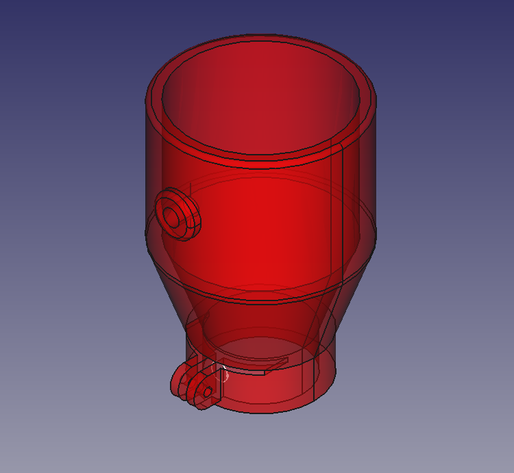
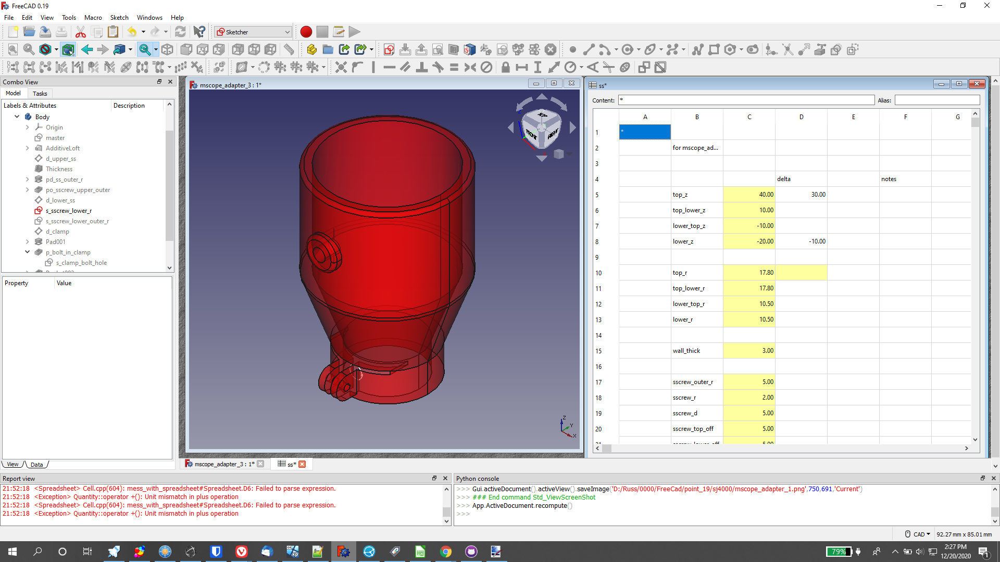

# Microscope Adapter Model
# Purpose

This adapter is intended to couple a GoPro or similar camera to a microscope eyepiece. It can be used for similar purposes on other devices, but it is expected that the weight of the camera allows it to be supported by the eyepiece of the connected device.

This model is included in the Wiki as an example of best practices for Spreadsheet modeling [Best Practices with SpreadSheets](Best_Practices_with_SpreadSheets.md). See something that is not a best practice, let me know.

# Images

 

# Parametric Model 

The model is highly parametric with many of parameters entered in a spreadsheet ( others exist in sketches ). It does not contain fillets or champers ( or they are added at the end ) as I cannot get them to behave in a parametric model, suggestions are welcome.

# Overall Plan 

-   I have tried to follow all the Best Practices documented in **[Best Practices with SpreadSheets](Best_Practices_with_SpreadSheets.md)**
-   In this version I have used a loft between 4 sketches to make the general shape.
-   A thickness is applied ( pipe ) to hollow out the shape.
-   Details are added.
-   Parametric model, key dimensions are all in the spreadsheet \"ss\"

## Comments

The clamp at the GoPro end is different than the microscope end because of the short length of the GoPro end and the microscope end. For neither clamp is the hardware shown.

# Environment

    OS: Windows 10 (10.0)
    Word size of OS: 64-bit
    Word size of FreeCAD: 64-bit
    Version: 0.19.23141 (Git)
    Build type: Release
    Branch: master
    Hash: 0eba78d40096720f7a637a9a73c382a08b820bca
    Python version: 3.6.8
    Qt version: 5.12.1
    Coin version: 4.0.0a
    OCC version: 7.3.0
    Locale: English/United States (en_US)

# Model Source 

-   [Source at Gitlab](https://gitlab.com/russhensel/freecadtest/-/blob/master/mscope_adapter_3.FCStd)

# Links to Related Material 

-   **Use What Links Here ( to the left of the page )**
-   **[Best Practices with SpreadSheets](Best_Practices_with_SpreadSheets.md)**
-   **[Spreadsheet Workbench - FreeCAD Documentation](https://wiki.freecadweb.org/Spreadsheet_Workbench)**

and perhaps add category Model and Best Practice

---
 [documentation index](../README.md) > Microscope Adapter Model
