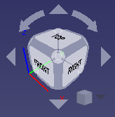
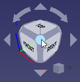

 

 

The navigational cube control, or **navigation cube**, is a user interface graphic aid for reorienting the 3D view. By default, it is visible and resides in the upper right corner of the 3D display. If you are looking at the standard 3D view, it looks like the following:

The navigation cube consists of a number of parts:

-   Directional Arrows
-   Main Navigation Cube
-   Mini-cube Menu

Hovering the mouse pointer over a feature of the navigational cube turns the feature light blue; clicking will reorient the 3D view as indicated by the feature. In the example below, the 3D view has been rotated by a [mouse gesture](Mouse_Model.md) to a \"non-standard\" orientation. The pointer is over a corner (indicated by the blue color); clicking will reorient the 3D view to a standard axonometric view with that corner facing you.

## Directional Arrows {#directional_arrows}

There are six directional arrows: four triangular arrowheads, one at the top, bottom, left and right; and two curved arrows, one on either side of the top arrow.

Clicking the triangular arrows will rotate the 3D view 45 degrees around a line perpendicular to the direction of the arrow. Clicking the curved arrows will rotate the 3D view around a line pointing towards you.

## Main Navigation Cube {#main_navigation_cube}

The main navigation cube (\"nav cube\" in the rest of this section), tracks the orientation of the actual object in the main part of the 3D view. Any operation which reorients the main 3D view will reorient the nav cube as well.

The nav cube is essentially a 3D view of a cube with its three main component types (faces, edges, and corners) enhanced so they may be easily clicked with the pointer. Clicking on a particular component will set the 3D view to have that component centered and facing you. The nav cube is somewhat \"squashed\", as if the feature farthest from you were larger than the feature directly facing you. This allows the features adjacent to the feature facing you to be seen and consequently selected. For example, in a \"normal\" view of a regular cube, when one face is facing you, you can also see the four edges of that face and the four corners of that face. In the \"squashed\" nav cube, you can also see features representing each of the adjacent faces, the four edges connecting the corners of the face facing you with the opposite face, and the corners of opposite face. This allows you to select any of the possible standard views except the opposite face and its edges (21 out of 26 possible views):

-   The face facing you (does nothing, since that is the current view)
-   The four edges of the current face
-   The four corners of the current face
-   The four adjacent faces
-   The four edges leading to the opposite face
-   The four corners of the opposite face

Not possible:

-   The opposite face
-   The edges of the opposite face

Note: As of this writing (v 0.18), there are some problems with the nav cube; not all features are currently selectable. In particular, edges are not selectable, nor are the four corners of the immediately facing face.

### Face Selection {#face_selection}

Clicking on a face will orient the 3D view with that particular face facing you. From a face view, other selection points are available as noted above. There are four thin \"bars\" on each of the outside edges, representing the four adjacent faces; clicking them will select the view corresponding to the adjacent face. There are four round corners which may be used to set the corresponding axonometric view. There is also an interior set of edges and corners, which are currently non-functional.

### Edge Selection {#edge_selection}

Unfortunately, edge selection is currently broken. Attempting to select an edge will select the face which lies behind it. Clicking an edge should center that edge so it is facing you.

### Corner Selection {#corner_selection}

Clicking one of the corners will give you an axonometric view as seen from that corner. As noted above, currently when a face is directly facing you, the corners of that face are not selectable.

## Mini-cube Menu {#mini_cube_menu}

In the lower right corner of the navigational cube is a small cube. Clicking on this cube will bring up a menu you may use to change the type of view (Orthographic, Perspective, Isometric) and to do a \"Zoom to Fit\".

## Moving the Navigation Cube Display {#moving_the_navigation_cube_display}

You may move the entire navigation cube control structure to another location in the 3D display by pressing the mouse anywhere in the main navigation cube and dragging. The structure will not begin to move until the mouse pointer has moved past the edge of the main navigation cube.

## Configuration

The navigation cube is configurable, including adjusting its size: {{MenuCommand|Edit → Preferences... → Display → Navigation → Navigation cube}} <small>(v0.19)</small> .

For more advanced configuration, refer to the [CubeMenu](Interface_Customization#CubeMenu.md) [external workbench](External_workbenches.md).

 

[Category:User Documentation{{\#translation:}}](Category:User_Documentation.md)
